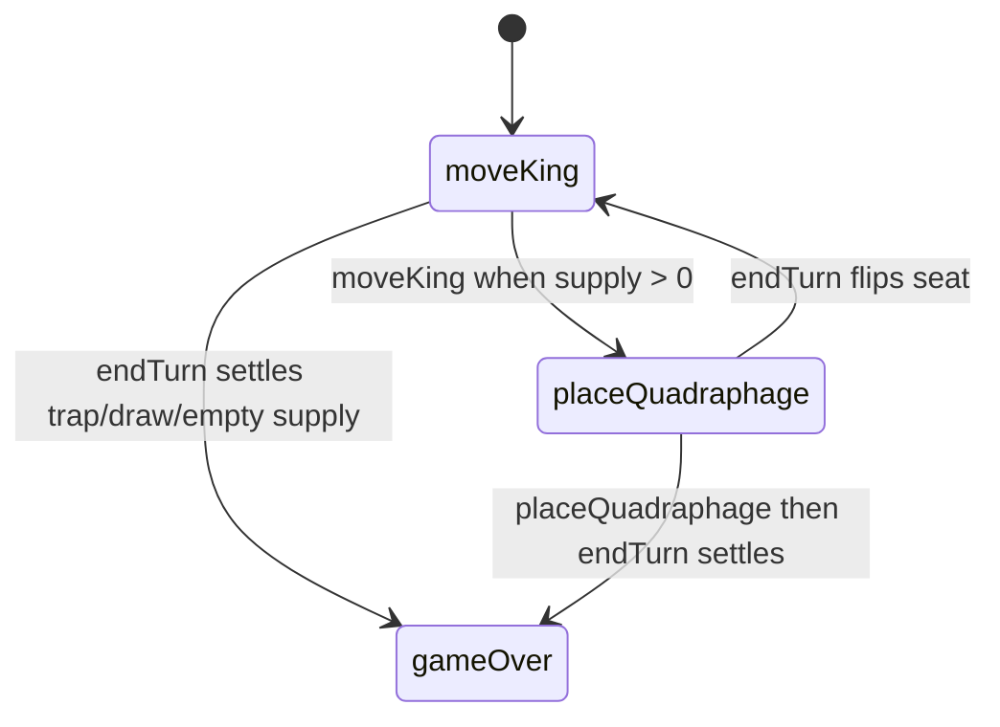

# Kings & Quadraphages — engine reference

> Contributor-only. Describes **code** under `src/games/kings-quadraphages/`. Not player-facing rules copy.
>
> Broader wiring: [wiki architecture (#475)](../../wiki/architecture.md) · [game registry](../../wiki/game-registry.md) · [docs sync (#496)](https://github.com/fuzzywigg/math-pentathlon/pull/496).
> Do not duplicate those docs here.

- **Registry id:** `kings-quadraphages` (Division I)
- **Mount:** `src/ui/game-route-mounts.ts` → `case 'kings-quadraphages'` → `src/games/kings-quadraphages/game-controller.ts`
- **UI:** `src/games/kings-quadraphages/board-ui.ts`
- **Rules / state:** `src/games/kings-quadraphages/rules.ts`, `src/games/kings-quadraphages/game-state.ts`
- **AI adapter:** `src/games/kings-quadraphages/ai.ts`

## State shape

Primary type: `GameState` in `src/games/kings-quadraphages/game-state.ts`.

| Field |
| --- |
| `board` |
| `currentPlayer` |
| `turnPhase` |
| `player1Supply` |
| `player2Supply` |
| `selectedKingPosition` |
| `winner` |
| `moveHistory` |

```ts
export interface GameState {
  board: Board;
  currentPlayer: PlayerOwner;
  turnPhase: TurnPhase;
  player1Supply: number;
  player2Supply: number;
  selectedKingPosition: Position | null;
  winner: PlayerOwner | null;
  moveHistory: MoveHistoryEntry[];
}
```

## Move types

- `MoveHistoryEntry` — `src/games/kings-quadraphages/game-state.ts`

```ts
export interface MoveHistoryEntry {
  player: PlayerOwner;
  action: 'moveKing' | 'placeQuadraphage';
  from?: Position;
  to: Position;
}
```

- `AIMove` — `src/games/kings-quadraphages/ai.ts`

```ts
export interface AIMove {
  kingMove: Pos;
  quadraphagePlacement: Pos;
}
```

### Apply / advance functions

- `selectKing` — `src/games/kings-quadraphages/game-state.ts`
- `moveKing` — `src/games/kings-quadraphages/game-state.ts`
- `placeQuadraphage` — `src/games/kings-quadraphages/game-state.ts`
- `endTurn` — `src/games/kings-quadraphages/game-state.ts`

## Turn / phase state machine

Phase type: `TurnPhase` in `src/games/kings-quadraphages/game-state.ts`.

```ts
export type TurnPhase = 'moveKing' | 'placeQuadraphage' | 'gameOver';
```



## Win / draw detection

| Function | File | What the code does |
| --- | --- | --- |
| `checkWinCondition` | `src/games/kings-quadraphages/rules.ts` | Opponent king has zero valid moves (checks player2 then player1). |
| `isDrawCondition` | `src/games/kings-quadraphages/rules.ts` | Both kings trapped, both supplies exhausted, or no empty cells with both mobile. |
| `canCompleteTurn` | `src/games/kings-quadraphages/rules.ts` | Whether the current seat can finish the required king/place steps. |

## Serialization format

Dedicated codec in `src/games/kings-quadraphages/serialization.ts`: `serializeGameState`, `deserializeGameState`, `gameStateToJSON`, `gameStateFromJSON`, `validateSerializedState`. Version constant `SAVE_VERSION`. Plain arrays/objects (no `Map`/`Set`).

Shared progress storage (`src/core/storage/storage.ts`) persists stats/profile only, not in-progress boards.

## AI adapter

- `getAIMove` — `src/games/kings-quadraphages/ai.ts`
- `getBestMove` — `src/games/kings-quadraphages/ai.ts`
- `getRandomMove` — `src/games/kings-quadraphages/ai.ts`
- `isAITurn` — `src/games/kings-quadraphages/ai.ts`

## Tests that cover this engine

Imports from `src/games/kings-quadraphages/` (non-exhaustive; prefer these first):

- `tests/unit/burn-wave35-kings-serialize-place-phase.test.ts`
- `tests/unit/burn-wave40-kings-gamestate-phase-reject.test.ts`
- `tests/unit/burn-wave41-kings-place-phase-reject.test.ts`
- `tests/unit/burn-wave41-kings-select-move-phase.test.ts`
- `tests/unit/burn-wave41-kings-win-trap-placements.test.ts`
- `tests/unit/burn-wave42-kings-ai-difficulties.test.ts`
- `tests/unit/burn-wave42-kings-phase-message-matrix.test.ts`
- `tests/unit/burn-wave42-kings-serialize-roundtrip.test.ts`
- `tests/unit/burn-wave42-kings-validate-serialize-shape.test.ts`
- `tests/unit/burn-wave49-kings-render-status-ai-mode.test.ts`
- `tests/unit/burn-wave49-kings-render-status-phases.test.ts`
- `tests/unit/kings-ai-input-aria-guard.test.ts`
- `tests/unit/kings-quadraphages-ai.test.ts`
- `tests/unit/overnight-kings-ai-easy-seeded-trapped.test.ts`
- `tests/unit/overnight-kings-ai-evaluate-heuristic-mobility.test.ts`
- `tests/unit/overnight-kings-ai-evaluate-missing-king.test.ts`
- `tests/unit/overnight-kings-ai-evaluate-terminal.test.ts`
- `tests/unit/overnight-kings-ai-getbestmove-ignores-difficulty-label.test.ts`
- `tests/unit/helpers/state-roundtrip-games.ts`

Also exercised by cross-game suites that import the module where listed above (round-trip helper, undo-audit props, registry/mount smoke).

## Known TODOs in code comments

None found under `src/games/kings-quadraphages/` (`TODO` / `FIXME` / `Andrew` comment scan).

## Key symbols (link-check table)

| Symbol | File |
| --- | --- |
| `GameState` | `src/games/kings-quadraphages/game-state.ts` |
| `MoveHistoryEntry` | `src/games/kings-quadraphages/game-state.ts` |
| `AIMove` | `src/games/kings-quadraphages/ai.ts` |
| `selectKing` | `src/games/kings-quadraphages/game-state.ts` |
| `moveKing` | `src/games/kings-quadraphages/game-state.ts` |
| `placeQuadraphage` | `src/games/kings-quadraphages/game-state.ts` |
| `endTurn` | `src/games/kings-quadraphages/game-state.ts` |
| `TurnPhase` | `src/games/kings-quadraphages/game-state.ts` |
| `checkWinCondition` | `src/games/kings-quadraphages/rules.ts` |
| `isDrawCondition` | `src/games/kings-quadraphages/rules.ts` |
| `canCompleteTurn` | `src/games/kings-quadraphages/rules.ts` |
| `getAIMove` | `src/games/kings-quadraphages/ai.ts` |
| `getBestMove` | `src/games/kings-quadraphages/ai.ts` |
| `getRandomMove` | `src/games/kings-quadraphages/ai.ts` |
| `isAITurn` | `src/games/kings-quadraphages/ai.ts` |
| `serializeGameState` | `src/games/kings-quadraphages/serialization.ts` |
| `deserializeGameState` | `src/games/kings-quadraphages/serialization.ts` |
| `gameStateToJSON` | `src/games/kings-quadraphages/serialization.ts` |
| `gameStateFromJSON` | `src/games/kings-quadraphages/serialization.ts` |
| `validateSerializedState` | `src/games/kings-quadraphages/serialization.ts` |
| `SerializedGameState` | `src/games/kings-quadraphages/serialization.ts` |
| *(module)* | `src/games/kings-quadraphages/game-controller.ts` |
| *(module)* | `src/games/kings-quadraphages/board-ui.ts` |
| *(module)* | `src/games/kings-quadraphages/rules.ts` |
| *(module)* | `src/games/kings-quadraphages/ai.ts` |
| *(module)* | `src/games/kings-quadraphages/tutorial.ts` |
| *(module)* | `src/ui/game-route-mounts.ts` |
| *(module)* | `src/core/game-registry.ts` |

## Questions for Andrew

Flagged code-vs-docs disagreements only (no rules text edited here). See also `docs/RULES-DECISIONS-2026-10-07.md` and `docs/tutorial-engine-mismatches-2026-10-07.md`.

- **KQ1 / H4:** Mutual trap: `checkWinCondition` runs before `isDrawCondition` and can award `player1` instead of draw. See `docs/RULES-DECISIONS-2026-10-07.md`.
  - Recommendation: **Yes** — Yes — treat mutual trap as draw.
