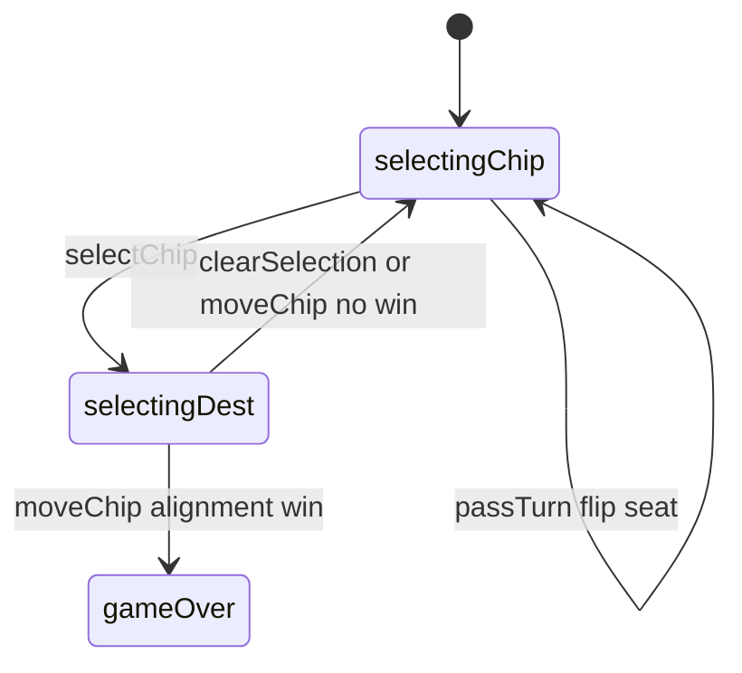

# Kwatro-Sinko — engine reference

> Contributor-only. Describes **code** under `src/games/kwatro-sinko/`. Not player-facing rules copy.
>
> Broader wiring: [wiki architecture (#475)](../../wiki/architecture.md) · [game registry](../../wiki/game-registry.md) · [docs sync (#496)](https://github.com/fuzzywigg/math-pentathlon/pull/496).
> Do not duplicate those docs here.

- **Registry id:** `kwatro-sinko` (Division II)
- **Mount:** `src/ui/game-route-mounts.ts` → `case 'kwatro-sinko'` → `src/games/kwatro-sinko/game-controller.ts`
- **UI:** `src/games/kwatro-sinko/board-ui.ts`
- **Rules / state:** `src/games/kwatro-sinko/rules.ts`, `src/games/kwatro-sinko/types.ts`
- **AI adapter:** `src/games/kwatro-sinko/ai.ts`

## State shape

Primary type: `KwaState` in `src/games/kwatro-sinko/types.ts`.

| Field |
| --- |
| `nodes` |
| `chips` |
| `currentPlayer` |
| `selectedChip` |
| `phase` |
| `winner` |
| `winningAlignment` |
| `moveHistory` |

```ts
export interface KwaState {
  nodes: Map<string, BoardNode>;
  chips: Map<string, Chip>;
  currentPlayer: Player;
  selectedChip: string | null;
  phase: GamePhase;
  winner: Player | null;
  winningAlignment: Alignment | null;
  moveHistory: KwaMove[];
}
```

## Move types

- `KwaMove` — `src/games/kwatro-sinko/types.ts`

```ts
export interface KwaMove {
  player: Player;
  chip: Chip;
  fromNode: string;
  toNode: string;
  alignment: Alignment | null;
  moveNumber: number;
}
```

### Apply / advance functions

- `selectChip` — `src/games/kwatro-sinko/rules.ts`
- `moveChip` — `src/games/kwatro-sinko/rules.ts`
- `passTurn` — `src/games/kwatro-sinko/rules.ts`
- `clearSelection` — `src/games/kwatro-sinko/rules.ts`

## Turn / phase state machine

Phase type: `GamePhase` in `src/games/kwatro-sinko/types.ts`.

```ts
export type GamePhase =
  | 'selectingChip' // Player selecting which chip to move
  | 'selectingDest' // Player selecting destination
  | 'gameOver';
```



## Win / draw detection

| Function | File | What the code does |
| --- | --- | --- |
| `findWinningAlignment` | `src/games/kwatro-sinko/rules.ts` | Contiguous 3-chip like+like−opp equals 4 or 5. |
| `checkTrioForWin` | `src/games/kwatro-sinko/rules.ts` | Expression check for a candidate trio. |
| `allChipsOffNumbered` | `src/games/kwatro-sinko/rules.ts` | Prerequisite for declaring a win. |
| `isWinningValue` | `src/games/kwatro-sinko/types.ts` | Value is 4 or 5. |

## Serialization format

No dedicated codec. **`nodes` + `chips` Maps** — Map/Set-aware JSON / `structuredClone`.

Shared progress storage (`src/core/storage/storage.ts`) persists stats/profile only, not in-progress boards.

## AI adapter

- `getAIMove` — `src/games/kwatro-sinko/ai.ts`
- `executeAITurn` — `src/games/kwatro-sinko/ai.ts`
- `isAITurn` — `src/games/kwatro-sinko/ai.ts`

## Tests that cover this engine

Imports from `src/games/kwatro-sinko/` (non-exhaustive; prefer these first):

- `tests/unit/burn-wave40-kwatro-move-phase-reject.test.ts`
- `tests/unit/burn-wave41-kwatro-move-phase-reject.test.ts`
- `tests/unit/burn-wave41-kwatro-sinko-ai-difficulties.test.ts`
- `tests/unit/burn-wave41-kwatro-sinko-opening-rules.test.ts`
- `tests/unit/burn-wave41-kwatro-sinko-winning-value.test.ts`
- `tests/unit/burn-wave42-kwatro-ai-hard-execute.test.ts`
- `tests/unit/burn-wave42-kwatro-ai-is-turn.test.ts`
- `tests/unit/burn-wave42-kwatro-ai-medium-random.test.ts`
- `tests/unit/burn-wave42-kwatro-ai-teaching-easy.test.ts`
- `tests/unit/burn-wave42-kwatro-alignment-win-five.test.ts`
- `tests/unit/burn-wave42-kwatro-alignment-win-four.test.ts`
- `tests/unit/burn-wave42-kwatro-alternative-win.test.ts`
- `tests/unit/burn-wave46-kwatro-ai-easy-high-random.test.ts`
- `tests/unit/burn-wave46-kwatro-ai-execute-hard.test.ts`
- `tests/unit/burn-wave46-kwatro-horizontal-win4.test.ts`
- `tests/unit/burn-wave47-kwatro-ai-hard-execute.test.ts`
- `tests/unit/burn-wave47-kwatro-ai-is-turn.test.ts`
- `tests/unit/burn-wave47-kwatro-ai-medium-random.test.ts`
- `tests/unit/helpers/state-roundtrip-games.ts`

Also exercised by cross-game suites that import the module where listed above (round-trip helper, undo-audit props, registry/mount smoke).

## Known TODOs in code comments

None found under `src/games/kwatro-sinko/` (`TODO` / `FIXME` / `Andrew` comment scan).

## Key symbols (link-check table)

| Symbol | File |
| --- | --- |
| `KwaState` | `src/games/kwatro-sinko/types.ts` |
| `KwaMove` | `src/games/kwatro-sinko/types.ts` |
| `selectChip` | `src/games/kwatro-sinko/rules.ts` |
| `moveChip` | `src/games/kwatro-sinko/rules.ts` |
| `passTurn` | `src/games/kwatro-sinko/rules.ts` |
| `clearSelection` | `src/games/kwatro-sinko/rules.ts` |
| `GamePhase` | `src/games/kwatro-sinko/types.ts` |
| `findWinningAlignment` | `src/games/kwatro-sinko/rules.ts` |
| `checkTrioForWin` | `src/games/kwatro-sinko/rules.ts` |
| `allChipsOffNumbered` | `src/games/kwatro-sinko/rules.ts` |
| `isWinningValue` | `src/games/kwatro-sinko/types.ts` |
| `getAIMove` | `src/games/kwatro-sinko/ai.ts` |
| `executeAITurn` | `src/games/kwatro-sinko/ai.ts` |
| `isAITurn` | `src/games/kwatro-sinko/ai.ts` |
| *(module)* | `src/games/kwatro-sinko/game-controller.ts` |
| *(module)* | `src/games/kwatro-sinko/board-ui.ts` |
| *(module)* | `src/games/kwatro-sinko/rules.ts` |
| *(module)* | `src/games/kwatro-sinko/ai.ts` |
| *(module)* | `src/games/kwatro-sinko/tutorial.ts` |
| *(module)* | `src/ui/game-route-mounts.ts` |
| *(module)* | `src/core/game-registry.ts` |

## Questions for Andrew

Flagged code-vs-docs disagreements only (no rules text edited here). See also `docs/RULES-DECISIONS-2026-10-07.md` and `docs/tutorial-engine-mismatches-2026-10-07.md`.

- **H1 / KW2:** Engine requires contiguous chips; Div II Highlights allow gaps.
  - Recommendation: **Yes** — Yes — allow gaps per Highlights (engine change later).
- **H2:** No repetition/move-cap draw; movement can loop.
  - Recommendation: **Yes** — B — repetition/position draw.
