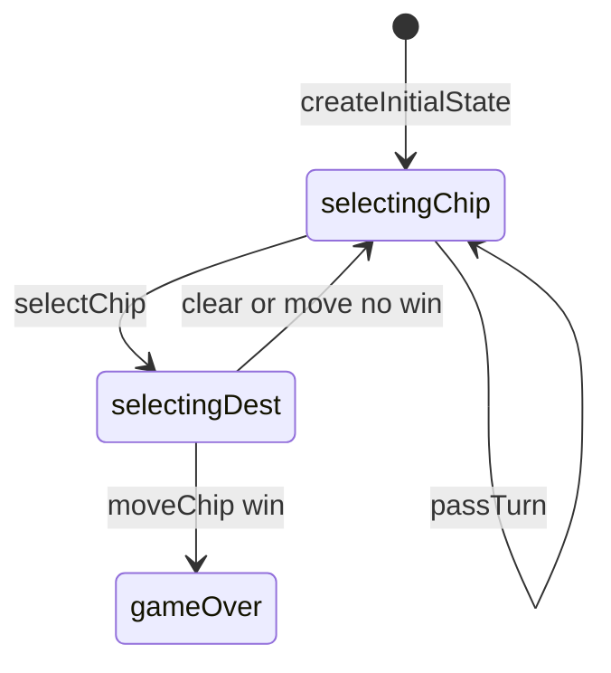

# Kwatro-Sinko engine (`kwatro-sinko`)

> Contributor reference for what the **code** does. Not player-facing.
> Do not treat this as official rules text. Wiki architecture: [docs/wiki/architecture.md](../../wiki/architecture.md) ([#475](https://github.com/fuzzywigg/math-pentathlon/issues/475)).
> Docs-sync work: see [#496](https://github.com/fuzzywigg/math-pentathlon/issues/496) — this page does not replace it.

**Division:** Division II · **Registry id:** `kwatro-sinko`

## Module files

- `src/games/kwatro-sinko/types.ts`
- `src/games/kwatro-sinko/rules.ts`

**AI adapter**

- `src/games/kwatro-sinko/ai.ts`

**UI entry**

- `src/games/kwatro-sinko/board-ui.ts`
- `src/games/kwatro-sinko/game-controller.ts`
- `src/games/kwatro-sinko/board-3d-loader.ts`

## State shape

Primary type `KwaState` in `src/games/kwatro-sinko/types.ts`.

- `nodes: Map<string, BoardNode>` / `chips: Map<string, Chip>`
- `selectedChip` / `winningAlignment`
- `phase: GamePhase` — `'selectingChip' | 'selectingDest' | 'gameOver'`
- `winner: Player | null`
- `moveHistory: KwaMove[]`

## Move types

Record `KwaMove`. Apply `selectChip`, `clearSelection`, `moveChip`, `passTurn`.

Apply / query API:

- `moveChip` — needs all chips off numbered + winning alignment (4 or 5)
- `findWinningAlignment` / `allChipsOffNumbered` / `checkTrioForWin`
- `passTurn` — no draw detector

## Turn / phase state machine

Phases in code: `selectingChip`, `selectingDest`, `gameOver`.



## Win / draw detection

- `findWinningAlignment` / `checkTrioForWin` → `Alignment | null`
- Requires `allChipsOffNumbered`
- No draw / move-cap termination

## Serialization format

Maps need revive. Optional 3D loader. No product board save.

## Tests that cover this engine

- `tests/unit/engine-coverage-kwatro-sinko-targeted.test.ts`
- `tests/unit/kwatro-sinko-end-rules-375.test.ts`
- `tests/unit/burn-wave42-kwatro-alignment-win-four.test.ts`
- `tests/unit/burn-wave42-kwatro-alignment-win-five.test.ts`
- `tests/unit/burn-wave41-kwatro-sinko-opening-rules.test.ts`
- `tests/unit/burn-wave47-kwatro-sinko-opening-rules.test.ts`
- `tests/unit/state-roundtrip-fuzz.test.ts`

## Known TODOs (from code comments)

- No tagged TODOs under `src/games/kwatro-sinko/`.

## Questions for Andrew

Yes/no decisions; recommendations are non-binding.

- **Q:** Add repetition/move-cap draw for endless cycling (RULES H2/KW5)?
  - **Recommendation:** Yes — once product wants finite games.
- **Q:** Tutorial diagonals-on-numbered vs center-only diagonals in code (RULES KW1)?
  - **Recommendation:** Flag only; code is source for this doc.

## Related reading

- Index: [README.md](./README.md)
- Wiki games catalog: [docs/wiki/games.md](../../wiki/games.md)
- Wiki architecture (#475): [docs/wiki/architecture.md](../../wiki/architecture.md)
- Adding a game: [docs/wiki/adding-a-game.md](../../wiki/adding-a-game.md)
- Rules decision log (do not edit rules here): [docs/RULES-DECISIONS-2026-10-07.md](../../RULES-DECISIONS-2026-10-07.md)

```dev-doc-refs
src/games/kwatro-sinko/types.ts#KwaState
src/games/kwatro-sinko/types.ts#GamePhase
src/games/kwatro-sinko/rules.ts#createInitialState
src/games/kwatro-sinko/rules.ts#moveChip
src/games/kwatro-sinko/rules.ts#findWinningAlignment
src/games/kwatro-sinko/rules.ts#allChipsOffNumbered
src/games/kwatro-sinko/rules.ts#passTurn
src/games/kwatro-sinko/ai.ts#getAIMove
src/games/kwatro-sinko/game-controller.ts#initGame
src/games/kwatro-sinko/board-ui.ts#renderBoard
tests/unit/engine-coverage-kwatro-sinko-targeted.test.ts
src/core/game-registry.ts#GAMES
src/ui/game-route-mounts.ts#mountGameById
```
