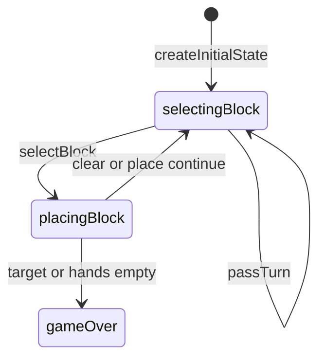

# Par 55 engine (`par-55`)

> Contributor reference for what the **code** does. Not player-facing.
> Do not treat this as official rules text. Wiki architecture: [docs/wiki/architecture.md](../../wiki/architecture.md) ([#475](https://github.com/fuzzywigg/math-pentathlon/issues/475)).
> Docs-sync work: see [#496](https://github.com/fuzzywigg/math-pentathlon/issues/496) — this page does not replace it.

**Division:** Division II · **Registry id:** `par-55`

## Module files

- `src/games/par-55/types.ts`
- `src/games/par-55/rules.ts`

**AI adapter**

- `src/games/par-55/ai.ts`

**UI entry**

- `src/games/par-55/board-ui.ts`
- `src/games/par-55/game-controller.ts`

## State shape

Primary type `Par55State` in `src/games/par-55/types.ts`.

- `bases: Map<string, Base>`
- `hands` / `selectedBlock` / `scores`
- `phase: GamePhase` — `'selectingBlock' | 'placingBlock' | 'gameOver'`
- `winner: Player | null`
- `moveHistory: Par55Move[]`
- `lastMoveBaseId: string | null`

## Move types

Record `Par55Move`. Apply `selectBlock`, `clearSelection`, `placeBlock`, `passTurn`.

Apply / query API:

- `placeBlock` — target 55 / both-hands-empty settle
- `passTurn`
- `hasValidMoves` / `getValidPlacements` / `calculateScore`

## Turn / phase state machine

Phases in code: `selectingBlock`, `placingBlock`, `gameOver`.



## Win / draw detection

- Inline in `placeBlock` (no `checkWinner`)
- Score ≥ 55 branches; both hands empty → higher score or `winner: null`

## Serialization format

`bases` Map needs `__mp_map__` revive. No product board save.

## Tests that cover this engine

- `tests/unit/par-55-rules.test.ts`
- `tests/unit/par-55-ai.test.ts`
- `tests/unit/engine-coverage-par-55-targeted.test.ts`
- `tests/unit/burn-wave35-par-55-win-draw-settle.test.ts`
- `tests/unit/burn-wave47-par-55-rules.test.ts`
- `tests/unit/burn-wave47-par55-place-target-p1-win.test.ts`
- `tests/unit/state-roundtrip-fuzz.test.ts`

## Known TODOs (from code comments)

- No tagged TODOs. Header mentions bump mechanics but none exist.

## Questions for Andrew

Yes/no decisions; recommendations are non-binding.

- **Q:** Header claims bump mechanics — implement or clarify comments?
  - **Recommendation:** Clarify/remove comment; do not invent bump here.
- **Q:** Deal-once hands (no refill) — confirm vs constant-5 tutorials?
  - **Recommendation:** Yes — document deal-once as code truth.

## Related reading

- Index: [README.md](./README.md)
- Wiki games catalog: [docs/wiki/games.md](../../wiki/games.md)
- Wiki architecture (#475): [docs/wiki/architecture.md](../../wiki/architecture.md)
- Adding a game: [docs/wiki/adding-a-game.md](../../wiki/adding-a-game.md)
- Rules decision log (do not edit rules here): [docs/RULES-DECISIONS-2026-10-07.md](../../RULES-DECISIONS-2026-10-07.md)

```dev-doc-refs
src/games/par-55/types.ts#Par55State
src/games/par-55/types.ts#GamePhase
src/games/par-55/rules.ts#createInitialState
src/games/par-55/rules.ts#placeBlock
src/games/par-55/rules.ts#passTurn
src/games/par-55/rules.ts#hasValidMoves
src/games/par-55/ai.ts#getAIMove
src/games/par-55/game-controller.ts#initGame
src/games/par-55/board-ui.ts#renderBoard
tests/unit/engine-coverage-par-55-targeted.test.ts
tests/unit/par-55-rules.test.ts
src/core/game-registry.ts#GAMES
src/ui/game-route-mounts.ts#mountGameById
```
