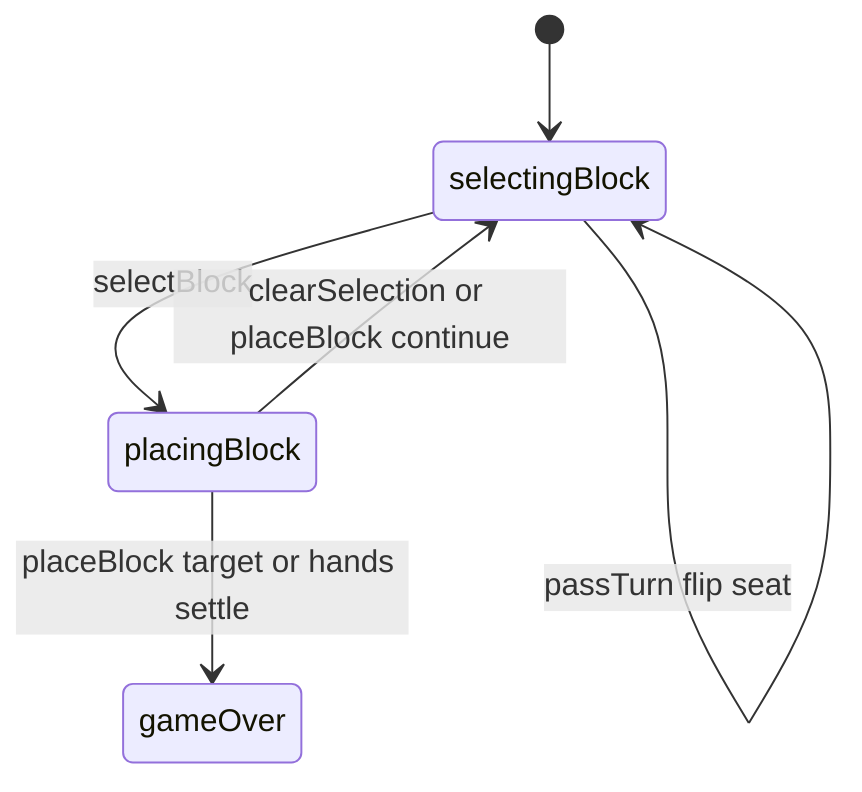

# Par 55 — engine reference

> Contributor-only. Describes **code** under `src/games/par-55/`. Not player-facing rules copy.
>
> Broader wiring: [wiki architecture (#475)](../../wiki/architecture.md) · [game registry](../../wiki/game-registry.md) · [docs sync (#496)](https://github.com/fuzzywigg/math-pentathlon/pull/496).
> Do not duplicate those docs here.

- **Registry id:** `par-55` (Division II)
- **Mount:** `src/ui/game-route-mounts.ts` → `case 'par-55'` → `src/games/par-55/game-controller.ts`
- **UI:** `src/games/par-55/board-ui.ts`
- **Rules / state:** `src/games/par-55/rules.ts`, `src/games/par-55/types.ts`
- **AI adapter:** `src/games/par-55/ai.ts`

## State shape

Primary type: `Par55State` in `src/games/par-55/types.ts`.

| Field |
| --- |
| `bases` |
| `hands` |
| `player1` |
| `player2` |
| `currentPlayer` |
| `selectedBlock` |
| `phase` |
| `scores` |
| `player1` |
| `player2` |
| `winner` |
| `moveHistory` |
| `lastMoveBaseId` |

```ts
export interface Par55State {
  bases: Map<string, Base>;
  hands: {
    player1: AttributeBlock[];
    player2: AttributeBlock[];
  };
  currentPlayer: Player;
  selectedBlock: string | null;
  phase: GamePhase;
  scores: {
    player1: number;
    player2: number;
  };
  winner: Player | null;
  moveHistory: Par55Move[];
  lastMoveBaseId: string | null;
}
```

## Move types

- `Par55Move` — `src/games/par-55/types.ts`

```ts
export interface Par55Move {
  player: Player;
  block: AttributeBlock;
  baseId: string;
  pointsScored: number;
  matchDetails: MatchDetail[];
  moveNumber: number;
}
```

### Apply / advance functions

- `selectBlock` — `src/games/par-55/rules.ts`
- `placeBlock` — `src/games/par-55/rules.ts`
- `passTurn` — `src/games/par-55/rules.ts`
- `clearSelection` — `src/games/par-55/rules.ts`

## Turn / phase state machine

Phase type: `GamePhase` in `src/games/par-55/types.ts`.

```ts
export type GamePhase =
  | 'selectingBlock' // Player selecting a block from their hand
  | 'placingBlock' // Player placing the block on a base
  | 'gameOver';
```



## Win / draw detection

| Function | File | What the code does |
| --- | --- | --- |
| `calculateScore` | `src/games/par-55/rules.ts` | Attribute match scoring for a placement. |
| `placeBlock` | `src/games/par-55/rules.ts` | Score ≥ `CONFIG.TARGET_SCORE` (55) or both hands empty → compare scores / `null` tie. |
| `hasValidMoves` | `src/games/par-55/rules.ts` | Observational; `passTurn` does not auto-settle. |

## Serialization format

No dedicated codec. **`bases: Map`** — Map/Set-aware JSON / `structuredClone` required (`docs/state-roundtrip-2026-10-07.md`).

Shared progress storage (`src/core/storage/storage.ts`) persists stats/profile only, not in-progress boards.

## AI adapter

- `getAIMove` — `src/games/par-55/ai.ts`
- `executeAITurn` — `src/games/par-55/ai.ts`
- `isAITurn` — `src/games/par-55/ai.ts`

## Tests that cover this engine

Imports from `src/games/par-55/` (non-exhaustive; prefer these first):

- `tests/unit/burn-wave35-par-55-win-draw-settle.test.ts`
- `tests/unit/burn-wave41-par55-phase-reject-matrix.test.ts`
- `tests/unit/burn-wave41-par55-place-identity-phase.test.ts`
- `tests/unit/burn-wave42-par55-ai-execute-pass.test.ts`
- `tests/unit/burn-wave42-par55-ai-get-move-difficulties.test.ts`
- `tests/unit/burn-wave42-par55-ai-is-turn.test.ts`
- `tests/unit/burn-wave42-par55-place-target-p1-win.test.ts`
- `tests/unit/burn-wave42-par55-place-target-p2-win.test.ts`
- `tests/unit/burn-wave47-par-55-ai.test.ts`
- `tests/unit/burn-wave47-par-55-rules.test.ts`
- `tests/unit/burn-wave47-par-55-win-draw-settle.test.ts`
- `tests/unit/burn-wave47-par55-ai-execute-pass.test.ts`
- `tests/unit/burn-wave47-par55-ai-get-move-difficulties.test.ts`
- `tests/unit/burn-wave47-par55-ai-is-turn.test.ts`
- `tests/unit/burn-wave47-par55-phase-reject-matrix.test.ts`
- `tests/unit/burn-wave47-par55-place-identity-phase.test.ts`
- `tests/unit/burn-wave47-par55-place-target-p1-win.test.ts`
- `tests/unit/burn-wave47-par55-place-target-p2-win.test.ts`
- `tests/unit/helpers/state-roundtrip-games.ts`

Also exercised by cross-game suites that import the module where listed above (round-trip helper, undo-audit props, registry/mount smoke).

## Known TODOs in code comments

None found under `src/games/par-55/` (`TODO` / `FIXME` / `Andrew` comment scan).

## Key symbols (link-check table)

| Symbol | File |
| --- | --- |
| `Par55State` | `src/games/par-55/types.ts` |
| `Par55Move` | `src/games/par-55/types.ts` |
| `selectBlock` | `src/games/par-55/rules.ts` |
| `placeBlock` | `src/games/par-55/rules.ts` |
| `passTurn` | `src/games/par-55/rules.ts` |
| `clearSelection` | `src/games/par-55/rules.ts` |
| `GamePhase` | `src/games/par-55/types.ts` |
| `calculateScore` | `src/games/par-55/rules.ts` |
| `hasValidMoves` | `src/games/par-55/rules.ts` |
| `getAIMove` | `src/games/par-55/ai.ts` |
| `executeAITurn` | `src/games/par-55/ai.ts` |
| `isAITurn` | `src/games/par-55/ai.ts` |
| *(module)* | `src/games/par-55/game-controller.ts` |
| *(module)* | `src/games/par-55/board-ui.ts` |
| *(module)* | `src/games/par-55/rules.ts` |
| *(module)* | `src/games/par-55/ai.ts` |
| *(module)* | `src/games/par-55/tutorial.ts` |
| *(module)* | `src/ui/game-route-mounts.ts` |
| *(module)* | `src/core/game-registry.ts` |

## Questions for Andrew

Flagged code-vs-docs disagreements only (no rules text edited here). See also `docs/RULES-DECISIONS-2026-10-07.md` and `docs/tutorial-engine-mismatches-2026-10-07.md`.

- **P55-2/3:** First seat to hit 55 can win without giving the opponent a reply turn.
  - Recommendation: **Yes** — Confirm whether opponent gets a reply turn after 55.
