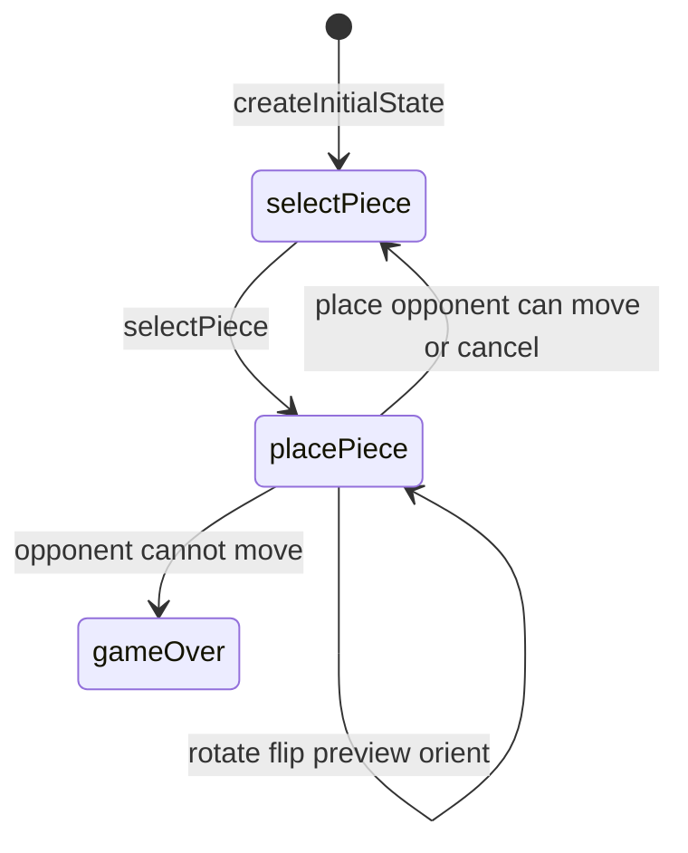

# Pent-Em-In engine (`pent-em-in`)

> Contributor reference for what the **code** does. Not player-facing.
> Do not treat this as official rules text. Wiki architecture: [docs/wiki/architecture.md](../../wiki/architecture.md) ([#475](https://github.com/fuzzywigg/math-pentathlon/issues/475)).
> Docs-sync work: see [#496](https://github.com/fuzzywigg/math-pentathlon/issues/496) — this page does not replace it.

**Division:** Division IV · **Registry id:** `pent-em-in`

## Module files

- `src/games/pent-em-in/types.ts`
- `src/games/pent-em-in/rules.ts`

**AI adapter**

- `src/games/pent-em-in/ai.ts`

**UI entry**

- `src/games/pent-em-in/board-ui.ts`
- `src/games/pent-em-in/game-controller.ts`
- `src/games/pent-em-in/board-3d-loader.ts`

## State shape

Primary type `PentEmInState` in `src/games/pent-em-in/types.ts`.

- `board: BoardCell[][]` (10×10)
- `placedPieces` / player piece lists
- `phase: GamePhase` — `'selectPiece' | 'placePiece' | 'gameOver'`
- `selectedPiece` / rotation / flip / `previewPosition`
- `winner` / `moveHistory: MoveRecord[]`

## Move types

Apply `selectPiece`, `placePiece`, rotate/flip/cancel/preview/orient helpers. AI: `AIMove` via `getAIMove`.

Apply / query API:

- `placePiece` — win when opponent `!canPlayerMove`
- `canPlayerMove` / `getValidPlacements` / `orientSelectedPieceToFit`

## Turn / phase state machine

Phases in code: `selectPiece`, `placePiece`, `gameOver`.



## Win / draw detection

- Inline in `placePiece`: opponent cannot move → current wins
- No draw path

## Serialization format

No codec. Nested arrays; fuzz `jsonRoundTrip`.

## Tests that cover this engine

- `tests/unit/pent-em-in-rules.test.ts`
- `tests/unit/pent-em-in-ai.test.ts`
- `tests/unit/pent-em-in-placement-escape.test.ts`
- `tests/unit/burn-wave35-pent-em-in-placement-geometry.test.ts`
- `tests/unit/burn-wave35-pent-em-in-selection-clear.test.ts`
- `tests/unit/state-roundtrip-fuzz.test.ts`

## Known TODOs (from code comments)

- No tagged TODOs under `src/games/pent-em-in/`.

## Questions for Andrew

Yes/no decisions; recommendations are non-binding.

- **Q:** Confirm last-placer trap win even if they couldn’t place next (RULES PE1)?
  - **Recommendation:** Yes — keep current trap-win.

## Related reading

- Index: [README.md](./README.md)
- Wiki games catalog: [docs/wiki/games.md](../../wiki/games.md)
- Wiki architecture (#475): [docs/wiki/architecture.md](../../wiki/architecture.md)
- Adding a game: [docs/wiki/adding-a-game.md](../../wiki/adding-a-game.md)
- Rules decision log (do not edit rules here): [docs/RULES-DECISIONS-2026-10-07.md](../../RULES-DECISIONS-2026-10-07.md)

```dev-doc-refs
src/games/pent-em-in/types.ts#PentEmInState
src/games/pent-em-in/types.ts#GamePhase
src/games/pent-em-in/types.ts#createInitialState
src/games/pent-em-in/rules.ts#placePiece
src/games/pent-em-in/rules.ts#canPlayerMove
src/games/pent-em-in/rules.ts#selectPiece
src/games/pent-em-in/rules.ts#orientSelectedPieceToFit
src/games/pent-em-in/ai.ts#getAIMove
src/games/pent-em-in/game-controller.ts#initGame
src/games/pent-em-in/board-ui.ts#renderBoard
tests/unit/pent-em-in-rules.test.ts
src/core/game-registry.ts#GAMES
src/ui/game-route-mounts.ts#mountGameById
```
