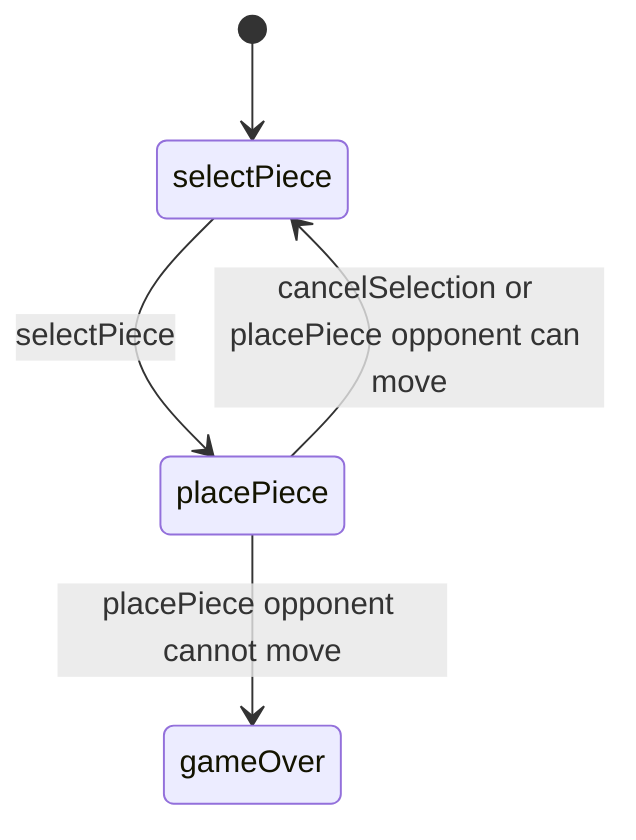

# Pent 'Em In — engine reference

> Contributor-only. Describes **code** under `src/games/pent-em-in/`. Not player-facing rules copy.
>
> Broader wiring: [wiki architecture (#475)](../../wiki/architecture.md) · [game registry](../../wiki/game-registry.md) · [docs sync (#496)](https://github.com/fuzzywigg/math-pentathlon/pull/496).
> Do not duplicate those docs here.

- **Registry id:** `pent-em-in` (Division IV)
- **Mount:** `src/ui/game-route-mounts.ts` → `case 'pent-em-in'` → `src/games/pent-em-in/game-controller.ts`
- **UI:** `src/games/pent-em-in/board-ui.ts`
- **Rules / state:** `src/games/pent-em-in/rules.ts`, `src/games/pent-em-in/types.ts`
- **AI adapter:** `src/games/pent-em-in/ai.ts`

## State shape

Primary type: `PentEmInState` in `src/games/pent-em-in/types.ts`.

| Field |
| --- |
| `board` |
| `placedPieces` |
| `currentPlayer` |
| `phase` |
| `player1Pieces` |
| `player2Pieces` |
| `selectedPiece` |
| `selectedRotation` |
| `selectedFlipped` |
| `previewPosition` |
| `moveHistory` |
| `winner` |

```ts
export interface PentEmInState {
  board: BoardCell[][];
  placedPieces: PlacedPiece[];
  currentPlayer: Player;
  phase: GamePhase;

  // Each player's pieces
  player1Pieces: PlayerPieces;
  player2Pieces: PlayerPieces;

  // Currently selected piece for placement
  selectedPiece: string | null;
  selectedRotation: Rotation;
  selectedFlipped: boolean;

  // Preview position
  previewPosition: Cell | null;

  // Move history
  moveHistory: MoveRecord[];

  // Winner
  winner: Player | null;
}
```

## Move types

- `MoveRecord` — `src/games/pent-em-in/types.ts`

```ts
export interface MoveRecord {
  player: Player;
  shapeId: string;
  position: Cell;
  rotation: Rotation;
  flipped: boolean;
  moveNumber: number;
}
```

- `AIMove` — `src/games/pent-em-in/ai.ts`

```ts
export interface AIMove {
  shapeId: string;
  position: Cell;
  rotation: Rotation;
  flipped: boolean;
  hint?: string;
}
```

### Apply / advance functions

- `selectPiece` — `src/games/pent-em-in/rules.ts`
- `placePiece` — `src/games/pent-em-in/rules.ts`
- `rotateSelectedPiece` — `src/games/pent-em-in/rules.ts`
- `flipSelectedPiece` — `src/games/pent-em-in/rules.ts`
- `cancelSelection` — `src/games/pent-em-in/rules.ts`

## Turn / phase state machine

Phase type: `GamePhase` in `src/games/pent-em-in/types.ts`.

```ts
export type GamePhase = 'selectPiece' | 'placePiece' | 'gameOver';
```



## Win / draw detection

| Function | File | What the code does |
| --- | --- | --- |
| `placePiece` | `src/games/pent-em-in/rules.ts` | If opponent fails `canPlayerMove`, current player wins. |
| `canPlayerMove` | `src/games/pent-em-in/rules.ts` | Whether a seat still has a legal placement. |

## Serialization format

No dedicated codec. No `Map`/`Set` → JSON / `structuredClone`.

Shared progress storage (`src/core/storage/storage.ts`) persists stats/profile only, not in-progress boards.

## AI adapter

- `getAIMove` — `src/games/pent-em-in/ai.ts`
- `isAITurn` — `src/games/pent-em-in/ai.ts`

## Tests that cover this engine

Imports from `src/games/pent-em-in/` (non-exhaustive; prefer these first):

- `tests/unit/burn-wave41-pent-ai-difficulties.test.ts`
- `tests/unit/burn-wave41-pent-place-trap-win.test.ts`
- `tests/unit/burn-wave42-pent-ai-difficulty-random.test.ts`
- `tests/unit/burn-wave42-pent-ai-is-turn-null.test.ts`
- `tests/unit/burn-wave42-pent-ai-winning-move.test.ts`
- `tests/unit/burn-wave42-pent-trap-win.test.ts`
- `tests/unit/overnight-pent-ai-hard-open-no-win.test.ts`
- `tests/unit/overnight-pent-ai-medium-random-top5.test.ts`
- `tests/unit/overnight-pent-ai-teaching-midband.test.ts`
- `tests/unit/overnight-pent-trap-win-ai-prefer.test.ts`
- `tests/unit/pent-em-in-ai-input-guard.test.ts`
- `tests/unit/pent-em-in-ai.test.ts`
- `tests/unit/pent-em-in-rules.test.ts`
- `tests/unit/burn-wave42-handshake-par-pent-prime-ai-null.test.ts`
- `tests/unit/burn-wave35-pent-em-in-placement-geometry.test.ts`
- `tests/unit/burn-wave35-pent-em-in-selection-clear.test.ts`
- `tests/unit/burn-wave40-pent-select-flags-oob.test.ts`
- `tests/unit/burn-wave41-pent-geometry-preview.test.ts`
- `tests/unit/helpers/state-roundtrip-games.ts`

Also exercised by cross-game suites that import the module where listed above (round-trip helper, undo-audit props, registry/mount smoke).

## Known TODOs in code comments

None found under `src/games/pent-em-in/` (`TODO` / `FIXME` / `Andrew` comment scan).

## Key symbols (link-check table)

| Symbol | File |
| --- | --- |
| `PentEmInState` | `src/games/pent-em-in/types.ts` |
| `MoveRecord` | `src/games/pent-em-in/types.ts` |
| `AIMove` | `src/games/pent-em-in/ai.ts` |
| `selectPiece` | `src/games/pent-em-in/rules.ts` |
| `placePiece` | `src/games/pent-em-in/rules.ts` |
| `rotateSelectedPiece` | `src/games/pent-em-in/rules.ts` |
| `flipSelectedPiece` | `src/games/pent-em-in/rules.ts` |
| `cancelSelection` | `src/games/pent-em-in/rules.ts` |
| `GamePhase` | `src/games/pent-em-in/types.ts` |
| `canPlayerMove` | `src/games/pent-em-in/rules.ts` |
| `getAIMove` | `src/games/pent-em-in/ai.ts` |
| `isAITurn` | `src/games/pent-em-in/ai.ts` |
| *(module)* | `src/games/pent-em-in/game-controller.ts` |
| *(module)* | `src/games/pent-em-in/board-ui.ts` |
| *(module)* | `src/games/pent-em-in/rules.ts` |
| *(module)* | `src/games/pent-em-in/ai.ts` |
| *(module)* | `src/games/pent-em-in/tutorial.ts` |
| *(module)* | `src/ui/game-route-mounts.ts` |
| *(module)* | `src/core/game-registry.ts` |

## Questions for Andrew

Flagged code-vs-docs disagreements only (no rules text edited here). See also `docs/RULES-DECISIONS-2026-10-07.md` and `docs/tutorial-engine-mismatches-2026-10-07.md`.

- None specific beyond the shared decision checklist (or already aligned in RULES/tutorial mismatch docs).
