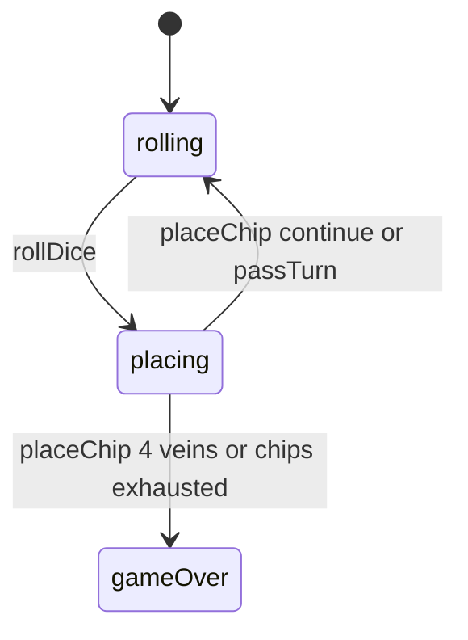

# Prime Gold — engine reference

> Contributor-only. Describes **code** under `src/games/prime-gold/`. Not player-facing rules copy.
>
> Broader wiring: [wiki architecture (#475)](../../wiki/architecture.md) · [game registry](../../wiki/game-registry.md) · [docs sync (#496)](https://github.com/fuzzywigg/math-pentathlon/pull/496).
> Do not duplicate those docs here.

- **Registry id:** `prime-gold` (Division IV)
- **Mount:** `src/ui/game-route-mounts.ts` → `case 'prime-gold'` → `src/games/prime-gold/game-controller.ts`
- **UI:** `src/games/prime-gold/board-ui.ts`
- **Rules / state:** `src/games/prime-gold/rules.ts`, `src/games/prime-gold/types.ts`
- **AI adapter:** `src/games/prime-gold/ai.ts`

## State shape

Primary type: `PrimeGoldState` in `src/games/prime-gold/types.ts`.

| Field |
| --- |
| `cells` |
| `currentPlayer` |
| `diceRoll` |
| `phase` |
| `winner` |
| `moveHistory` |
| `playerChips` |
| `primeVeins` |

```ts
export interface PrimeGoldState {
  cells: Map<string, BoardCell>; // key: "row,col"
  currentPlayer: Player;
  diceRoll: DiceRoll | null;
  phase: 'rolling' | 'placing' | 'gameOver';
  winner: Player | null;
  moveHistory: MoveRecord[];
  playerChips: Record<Player, number>;
  primeVeins: Record<Player, number>; // Count of diagonal prime veins
}
```

## Move types

- `MoveRecord` — `src/games/prime-gold/types.ts`

```ts
export interface MoveRecord {
  player: Player;
  dice: DiceRoll;
  expression: string;
  result: number;
  row: number;
  col: number;
}
```

- `AIPlacement` — `src/games/prime-gold/ai.ts`

```ts
export interface AIPlacement {
  value: number;
  expression: string;
  hint?: string;
}
```

### Apply / advance functions

- `rollDice` — `src/games/prime-gold/rules.ts`
- `placeChip` — `src/games/prime-gold/rules.ts`
- `passTurn` — `src/games/prime-gold/rules.ts`

## Turn / phase state machine

Phase field is an inline string union on `PrimeGoldState` in `src/games/prime-gold/types.ts` (not a separate exported `GamePhase` alias).



## Win / draw detection

| Function | File | What the code does |
| --- | --- | --- |
| `placeChip` | `src/games/prime-gold/rules.ts` | Inline: veins ≥ `CONFIG.VEINS_TO_WIN` (4), or both chip counts 0 → higher veins / null tie. |
| `getPrimeVeinSegments` | `src/games/prime-gold/rules.ts` | Vein geometry used by settle. |
| `hasValidMoves` | `src/games/prime-gold/rules.ts` | Whether current roll has a legal cell. |

## Serialization format

No dedicated codec. **`cells: Map`** — Map-aware JSON / `structuredClone`.

Shared progress storage (`src/core/storage/storage.ts`) persists stats/profile only, not in-progress boards.

## AI adapter

- `getAIPlacement` — `src/games/prime-gold/ai.ts`
- `executeAITurn` — `src/games/prime-gold/ai.ts`
- `isAITurn` — `src/games/prime-gold/ai.ts`

## Tests that cover this engine

Imports from `src/games/prime-gold/` (non-exhaustive; prefer these first):

- `tests/unit/burn-wave40-prime-roll-phase-valids.test.ts`
- `tests/unit/burn-wave41-prime-ai-difficulty.test.ts`
- `tests/unit/burn-wave41-prime-ai-execute.test.ts`
- `tests/unit/burn-wave42-prime-ai-execute-turn.test.ts`
- `tests/unit/burn-wave42-prime-ai-is-turn.test.ts`
- `tests/unit/burn-wave42-prime-ai-placement.test.ts`
- `tests/unit/burn-wave42-prime-place-chip-settle-win.test.ts`
- `tests/unit/mp3d-prime-gold-full-game-ai.test.ts`
- `tests/unit/overnight-prime-ai-block-opponent-setup.test.ts`
- `tests/unit/overnight-prime-ai-isaiturn-matrix.test.ts`
- `tests/unit/overnight-prime-ai-medium-random-top3.test.ts`
- `tests/unit/overnight-prime-ai-teaching-nonprime.test.ts`
- `tests/unit/overnight-prime-ai-vein-neighbor-prefer.test.ts`
- `tests/unit/prime-gold-ai-input-guard.test.ts`
- `tests/unit/prime-gold-ai.test.ts`
- `tests/unit/prime-gold-rules.test.ts`
- `tests/unit/burn-wave41-handshake-prime-dice-roll-phase.test.ts`
- `tests/unit/burn-wave42-handshake-par-pent-prime-ai-null.test.ts`
- `tests/unit/helpers/state-roundtrip-games.ts`

Also exercised by cross-game suites that import the module where listed above (round-trip helper, undo-audit props, registry/mount smoke).

## Known TODOs in code comments

None found under `src/games/prime-gold/` (`TODO` / `FIXME` / `Andrew` comment scan).

## Key symbols (link-check table)

| Symbol | File |
| --- | --- |
| `PrimeGoldState` | `src/games/prime-gold/types.ts` |
| `MoveRecord` | `src/games/prime-gold/types.ts` |
| `AIPlacement` | `src/games/prime-gold/ai.ts` |
| `rollDice` | `src/games/prime-gold/rules.ts` |
| `placeChip` | `src/games/prime-gold/rules.ts` |
| `passTurn` | `src/games/prime-gold/rules.ts` |
| `getPrimeVeinSegments` | `src/games/prime-gold/rules.ts` |
| `hasValidMoves` | `src/games/prime-gold/rules.ts` |
| `getAIPlacement` | `src/games/prime-gold/ai.ts` |
| `executeAITurn` | `src/games/prime-gold/ai.ts` |
| `isAITurn` | `src/games/prime-gold/ai.ts` |
| *(module)* | `src/games/prime-gold/game-controller.ts` |
| *(module)* | `src/games/prime-gold/board-ui.ts` |
| *(module)* | `src/games/prime-gold/rules.ts` |
| *(module)* | `src/games/prime-gold/ai.ts` |
| *(module)* | `src/games/prime-gold/tutorial.ts` |
| *(module)* | `src/ui/game-route-mounts.ts` |
| *(module)* | `src/core/game-registry.ts` |

## Questions for Andrew

Flagged code-vs-docs disagreements only (no rules text edited here). See also `docs/RULES-DECISIONS-2026-10-07.md` and `docs/tutorial-engine-mismatches-2026-10-07.md`.

- None specific beyond the shared decision checklist (or already aligned in RULES/tutorial mismatch docs).
