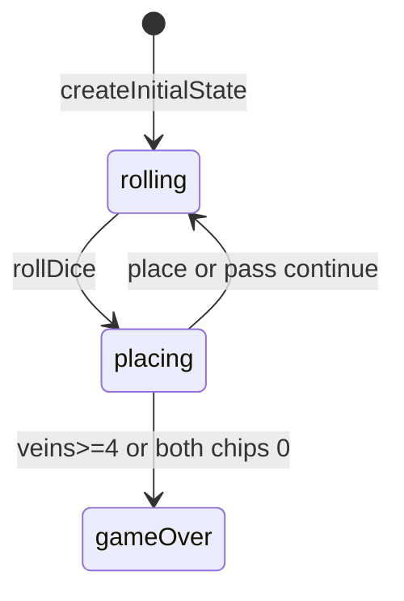

# Prime Gold engine (`prime-gold`)

> Contributor reference for what the **code** does. Not player-facing.
> Do not treat this as official rules text. Wiki architecture: [docs/wiki/architecture.md](../../wiki/architecture.md) ([#475](https://github.com/fuzzywigg/math-pentathlon/issues/475)).
> Docs-sync work: see [#496](https://github.com/fuzzywigg/math-pentathlon/issues/496) — this page does not replace it.

**Division:** Division IV · **Registry id:** `prime-gold`

## Module files

- `src/games/prime-gold/types.ts`
- `src/games/prime-gold/rules.ts`

**AI adapter**

- `src/games/prime-gold/ai.ts`

**UI entry**

- `src/games/prime-gold/board-ui.ts`
- `src/games/prime-gold/game-controller.ts`
- `src/games/prime-gold/board-3d-loader.ts`

## State shape

Primary type `PrimeGoldState` in `src/games/prime-gold/types.ts`.

- `cells: Map<string, BoardCell>`
- `diceRoll` / `playerChips` / `primeVeins`
- `phase: 'rolling' | 'placing' | 'gameOver'`
- `winner: Player | null`
- `moveHistory: MoveRecord[]`

## Move types

Apply `rollDice`, `placeChip(state, value, expression)`, `passTurn`.

Apply / query API:

- `rollDice` / `placeChip` / `passTurn`
- `getValidPlacements` / `hasValidMoves`
- `getPrimeVeinSegments` — vein counting

## Turn / phase state machine

Phases in code: `rolling`, `placing`, `gameOver`.



## Win / draw detection

- Inline in `placeChip`: ≥4 veins wins
- Both chips 0 → compare vein counts; equal → `winner: null`
- `passTurn` never ends the game

## Serialization format

No codec. `cells` Map → `__mp_map__` in fuzz helper.

## Tests that cover this engine

- `tests/unit/prime-gold-rules.test.ts`
- `tests/unit/prime-gold-ai.test.ts`
- `tests/unit/burn-wave35-prime-gold-empty-valids-pass.test.ts`
- `tests/unit/burn-wave42-prime-goldbach-number.test.ts`
- `tests/unit/state-roundtrip-fuzz.test.ts`

## Known TODOs (from code comments)

- No tagged TODOs. `isGoldbachNumber` / targets unused by rules (AI bias only).

## Questions for Andrew

Yes/no decisions; recommendations are non-binding.

- **Q:** Keep chip-exhaust settle / draw besides first-to-4-veins (RULES PG1)?
  - **Recommendation:** Yes — keep engine settle.
- **Q:** `placeChip` does not refuse at `playerChips <= 0` — gate it (RULES PG2)?
  - **Recommendation:** Yes — reject when chips exhausted.

## Related reading

- Index: [README.md](./README.md)
- Wiki games catalog: [docs/wiki/games.md](../../wiki/games.md)
- Wiki architecture (#475): [docs/wiki/architecture.md](../../wiki/architecture.md)
- Adding a game: [docs/wiki/adding-a-game.md](../../wiki/adding-a-game.md)
- Rules decision log (do not edit rules here): [docs/RULES-DECISIONS-2026-10-07.md](../../RULES-DECISIONS-2026-10-07.md)

```dev-doc-refs
src/games/prime-gold/types.ts#PrimeGoldState
src/games/prime-gold/rules.ts#createInitialState
src/games/prime-gold/rules.ts#rollDice
src/games/prime-gold/rules.ts#placeChip
src/games/prime-gold/rules.ts#passTurn
src/games/prime-gold/rules.ts#getPrimeVeinSegments
src/games/prime-gold/ai.ts#executeAITurn
src/games/prime-gold/game-controller.ts#initGame
src/games/prime-gold/board-ui.ts#renderBoard
tests/unit/prime-gold-rules.test.ts
src/core/game-registry.ts#GAMES
src/ui/game-route-mounts.ts#mountGameById
```
