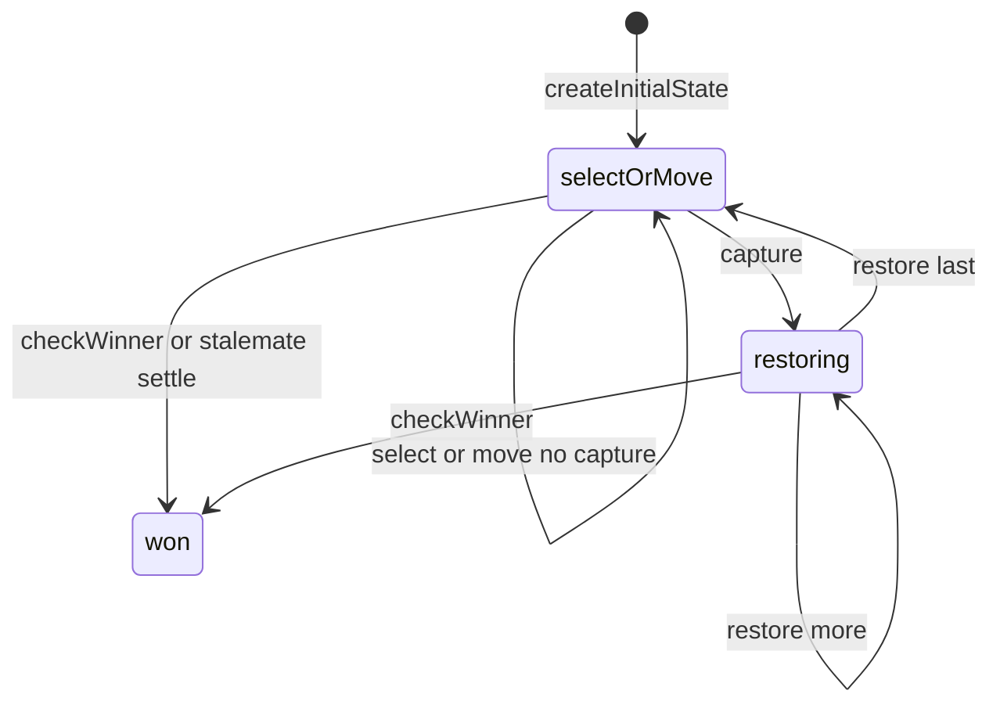

# Queens & Guards engine (`queens-guards`)

> Contributor reference for what the **code** does. Not player-facing.
> Do not treat this as official rules text. Wiki architecture: [docs/wiki/architecture.md](../../wiki/architecture.md) ([#475](https://github.com/fuzzywigg/math-pentathlon/issues/475)).
> Docs-sync work: see [#496](https://github.com/fuzzywigg/math-pentathlon/issues/496) — this page does not replace it.

**Division:** Division III · **Registry id:** `queens-guards`

## Module files

- `src/games/queens-guards/types.ts`
- `src/games/queens-guards/rules.ts`

**AI adapter**

- `src/games/queens-guards/ai.ts`
- `src/games/queens-guards/ai-client.ts`
- `src/games/queens-guards/ai.worker.ts`

**UI entry**

- `src/games/queens-guards/board-ui.ts`
- `src/games/queens-guards/game-controller.ts`
- `src/games/queens-guards/board-3d-loader.ts`

## State shape

Primary type `QueensGuardsState` in `src/games/queens-guards/types.ts`.

- `cells: Map<string, HexCell>`
- `currentPlayer` / `selectedPiece`
- `capturedPieces: BoardCoord[]` (pending restores)
- `winner: Player | null`
- `moveHistory: QGMove[]`
- No `phase` field — terminal when `winner !== null`

## Move types

History `QGMove`. Apply `selectPiece`, `makeMove`, `restoreCapturedPiece`. Restores are not appended to history.

Apply / query API:

- `makeMove(state, from, to)`
- `restoreCapturedPiece`
- `checkWinner` / `hasValidMoves` / `getValidMoves`
- Controller-private `settleStalemateIfNeeded` awards opponent when stuck

## Turn / phase state machine

Phases in code: `selectOrMove (implicit)`, `restoring (while capturedPieces non-empty)`, `won (winner set)`.



## Win / draw detection

- `checkWinner` — queen on center + all 6 ring-1 cells own guards
- No draw
- Stalemate win is controller-only (`settleStalemateIfNeeded`), not in `rules.checkWinner`

## Serialization format

`cells` Map. AI `structuredClone`. No dedicated serialize / mid-game key.

## Tests that cover this engine

- `tests/unit/queens-guards-rules.test.ts`
- `tests/unit/queens-guards-ai.test.ts`
- `tests/unit/engine-coverage-queens-guards-targeted.test.ts`
- `tests/unit/burn-wave35-queens-guards-win-center-settle.test.ts`
- `tests/unit/burn-wave42-queens-check-winner-surround.test.ts`
- `tests/unit/burn-wave42-queens-restore-clear-flip.test.ts`
- `tests/unit/ai-worker-parity-queens-hex.test.ts`
- `tests/unit/state-roundtrip-fuzz.test.ts`

## Known TODOs (from code comments)

- No tagged TODOs. Comments note simplified sandwich/`formsLine` geometry.

## Questions for Andrew

Yes/no decisions; recommendations are non-binding.

- **Q:** Move stalemate settle into `rules.ts` (RULES QG1)?
  - **Recommendation:** Yes — keep behavior, centralize in rules.
- **Q:** Append restores to `moveHistory` (RULES QG2)?
  - **Recommendation:** Yes — if status/turn math depends on history length.

## Related reading

- Index: [README.md](./README.md)
- Wiki games catalog: [docs/wiki/games.md](../../wiki/games.md)
- Wiki architecture (#475): [docs/wiki/architecture.md](../../wiki/architecture.md)
- Adding a game: [docs/wiki/adding-a-game.md](../../wiki/adding-a-game.md)
- Rules decision log (do not edit rules here): [docs/RULES-DECISIONS-2026-10-07.md](../../RULES-DECISIONS-2026-10-07.md)

```dev-doc-refs
src/games/queens-guards/types.ts#QueensGuardsState
src/games/queens-guards/types.ts#createInitialState
src/games/queens-guards/rules.ts#makeMove
src/games/queens-guards/rules.ts#restoreCapturedPiece
src/games/queens-guards/rules.ts#checkWinner
src/games/queens-guards/rules.ts#hasValidMoves
src/games/queens-guards/game-controller.ts#settleStalemateIfNeeded
src/games/queens-guards/ai.ts#getAIMove
src/games/queens-guards/ai-client.ts#getAIMoveAsync
src/games/queens-guards/game-controller.ts#initGame
src/games/queens-guards/board-ui.ts#renderBoard
tests/unit/engine-coverage-queens-guards-targeted.test.ts
tests/unit/queens-guards-rules.test.ts
src/core/game-registry.ts#GAMES
src/ui/game-route-mounts.ts#mountGameById
```
