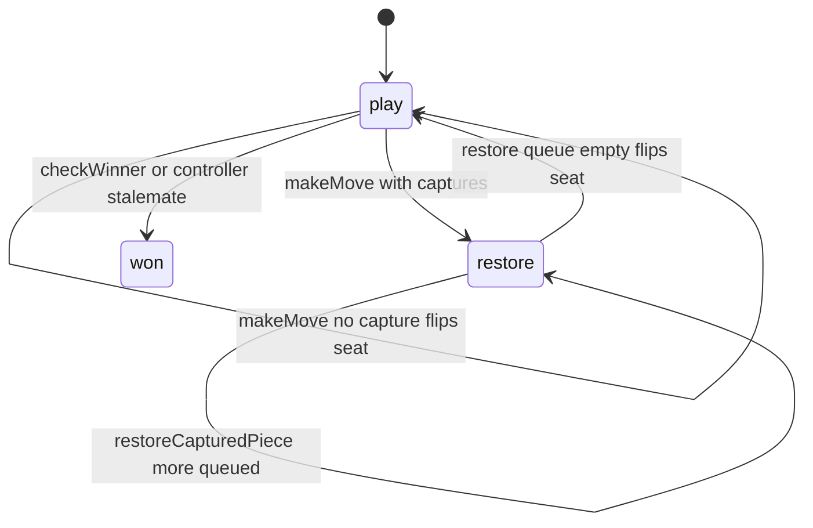

# Queens & Guards — engine reference

> Contributor-only. Describes **code** under `src/games/queens-guards/`. Not player-facing rules copy.
>
> Broader wiring: [wiki architecture (#475)](../../wiki/architecture.md) · [game registry](../../wiki/game-registry.md) · [docs sync (#496)](https://github.com/fuzzywigg/math-pentathlon/pull/496).
> Do not duplicate those docs here.

- **Registry id:** `queens-guards` (Division III)
- **Mount:** `src/ui/game-route-mounts.ts` → `case 'queens-guards'` → `src/games/queens-guards/game-controller.ts`
- **UI:** `src/games/queens-guards/board-ui.ts`
- **Rules / state:** `src/games/queens-guards/rules.ts`, `src/games/queens-guards/types.ts`
- **AI adapter:** `src/games/queens-guards/ai.ts` + worker client

## State shape

Primary type: `QueensGuardsState` in `src/games/queens-guards/types.ts`.

| Field |
| --- |
| `cells` |
| `currentPlayer` |
| `selectedPiece` |
| `capturedPieces` |
| `winner` |
| `moveHistory` |

```ts
export interface QueensGuardsState {
  cells: Map<string, HexCell>;
  currentPlayer: Player;
  selectedPiece: string | null; // Cell key of selected piece
  capturedPieces: BoardCoord[]; // Pieces that must be moved to outer ring
  winner: Player | null;
  moveHistory: QGMove[];
}
```

## Move types

- `QGMove` — `src/games/queens-guards/types.ts`

```ts
export interface QGMove {
  player: Player;
  from: BoardCoord;
  to: BoardCoord;
  pieceType: PieceType;
  wasCapture: boolean;
  moveNumber: number;
}
```

- `AIMove` — `src/games/queens-guards/ai.ts`

```ts
export interface AIMove {
  from: BoardCoord;
  to: BoardCoord;
}
```

### Apply / advance functions

- `selectPiece` — `src/games/queens-guards/rules.ts`
- `makeMove` — `src/games/queens-guards/rules.ts`
- `restoreCapturedPiece` — `src/games/queens-guards/rules.ts`

## Turn / phase state machine

No `GamePhase` / `TurnPhase` field. Turn progress uses `currentPlayer` / `winner` (and capture restore where applicable) on `QueensGuardsState`.



## Win / draw detection

| Function | File | What the code does |
| --- | --- | --- |
| `checkWinner` | `src/games/queens-guards/rules.ts` | Queen on center + 6 same-player guards on ring 1. |
| `getValidMoves` | `src/games/queens-guards/rules.ts` | Legal moves; controller stalemate settle awards opponent when empty (not in rules). |
| `getRestoreTargets` | `src/games/queens-guards/rules.ts` | Legal restore cells while captures remain queued. |

## Serialization format

No dedicated codec. **`cells: Map`** — Map/Set-aware JSON / `structuredClone`.

Shared progress storage (`src/core/storage/storage.ts`) persists stats/profile only, not in-progress boards.

## AI adapter

- `searchAIMove` — `src/games/queens-guards/ai.ts`
- `getAIMove` — `src/games/queens-guards/ai.ts`
- `applyAIMove` — `src/games/queens-guards/ai.ts`
- `getAIMoveAsync` — `src/games/queens-guards/ai-client.ts`
- Worker module: `src/games/queens-guards/ai.worker.ts`
- Shared protocol: `src/core/ai-worker/protocol.ts` (`AiWorkerGameId` includes this game)

## Tests that cover this engine

Imports from `src/games/queens-guards/` (non-exhaustive; prefer these first):

- `tests/unit/ai-worker-parity-queens-hex.test.ts`
- `tests/unit/burn-wave35-queens-guards-win-center-settle.test.ts`
- `tests/unit/burn-wave41-queens-ai-apply.test.ts`
- `tests/unit/burn-wave41-queens-check-winner-matrix.test.ts`
- `tests/unit/burn-wave42-queens-ai-difficulty-moves.test.ts`
- `tests/unit/burn-wave42-queens-cell-key-roundtrip.test.ts`
- `tests/unit/burn-wave42-queens-check-winner-surround.test.ts`
- `tests/unit/overnight-queens-ai-apply-restore-move.test.ts`
- `tests/unit/overnight-queens-ai-hard-randomness-branch.test.ts`
- `tests/unit/overnight-queens-ai-randomness-top3.test.ts`
- `tests/unit/overnight-queens-ai-restore-full-outer-null.test.ts`
- `tests/unit/overnight-queens-ai-restore-partial-outer.test.ts`
- `tests/unit/overnight-queens-ai-single-move-skips-random.test.ts`
- `tests/unit/queens-guards-ai-softlock-recovery.test.ts`
- `tests/unit/queens-guards-ai-tiny.test.ts`
- `tests/unit/queens-guards-ai.test.ts`
- `tests/unit/queens-guards-rules.test.ts`
- `tests/unit/queens-hex-ai-play-deadline.test.ts`
- `tests/unit/helpers/state-roundtrip-games.ts`

Also exercised by cross-game suites that import the module where listed above (round-trip helper, undo-audit props, registry/mount smoke).

## Known TODOs in code comments

None found under `src/games/queens-guards/` (`TODO` / `FIXME` / `Andrew` comment scan).

## Key symbols (link-check table)

| Symbol | File |
| --- | --- |
| `QueensGuardsState` | `src/games/queens-guards/types.ts` |
| `QGMove` | `src/games/queens-guards/types.ts` |
| `AIMove` | `src/games/queens-guards/ai.ts` |
| `selectPiece` | `src/games/queens-guards/rules.ts` |
| `makeMove` | `src/games/queens-guards/rules.ts` |
| `restoreCapturedPiece` | `src/games/queens-guards/rules.ts` |
| `checkWinner` | `src/games/queens-guards/rules.ts` |
| `getValidMoves` | `src/games/queens-guards/rules.ts` |
| `getRestoreTargets` | `src/games/queens-guards/rules.ts` |
| `searchAIMove` | `src/games/queens-guards/ai.ts` |
| `getAIMove` | `src/games/queens-guards/ai.ts` |
| `applyAIMove` | `src/games/queens-guards/ai.ts` |
| `getAIMoveAsync` | `src/games/queens-guards/ai-client.ts` |
| *(module)* | `src/games/queens-guards/game-controller.ts` |
| *(module)* | `src/games/queens-guards/board-ui.ts` |
| *(module)* | `src/games/queens-guards/rules.ts` |
| *(module)* | `src/games/queens-guards/ai.ts` |
| *(module)* | `src/games/queens-guards/tutorial.ts` |
| *(module)* | `src/games/queens-guards/ai-client.ts` |
| *(module)* | `src/games/queens-guards/ai.worker.ts` |
| *(module)* | `src/core/ai-worker/protocol.ts` |
| *(module)* | `src/ui/game-route-mounts.ts` |
| *(module)* | `src/core/game-registry.ts` |

## Questions for Andrew

Flagged code-vs-docs disagreements only (no rules text edited here). See also `docs/RULES-DECISIONS-2026-10-07.md` and `docs/tutorial-engine-mismatches-2026-10-07.md`.

- **Stalemate:** Stalemate win is applied in `game-controller.ts`, not exported from `rules.ts`.
  - Recommendation: **Yes** — Yes — move settle into rules for a single source of truth.
