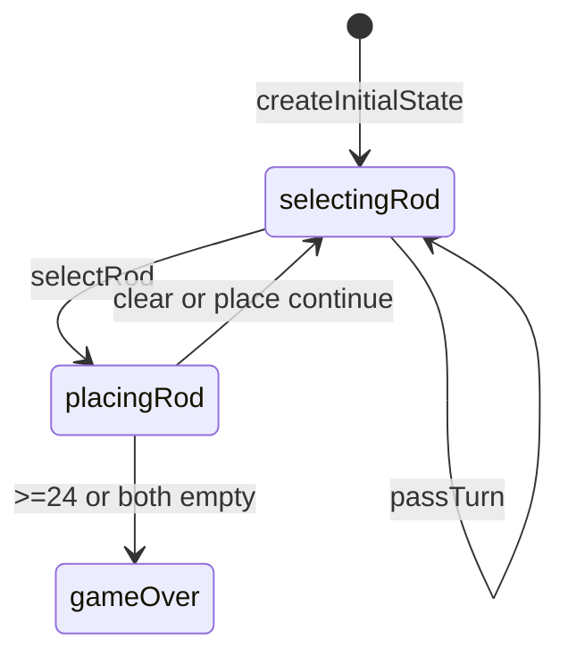

# Ramrod engine (`ramrod`)

> Contributor reference for what the **code** does. Not player-facing.
> Do not treat this as official rules text. Wiki architecture: [docs/wiki/architecture.md](../../wiki/architecture.md) ([#475](https://github.com/fuzzywigg/math-pentathlon/issues/475)).
> Docs-sync work: see [#496](https://github.com/fuzzywigg/math-pentathlon/issues/496) — this page does not replace it.

**Division:** Division II · **Registry id:** `ramrod`

## Module files

- `src/games/ramrod/types.ts`
- `src/games/ramrod/rules.ts`

**AI adapter**

- `src/games/ramrod/ai.ts`

**UI entry**

- `src/games/ramrod/board-ui.ts`
- `src/games/ramrod/game-controller.ts`

## State shape

Primary type `RamrodState` in `src/games/ramrod/types.ts`.

- `boxes: Map<string, SumBox>` / `rods: Map<string, Rod>`
- `playerRods` / `selectedRod` / `scores`
- `phase: GamePhase` — `'selectingRod' | 'placingRod' | 'gameOver'`
- `winner: Player | null`
- `moveHistory: RamrodMove[]`

## Move types

Record `RamrodMove`. Apply `selectRod`, `clearSelection`, `placeRod`, `passTurn`.

Apply / query API:

- `placeRod` — capture; win at target 24 or both out of rods
- `passTurn` — seat flip only
- `hasValidMoves` / `isValidPlacement`

## Turn / phase state machine

Phases in code: `selectingRod`, `placingRod`, `gameOver`.



## Win / draw detection

- Inline in `placeRod`
- Both rods empty → higher score or `winner: null`
- Mutual no-fit does not auto-end (infinite pass possible)

## Serialization format

Maps need `__mp_map__` revive. No product board save.

## Tests that cover this engine

- `tests/unit/engine-coverage-ramrod-targeted.test.ts`
- `tests/unit/ramrod-deep-playability.test.ts`
- `tests/unit/burn-wave48-ramrod-target-score-win.test.ts`
- `tests/unit/burn-wave48-ramrod-both-empty-hands-settle.test.ts`
- `tests/unit/burn-wave43-ramrod-place-capture-score.test.ts`
- `tests/unit/state-roundtrip-fuzz.test.ts`

## Known TODOs (from code comments)

- No tagged TODOs under `src/games/ramrod/`.

## Questions for Andrew

Yes/no decisions; recommendations are non-binding.

- **Q:** Auto-settle when both seats lack placements (RULES RM1)?
  - **Recommendation:** Yes — add settle; until then document infinite pass.

## Related reading

- Index: [README.md](./README.md)
- Wiki games catalog: [docs/wiki/games.md](../../wiki/games.md)
- Wiki architecture (#475): [docs/wiki/architecture.md](../../wiki/architecture.md)
- Adding a game: [docs/wiki/adding-a-game.md](../../wiki/adding-a-game.md)
- Rules decision log (do not edit rules here): [docs/RULES-DECISIONS-2026-10-07.md](../../RULES-DECISIONS-2026-10-07.md)

```dev-doc-refs
src/games/ramrod/types.ts#RamrodState
src/games/ramrod/types.ts#GamePhase
src/games/ramrod/rules.ts#createInitialState
src/games/ramrod/rules.ts#placeRod
src/games/ramrod/rules.ts#passTurn
src/games/ramrod/rules.ts#hasValidMoves
src/games/ramrod/ai.ts#getAIMove
src/games/ramrod/game-controller.ts#initGame
src/games/ramrod/board-ui.ts#renderBoard
tests/unit/engine-coverage-ramrod-targeted.test.ts
src/core/game-registry.ts#GAMES
src/ui/game-route-mounts.ts#mountGameById
```
