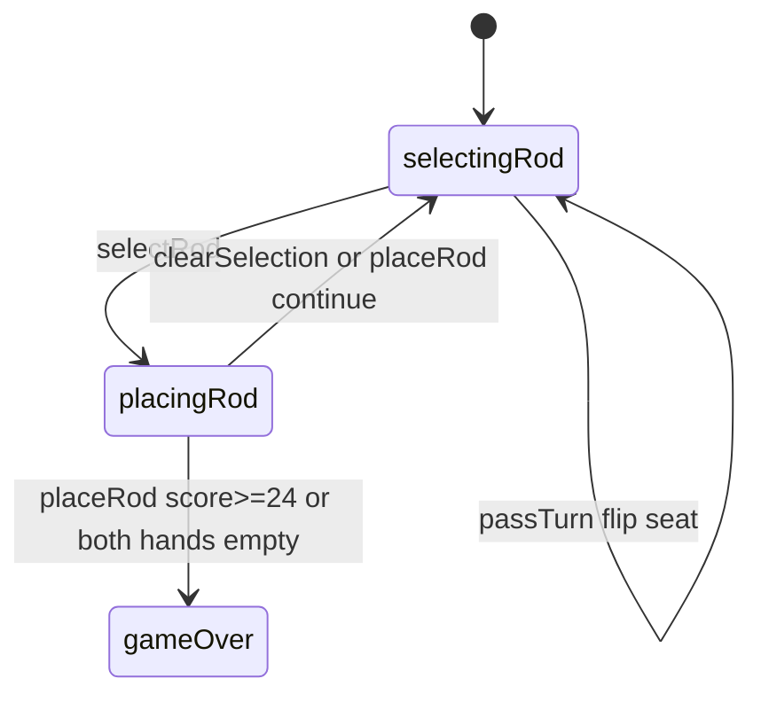

# Ramrod — engine reference

> Contributor-only. Describes **code** under `src/games/ramrod/`. Not player-facing rules copy.
>
> Broader wiring: [wiki architecture (#475)](../../wiki/architecture.md) · [game registry](../../wiki/game-registry.md) · [docs sync (#496)](https://github.com/fuzzywigg/math-pentathlon/pull/496).
> Do not duplicate those docs here.

- **Registry id:** `ramrod` (Division II)
- **Mount:** `src/ui/game-route-mounts.ts` → `case 'ramrod'` → `src/games/ramrod/game-controller.ts`
- **UI:** `src/games/ramrod/board-ui.ts`
- **Rules / state:** `src/games/ramrod/rules.ts`, `src/games/ramrod/types.ts`
- **AI adapter:** `src/games/ramrod/ai.ts`

## State shape

Primary type: `RamrodState` in `src/games/ramrod/types.ts`.

| Field |
| --- |
| `boxes` |
| `rods` |
| `playerRods` |
| `player1` |
| `player2` |
| `currentPlayer` |
| `selectedRod` |
| `phase` |
| `scores` |
| `player1` |
| `player2` |
| `winner` |
| `moveHistory` |

```ts
export interface RamrodState {
  boxes: Map<string, SumBox>;
  rods: Map<string, Rod>;
  playerRods: {
    player1: string[]; // Rod IDs in player's area
    player2: string[];
  };
  currentPlayer: Player;
  selectedRod: string | null;
  phase: GamePhase;
  scores: {
    player1: number; // Total cm captured
    player2: number;
  };
  winner: Player | null;
  moveHistory: RamrodMove[];
}
```

## Move types

- `RamrodMove` — `src/games/ramrod/types.ts`

```ts
export interface RamrodMove {
  player: Player;
  rod: Rod;
  boxId: string;
  slot: number;
  capturedBox: boolean;
  pointsScored: number;
  moveNumber: number;
}
```

### Apply / advance functions

- `selectRod` — `src/games/ramrod/rules.ts`
- `placeRod` — `src/games/ramrod/rules.ts`
- `passTurn` — `src/games/ramrod/rules.ts`
- `clearSelection` — `src/games/ramrod/rules.ts`

## Turn / phase state machine

Phase type: `GamePhase` in `src/games/ramrod/types.ts`.

```ts
export type GamePhase =
  | 'selectingRod' // Player selecting a rod
  | 'placingRod' // Player placing the rod in a box
  | 'gameOver';
```



## Win / draw detection

| Function | File | What the code does |
| --- | --- | --- |
| `placeRod` | `src/games/ramrod/rules.ts` | Score ≥ `CONFIG.TARGET_SCORE` (24) or both out of rods → higher cm / `null` tie. |
| `hasValidMoves` | `src/games/ramrod/rules.ts` | Observational; mutual no-fit does not auto-settle via `passTurn`. |

## Serialization format

No dedicated codec. **`boxes` + `rods` Maps** — Map/Set-aware JSON / `structuredClone`.

Shared progress storage (`src/core/storage/storage.ts`) persists stats/profile only, not in-progress boards.

## AI adapter

- `getAIMove` — `src/games/ramrod/ai.ts`
- `executeAITurn` — `src/games/ramrod/ai.ts`
- `isAITurn` — `src/games/ramrod/ai.ts`

## Tests that cover this engine

Imports from `src/games/ramrod/` (non-exhaustive; prefer these first):

- `tests/unit/burn-wave41-ramrod-ai-execute.test.ts`
- `tests/unit/burn-wave41-ramrod-box-sum-remaining-format.test.ts`
- `tests/unit/burn-wave43-ramrod-ai-null-execute.test.ts`
- `tests/unit/burn-wave48-ramrod-target-score-win.test.ts`
- `tests/unit/overnight-ramrod-ai-hard-random-top3.test.ts`
- `tests/unit/overnight-wave56-ramrod-winner-banner-copy.test.ts`
- `tests/unit/overnight-wave58-ramrod-red-wins-banner.test.ts`
- `tests/unit/ramrod-ai-input-guard.test.ts`
- `tests/unit/ramrod-ai-timer-race.test.ts`
- `tests/unit/ramrod-ai.test.ts`
- `tests/unit/ramrod-rules.test.ts`
- `tests/unit/burn-wave43-handshake-calla-ramrod-stars-ai.test.ts`
- `tests/unit/burn-wave35-ramrod-box-format-helpers.test.ts`
- `tests/unit/burn-wave40-ramrod-boxsum-null-reject.test.ts`
- `tests/unit/burn-wave40-ramrod-completed-slot-reject.test.ts`
- `tests/unit/burn-wave41-ramrod-complete-capture.test.ts`
- `tests/unit/burn-wave41-ramrod-pass-format.test.ts`
- `tests/unit/burn-wave41-ramrod-place-pass-moves.test.ts`
- `tests/unit/helpers/state-roundtrip-games.ts`

Also exercised by cross-game suites that import the module where listed above (round-trip helper, undo-audit props, registry/mount smoke).

## Known TODOs in code comments

None found under `src/games/ramrod/` (`TODO` / `FIXME` / `Andrew` comment scan).

## Key symbols (link-check table)

| Symbol | File |
| --- | --- |
| `RamrodState` | `src/games/ramrod/types.ts` |
| `RamrodMove` | `src/games/ramrod/types.ts` |
| `selectRod` | `src/games/ramrod/rules.ts` |
| `placeRod` | `src/games/ramrod/rules.ts` |
| `passTurn` | `src/games/ramrod/rules.ts` |
| `clearSelection` | `src/games/ramrod/rules.ts` |
| `GamePhase` | `src/games/ramrod/types.ts` |
| `hasValidMoves` | `src/games/ramrod/rules.ts` |
| `getAIMove` | `src/games/ramrod/ai.ts` |
| `executeAITurn` | `src/games/ramrod/ai.ts` |
| `isAITurn` | `src/games/ramrod/ai.ts` |
| *(module)* | `src/games/ramrod/game-controller.ts` |
| *(module)* | `src/games/ramrod/board-ui.ts` |
| *(module)* | `src/games/ramrod/rules.ts` |
| *(module)* | `src/games/ramrod/ai.ts` |
| *(module)* | `src/games/ramrod/tutorial.ts` |
| *(module)* | `src/ui/game-route-mounts.ts` |
| *(module)* | `src/core/game-registry.ts` |

## Questions for Andrew

Flagged code-vs-docs disagreements only (no rules text edited here). See also `docs/RULES-DECISIONS-2026-10-07.md` and `docs/tutorial-engine-mismatches-2026-10-07.md`.

- **RM1:** Mutual no-fit can loop via `passTurn` with no auto-settle.
  - Recommendation: **Yes** — Yes — settle when neither seat has a legal place.
