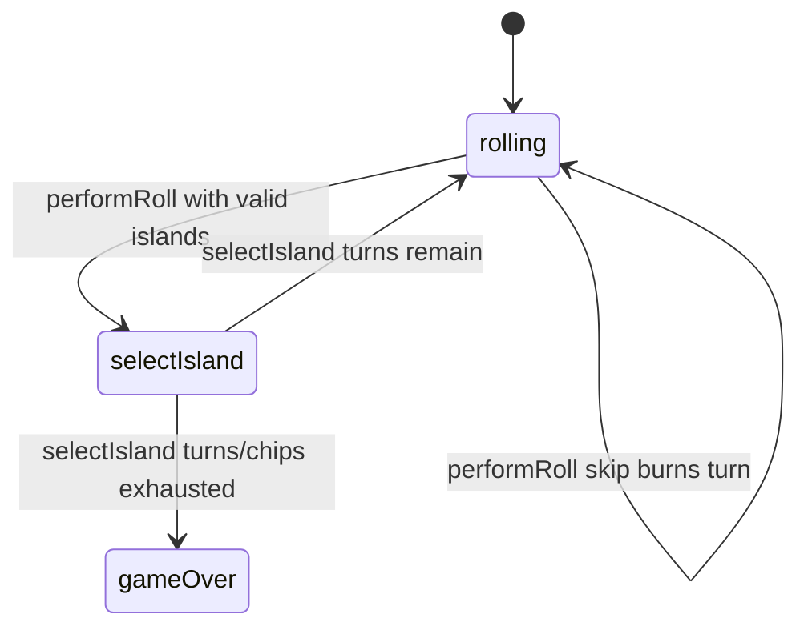

# Remainder Islands — engine reference

> Contributor-only. Describes **code** under `src/games/remainder-islands/`. Not player-facing rules copy.
>
> Broader wiring: [wiki architecture (#475)](../../wiki/architecture.md) · [game registry](../../wiki/game-registry.md) · [docs sync (#496)](https://github.com/fuzzywigg/math-pentathlon/pull/496).
> Do not duplicate those docs here.

- **Registry id:** `remainder-islands` (Division IV)
- **Mount:** `src/ui/game-route-mounts.ts` → `case 'remainder-islands'` → `src/games/remainder-islands/game-controller.ts`
- **UI:** `src/games/remainder-islands/board-ui.ts`
- **Rules / state:** `src/games/remainder-islands/rules.ts`, `src/games/remainder-islands/types.ts`
- **AI adapter:** `src/games/remainder-islands/ai.ts`

## State shape

Primary type: `RemainderIslandsState` in `src/games/remainder-islands/types.ts`.

| Field |
| --- |
| `islands` |
| `currentPlayer` |
| `phase` |
| `currentRoll` |
| `validIslands` |
| `selectedIsland` |
| `player1Score` |
| `player2Score` |
| `player1Chips` |
| `player2Chips` |
| `moveHistory` |
| `winner` |
| `turnsRemaining` |

```ts
export interface RemainderIslandsState {
  islands: Island[];
  currentPlayer: Player;
  phase: GamePhase;

  // Current dice roll
  currentRoll: DiceRoll | null;

  // Valid islands for current roll
  validIslands: string[]; // Island IDs

  // Selected island preview
  selectedIsland: string | null;

  // Scores
  player1Score: number;
  player2Score: number;

  // Chips remaining for each player
  player1Chips: number;
  player2Chips: number;

  // Move history
  moveHistory: MoveRecord[];

  // Winner
  winner: Player | null;

  // Turns remaining
  turnsRemaining: number;
}
```

## Move types

- `MoveRecord` — `src/games/remainder-islands/types.ts`

```ts
export interface MoveRecord {
  player: Player;
  roll: DiceRoll;
  island: Island;
  divisionResult: DivisionResult;
  pointsEarned: number;
  turnNumber: number;
}
```

- `AIIslandChoice` — `src/games/remainder-islands/ai.ts`

```ts
export interface AIIslandChoice {
  islandId: string;
  hint?: string;
}
```

### Apply / advance functions

- `performRoll` — `src/games/remainder-islands/rules.ts`
- `selectIsland` — `src/games/remainder-islands/rules.ts`
- `setSelectedIsland` — `src/games/remainder-islands/rules.ts`

## Turn / phase state machine

Phase type: `GamePhase` in `src/games/remainder-islands/types.ts`.

```ts
export type GamePhase =
  | 'rolling' // Waiting for dice roll
  | 'selectIsland' // Choose which island to land on
  | 'gameOver';
```



## Win / draw detection

| Function | File | What the code does |
| --- | --- | --- |
| `selectIsland` | `src/games/remainder-islands/rules.ts` | Inline settle when turns/chips exhausted; higher score wins / null tie. |
| `performRoll` | `src/games/remainder-islands/rules.ts` | Empty-roll skip burns `turnsRemaining` (can hit 0 without `gameOver`). |
| `countOwnedIslands` | `src/games/remainder-islands/rules.ts` | Ownership count helper (not the win predicate). |

## Serialization format

No dedicated codec. No `Map`/`Set` → JSON / `structuredClone`.

Shared progress storage (`src/core/storage/storage.ts`) persists stats/profile only, not in-progress boards.

## AI adapter

- `getAIIslandChoice` — `src/games/remainder-islands/ai.ts`
- `executeAISelection` — `src/games/remainder-islands/ai.ts`
- `isAITurn` — `src/games/remainder-islands/ai.ts`

## Tests that cover this engine

Imports from `src/games/remainder-islands/` (non-exhaustive; prefer these first):

- `tests/unit/burn-wave35-remainder-islands-empty-valids.test.ts`
- `tests/unit/burn-wave39-remainder-preview-noop.test.ts`
- `tests/unit/burn-wave41-remainder-chips-exhaust-draw.test.ts`
- `tests/unit/burn-wave41-remainder-division-owned-matrix.test.ts`
- `tests/unit/burn-wave41-remainder-find-valid-owned.test.ts`
- `tests/unit/burn-wave41-remainder-select-score-matrix.test.ts`
- `tests/unit/burn-wave41-remainder-skip-opponent-owned.test.ts`
- `tests/unit/burn-wave41-remainder-zero-remainder-score.test.ts`
- `tests/unit/burn-wave42-remainder-ai-choice-execute.test.ts`
- `tests/unit/burn-wave42-remainder-division-matrix-dense.test.ts`
- `tests/unit/burn-wave42-remainder-owned-recount-preview.test.ts`
- `tests/unit/burn-wave42-remainder-roll-skip-chain.test.ts`
- `tests/unit/burn-wave42-remainder-select-reject-gameover.test.ts`
- `tests/unit/burn-wave48-remainder-board-preview-equation.test.ts`
- `tests/unit/burn-wave48-remainder-select-p1-win-exhaust.test.ts`
- `tests/unit/burn-wave48-remainder-select-tie-winner-null.test.ts`
- `tests/unit/overnight-remainder-ai-constrained-single.test.ts`
- `tests/unit/overnight-remainder-ai-empty-valids-null.test.ts`
- `tests/unit/helpers/state-roundtrip-games.ts`

Also exercised by cross-game suites that import the module where listed above (round-trip helper, undo-audit props, registry/mount smoke).

## Known TODOs in code comments

None found under `src/games/remainder-islands/` (`TODO` / `FIXME` / `Andrew` comment scan).

## Key symbols (link-check table)

| Symbol | File |
| --- | --- |
| `RemainderIslandsState` | `src/games/remainder-islands/types.ts` |
| `MoveRecord` | `src/games/remainder-islands/types.ts` |
| `AIIslandChoice` | `src/games/remainder-islands/ai.ts` |
| `performRoll` | `src/games/remainder-islands/rules.ts` |
| `selectIsland` | `src/games/remainder-islands/rules.ts` |
| `setSelectedIsland` | `src/games/remainder-islands/rules.ts` |
| `GamePhase` | `src/games/remainder-islands/types.ts` |
| `countOwnedIslands` | `src/games/remainder-islands/rules.ts` |
| `getAIIslandChoice` | `src/games/remainder-islands/ai.ts` |
| `executeAISelection` | `src/games/remainder-islands/ai.ts` |
| `isAITurn` | `src/games/remainder-islands/ai.ts` |
| *(module)* | `src/games/remainder-islands/game-controller.ts` |
| *(module)* | `src/games/remainder-islands/board-ui.ts` |
| *(module)* | `src/games/remainder-islands/rules.ts` |
| *(module)* | `src/games/remainder-islands/ai.ts` |
| *(module)* | `src/games/remainder-islands/tutorial.ts` |
| *(module)* | `src/ui/game-route-mounts.ts` |
| *(module)* | `src/core/game-registry.ts` |

## Questions for Andrew

Flagged code-vs-docs disagreements only (no rules text edited here). See also `docs/RULES-DECISIONS-2026-10-07.md` and `docs/tutorial-engine-mismatches-2026-10-07.md`.

- **H3 / RI1:** Empty-roll skip can burn `turnsRemaining` to 0 without entering `gameOver`.
  - Recommendation: **Yes** — Yes — last skip with 0 turns left must end the game.
