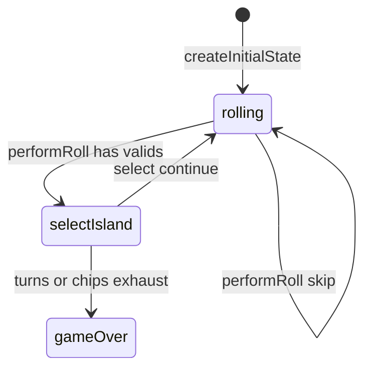

# Remainder Islands engine (`remainder-islands`)

> Contributor reference for what the **code** does. Not player-facing.
> Do not treat this as official rules text. Wiki architecture: [docs/wiki/architecture.md](../../wiki/architecture.md) ([#475](https://github.com/fuzzywigg/math-pentathlon/issues/475)).
> Docs-sync work: see [#496](https://github.com/fuzzywigg/math-pentathlon/issues/496) — this page does not replace it.

**Division:** Division IV · **Registry id:** `remainder-islands`

## Module files

- `src/games/remainder-islands/types.ts`
- `src/games/remainder-islands/rules.ts`

**AI adapter**

- `src/games/remainder-islands/ai.ts`

**UI entry**

- `src/games/remainder-islands/board-ui.ts`
- `src/games/remainder-islands/game-controller.ts`

## State shape

Primary type `RemainderIslandsState` in `src/games/remainder-islands/types.ts`.

- `islands: Island[]`
- `phase: GamePhase` — `'rolling' | 'selectIsland' | 'gameOver'`
- `currentRoll` / `validIslands` / `selectedIsland`
- `player1Score` / `player2Score` / chips
- `turnsRemaining` / `winner` / `moveHistory`

## Move types

Apply `performRoll`, `selectIsland`, `setSelectedIsland` (preview).

Apply / query API:

- `performRoll` — may skip seat when no valids
- `selectIsland` — scores and may end
- `findValidIslands` / `calculateDivision` / `previewDivision`

## Turn / phase state machine

Phases in code: `rolling`, `selectIsland`, `gameOver`.



## Win / draw detection

- Inline in `selectIsland`: turns≤0 or both chips≤0 → higher score or `winner: null`
- `performRoll` never sets `gameOver` (empty-roll skip at 0 turns can soft-lock)

## Serialization format

No codec. Plain arrays/objects. Fuzz `jsonRoundTrip`.

## Tests that cover this engine

- `tests/unit/remainder-islands-rules.test.ts`
- `tests/unit/remainder-islands-ai.test.ts`
- `tests/unit/burn-wave35-remainder-islands-empty-valids.test.ts`
- `tests/unit/burn-wave41-remainder-chips-exhaust-draw.test.ts`
- `tests/unit/burn-wave42-remainder-roll-skip-chain.test.ts`
- `tests/unit/burn-wave48-remainder-select-tie-winner-null.test.ts`
- `tests/unit/state-roundtrip-fuzz.test.ts`

## Known TODOs (from code comments)

- No tagged TODOs under `src/games/remainder-islands/`.

## Questions for Andrew

Yes/no decisions; recommendations are non-binding.

- **Q:** Settle `gameOver` inside `performRoll` when turns hit 0 on skip (RULES RI1/H3)?
  - **Recommendation:** Yes — avoid soft-lock.

## Related reading

- Index: [README.md](./README.md)
- Wiki games catalog: [docs/wiki/games.md](../../wiki/games.md)
- Wiki architecture (#475): [docs/wiki/architecture.md](../../wiki/architecture.md)
- Adding a game: [docs/wiki/adding-a-game.md](../../wiki/adding-a-game.md)
- Rules decision log (do not edit rules here): [docs/RULES-DECISIONS-2026-10-07.md](../../RULES-DECISIONS-2026-10-07.md)

```dev-doc-refs
src/games/remainder-islands/types.ts#RemainderIslandsState
src/games/remainder-islands/types.ts#GamePhase
src/games/remainder-islands/types.ts#createInitialState
src/games/remainder-islands/rules.ts#performRoll
src/games/remainder-islands/rules.ts#selectIsland
src/games/remainder-islands/rules.ts#findValidIslands
src/games/remainder-islands/ai.ts#getAIIslandChoice
src/games/remainder-islands/game-controller.ts#initGame
src/games/remainder-islands/board-ui.ts#renderBoard
tests/unit/remainder-islands-rules.test.ts
src/core/game-registry.ts#GAMES
src/ui/game-route-mounts.ts#mountGameById
```
