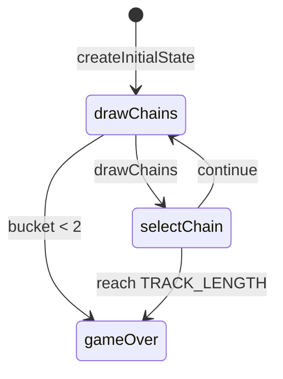

# Star Track engine (`star-track`)

> Contributor reference for what the **code** does. Not player-facing.
> Do not treat this as official rules text. Wiki architecture: [docs/wiki/architecture.md](../../wiki/architecture.md) ([#475](https://github.com/fuzzywigg/math-pentathlon/issues/475)).
> Docs-sync work: see [#496](https://github.com/fuzzywigg/math-pentathlon/issues/496) — this page does not replace it.

**Division:** Division I · **Registry id:** `star-track`

## Module files

- `src/games/star-track/types.ts`
- `src/games/star-track/rules.ts`

**AI adapter**

- `src/games/star-track/ai.ts`

**UI entry**

- `src/games/star-track/board-ui.ts`
- `src/games/star-track/game-controller.ts`
- `src/games/star-track/board-3d-loader.ts`

## State shape

Primary type `StarTrackGameState` in `src/games/star-track/types.ts`.

- `currentPlayer: Player`
- `phase: GamePhase` — `'drawChains' | 'selectChain' | 'moving' | 'gameOver'`
- `player1Position` / `player2Position: number`
- `drawnChains` / `selectedChain`
- `winner: Player | null`
- `moveHistory: StarTrackMove[]`
- `chainBucket: ChainLink[]`

## Move types

Apply `drawChains` then `selectChain(state, 0|1)`. History: `StarTrackMove`.

Apply / query API:

- `drawChains`
- `selectChain`
- `getChainLandingSpace`
- `isGameOver`

## Turn / phase state machine

Phases in code: `drawChains`, `selectChain`, `moving (unused)`, `gameOver`.



## Win / draw detection

- Landing ≥ `TRACK_LENGTH` wins
- Bucket exhaust → farther position or `winner: null` draw
- `isGameOver`

## Serialization format

No codec. In-memory `getGameState()`.

## Tests that cover this engine

- `tests/unit/star-track-rules.test.ts`
- `tests/unit/star-track-ai.test.ts`
- `tests/unit/burn-wave41-star-track-bucket-exhaust-draw.test.ts`
- `tests/unit/burn-wave41-star-track-select-win-clamp.test.ts`
- `tests/unit/burn-wave44-star-track-draw-select-pipeline.test.ts`
- `tests/unit/burn-wave42-star-track-ai-execute-select-phase.test.ts`
- `tests/unit/state-roundtrip-fuzz.test.ts`
- `tests/unit/undo-audit-log-games-props.test.ts`

## Known TODOs (from code comments)

- Dead phase `'moving'` never assigned by rules.

## Questions for Andrew

Yes/no decisions; recommendations are non-binding.

- **Q:** Remove unused `'moving'` from `GamePhase`?
  - **Recommendation:** Yes — remove or drive from UI animation only.
- **Q:** Keep bucket-exhaust position/draw settle (RULES ST2)?
  - **Recommendation:** Yes — keep engine settle.

## Related reading

- Index: [README.md](./README.md)
- Wiki games catalog: [docs/wiki/games.md](../../wiki/games.md)
- Wiki architecture (#475): [docs/wiki/architecture.md](../../wiki/architecture.md)
- Adding a game: [docs/wiki/adding-a-game.md](../../wiki/adding-a-game.md)
- Rules decision log (do not edit rules here): [docs/RULES-DECISIONS-2026-10-07.md](../../RULES-DECISIONS-2026-10-07.md)

```dev-doc-refs
src/games/star-track/types.ts#StarTrackGameState
src/games/star-track/types.ts#GamePhase
src/games/star-track/types.ts#createInitialState
src/games/star-track/rules.ts#drawChains
src/games/star-track/rules.ts#selectChain
src/games/star-track/rules.ts#isGameOver
src/games/star-track/ai.ts#executeAITurn
src/games/star-track/game-controller.ts#initGame
src/games/star-track/board-ui.ts#renderBoard
tests/unit/star-track-rules.test.ts
src/core/game-registry.ts#GAMES
src/ui/game-route-mounts.ts#mountGameById
```
