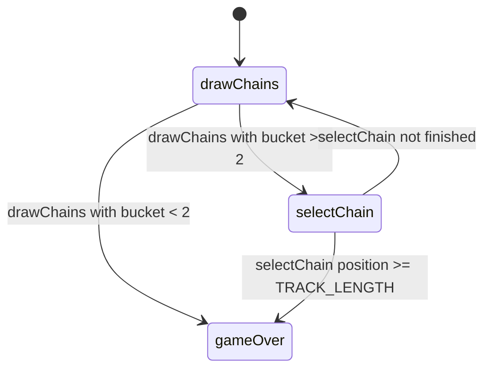

# Star Track — engine reference

> Contributor-only. Describes **code** under `src/games/star-track/`. Not player-facing rules copy.
>
> Broader wiring: [wiki architecture (#475)](../../wiki/architecture.md) · [game registry](../../wiki/game-registry.md) · [docs sync (#496)](https://github.com/fuzzywigg/math-pentathlon/pull/496).
> Do not duplicate those docs here.

- **Registry id:** `star-track` (Division I)
- **Mount:** `src/ui/game-route-mounts.ts` → `case 'star-track'` → `src/games/star-track/game-controller.ts`
- **UI:** `src/games/star-track/board-ui.ts`
- **Rules / state:** `src/games/star-track/rules.ts`, `src/games/star-track/types.ts`
- **AI adapter:** `src/games/star-track/ai.ts`

## State shape

Primary type: `StarTrackGameState` in `src/games/star-track/types.ts`.

| Field |
| --- |
| `currentPlayer` |
| `phase` |
| `player1Position` |
| `player2Position` |
| `drawnChains` |
| `selectedChain` |
| `winner` |
| `moveHistory` |
| `chainBucket` |

```ts
export interface StarTrackGameState {
  currentPlayer: Player;
  phase: GamePhase;

  // Player positions (0 = start, TRACK_LENGTH = goal/center)
  player1Position: number;
  player2Position: number;

  // The two chains drawn this turn
  drawnChains: [ChainLink, ChainLink] | null;

  // Selected chain for this turn
  selectedChain: ChainLink | null;

  // Winner (if game over)
  winner: Player | null;

  // Move history for display
  moveHistory: StarTrackMove[];

  // Chain bucket (chains available to draw)
  chainBucket: ChainLink[];
}
```

## Move types

- `StarTrackMove` — `src/games/star-track/types.ts`

```ts
export interface StarTrackMove {
  player: Player;
  chainUsed: ChainLength;
  fromPosition: number;
  toPosition: number;
  moveNumber: number;
}
```

- `AIChainChoice` — `src/games/star-track/ai.ts`

```ts
export interface AIChainChoice {
  chainIndex: 0 | 1;
  hint?: string;
}
```

### Apply / advance functions

- `drawChains` — `src/games/star-track/rules.ts`
- `selectChain` — `src/games/star-track/rules.ts`

## Turn / phase state machine

Phase type: `GamePhase` in `src/games/star-track/types.ts`.

```ts
export type GamePhase =
  | 'drawChains' // Player draws two chains from bucket
  | 'selectChain' // Player chooses which chain to use
  | 'moving' // Animating movement (optional)
  | 'gameOver';
```



## Win / draw detection

| Function | File | What the code does |
| --- | --- | --- |
| `isGameOver` | `src/games/star-track/rules.ts` | True when `phase === gameOver` or `winner !== null`. |
| `selectChain` | `src/games/star-track/rules.ts` | Inline win when position reaches `TRACK_LENGTH`; bucket exhaust ties with `winner: null`. |

## Serialization format

No dedicated codec. No `Map`/`Set` on state → JSON / `structuredClone` per roundtrip doc.

Shared progress storage (`src/core/storage/storage.ts`) persists stats/profile only, not in-progress boards.

## AI adapter

- `getAIChainChoice` — `src/games/star-track/ai.ts`
- `executeAITurn` — `src/games/star-track/ai.ts`
- `isAITurn` — `src/games/star-track/ai.ts`

## Tests that cover this engine

Imports from `src/games/star-track/` (non-exhaustive; prefer these first):

- `tests/unit/burn-wave41-star-progress-phase-over.test.ts`
- `tests/unit/burn-wave41-star-track-ai-easy-teaching.test.ts`
- `tests/unit/burn-wave41-star-track-phase-message-matrix.test.ts`
- `tests/unit/burn-wave41-star-track-progress-phase-matrix.test.ts`
- `tests/unit/burn-wave41-star-track-select-win-clamp.test.ts`
- `tests/unit/burn-wave42-star-ai-execute-difficulties.test.ts`
- `tests/unit/burn-wave42-star-track-ai-deny-opponent-win.test.ts`
- `tests/unit/burn-wave42-star-track-ai-execute-select-phase.test.ts`
- `tests/unit/burn-wave42-star-track-ai-teaching-hint.test.ts`
- `tests/unit/burn-wave42-star-win-race-clamp.test.ts`
- `tests/unit/burn-wave43-star-phase-message-matrix.test.ts`
- `tests/unit/burn-wave43-star-select-win-clamp.test.ts`
- `tests/unit/burn-wave44-star-track-phase-message-matrix.test.ts`
- `tests/unit/burn-wave45-star-ai-exact-and-deny.test.ts`
- `tests/unit/burn-wave45-star-ai-execute-select-win-race.test.ts`
- `tests/unit/burn-wave45-star-ai-giveback-exact-opponent-need.test.ts`
- `tests/unit/burn-wave45-star-ai-giveback-long-penalty.test.ts`
- `tests/unit/burn-wave45-star-ai-hard-random-legal.test.ts`
- `tests/unit/helpers/state-roundtrip-games.ts`

Also exercised by cross-game suites that import the module where listed above (round-trip helper, undo-audit props, registry/mount smoke).

## Known TODOs in code comments

- `src/games/star-track/types.ts` — GamePhase includes unused `"moving"` — never assigned in `rules.ts` (dead phase variant).

## Key symbols (link-check table)

| Symbol | File |
| --- | --- |
| `StarTrackGameState` | `src/games/star-track/types.ts` |
| `StarTrackMove` | `src/games/star-track/types.ts` |
| `AIChainChoice` | `src/games/star-track/ai.ts` |
| `drawChains` | `src/games/star-track/rules.ts` |
| `selectChain` | `src/games/star-track/rules.ts` |
| `GamePhase` | `src/games/star-track/types.ts` |
| `isGameOver` | `src/games/star-track/rules.ts` |
| `getAIChainChoice` | `src/games/star-track/ai.ts` |
| `executeAITurn` | `src/games/star-track/ai.ts` |
| `isAITurn` | `src/games/star-track/ai.ts` |
| *(module)* | `src/games/star-track/game-controller.ts` |
| *(module)* | `src/games/star-track/board-ui.ts` |
| *(module)* | `src/games/star-track/rules.ts` |
| *(module)* | `src/games/star-track/ai.ts` |
| *(module)* | `src/games/star-track/tutorial.ts` |
| *(module)* | `src/ui/game-route-mounts.ts` |
| *(module)* | `src/core/game-registry.ts` |

## Questions for Andrew

Flagged code-vs-docs disagreements only (no rules text edited here). See also `docs/RULES-DECISIONS-2026-10-07.md` and `docs/tutorial-engine-mismatches-2026-10-07.md`.

- None specific beyond the shared decision checklist (or already aligned in RULES/tutorial mismatch docs).
