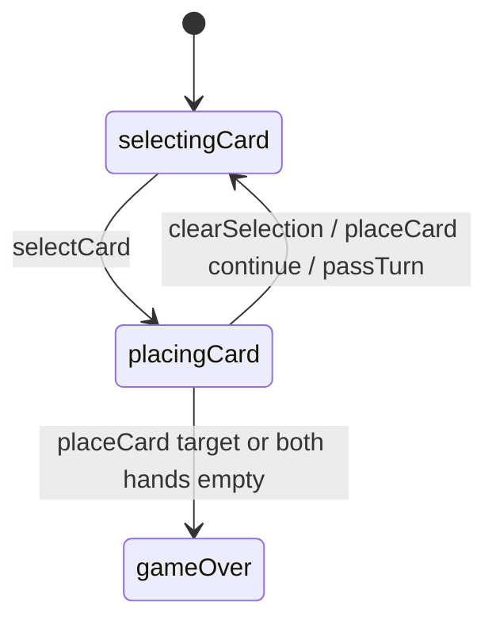

# Stars & Bars — engine reference

> Contributor-only. Describes **code** under `src/games/stars-bars/`. Not player-facing rules copy.
>
> Broader wiring: [wiki architecture (#475)](../../wiki/architecture.md) · [game registry](../../wiki/game-registry.md) · [docs sync (#496)](https://github.com/fuzzywigg/math-pentathlon/pull/496).
> Do not duplicate those docs here.

- **Registry id:** `stars-bars` (Division III)
- **Mount:** `src/ui/game-route-mounts.ts` → `case 'stars-bars'` → `src/games/stars-bars/game-controller.ts`
- **UI:** `src/games/stars-bars/board-ui.ts`
- **Rules / state:** `src/games/stars-bars/rules.ts`, `src/games/stars-bars/types.ts`
- **AI adapter:** `src/games/stars-bars/ai.ts`

## State shape

Primary type: `StarsState` in `src/games/stars-bars/types.ts`.

| Field |
| --- |
| `cells` |
| `playerHands` |
| `playerScores` |
| `currentPlayer` |
| `selectedCard` |
| `phase` |
| `winner` |
| `moveHistory` |
| `deck` |
| `lastMove` |

```ts
export interface StarsState {
  cells: BoardCell[][];
  playerHands: Record<Player, AttributeCard[]>;
  playerScores: Record<Player, number>;
  currentPlayer: Player;
  selectedCard: AttributeCard | null;
  phase: 'selectingCard' | 'placingCard' | 'gameOver';
  winner: Player | null;
  moveHistory: MoveRecord[];
  deck: AttributeCard[];
  lastMove: { row: number; col: number } | null;
}
```

## Move types

- `MoveRecord` — `src/games/stars-bars/types.ts`

```ts
export interface MoveRecord {
  player: Player;
  card: AttributeCard;
  row: number;
  col: number;
  score: number;
  breakdown: string;
}
```

- `AIMove` — `src/games/stars-bars/ai.ts`

```ts
export interface AIMove {
  cardId: string;
  row: number;
  col: number;
  hint?: string;
}
```

### Apply / advance functions

- `selectCard` — `src/games/stars-bars/rules.ts`
- `placeCard` — `src/games/stars-bars/rules.ts`
- `passTurn` — `src/games/stars-bars/rules.ts`
- `clearSelection` — `src/games/stars-bars/rules.ts`

## Turn / phase state machine

Phase field is an inline string union on `StarsState` in `src/games/stars-bars/types.ts` (not a separate exported `GamePhase` alias).



## Win / draw detection

| Function | File | What the code does |
| --- | --- | --- |
| `placeCard` | `src/games/stars-bars/rules.ts` | Score ≥ `CONFIG.TARGET_SCORE` (30) or both hands empty → higher score / `null` tie. |
| `hasValidMoves` | `src/games/stars-bars/rules.ts` | Legal placement existence for pass logic. |

## Serialization format

No dedicated codec. No `Map`/`Set` → JSON / `structuredClone`.

Shared progress storage (`src/core/storage/storage.ts`) persists stats/profile only, not in-progress boards.

## AI adapter

- `getAIMove` — `src/games/stars-bars/ai.ts`
- `executeAITurn` — `src/games/stars-bars/ai.ts`
- `isAITurn` — `src/games/stars-bars/ai.ts`

## Tests that cover this engine

Imports from `src/games/stars-bars/` (non-exhaustive; prefer these first):

- `tests/unit/burn-wave41-stars-ai-execute-difficulties.test.ts`
- `tests/unit/burn-wave42-stars-ai-winning-preference.test.ts`
- `tests/unit/burn-wave43-stars-ai-null-execute.test.ts`
- `tests/unit/burn-wave43-stars-target-score-win.test.ts`
- `tests/unit/burn-wave47-stars-ai-execute-difficulties.test.ts`
- `tests/unit/burn-wave47-stars-ai-winning-preference.test.ts`
- `tests/unit/overnight-stars-ai-hard-execute-flip.test.ts`
- `tests/unit/stars-bars-ai-input-guard.test.ts`
- `tests/unit/stars-bars-ai.test.ts`
- `tests/unit/stars-bars-rules.test.ts`
- `tests/unit/burn-wave43-handshake-calla-ramrod-stars-ai.test.ts`
- `tests/unit/burn-wave35-stars-bars-empty-placements.test.ts`
- `tests/unit/burn-wave40-stars-place-adjacency-reject.test.ts`
- `tests/unit/burn-wave40-stars-select-gameover-noop.test.ts`
- `tests/unit/burn-wave41-stars-adjacency-pass.test.ts`
- `tests/unit/burn-wave41-stars-opponent-select-reject.test.ts`
- `tests/unit/burn-wave41-stars-pass-has-moves-empty-hand.test.ts`
- `tests/unit/helpers/state-roundtrip-games.ts`

Also exercised by cross-game suites that import the module where listed above (round-trip helper, undo-audit props, registry/mount smoke).

## Known TODOs in code comments

- `src/games/stars-bars/board-ui.ts:758` — Full history display (do not cap — #501 fold held player-visible trim for Andrew).

## Key symbols (link-check table)

| Symbol | File |
| --- | --- |
| `StarsState` | `src/games/stars-bars/types.ts` |
| `MoveRecord` | `src/games/stars-bars/types.ts` |
| `AIMove` | `src/games/stars-bars/ai.ts` |
| `selectCard` | `src/games/stars-bars/rules.ts` |
| `placeCard` | `src/games/stars-bars/rules.ts` |
| `passTurn` | `src/games/stars-bars/rules.ts` |
| `clearSelection` | `src/games/stars-bars/rules.ts` |
| `hasValidMoves` | `src/games/stars-bars/rules.ts` |
| `getAIMove` | `src/games/stars-bars/ai.ts` |
| `executeAITurn` | `src/games/stars-bars/ai.ts` |
| `isAITurn` | `src/games/stars-bars/ai.ts` |
| *(module)* | `src/games/stars-bars/game-controller.ts` |
| *(module)* | `src/games/stars-bars/board-ui.ts` |
| *(module)* | `src/games/stars-bars/rules.ts` |
| *(module)* | `src/games/stars-bars/ai.ts` |
| *(module)* | `src/games/stars-bars/tutorial.ts` |
| *(module)* | `src/ui/game-route-mounts.ts` |
| *(module)* | `src/core/game-registry.ts` |

## Questions for Andrew

Flagged code-vs-docs disagreements only (no rules text edited here). See also `docs/RULES-DECISIONS-2026-10-07.md` and `docs/tutorial-engine-mismatches-2026-10-07.md`.

- None specific beyond the shared decision checklist (or already aligned in RULES/tutorial mismatch docs).
