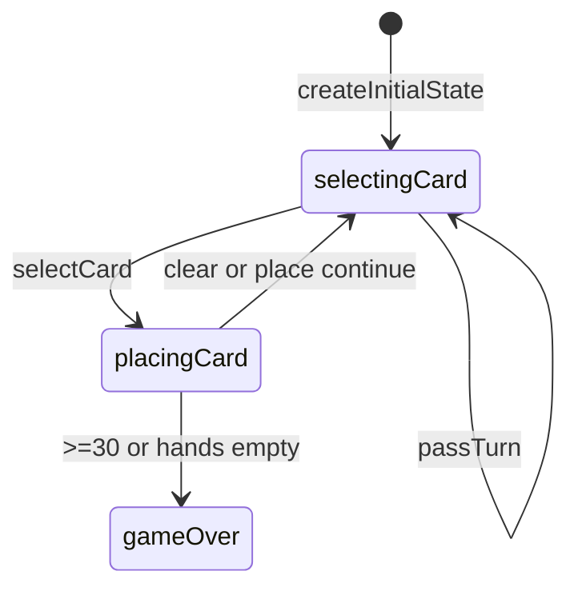

# Stars & Bars engine (`stars-bars`)

> Contributor reference for what the **code** does. Not player-facing.
> Do not treat this as official rules text. Wiki architecture: [docs/wiki/architecture.md](../../wiki/architecture.md) ([#475](https://github.com/fuzzywigg/math-pentathlon/issues/475)).
> Docs-sync work: see [#496](https://github.com/fuzzywigg/math-pentathlon/issues/496) — this page does not replace it.

**Division:** Division III · **Registry id:** `stars-bars`

## Module files

- `src/games/stars-bars/types.ts`
- `src/games/stars-bars/rules.ts`

**AI adapter**

- `src/games/stars-bars/ai.ts`

**UI entry**

- `src/games/stars-bars/board-ui.ts`
- `src/games/stars-bars/game-controller.ts`

## State shape

Primary type `StarsState` in `src/games/stars-bars/types.ts`.

- `cells: BoardCell[][]` / `deck` / `playerHands`
- `playerScores` / `selectedCard` / `lastMove`
- `phase: 'selectingCard' | 'placingCard' | 'gameOver'`
- `winner: Player | null` (null + gameOver = tie)
- `moveHistory: MoveRecord[]`

## Move types

History `MoveRecord`. Apply `selectCard`, `clearSelection`, `placeCard`, `passTurn`. No exported `checkWinner`.

Apply / query API:

- `placeCard` — score ≥ 30 or both hands empty settle
- `passTurn` — seat flip; does not end game
- `getValidPlacements` / `hasValidMoves`

## Turn / phase state machine

Phases in code: `selectingCard`, `placingCard`, `gameOver`.



## Win / draw detection

- Inline in `placeCard`: target 30; both hands empty → higher score or tie (`winner: null`)
- `passTurn` never ends the game (can pass forever — RULES SB1)

## Serialization format

Plain JSON-friendly (no Maps). No product board save.

## Tests that cover this engine

- `tests/unit/stars-bars-rules.test.ts`
- `tests/unit/stars-bars-ai.test.ts`
- `tests/unit/burn-wave35-stars-bars-empty-placements.test.ts`
- `tests/unit/burn-wave41-stars-place-star-scoring.test.ts`
- `tests/unit/burn-wave41-stars-adjacency-pass.test.ts`
- `tests/unit/burn-wave43-stars-target-score-win.test.ts`
- `tests/unit/state-roundtrip-fuzz.test.ts`

## Known TODOs (from code comments)

- No tagged TODOs under `src/games/stars-bars/`.

## Questions for Andrew

Yes/no decisions; recommendations are non-binding.

- **Q:** Add full-board / mutual-pass settle (RULES SB1)?
  - **Recommendation:** Yes — if endless pass is undesirable.
- **Q:** First card anywhere vs tutorials saying always adjacent (RULES SB3)?
  - **Recommendation:** Keep empty-board anywhere; fix tutorials elsewhere.

## Related reading

- Index: [README.md](./README.md)
- Wiki games catalog: [docs/wiki/games.md](../../wiki/games.md)
- Wiki architecture (#475): [docs/wiki/architecture.md](../../wiki/architecture.md)
- Adding a game: [docs/wiki/adding-a-game.md](../../wiki/adding-a-game.md)
- Rules decision log (do not edit rules here): [docs/RULES-DECISIONS-2026-10-07.md](../../RULES-DECISIONS-2026-10-07.md)

```dev-doc-refs
src/games/stars-bars/types.ts#StarsState
src/games/stars-bars/rules.ts#createInitialState
src/games/stars-bars/rules.ts#selectCard
src/games/stars-bars/rules.ts#placeCard
src/games/stars-bars/rules.ts#passTurn
src/games/stars-bars/rules.ts#hasValidMoves
src/games/stars-bars/ai.ts#getAIMove
src/games/stars-bars/game-controller.ts#initGame
src/games/stars-bars/board-ui.ts#renderBoard
tests/unit/stars-bars-rules.test.ts
src/core/game-registry.ts#GAMES
src/ui/game-route-mounts.ts#mountGameById
```
