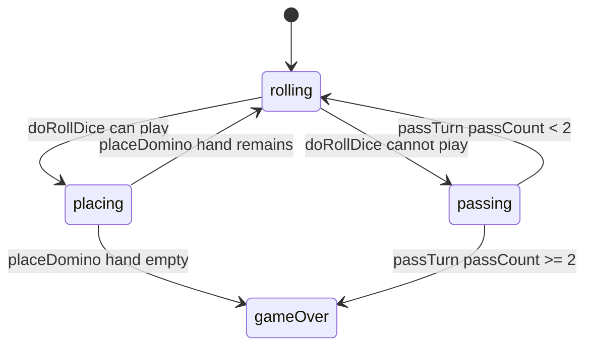

# Sum Dominoes & Dice — engine reference

> Contributor-only. Describes **code** under `src/games/sum-dominoes/`. Not player-facing rules copy.
>
> Broader wiring: [wiki architecture (#475)](../../wiki/architecture.md) · [game registry](../../wiki/game-registry.md) · [docs sync (#496)](https://github.com/fuzzywigg/math-pentathlon/pull/496).
> Do not duplicate those docs here.

- **Registry id:** `sum-dominoes` (Division II)
- **Mount:** `src/ui/game-route-mounts.ts` → `case 'sum-dominoes'` → `src/games/sum-dominoes/game-controller.ts`
- **UI:** `src/games/sum-dominoes/board-ui.ts`
- **Rules / state:** `src/games/sum-dominoes/rules.ts`, `src/games/sum-dominoes/types.ts`
- **AI adapter:** `src/games/sum-dominoes/ai.ts`

## State shape

Primary type: `SumDominoesState` in `src/games/sum-dominoes/types.ts`.

| Field |
| --- |
| `board` |
| `hands` |
| `player1` |
| `player2` |
| `currentPlayer` |
| `currentDice` |
| `selectedDomino` |
| `phase` |
| `winner` |
| `moveHistory` |
| `passCount` |

```ts
export interface SumDominoesState {
  board: (PlacedDomino | null)[][]; // 11x11 board
  hands: {
    player1: Domino[];
    player2: Domino[];
  };
  currentPlayer: Player;
  currentDice: [number, number] | null;
  selectedDomino: string | null;
  phase: GamePhase;
  winner: Player | null;
  moveHistory: SDMove[];
  passCount: number; // Consecutive passes
}
```

## Move types

- `SDMove` — `src/games/sum-dominoes/types.ts`

```ts
export interface SDMove {
  player: Player;
  domino: Domino;
  position: BoardPosition;
  orientation: 'horizontal' | 'vertical';
  matchedFace: number; // The face value that matched the sum
  adjacentFace: number; // The face value it connected to
  diceSum: number;
  moveNumber: number;
}
```

### Apply / advance functions

- `doRollDice` — `src/games/sum-dominoes/rules.ts`
- `selectDomino` — `src/games/sum-dominoes/rules.ts`
- `placeDomino` — `src/games/sum-dominoes/rules.ts`
- `passTurn` — `src/games/sum-dominoes/rules.ts`

## Turn / phase state machine

Phase type: `GamePhase` in `src/games/sum-dominoes/types.ts`.

```ts
export type GamePhase =
  | 'rolling' // Player needs to roll dice
  | 'placing' // Player selecting where to place domino
  | 'passing' // Player cannot play, must pass
  | 'gameOver';
```



## Win / draw detection

| Function | File | What the code does |
| --- | --- | --- |
| `placeDomino` | `src/games/sum-dominoes/rules.ts` | Empty hand → that player wins. |
| `passTurn` | `src/games/sum-dominoes/rules.ts` | At `passCount >= 2`, fewer remaining pips wins; equal → `winner: null`. |

## Serialization format

No dedicated codec. No `Map`/`Set` → JSON / `structuredClone`.

Shared progress storage (`src/core/storage/storage.ts`) persists stats/profile only, not in-progress boards.

## AI adapter

- `getAIMove` — `src/games/sum-dominoes/ai.ts`
- `executeAITurn` — `src/games/sum-dominoes/ai.ts`
- `hasPlayableMove` — `src/games/sum-dominoes/ai.ts`
- `isAITurn` — `src/games/sum-dominoes/ai.ts`

## Tests that cover this engine

Imports from `src/games/sum-dominoes/` (non-exhaustive; prefer these first):

- `tests/unit/burn-wave35-sum-dominoes-format-win-draw.test.ts`
- `tests/unit/burn-wave41-sum-dominoes-format-remaining.test.ts`
- `tests/unit/burn-wave41-sum-dominoes-place-phase-identity.test.ts`
- `tests/unit/burn-wave41-sum-dominoes-select-phase-identity.test.ts`
- `tests/unit/burn-wave42-sum-dominoes-ai-double-prefer.test.ts`
- `tests/unit/burn-wave42-sum-dominoes-ai-easy-best-fallback.test.ts`
- `tests/unit/burn-wave42-sum-dominoes-ai-easy-teaching.test.ts`
- `tests/unit/burn-wave42-sum-dominoes-ai-high-pip-reason.test.ts`
- `tests/unit/burn-wave42-sum-dominoes-ai-no-playable-null.test.ts`
- `tests/unit/burn-wave42-sum-dominoes-ai-randomness.test.ts`
- `tests/unit/burn-wave47-sum-dominoes-ai-double-prefer.test.ts`
- `tests/unit/burn-wave47-sum-dominoes-ai-easy-best-fallback.test.ts`
- `tests/unit/burn-wave47-sum-dominoes-ai-easy-teaching.test.ts`
- `tests/unit/burn-wave47-sum-dominoes-ai-high-pip-reason.test.ts`
- `tests/unit/burn-wave47-sum-dominoes-ai-no-playable-null.test.ts`
- `tests/unit/burn-wave47-sum-dominoes-ai-randomness.test.ts`
- `tests/unit/burn-wave47-sum-dominoes-format-remaining.test.ts`
- `tests/unit/burn-wave47-sum-dominoes-place-phase-identity.test.ts`
- `tests/unit/helpers/state-roundtrip-games.ts`

Also exercised by cross-game suites that import the module where listed above (round-trip helper, undo-audit props, registry/mount smoke).

## Known TODOs in code comments

None found under `src/games/sum-dominoes/` (`TODO` / `FIXME` / `Andrew` comment scan).

## Key symbols (link-check table)

| Symbol | File |
| --- | --- |
| `SumDominoesState` | `src/games/sum-dominoes/types.ts` |
| `SDMove` | `src/games/sum-dominoes/types.ts` |
| `doRollDice` | `src/games/sum-dominoes/rules.ts` |
| `selectDomino` | `src/games/sum-dominoes/rules.ts` |
| `placeDomino` | `src/games/sum-dominoes/rules.ts` |
| `passTurn` | `src/games/sum-dominoes/rules.ts` |
| `GamePhase` | `src/games/sum-dominoes/types.ts` |
| `getAIMove` | `src/games/sum-dominoes/ai.ts` |
| `executeAITurn` | `src/games/sum-dominoes/ai.ts` |
| `hasPlayableMove` | `src/games/sum-dominoes/ai.ts` |
| `isAITurn` | `src/games/sum-dominoes/ai.ts` |
| *(module)* | `src/games/sum-dominoes/game-controller.ts` |
| *(module)* | `src/games/sum-dominoes/board-ui.ts` |
| *(module)* | `src/games/sum-dominoes/rules.ts` |
| *(module)* | `src/games/sum-dominoes/ai.ts` |
| *(module)* | `src/games/sum-dominoes/tutorial.ts` |
| *(module)* | `src/ui/game-route-mounts.ts` |
| *(module)* | `src/core/game-registry.ts` |

## Questions for Andrew

Flagged code-vs-docs disagreements only (no rules text edited here). See also `docs/RULES-DECISIONS-2026-10-07.md` and `docs/tutorial-engine-mismatches-2026-10-07.md`.

- None specific beyond the shared decision checklist (or already aligned in RULES/tutorial mismatch docs).
