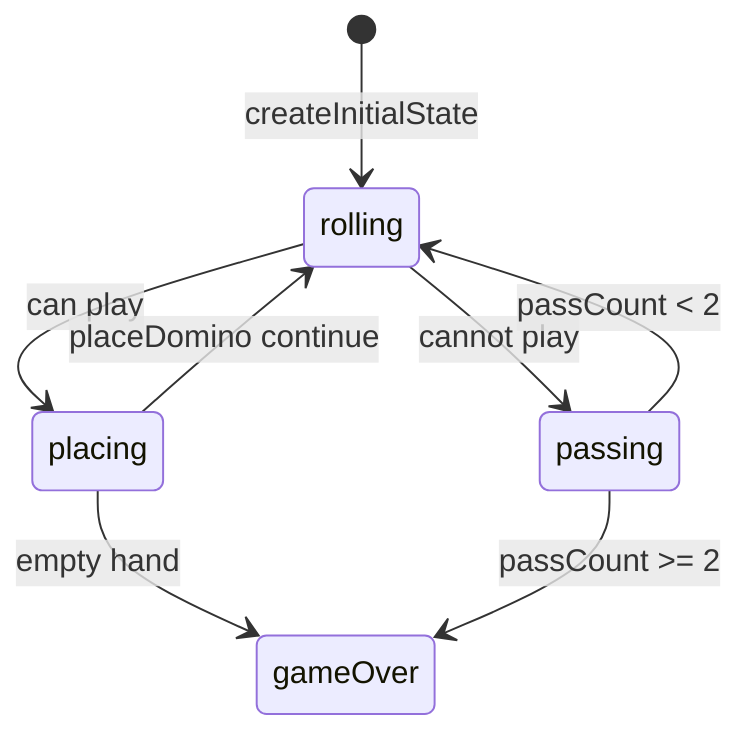

# Sum Dominoes & Dice engine (`sum-dominoes`)

> Contributor reference for what the **code** does. Not player-facing.
> Do not treat this as official rules text. Wiki architecture: [docs/wiki/architecture.md](../../wiki/architecture.md) ([#475](https://github.com/fuzzywigg/math-pentathlon/issues/475)).
> Docs-sync work: see [#496](https://github.com/fuzzywigg/math-pentathlon/issues/496) — this page does not replace it.

**Division:** Division II · **Registry id:** `sum-dominoes`

## Module files

- `src/games/sum-dominoes/types.ts`
- `src/games/sum-dominoes/rules.ts`

**AI adapter**

- `src/games/sum-dominoes/ai.ts`

**UI entry**

- `src/games/sum-dominoes/board-ui.ts`
- `src/games/sum-dominoes/game-controller.ts`

## State shape

Primary type `SumDominoesState` in `src/games/sum-dominoes/types.ts`.

- `board: (PlacedDomino | null)[][]` (11×11)
- `hands` / `currentDice` / `selectedDomino`
- `phase: GamePhase` — `'rolling' | 'placing' | 'passing' | 'gameOver'`
- `winner: Player | null`
- `moveHistory: SDMove[]`
- `passCount: number`

## Move types

Record `SDMove`. Apply `doRollDice`, `selectDomino`, `placeDomino`, `passTurn`.

Apply / query API:

- `doRollDice` → placing or passing
- `placeDomino` — empty hand wins
- `passTurn` — ≥2 consecutive passes settle by remaining pips (tie → `winner: null`)

## Turn / phase state machine

Phases in code: `rolling`, `placing`, `passing`, `gameOver`.



## Win / draw detection

- Inline in `placeDomino` and `passTurn`
- No separate `checkWinner` export
- Draw: `winner: null` on equal remaining pips

## Serialization format

No codec. Plain JSON-friendly. Fuzz `jsonRoundTrip`. Stats key only.

## Tests that cover this engine

- `tests/unit/sum-dominoes-ai.test.ts`
- `tests/unit/sum-dominoes-deep-playability.test.ts`
- `tests/unit/burn-wave35-sum-dominoes-format-win-draw.test.ts`
- `tests/unit/burn-wave42-sum-dominoes-pass-both-settle.test.ts`
- `tests/unit/burn-wave47-sum-dominoes-create-initial.test.ts`
- `tests/unit/burn-wave47-sum-dominoes-valid-placements-matrix.test.ts`
- `tests/unit/state-roundtrip-fuzz.test.ts`

## Known TODOs (from code comments)

- No tagged TODOs under `src/games/sum-dominoes/`.

## Questions for Andrew

Yes/no decisions; recommendations are non-binding.

- **Q:** Confirm mutual-pass draw (`winner: null`) is official (RULES SD2)?
  - **Recommendation:** Yes — keep engine draw.

## Related reading

- Index: [README.md](./README.md)
- Wiki games catalog: [docs/wiki/games.md](../../wiki/games.md)
- Wiki architecture (#475): [docs/wiki/architecture.md](../../wiki/architecture.md)
- Adding a game: [docs/wiki/adding-a-game.md](../../wiki/adding-a-game.md)
- Rules decision log (do not edit rules here): [docs/RULES-DECISIONS-2026-10-07.md](../../RULES-DECISIONS-2026-10-07.md)

```dev-doc-refs
src/games/sum-dominoes/types.ts#SumDominoesState
src/games/sum-dominoes/types.ts#GamePhase
src/games/sum-dominoes/types.ts#SDMove
src/games/sum-dominoes/rules.ts#createInitialState
src/games/sum-dominoes/rules.ts#doRollDice
src/games/sum-dominoes/rules.ts#placeDomino
src/games/sum-dominoes/rules.ts#passTurn
src/games/sum-dominoes/ai.ts#getAIMove
src/games/sum-dominoes/ai.ts#executeAITurn
src/games/sum-dominoes/game-controller.ts#initGame
src/games/sum-dominoes/board-ui.ts#renderBoard
tests/unit/burn-wave35-sum-dominoes-format-win-draw.test.ts
src/core/game-registry.ts#GAMES
src/ui/game-route-mounts.ts#mountGameById
```
