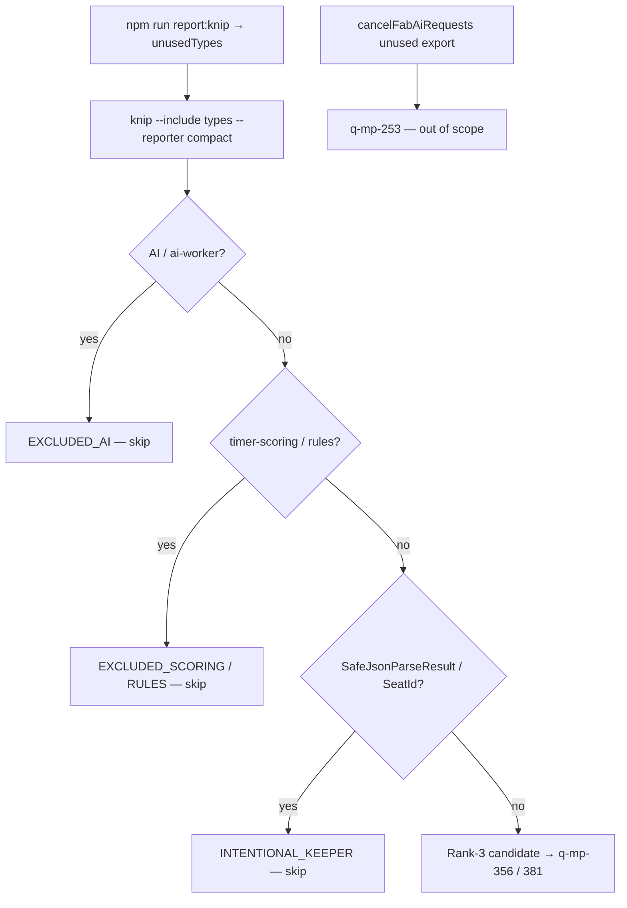

# q-mp-365 — Knip Rank-3 `unusedTypes` candidate inventory (2026-10-10)

**Task id:** `q-mp-365`  
**Role:** worker (docs / visual only)  
**Tip audited:** `cursor/mp-tip-post830` @ `97487de6` (full `97487de6b6ad16a2f47a07dcff1076ff1d544aa4`)  
**Machine summary:** [`knip-rank3-unused-types-inventory-2026-10-10.json`](./knip-rank3-unused-types-inventory-2026-10-10.json)  
**Chart:** [`knip-rank3-unused-types-inventory-2026-10-10.svg`](./knip-rank3-unused-types-inventory-2026-10-10.svg)  
**Scope:** Dated inventory of live Rank-3 `unusedTypes` after tip batch-5 floor. **No `src/` edits. No `knip-baseline.json` edits. No type demotes.**

## Purpose

Publish a tip-stamped map of knip `unusedTypes` so parallel demote workers (`q-mp-356` batch 6, `q-mp-381` batch 7) have a single live list. Spec backlog was written against tip post785 evidence (`unusedTypes` **47** / GamePhase cluster). **Live post830 re-measure is authoritative.**

## Hard-rule HOLD (explicit)

Workers using this inventory must **not**:

- Demote or delete AI protocol / `src/games/*/ai.ts` types
- Edit `*/rules.ts`, legal-move, or scoring paths (including `src/core/timer-scoring.ts`)
- Change AI search, scoring, difficulty, or move timing; Hex Hard stays **450ms**
- Edit `cancelFabAiRequests` (unused **export**, owned by `q-mp-253`)
- Lower `knip-baseline.json` from this docs PR (demote tickets own baseline edits)

## Duplicate check (open drafts)

| Related draft / prior                                                                 | Overlap                                                                | Action                                        |
| ------------------------------------------------------------------------------------- | ---------------------------------------------------------------------- | --------------------------------------------- |
| [#851](https://github.com/fuzzywigg/math-pentathlon/pull/851) `q-mp-090k` backlog 10b | Defines this task; does not ship the inventory                         | Leave open                                    |
| [#829](https://github.com/fuzzywigg/math-pentathlon/pull/829) `q-mp-332` batch 5      | Already folded into tip floor (baseline **47**); open draft may linger | Leave open; **contained** by tip fold payload |
| Undrafted / parallel `q-mp-356` batch 6                                               | **Code demotes** of Rank-3 types                                       | Complementary; this PR is planning-only       |
| `q-mp-381` batch 7                                                                    | Waits on `356`                                                         | Complementary                                 |
| Open post830 drafts `#853` / `#854`                                                   | Bundle headroom / CI permissions                                       | No unusedTypes inventory                      |
| Prior knip docs [`knip-report.md`](./knip-report.md)                                  | Batch narrative + baseline                                             | Cross-link only; baseline untouched           |

No open draft already owns a post830-dated Rank-3 unusedTypes inventory → full task proceeds.

## Method (live tip)

```text
$ git rev-parse HEAD
  97487de6b6ad16a2f47a07dcff1076ff1d544aa4

$ npm run report:knip -- --json
  unusedFiles: 0
  unusedExports: 3
  unusedTypes: 43
  unusedDependencies: 0
  unusedDevDependencies: 0
  unlisted: 3
  duplicates: 0
  [NOTICE] knip unused surface within baseline
  [NOTICE] knip unused shrink: unusedTypes 47→43 (-4)

$ npx knip@5.88.1 --include types --reporter compact
  # 43 exported types listed (see tables + JSON)

$ npx knip@5.88.1 --include exports --reporter compact
  src/core/storage/index.ts: isPlainProgressObject, sanitizeSettings
  src/games/fab-a-diffy/ai-client.ts: cancelFabAiRequests
```

Listing captured with pinned `knip@5.88.1` / committed [`knip.json`](../../knip.json).

## Before → after metrics (report-only stamp)

| Metric               |                 Spec / baseline evidence |     Live tip `97487de6` | This PR                          |
| -------------------- | ---------------------------------------: | ----------------------: | -------------------------------- |
| `unusedTypes` (knip) | **47** (baseline + backlog @ `06126841`) | **43** (−4 vs baseline) | Docs only; **no** baseline write |
| `unusedExports`      |                                        3 |                       3 | unchanged                        |
| `unlisted`           |                                        3 |                       3 | unchanged                        |
| `duplicates`         |                                        0 |                       0 | unchanged                        |
| Tip SHA stamp        |                         post785 evidence |  **`97487de6` post830** | inventory + SVG + JSON           |

**Delta vs backlog `q-mp-365` evidence:** tip SHA + live count (**47→43**). The named GamePhase / hex-a-gone / FractionBar / FIAR layout / `WinCondition` cluster is **not** in the live knip `unusedTypes` listing (see stale-spec note).

## Disposition overview


| Disposition             |  Count | Meaning for demote workers                                 |
| ----------------------- | -----: | ---------------------------------------------------------- |
| `EXCLUDED_AI`           | **23** | Hard-rule HOLD — AI worker + per-game `ai.ts` result types |
| `EXCLUDED_SCORING`      |  **4** | Hard-rule HOLD — `timer-scoring.ts`                        |
| `EXCLUDED_RULES`        |  **0** | None currently in unusedTypes                              |
| `INTENTIONAL_KEEPER`    |  **2** | Documented keepers (`SafeJsonParseResult`, `SeatId`)       |
| **Rank-3 candidates**   | **14** | Safe demote fodder for `356` / `381` after re-`rg`         |
| — alignment `compat.ts` |      7 | Module-private candidates                                  |
| — UI helpers            |      7 | Module-private candidates                                  |

## Rank-3 candidates (safe demote queue — planning only)

Zero cross-module **type imports** observed at audit (name hits in other files are comments or duplicate canonical definitions elsewhere). Demotes belong to `q-mp-356` / `q-mp-381`, not this PR.

### Alignment compat (`src/core/alignment/compat.ts`) — 7

| Type                   | Notes                                                                                                    |
| ---------------------- | -------------------------------------------------------------------------------------------------------- |
| `WrapOptions`          | Same-file only                                                                                           |
| `AlignmentOptions`     | Same-file only                                                                                           |
| `LineAlignmentResult`  | Same-file only                                                                                           |
| `ConnectivityOptions`  | Same-file only                                                                                           |
| `RegionStats`          | Same-file only                                                                                           |
| `Dimensions`           | Same-file use; board-ui name hits are **comments** only                                                  |
| `AlignmentCheckResult` | Compat export unused; canonical lives on `src/core/alignment/types.ts` (imported by `grid-alignment.ts`) |

### UI helpers — 7

| Type                          | File                          | Notes          |
| ----------------------------- | ----------------------------- | -------------- |
| `GameMountDeps`               | `src/ui/game-route-mounts.ts` | Same-file only |
| `PlayerSeat`                  | `src/ui/player-colors.ts`     | Same-file only |
| `GameModeChrome`              | `src/ui/player-colors.ts`     | Same-file only |
| `PointerTapControllerOptions` | `src/ui/pointer-hygiene.ts`   | Same-file only |
| `PointerTapController`        | `src/ui/pointer-hygiene.ts`   | Same-file only |
| `BindCanvasPointerTapOptions` | `src/ui/pointer-hygiene.ts`   | Same-file only |
| `GameModeLabel`               | `src/ui/seat-labels.ts`       | Same-file only |

## Intentional keepers (do not demote from this inventory)

| Type                  | File                           | Why kept                                                                                                                              |
| --------------------- | ------------------------------ | ------------------------------------------------------------------------------------------------------------------------------------- |
| `SafeJsonParseResult` | `src/core/safe-web-storage.ts` | Documented mirror surface (`knip-report.md` batch 2 / batch 5 skip)                                                                   |
| `SeatId`              | `src/core/seats.ts`            | Canonical export; knip also flags the `export type { SeatId }` re-export from `src/ui/seat-labels.ts` (batch 5 skip / test importers) |

## EXCLUDED — AI (23)

Hard-rule HOLD. Listed so demote workers do not “clean” them while chasing the baseline.

| File                                 | Types                                               |
| ------------------------------------ | --------------------------------------------------- |
| `src/core/ai-worker/client.ts`       | `AiWorkerRequestPayload`                            |
| `src/core/ai-worker/protocol.ts`     | `AiWorkerRequestBase`                               |
| `src/games/calla/ai.ts`              | `MoveAnalysis`, `AIMove`                            |
| `src/games/contig-60/ai.ts`          | `AIPlacement`                                       |
| `src/games/fab-a-diffy/ai.ts`        | `AISearchResult`                                    |
| `src/games/fiar/ai.ts`               | `AISearchResult`                                    |
| `src/games/hex-a-gone/ai.ts`         | `AISelectionResult`, `AIPlacementResult`            |
| `src/games/hex/ai.ts`                | `AISearchResult`                                    |
| `src/games/juggle/ai.ts`             | `AIDieChoice`, `AIShapeChoice`, `AIPlacementChoice` |
| `src/games/kings-quadraphages/ai.ts` | `AIMove`                                            |
| `src/games/kwatro-sinko/ai.ts`       | `AIMove`                                            |
| `src/games/par-55/ai.ts`             | `AIMove`                                            |
| `src/games/pent-em-in/ai.ts`         | `AIMove`                                            |
| `src/games/prime-gold/ai.ts`         | `AIPlacement`                                       |
| `src/games/queens-guards/ai.ts`      | `AISearchResult`                                    |
| `src/games/ramrod/ai.ts`             | `AIMove`                                            |
| `src/games/star-track/ai.ts`         | `AIChainChoice`                                     |
| `src/games/stars-bars/ai.ts`         | `AIMove`                                            |
| `src/games/sum-dominoes/ai.ts`       | `AIMove`                                            |

## EXCLUDED — scoring (4)

| File                        | Types                                                               |
| --------------------------- | ------------------------------------------------------------------- |
| `src/core/timer-scoring.ts` | `FormatTimeOptions`, `ScoreEntry`, `LeaderboardEntry`, `GameResult` |

`WinCondition` on the same file is **scoring HOLD** even though it is **not** in the live knip unusedTypes list (referenced from `ScoringState`).

## Out-of-scope unused **exports** (not types)

| Export                  | File                                 | Owner                         |
| ----------------------- | ------------------------------------ | ----------------------------- |
| `cancelFabAiRequests`   | `src/games/fab-a-diffy/ai-client.ts` | `q-mp-253` — **do not touch** |
| `isPlainProgressObject` | `src/core/storage/index.ts`          | Outside this ticket           |
| `sanitizeSettings`      | `src/core/storage/index.ts`          | Outside this ticket           |

## Spec staleness — backlog GamePhase / layout cluster

Backlog `q-mp-365` / `q-mp-356` named these as Rank-3 knip fodder. **None appear in live `knip --include types` on tip `97487de6`:**

| Symbol                                                                                | Still exported? | Live knip unusedTypes? | Note                                                            |
| ------------------------------------------------------------------------------------- | --------------- | ---------------------- | --------------------------------------------------------------- |
| `GamePhase` (per-game)                                                                | yes             | **no**                 | Imported by several `rules.ts` modules / embedded in game state |
| hex-a-gone `PlacedBlock` / `TurnSelection`                                            | yes             | **no**                 | Structural fields on exported game state                        |
| hex-a-gone / peers `MoveRecord`                                                       | yes             | **no**                 | Used across rules / types                                       |
| `FractionBarStyle` / `FractionBarColors`                                              | yes             | **no**                 | Embedded in fraction options                                    |
| FIAR `LayoutNode`                                                                     | yes             | **no**                 | Used inside `fiar/layout.ts` public layout values               |
| `WinCondition`                                                                        | yes             | **no**                 | Scoring HOLD (`timer-scoring.ts`)                               |
| `ProblemResult` / `RodPosition` / `ChainLength` / `StarTrackMove` / `LogicalOperator` | yes             | **no**                 | Structural / same-module; not knip-flagged                      |

Parallel `q-mp-356` / `381` must **re-`rg` and re-run knip** before demoting; do not treat the backlog name list as the live queue. This inventory’s demote queue is the **14** Rank-3 candidates above.

## Mermaid — triage flow for demote workers



## Non-goals / left alone

- No `src/` product edits; no test behavior changes
- No `knip-baseline.json` / ratchet JSON edits (even though live types are already **43** under baseline **47** — tip owner / demote ticket takes **min** at fold)
- No AI / rules / scoring / copy edits
- No claim that backlog GamePhase cluster is still knip-unused

## Verify

```bash
git rev-parse HEAD
npm run report:knip -- --json
npx knip@5.88.1 --include types --reporter compact
npm run check:dev-docs
npm run verify
npm run test:unit
```

## Related docs

- [`knip-report.md`](./knip-report.md) — CI job + batch narrative
- [`knip-baseline.json`](./knip-baseline.json) — report-only baseline (`unusedTypes: 47`, enforce false)
- [`dead-code-inventory.md`](./dead-code-inventory.md) — broader dead-code map
- Backlog: [`backlog-2026-10-10b.md`](./backlog-2026-10-10b.md) `q-mp-365` / `q-mp-381`; [`backlog-2026-10-10a.md`](./backlog-2026-10-10a.md) `q-mp-356`

**Next action: fold into tip by the tip owner.**
