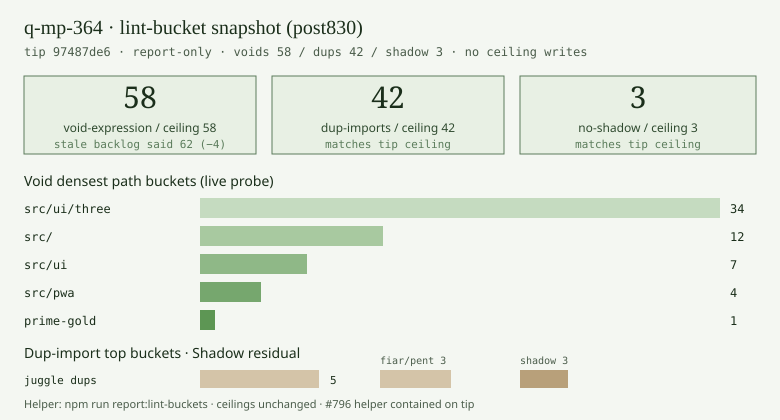

# Lint-bucket measured snapshot — tip post830 (2026-10-10)

**Task id:** `q-mp-364`  
**Role:** worker (docs / chart only)  
**Tip measured:** `cursor/mp-tip-post830` @ `97487de6` (`97487de6b6ad16a2f47a07dcff1076ff1d544aa4`)  
**Measured at:** `2026-10-10T03:54:19Z` (UTC)  
**Helper:** [`lint-bucket-report.md`](./lint-bucket-report.md) (`npm run report:lint-buckets`, `q-mp-280` / open `#796` **contained** on tip)  
**Data:** [`lint-bucket-snapshot-post830-2026-10-10.json`](./lint-bucket-snapshot-post830-2026-10-10.json)  
**Chart:** 

## Purpose

Backlog `q-mp-364` asked for a dated tip snapshot after post785 folds (stale evidence: tip `06126841`, void **62** / dup **42** / shadow **3**). Live tip cut is `cursor/mp-tip-post830` @ `97487de6` (alpha tip fold `#830`). Re-measure on the live tree; commit report-only docs + chart. **No** `lint-ratchet-ceilings.json` edits. **No** `src/` / test behavior changes.

## Duplicate check (open drafts)

| PR                                                            | Title                         | Overlap                                                                                    |
| ------------------------------------------------------------- | ----------------------------- | ------------------------------------------------------------------------------------------ |
| [#796](https://github.com/fuzzywigg/math-pentathlon/pull/796) | `q-mp-280` lint-bucket helper | **CONTAINED** — script + helper doc already on tip; this PR is the dated measured snapshot |
| [#851](https://github.com/fuzzywigg/math-pentathlon/pull/851) | `q-mp-090k` backlog 10b       | Spec owner only (lists `q-mp-364`); no snapshot files                                      |
| Older void / dup / shadow clear PRs                           | various tip bases             | Orthogonal (code clears); not a measured snapshot                                          |

No open draft into `cursor/mp-tip-post830` owned a post830 lint-bucket measured snapshot before this PR.

## Stale backlog → live tip (focus ceilings)

| Rule                                              | Stale backlog (`06126841` / post785) | Live tip (`97487de6` / post830) |      Δ |
| ------------------------------------------------- | -----------------------------------: | ------------------------------: | -----: |
| `@typescript-eslint/no-confusing-void-expression` |                                   62 |                          **58** | **−4** |
| `no-duplicate-imports`                            |                                   42 |                          **42** |      0 |
| `@typescript-eslint/no-shadow`                    |                                    3 |                           **3** |      0 |

Live ceilings come from [`lint-ratchet-ceilings.json`](./lint-ratchet-ceilings.json) notes (tip fold `#830` / post785 min ceilings): void **58**, dup **42**, no-shadow **3**.

## Chart — focus metrics + void buckets


```text
void       ██████████████████████████████████████████████████████████  58 / 58
dup-import ██████████████████████████████████████████                  42 / 42
no-shadow  ███                                                          3 /  3

void path buckets:
  src/ui/three  ████████████████████████████████████  34
  src/          ████████████                          12
  src/ui        ███████                                7
  src/pwa       ████                                   4
  prime-gold    █                                      1
```

## All ceilinged rules (live probe)

Commands:

```bash
npm run report:lint-buckets -- --top 50
npm run lint:ratchet
```

| Rule                                              | Live total | Ceiling | Headroom |
| ------------------------------------------------- | ---------: | ------: | -------: |
| `curly`                                           |        538 |     538 |        0 |
| `@typescript-eslint/no-non-null-assertion`        |        246 |     246 |        0 |
| `@typescript-eslint/no-confusing-void-expression` |     **58** |  **58** |        0 |
| `radix`                                           |          6 |       6 |        0 |
| `default-case`                                    |          5 |       5 |        0 |
| `no-duplicate-imports`                            |     **42** |  **42** |        0 |
| `@typescript-eslint/prefer-nullish-coalescing`    |         65 |      65 |        0 |
| `@typescript-eslint/prefer-optional-chain`        |         21 |      21 |        0 |
| `@typescript-eslint/switch-exhaustiveness-check`  |          8 |       8 |        0 |
| `@typescript-eslint/no-shadow`                    |      **3** |   **3** |        0 |
| `eqeqeq` (stricter always; via `lint:ratchet`)    |      **1** |   **1** |        0 |
| `@typescript-eslint/return-await`                 |          3 |       3 |        0 |

### Probe note (eqeqeq)

`npm run lint:ratchet` reports `eqeqeq: 1 / ceiling 1` (stricter `always` overlay; residual HOLD on fiar rules).  
`npm run report:lint-buckets` currently omits `eqeqeq` from its probe overlay, so the helper prints `eqeqeq: 0 / ceiling 1`. This snapshot records the **ratchet** total for eqeqeq and the helper totals for every other rule. No script edit in this ticket (docs/chart only).

---

## Focus: `@typescript-eslint/no-confusing-void-expression` — 58 / 58

### Path buckets

| Hits | Bucket               |
| ---: | -------------------- |
|   34 | src/ui/three         |
|   12 | src/                 |
|    7 | src/ui               |
|    4 | src/pwa              |
|    1 | src/games/prime-gold |

### Densest files (top 10)

| Hits | File                                        |
| ---: | ------------------------------------------- |
|   12 | src/main.ts                                 |
|    5 | src/ui/three/hex-a-gone-board-3d.ts         |
|    5 | src/ui/three/star-track-board-3d.ts         |
|    4 | src/ui/three/fiar-board-3d.ts               |
|    4 | src/ui/three/kings-quadraphages-board-3d.ts |
|    4 | src/ui/three/kwatro-sinko-board-3d.ts       |
|    4 | src/ui/three/pent-em-in-board-3d.ts         |
|    4 | src/ui/three/prime-gold-board-3d.ts         |
|    4 | src/ui/three/queens-guards-board-3d.ts      |
|    3 | src/ui/owl/owl-component.ts                 |

Clearable triage pointers (not this ticket): board-3d / layout-read owners; owl void clear is backlog `q-mp-366`. Do not touch AI / rules / scoring / Hex Hard **450ms**.

---

## Focus: `no-duplicate-imports` — 42 / 42

### Path buckets (all)

| Hits | Bucket                       |
| ---: | ---------------------------- |
|    5 | src/games/juggle             |
|    3 | src/games/fiar               |
|    3 | src/games/pent-em-in         |
|    2 | src/games/calla              |
|    2 | src/games/contig-60          |
|    2 | src/games/frac-fact          |
|    2 | src/games/fraction-pinball   |
|    2 | src/games/hex                |
|    2 | src/games/hex-a-gone         |
|    2 | src/games/kwatro-sinko       |
|    2 | src/games/par-55             |
|    2 | src/games/prime-gold         |
|    2 | src/games/queens-guards      |
|    2 | src/games/ramrod             |
|    2 | src/games/star-track         |
|    2 | src/games/stars-bars         |
|    2 | src/games/sum-dominoes       |
|    1 | src/games/fab-a-diffy        |
|    1 | src/games/kings-quadraphages |
|    1 | src/games/remainder-islands  |

### Densest files (top 10)

| Hits | File                                |
| ---: | ----------------------------------- |
|    2 | src/games/frac-fact/rules.ts        |
|    2 | src/games/fraction-pinball/rules.ts |
|    2 | src/games/juggle/ai.ts              |
|    2 | src/games/juggle/rules.ts           |
|    1 | src/games/calla/ai.ts               |
|    1 | src/games/calla/rules.ts            |
|    1 | src/games/contig-60/ai.ts           |
|    1 | src/games/contig-60/rules.ts        |
|    1 | src/games/fab-a-diffy/rules.ts      |
|    1 | src/games/fiar/ai.ts                |

Many residual hits sit in `*/rules.ts` / `*/ai.ts` — HOLD under hard rules for AI / legal-move / scoring paths. Merge-only clears must stay outside those paths.

---

## Focus: `@typescript-eslint/no-shadow` — 3 / 3

| Hits | File                         |
| ---: | ---------------------------- |
|    2 | src/games/contig-60/types.ts |
|    1 | src/games/par-55/rules.ts    |

Bucket totals: contig-60 **2**, par-55 **1**. The par-55 hit is under rules — HOLD for worker clears that must not touch rules logic.

---

## Other densest-file snapshots (context)

### `curly` (538) — densest files

| Hits | File                            |
| ---: | ------------------------------- |
|   40 | src/games/fiar/ai.ts            |
|   32 | src/games/kwatro-sinko/rules.ts |
|   25 | src/games/fiar/rules.ts         |
|   25 | src/games/juggle/ai.ts          |
|   24 | src/games/hex/ai.ts             |
|   20 | src/games/hex-a-gone/rules.ts   |
|   20 | src/games/kwatro-sinko/ai.ts    |
|   19 | src/games/fab-a-diffy/rules.ts  |
|   19 | src/games/queens-guards/ai.ts   |
|   17 | src/games/hex-a-gone/ai.ts      |

### `@typescript-eslint/no-non-null-assertion` (246) — densest files

| Hits | File                                  |
| ---: | ------------------------------------- |
|   29 | src/main.ts                           |
|   28 | src/ui/game-route-mounts.ts           |
|   16 | src/games/kwatro-sinko/rules.ts       |
|   15 | src/games/hex/rules.ts                |
|   14 | src/core/expressions/evaluator.ts     |
|   14 | src/games/sum-dominoes/rules.ts       |
|   11 | src/games/stars-bars/rules.ts         |
|    9 | src/games/calla/rules.ts              |
|    7 | src/core/expressions/expression-ui.ts |
|    7 | src/core/timer-scoring.ts             |

### `@typescript-eslint/prefer-nullish-coalescing` (65) — densest files

| Hits | File                                            |
| ---: | ----------------------------------------------- |
|    9 | src/core/owl/owl-messages.ts                    |
|    5 | src/core/dice/dice-selector.ts                  |
|    5 | src/core/owl/owl-events.ts                      |
|    3 | src/ui/game-route-mounts.ts                     |
|    2 | src/core/owl/ollie-inspect-map.ts               |
|    2 | src/core/owl/owl-system.ts                      |
|    2 | src/games/kings-quadraphages/game-controller.ts |
|    2 | src/games/sum-dominoes/rules.ts                 |
|    2 | src/ui/three/prime-gold-board-3d.ts             |
|    2 | src/ui/three/tablet-gl.ts                       |

Nullish remains HELD behind open `#727` / related backlog keys — do not clear from this snapshot ticket.

## Hard-rule notes

- Report-only: docs + JSON data + SVG chart. No ceiling writes. No `src/` / test edits.
- Do not clear debt in `*/rules.ts`, AI search/scoring/difficulty/timing paths, or player-facing copy from this snapshot alone.
- Hex Hard stays **450ms** with real time; no Stars & Bars history cap.
- Ratchets only go down (elsewhere); this PR does not touch ceilings.

## Verification (local)

```bash
git rev-parse HEAD   # tip base before branch commit: 97487de6b6ad16a2f47a07dcff1076ff1d544aa4
npm run report:lint-buckets -- --top 50
npm run lint:ratchet
npm run check:dev-docs
```
