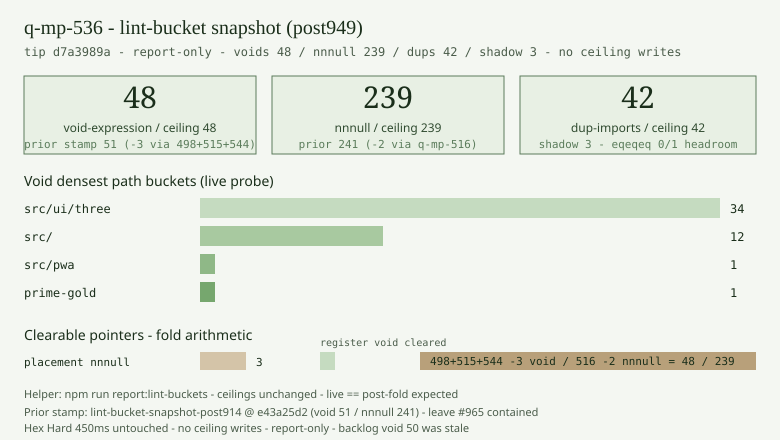

# Lint-bucket measured snapshot — tip post949 (2026-10-10)

**Task id:** `q-mp-536`  
**Role:** worker (docs / chart only)  
**Tip measured:** `cursor/mp-tip-post949` @ `d7a3989a` (`d7a3989a25c15c3294c93d2fe3e5fc5f043fef66`)  
**Measured at:** `2026-10-10T14:24:19Z` (UTC)  
**Helper:** [`lint-bucket-report.md`](./lint-bucket-report.md) (`npm run report:lint-buckets`, `q-mp-280` helper **contained** on tip)  
**Data:** [`lint-bucket-snapshot-post949-2026-10-10.json`](./lint-bucket-snapshot-post949-2026-10-10.json)  
**Chart:** 

## Purpose

Backlog `q-mp-536` (spec in [`backlog-2026-10-10r.md`](./backlog-2026-10-10r.md) / draft [#995](https://github.com/fuzzywigg/math-pentathlon/pull/995)) asked for a dated tip snapshot at post949 ceilings. Stale backlog evidence listed void **50** / nnnull **241** / nullish **65** / dup **42** / shadow **3** with `eqeqeq` live **0** / ceiling **1** and `lint:ratchet` green. Prior dated snapshot stamps post914 (`q-mp-491` @ `e43a25d2`, void **51** / nnnull **241**). Re-measure on the live tip head; commit report-only docs + chart. **No** `lint-ratchet-ceilings.json` edits. **No** `src/` / test behavior changes.

## Duplicate check (open drafts)

| PR                                                            | Title                                     | Overlap                                                                |
| ------------------------------------------------------------- | ----------------------------------------- | ---------------------------------------------------------------------- |
| [#995](https://github.com/fuzzywigg/math-pentathlon/pull/995) | `q-mp-090r` backlog 10r                   | Spec owner only (lists `q-mp-536`); no snapshot files                  |
| [#965](https://github.com/fuzzywigg/math-pentathlon/pull/965) | `q-mp-491` lint-bucket snapshot post914   | Prior tip stamp — **already on tip**; leave open with **contained**    |
| [#944](https://github.com/fuzzywigg/math-pentathlon/pull/944) | `q-mp-464` eslint non-ceilinged residuals | Orthogonal (non-ceilinged overlay); leave open with **contained**      |
| [#928](https://github.com/fuzzywigg/math-pentathlon/pull/928) | `q-mp-441` lint-bucket snapshot post898   | Older tip stamp — leave open with **contained**                        |
| [#999](https://github.com/fuzzywigg/math-pentathlon/pull/999) | `q-mp-544` register void (-1)             | Folded on tip @ `d7a3989a` (void 49→48); leave open with **contained** |

No open draft into `cursor/mp-tip-post949` owned a post949 lint-bucket measured snapshot before this PR. Leave `#965` / `#944` open with **contained** (do not close).

## Stale backlog → live tip (focus ceilings)

| Rule                                              | Stale backlog (`q-mp-536` @ post949) | Prior snapshot (post914 @ `e43a25d2`) | Live tip (`d7a3989a` / post949) |   Δ vs prior stamp |
| ------------------------------------------------- | -----------------------------------: | ------------------------------------: | ------------------------------: | -----------------: |
| `@typescript-eslint/no-confusing-void-expression` |                                   50 |                                **51** |                          **48** |             **-3** |
| `no-duplicate-imports`                            |                                   42 |                                **42** |                          **42** |                  0 |
| `@typescript-eslint/no-shadow`                    |                                    3 |                                 **3** |                           **3** |                  0 |
| `@typescript-eslint/no-non-null-assertion`        |                                  241 |                                   241 |                         **239** |             **-2** |
| `@typescript-eslint/prefer-nullish-coalescing`    |                                   65 |                                    65 |                          **65** |                  0 |
| `eqeqeq` (ratchet vs helper)                      |                           0 live / 1 |                                 **1** |    helper **0** / ratchet **1** | helper headroom -1 |

Live ceilings come from [`lint-ratchet-ceilings.json`](./lint-ratchet-ceilings.json) notes (tip post949 min ceilings). Backlog void **50** / nnnull **241** are stale: tip folded `q-mp-498` / `q-mp-515` / `q-mp-544` (-3 void vs post914) and `q-mp-516` (-2 nnnull).

## Tip folds since prior snapshot — live vs post-fold

| Draft / commit                | Delta | Tip commit | On tip? | Effect           |
| ----------------------------- | ----: | ---------- | ------- | ---------------- |
| `q-mp-498` bootstrap-owl void |    -1 | `7f643280` | **yes** | void 51 → 50     |
| `q-mp-515` idle-warm void     |    -1 | `8344c551` | **yes** | void 50 → 49     |
| `q-mp-544` register void      |    -1 | `d7a3989a` | **yes** | void 49 → 48     |
| `q-mp-516` game-shell nnnull  |    -2 | `399dcfe5` | **yes** | nnnull 241 → 239 |

| Scenario                                      | Void total / ceiling | Nnnull total / ceiling |
| --------------------------------------------- | -------------------: | ---------------------: |
| Prior post914 stamp (`q-mp-491` @ `e43a25d2`) |          **51** / 51 |          **241** / 241 |
| Live tip measured (`d7a3989a`)                |          **48** / 48 |          **239** / 239 |
| Post-fold expected                            |          **48** / 48 |          **239** / 239 |

Live == post-fold expected. Leave `#965` / `#999` open with **contained**; do not close.

## Chart — focus metrics + void buckets


```text
void       ################################################  48 / 48
dup-import ##########################################        42 / 42
no-shadow  ###                                                3 /  3
nnnull     ################################################# 239 / 239

void path buckets:
  src/ui/three  ##################################  34
  src/          ############                        12
  src/pwa       #                                    1
  prime-gold    #                                    1
```

## All ceilinged rules (live probe)

Commands:

```bash
npm run report:lint-buckets -- --top 40
npm run lint:ratchet
```

| Rule                                              | Live total | Ceiling | Headroom |
| ------------------------------------------------- | ---------: | ------: | -------: |
| `curly`                                           |        538 |     538 |        0 |
| `@typescript-eslint/no-non-null-assertion`        |    **239** | **239** |        0 |
| `@typescript-eslint/no-confusing-void-expression` |     **48** |  **48** |        0 |
| `radix`                                           |          6 |       6 |        0 |
| `default-case`                                    |          5 |       5 |        0 |
| `no-duplicate-imports`                            |     **42** |  **42** |        0 |
| `@typescript-eslint/prefer-nullish-coalescing`    |         65 |      65 |        0 |
| `@typescript-eslint/prefer-optional-chain`        |         21 |      21 |        0 |
| `@typescript-eslint/switch-exhaustiveness-check`  |          8 |       8 |        0 |
| `@typescript-eslint/no-shadow`                    |      **3** |   **3** |        0 |
| `eqeqeq` (stricter always; via `lint:ratchet`)    |      **1** |   **1** |        0 |
| `@typescript-eslint/return-await`                 |          3 |       3 |        0 |

### Probe note (eqeqeq)

`npm run lint:ratchet` reports `eqeqeq: 1 / ceiling 1` (stricter `always` overlay).  
`npm run report:lint-buckets` text/JSON mode currently prints `eqeqeq: 0 / ceiling 1` (-1 headroom). This snapshot records the **ratchet** total for eqeqeq and the helper totals for every other rule. No script edit in this ticket (docs/chart only).

---

## Focus: `@typescript-eslint/no-confusing-void-expression` — 48 / 48

### Path buckets

| Hits | Bucket               |
| ---: | -------------------- |
|   34 | src/ui/three         |
|   12 | src/                 |
|    1 | src/games/prime-gold |
|    1 | src/pwa              |

### Densest files (all residual files)

| Hits | File                                        |
| ---: | ------------------------------------------- |
|   12 | src/main.ts                                 |
|    5 | src/ui/three/hex-a-gone-board-3d.ts         |
|    5 | src/ui/three/star-track-board-3d.ts         |
|    4 | src/ui/three/fiar-board-3d.ts               |
|    4 | src/ui/three/kings-quadraphages-board-3d.ts |
|    4 | src/ui/three/kwatro-sinko-board-3d.ts       |
|    4 | src/ui/three/pent-em-in-board-3d.ts         |
|    4 | src/ui/three/prime-gold-board-3d.ts         |
|    4 | src/ui/three/queens-guards-board-3d.ts      |
|    1 | src/games/prime-gold/types.ts               |
|    1 | src/pwa/bootstrap.ts                        |

**Clearable triage pointer:** `src/pwa/bootstrap-owl.ts`, `src/pwa/idle-warm.ts`, and `src/pwa/register.ts` void residuals are **gone** (cleared via `q-mp-498` / `q-mp-515` / `q-mp-544`, on tip). Remaining PWA single: `bootstrap.ts`. Do not touch AI / rules / scoring / Hex Hard **450ms**.

---

## Focus: `no-duplicate-imports` — 42 / 42

### Path buckets (all)

| Hits | Bucket                       |
| ---: | ---------------------------- |
|    5 | src/games/juggle             |
|    3 | src/games/fiar               |
|    3 | src/games/pent-em-in         |
|    2 | src/games/calla              |
|    2 | src/games/contig-60          |
|    2 | src/games/frac-fact          |
|    2 | src/games/fraction-pinball   |
|    2 | src/games/hex                |
|    2 | src/games/hex-a-gone         |
|    2 | src/games/kwatro-sinko       |
|    2 | src/games/par-55             |
|    2 | src/games/prime-gold         |
|    2 | src/games/queens-guards      |
|    2 | src/games/ramrod             |
|    2 | src/games/star-track         |
|    2 | src/games/stars-bars         |
|    2 | src/games/sum-dominoes       |
|    1 | src/games/fab-a-diffy        |
|    1 | src/games/kings-quadraphages |
|    1 | src/games/remainder-islands  |

### Densest files (top 10)

| Hits | File                                |
| ---: | ----------------------------------- |
|    2 | src/games/frac-fact/rules.ts        |
|    2 | src/games/fraction-pinball/rules.ts |
|    2 | src/games/juggle/ai.ts              |
|    2 | src/games/juggle/rules.ts           |
|    1 | src/games/calla/ai.ts               |
|    1 | src/games/calla/rules.ts            |
|    1 | src/games/contig-60/ai.ts           |
|    1 | src/games/contig-60/rules.ts        |
|    1 | src/games/fab-a-diffy/rules.ts      |
|    1 | src/games/fiar/ai.ts                |

Many residual hits sit in `*/rules.ts` / `*/ai.ts` — HOLD under hard rules for AI / legal-move / scoring paths. Merge-only clears must stay outside those paths.

---

## Focus: `@typescript-eslint/no-shadow` — 3 / 3

| Hits | File                         |
| ---: | ---------------------------- |
|    2 | src/games/contig-60/types.ts |
|    1 | src/games/par-55/rules.ts    |

Bucket totals: contig-60 **2**, par-55 **1**. The par-55 hit is under rules — HOLD for worker clears that must not touch rules logic.

---

## Other densest-file snapshots (context)

### `curly` (538) — densest files

| Hits | File                            |
| ---: | ------------------------------- |
|   40 | src/games/fiar/ai.ts            |
|   32 | src/games/kwatro-sinko/rules.ts |
|   25 | src/games/fiar/rules.ts         |
|   25 | src/games/juggle/ai.ts          |
|   24 | src/games/hex/ai.ts             |
|   20 | src/games/hex-a-gone/rules.ts   |
|   20 | src/games/kwatro-sinko/ai.ts    |
|   19 | src/games/fab-a-diffy/rules.ts  |
|   19 | src/games/queens-guards/ai.ts   |
|   17 | src/games/hex-a-gone/ai.ts      |

### `@typescript-eslint/no-non-null-assertion` (239) — densest files

| Hits | File                                  |
| ---: | ------------------------------------- |
|   29 | src/main.ts                           |
|   28 | src/ui/game-route-mounts.ts           |
|   16 | src/games/kwatro-sinko/rules.ts       |
|   15 | src/games/hex/rules.ts                |
|   14 | src/core/expressions/evaluator.ts     |
|   14 | src/games/sum-dominoes/rules.ts       |
|   11 | src/games/stars-bars/rules.ts         |
|    9 | src/games/calla/rules.ts              |
|    7 | src/core/expressions/expression-ui.ts |
|    7 | src/core/timer-scoring.ts             |

**Clearable triage pointer:** `src/ui/components/game-shell.ts` nnnull **2** is **gone** (cleared via `q-mp-516`, on tip). `src/core/polyomino/placement.ts` still holds nnnull **3** (clearable helper).

### `@typescript-eslint/prefer-nullish-coalescing` (65) — densest files

| Hits | File                                            |
| ---: | ----------------------------------------------- |
|    9 | src/core/owl/owl-messages.ts                    |
|    5 | src/core/dice/dice-selector.ts                  |
|    5 | src/core/owl/owl-events.ts                      |
|    3 | src/ui/game-route-mounts.ts                     |
|    2 | src/core/owl/ollie-inspect-map.ts               |
|    2 | src/core/owl/owl-system.ts                      |
|    2 | src/games/kings-quadraphages/game-controller.ts |
|    2 | src/games/sum-dominoes/rules.ts                 |
|    2 | src/ui/three/prime-gold-board-3d.ts             |
|    2 | src/ui/three/tablet-gl.ts                       |

Nullish remains HELD — do not clear from this snapshot ticket.

## Hard-rule notes

- Report-only: docs + JSON data + SVG chart. No ceiling writes. No `src/` / test edits.
- Do not clear debt in `*/rules.ts`, AI search/scoring/difficulty/timing paths, or player-facing copy from this snapshot alone.
- Hex Hard stays **450ms** with real time; no Stars & Bars history cap.
- Ratchets only go down (elsewhere); this PR does not touch ceilings.

## Verification (local)

```bash
git rev-parse HEAD   # tip base before branch commit: d7a3989a25c15c3294c93d2fe3e5fc5f043fef66
npm run report:lint-buckets -- --top 40
npm run lint:ratchet
npm run check:dev-docs
```
