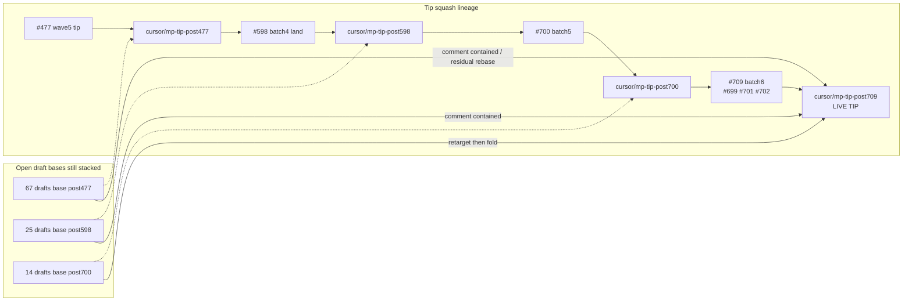

# Open draft triage — post700 / post709 snapshot (2026-10-09)

**Task id:** `q-mp-209`  
**Live tip branch:** `cursor/mp-tip-post709`  
**Tip SHA checked:** `cdd2f8b12e1699d90812016049798480e79c3eeb` (`cdd2f8b12e16`)  
**Tip lineage note:** `post700` squash-landed as tip fold batch 5 (`3320d897` / PR #700); batch 6 (`cdd2f8b12e16` / PR #709) folded #699/#701/#702. Live tip equals that tip SHA (alpha at snapshot time may lag by one squash).  
**Prior triage (stale):** [`open-draft-triage-2026-10-08.md`](./open-draft-triage-2026-10-08.md), [`open-draft-triage-v2.md`](./open-draft-triage-v2.md) — both predate post700/#709.  
**Open PRs enumerated:** 149 (via `gh pr list --state open --limit 200`)  
**Machine-readable twin:** [`open-draft-triage-post700-2026-10-09.json`](./open-draft-triage-post700-2026-10-09.json)  
**Generated (UTC):** 2026-10-09T17:43:17Z  
**Scope:** report only — **do not close PRs** from this triage. Workers may comment `contained` / `superseded` only; tip owner folds into `cursor/*` tips.

## Hard rule (this doc)

> **Do not close PRs.** Prefer comments `contained` or `superseded` (with keeper / tip SHA). Closing remains an Oct-14+ tip-owner / Andrew bulk-close action, not a worker action.

## Summary counts

| Category | Count | Recommended default action |
| --- | ---: | --- |
| CONTAINED | 89 | comment `contained` |
| LIKELY_CONTAINED | 1 | comment `contained` after spot-check |
| SUPERSEDED | 5 | comment `superseded` |
| FOLD (post700 queue) | 14 | retarget → post709, then fold |
| REBASE_THEN_FOLD | 11 | rebase/retarget; fold only unique residual |
| LEAVE_STALE / LEAVE_STALE_STACK / LEAVE_LEGACY | 14 | leave |
| HARD_RULE_HOLD | 15 | leave (do not fold) |
| **Total (each open PR once)** | **149** | |

### Open drafts by tip base

| Tip / base bucket | Open count | Notes |
| --- | ---: | --- |
| `cursor/mp-tip-post709` | 6 | Opened during/after primary snapshot — already on live tip; fold candidates |
| `cursor/mp-tip-post700` | 14 | Primary fold queue onto **post709** (includes #703/#705 called out in ticket) |
| `cursor/mp-tip-post598` | 25 | Nearly all contained via #700 / #709; #687 HOLD leave |
| `cursor/mp-tip-post477` | 67 | Mostly contained via #598 land; few residual report drafts |
| wave5 / integration-fold legacy | 30 | Leave or contained; AI/copy OPTION HOLDs |
| `alpha` | 5 | Hard-rule / promotion HOLDs |
| other legacy | 8 | Deep-playtest / overnight stacks — leave |

**Enumeration note:** Primary classification below covers **149** open PRs at first `gh pr list` pass. A refresh before publish saw **155** open (+6 already based on `cursor/mp-tip-post709`, listed in section A0). No other base-bucket drift required reclassification.

## Tip stack diagram



## Method

1. `gh pr list --repo fuzzywigg/math-pentathlon --state open --limit 200` → **149** open PRs.
2. Live tip `cdd2f8b12e16` on `cursor/mp-tip-post709` (`git fetch origin cursor/mp-tip-post709`).
3. Per PR: fetch `pull/$N/head`, compare GH file list blobs to tip, and match `q-mp-*` task ids to tip fold commit bodies:
   - `#598` / `7922f9af` (batch4 land of post477)
   - `#700` / `3320d897` (batch5)
   - `#709` / `cdd2f8b12e16` (batch6: #699/#701/#702)
4. Duplicate task ids → SUPERSEDED (keeper = highest PR number).
5. Hard-rule HOLD when PR still differs from tip on `ai.ts` / `rules.ts` or player-facing copy/tutorial paths (legacy stacks).
6. **No PR closes, merges, or ready-for-review flips** performed by this task.

## Spot-check: contained via tip folds

| PR | Check | Result |
| ---: | --- | --- |
| #699 | tip log `cdd2f8b12e16` cites fold #699; GH files blob-identical on tip (8/8) | **PASS CONTAINED** |
| #701 | tip log `cdd2f8b12e16` q-mp-168 board-renderer curly; tip has ceiling reconcile after cherry-pick | **PASS CONTAINED** (comment contained; tip blob may be stricter reconcile) |
| #702 | tip log `cdd2f8b12e16` q-mp-162 nnnull shell clear; tip ceilings 268 | **PASS CONTAINED** |
| #674 | #700 body `ci(q-mp-136): consolidate lint job to npm run verify`; tip `package.json` has `verify` script | **PASS CONTAINED** |
| #698 | #700 body lists q-mp-170; GH files 2/2 identical on tip | **PASS CONTAINED** |
| #601 | #598 batch4 lists q-mp-061; tip verify script present | **PASS CONTAINED** |
| #618 | #598 batch4 lists q-mp-052; GH files identical | **PASS CONTAINED** |
| #624 | #598 batch4 lists q-mp-055; GH files identical | **PASS CONTAINED** |
| #667 | #598 batch4 lists q-mp-143; GH files identical | **PASS CONTAINED** |
| #675 | #598 batch4 lists q-mp-133; 81/82 GH paths identical | **PASS CONTAINED** |

## Suggested fold order (post700 queue only)

Retarget each PR base from `cursor/mp-tip-post700` → `cursor/mp-tip-post709` before folding. Concurrent post709 drafts (#719–#724) need no retarget. Do not fold #713 until pointers say **post709**.

| Order | PR | Note |
| ---: | ---: | --- |
| 1 | #711 | q-mp-177: clear check:dev-docs missing-symbol drift in alpha-delta-iso — docs check:dev-docs symbol drift — tiny |
| 2 | #718 | q-mp-179: sync runtime-error-path-audit.md to tip soft-fails — docs runtime-error-path-audit sync — tiny |
| 3 | #708 | q-mp-090d: Oct 9d engineering backlog round 4 (≥20 tasks) for tip post — docs backlog round 4 — report-only |
| 4 | #710 | q-mp-176: Delete Rank-1 dead CSS `.game-card-division` — dead CSS Rank-1 delete — small |
| 5 | #717 | q-mp-187: demote unused tablet-gl exports (knip unusedExports) — demote unused tablet-gl exports |
| 6 | #712 | q-mp-188: deduplicate tests/helpers/rng seeded-random aliases — rng helper dedupe — tests only |
| 7 | #716 | q-mp-178: clear residual 13 missing-path stubs (post-#700) — docs missing-path stubs clear |
| 8 | #703 | q-mp-157: ratchet @typescript-eslint/no-shadow (ceiling 13) — lint ratchet no-shadow |
| 9 | #705 | q-mp-159: hard-enable prefer-object-has-own (debt 0) — lint hard-enable prefer-object-has-own |
| 10 | #714 | q-mp-184: clear prefer-nullish-coalescing in fraction-bar-ui (−18) — lint nullish in fraction-bar-ui |
| 11 | #715 | q-mp-196: UI coverage round 9 — coldest src/ui/owl characterization — UI coverage owl characterization |
| 12 | #706 | q-mp-163: trim juggle / par-55 / remainder-islands gzip NEW OVER chunk — bundle trim NEW OVER chunks — size-sensitive |
| 13 | #707 | q-mp-142: shard CI unit job by vitest project matrix — CI unit shards — workflow change; keep permissions:contents:read |
| 14 | #713 | q-mp-198: re-anchor AGENTS.md + wiki tip pointers to cursor/mp-tip-pos — tip pointer re-anchor — update targets to post709 before fold |

### Explicitly do **not** fold next

- **#687** (`q-mp-135` Star Track p95) — tip-owner HOLD / harness wait; leave.
- **Hard-rule HOLD** alpha/legacy AI/copy/rules drafts (#393/#394/#418/#419/#428/#429/#468/#487/#488/#537/#557/#559/#560).
- **Already contained** post598/#477 stacks — comment `contained` only.

## Duplicate-task SUPERSEDED (comment only)

| Older PR | Keeper | Task |
| ---: | ---: | --- |
| #603 | #620 | `q-mp-080` |
| #604 | #621 | `q-mp-074` |
| #609 | #612 | `q-mp-071` |
| #669 | #672 | `q-mp-128` |
| #671 | #672 | `q-mp-128` |

## Comment templates (workers)

**Contained**

```text
contained — landed on tip cursor/mp-tip-post709 @ TIP_SHA via fold REF (q-mp-209 triage). Do not close from worker; tip owner / Oct-14 bulk-close owns closure.
```

**Superseded**

```text
superseded by #KEEPER (same q-mp task). Per q-mp-209 open-draft triage — comment only; do not close from worker.
```

---

## A0. Base `cursor/mp-tip-post709` (live tip — concurrent drafts after primary snapshot)

*6 open drafts* — already correctly based; tip owner can fold without retarget. Not included in the 149-row category totals above.

| PR | Title | Base | Head branch | Category | Recommendation |
| ---: | --- | --- | --- | --- | --- |
| #719 | q-mp-203: Wiki gallery — embed docs/visuals/2026-10 start/mid shots | `cursor/mp-tip-post709` | `cursor/q-mp-203-wiki-gallery-2899` | FOLD | fold on live tip |
| #720 | q-mp-208: Clear no-promise-executor-return leftover in owl-system.ts (−1) | `cursor/mp-tip-post709` | `cursor/q-mp-208-owl-promise-executor-5755` | FOLD | fold on live tip |
| #721 | q-mp-200: remeasure bundle-over after tip #700 (par-55 +1.18 kB) | `cursor/mp-tip-post709` | `cursor/q-mp-200-bundle-over-remeasure-208a` | FOLD | fold on live tip |
| #722 | q-mp-185: clear prefer-nullish-coalescing in highlight-ui (−11) | `cursor/mp-tip-post709` | `cursor/q-mp-185-nullish-highlight-ui-5c51` | FOLD | fold on live tip |
| #723 | q-mp-197: cut owl-component layout-forcing getBoundingClientRect reads | `cursor/mp-tip-post709` | `cursor/q-mp-197-owl-layout-reads-18b0` | FOLD | fold on live tip |
| #724 | q-mp-201: engine coverage round 5 — clear remaining round-1/2 it.todo | `cursor/mp-tip-post709` | `cursor/q-mp-201-engine-cov-r5-0c27` | FOLD | fold on live tip |

## A. Base `cursor/mp-tip-post700` (primary next fold queue onto post709)

*14 open drafts*

| PR | Title | Base | Head | GH files | Tip blob ratio | Category | Recommendation | Evidence |
| ---: | --- | --- | --- | ---: | ---: | --- | --- | --- |
| #703 | q-mp-157: ratchet @typescript-eslint/no-shadow (ceiling 13) | `cursor/mp-tip-post700` | `5dcf4efc79b5` | 4 | 0.0 | FOLD | **fold** — Retarget base to `cursor/mp-tip-post709`, then tip owner folds | retarget base→post709 then fold; GH files=4, tip_diff=4; unique vs base; 4 files; 4 still differ from tip; retarget base |
| #705 | q-mp-159: hard-enable prefer-object-has-own (debt 0) | `cursor/mp-tip-post700` | `cf7aa6cfdc21` | 4 | 0.0 | FOLD | **fold** — Retarget base to `cursor/mp-tip-post709`, then tip owner folds | retarget base→post709 then fold; GH files=4, tip_diff=4; unique vs base; 4 files; 4 still differ from tip; retarget base |
| #706 | q-mp-163: trim juggle / par-55 / remainder-islands gzip NEW OVER chunks | `cursor/mp-tip-post700` | `67f47f87abc1` | 6 | 0.0 | FOLD | **fold** — Retarget base to `cursor/mp-tip-post709`, then tip owner folds | retarget base→post709 then fold; GH files=6, tip_diff=6; unique vs base; 6 files; 6 still differ from tip; retarget base |
| #707 | q-mp-142: shard CI unit job by vitest project matrix | `cursor/mp-tip-post700` | `7f00af01e53b` | 8 | 0.0 | FOLD | **fold** — Retarget base to `cursor/mp-tip-post709`, then tip owner folds | retarget base→post709 then fold; GH files=8, tip_diff=8; unique vs base; 8 files; 8 still differ from tip; retarget base |
| #708 | q-mp-090d: Oct 9d engineering backlog round 4 (≥20 tasks) for tip post700 | `cursor/mp-tip-post700` | `d867a0aef7a6` | 1 | 0.0 | FOLD | **fold** — Retarget base to `cursor/mp-tip-post709`, then tip owner folds | retarget base→post709 then fold; GH files=1, tip_diff=1; unique vs base; 1 files; 1 still differ from tip; retarget base |
| #710 | q-mp-176: Delete Rank-1 dead CSS `.game-card-division` | `cursor/mp-tip-post700` | `0e695dde80e6` | 3 | 0.0 | FOLD | **fold** — Retarget base to `cursor/mp-tip-post709`, then tip owner folds | retarget base→post709 then fold; GH files=3, tip_diff=3; unique vs base; 3 files; 3 still differ from tip; retarget base |
| #711 | q-mp-177: clear check:dev-docs missing-symbol drift in alpha-delta-isolation | `cursor/mp-tip-post700` | `27cfd02b416b` | 1 | 0.0 | FOLD | **fold** — Retarget base to `cursor/mp-tip-post709`, then tip owner folds | retarget base→post709 then fold; GH files=1, tip_diff=1; unique vs base; 1 files; 1 still differ from tip; retarget base |
| #712 | q-mp-188: deduplicate tests/helpers/rng seeded-random aliases | `cursor/mp-tip-post700` | `5ef9644b534e` | 9 | 0.0 | FOLD | **fold** — Retarget base to `cursor/mp-tip-post709`, then tip owner folds | retarget base→post709 then fold; GH files=9, tip_diff=9; unique vs base; 9 files; 9 still differ from tip; retarget base |
| #713 | q-mp-198: re-anchor AGENTS.md + wiki tip pointers to cursor/mp-tip-post700 | `cursor/mp-tip-post700` | `57f0150f4781` | 2 | 0.0 | FOLD | **fold** — Retarget base to `cursor/mp-tip-post709`, then tip owner folds | retarget base→post709 then fold; GH files=2, tip_diff=2; unique vs base; 2 files; 2 still differ from tip; retarget base |
| #714 | q-mp-184: clear prefer-nullish-coalescing in fraction-bar-ui (−18) | `cursor/mp-tip-post700` | `83421bff3ea5` | 3 | 0.0 | FOLD | **fold** — Retarget base to `cursor/mp-tip-post709`, then tip owner folds | retarget base→post709 then fold; GH files=3, tip_diff=3; unique vs base; 3 files; 3 still differ from tip; retarget base |
| #715 | q-mp-196: UI coverage round 9 — coldest src/ui/owl characterization | `cursor/mp-tip-post700` | `55c927e7484e` | 4 | 0.0 | FOLD | **fold** — Retarget base to `cursor/mp-tip-post709`, then tip owner folds | retarget base→post709 then fold; GH files=4, tip_diff=4; unique vs base; 4 files; 4 still differ from tip; retarget base |
| #716 | q-mp-178: clear residual 13 missing-path stubs (post-#700) | `cursor/mp-tip-post700` | `548d93d7c2f9` | 4 | 0.0 | FOLD | **fold** — Retarget base to `cursor/mp-tip-post709`, then tip owner folds | retarget base→post709 then fold; GH files=4, tip_diff=4; unique vs base; 4 files; 4 still differ from tip; retarget base |
| #717 | q-mp-187: demote unused tablet-gl exports (knip unusedExports) | `cursor/mp-tip-post700` | `acd8be7f4918` | 3 | 0.0 | FOLD | **fold** — Retarget base to `cursor/mp-tip-post709`, then tip owner folds | retarget base→post709 then fold; GH files=3, tip_diff=3; unique vs base; 3 files; 3 still differ from tip; retarget base |
| #718 | q-mp-179: sync runtime-error-path-audit.md to tip soft-fails | `cursor/mp-tip-post700` | `04c8ddab8cd5` | 1 | 0.0 | FOLD | **fold** — Retarget base to `cursor/mp-tip-post709`, then tip owner folds | retarget base→post709 then fold; GH files=1, tip_diff=1; unique vs base; 1 files; 1 still differ from tip; retarget base |

## B. Base `cursor/mp-tip-post598` (post-#700 / #709)

*25 open drafts*

| PR | Title | Base | Head | GH files | Tip blob ratio | Category | Recommendation | Evidence |
| ---: | --- | --- | --- | ---: | ---: | --- | --- | --- |
| #674 | q-mp-136: consolidate CI lint job to npm run verify | `cursor/mp-tip-post598` | `dde2f97a5d45` | 755 | 0.842 | CONTAINED | **comment_contained** — Comment `contained` (do not close from worker) | #700 (batch5) q-mp-136 |
| #678 | q-mp-139: Remove unused fake-timers test helper | `cursor/mp-tip-post598` | `901e92bb46de` | 752 | 0.842 | CONTAINED | **comment_contained** — Comment `contained` (do not close from worker) | #700 (batch5) |
| #679 | q-mp-140: ratchet @typescript-eslint/prefer-nullish-coalescing (ceiling 96) | `cursor/mp-tip-post598` | `4a1d0d04bc4a` | 752 | 0.842 | CONTAINED | **comment_contained** — Comment `contained` (do not close from worker) | #700 (batch5) |
| #680 | q-mp-134: cut par-55 layout-forcing DOM reads (board-ui/sync) | `cursor/mp-tip-post598` | `18c1b08bf418` | 753 | 0.845 | CONTAINED | **comment_contained** — Comment `contained` (do not close from worker) | #700 (batch5) |
| #681 | q-mp-137: CI report-only check:copy-pins step (continue-on-error) | `cursor/mp-tip-post598` | `6ef785412f5b` | 752 | 0.843 | CONTAINED | **comment_contained** — Comment `contained` (do not close from worker) | #700 (batch5) |
| #682 | q-mp-147: brace no-confusing-void-expression in game-route-mounts (−40) | `cursor/mp-tip-post598` | `74b9c7fd22ba` | 753 | 0.842 | CONTAINED | **comment_contained** — Comment `contained` (do not close from worker) | #700 (batch5) |
| #683 | q-mp-150: clear three/ no-non-null-assertion (−23 ceiling) | `cursor/mp-tip-post598` | `166a8589796d` | 753 | 0.846 | CONTAINED | **comment_contained** — Comment `contained` (do not close from worker) | #700 (batch5) |
| #684 | q-mp-145: post-destroy memory tip re-run + clear AI timer leaks on destroy | `cursor/mp-tip-post598` | `9612d4c73df6` | 753 | 0.846 | CONTAINED | **comment_contained** — Comment `contained` (do not close from worker) | #700 (batch5) |
| #685 | q-mp-148: prefer-optional-chain non-HOLD clear + ratchet ceiling 21 | `cursor/mp-tip-post598` | `d1e4846ba8e4` | 754 | 0.841 | CONTAINED | **comment_contained** — Comment `contained` (do not close from worker) | #700 (batch5) |
| #686 | q-mp-149: UI coverage round 7 — controllers destroy/remount characterization | `cursor/mp-tip-post598` | `b3063b7ccbf0` | 755 | 0.842 | CONTAINED | **comment_contained** — Comment `contained` (do not close from worker) | #700 (batch5) |
| #687 | q-mp-135: Star Track move p95 — 3D layout trim + tip-owner HOLD (harness wait) | `cursor/mp-tip-post598` | `741c497a3e9c` | 754 | 0.838 | LEAVE_STALE_STACK | **leave** — Leave — tip-stack pollution / HOLD; tip owner cherry-pick only if unique | GH file list 754 (tip-stack pollution vs squash tip); leave unless tip owner cherry-picks unique commits; stale tip base |
| #688 | q-mp-146: Chromium lifecycle visuals (menu → mount → ← Games → crash boundary) | `cursor/mp-tip-post598` | `872393a97154` | 759 | 0.847 | CONTAINED | **comment_contained** — Comment `contained` (do not close from worker) | #700 (batch5) |
| #689 | q-mp-090c: Oct 9c engineering backlog (≥20 tasks) for tip refill | `cursor/mp-tip-post598` | `97c75d13ee38` | 753 | 0.842 | CONTAINED | **comment_contained** — Comment `contained` (do not close from worker) | #700 (batch5) |
| #690 | q-mp-154: Remove Rank-1 dead CSS `.calla-teaching-hint` + `.sd-hands-container` | `cursor/mp-tip-post598` | `36c61a273b08` | 761 | 0.845 | CONTAINED | **comment_contained** — Comment `contained` (do not close from worker) | #700 (batch5) |
| #691 | q-mp-166: Deduplicate e2e dismissOwl / dismissOwlIfNeeded helpers | `cursor/mp-tip-post598` | `7671db8c9eda` | 764 | 0.847 | CONTAINED | **comment_contained** — Comment `contained` (do not close from worker) | #700 (batch5) |
| #692 | q-mp-172: document size:check NEW OVER state (table + Mermaid) | `cursor/mp-tip-post598` | `583665ebea33` | 762 | 0.845 | CONTAINED | **comment_contained** — Comment `contained` (do not close from worker) | #700 (batch5) |
| #693 | q-mp-165: AI-timing CI-skip bench inventory (HOLD Hex Hard 450ms) | `cursor/mp-tip-post598` | `51f248c3e0bc` | 762 | 0.844 | CONTAINED | **comment_contained** — Comment `contained` (do not close from worker) | #700 (batch5) |
| #694 | q-mp-164: clear check:dev-docs missing-path stubs (docs/dev) | `cursor/mp-tip-post598` | `65ed17bcc18b` | 768 | 0.85 | CONTAINED | **comment_contained** — Comment `contained` (do not close from worker) | #700 (batch5) |
| #695 | q-mp-155: demote unused clearDom test-helper export | `cursor/mp-tip-post598` | `4a3d06750516` | 807 | 0.926 | CONTAINED | **comment_contained** — Comment `contained` (do not close from worker) | #700 (batch5) |
| #696 | q-mp-175: Wiki CI unit budget + AI-bench skip diagram/screenshot | `cursor/mp-tip-post598` | `c19dab21a0af` | 811 | 0.928 | CONTAINED | **comment_contained** — Comment `contained` (do not close from worker) | #700 (batch5) |
| #697 | q-mp-141: ratchet @typescript-eslint/switch-exhaustiveness-check (ceiling 8) | `cursor/mp-tip-post598` | `03fff4dd12ff` | 4 | 0.0 | CONTAINED | **comment_contained** — Comment `contained` (do not close from worker) | #700 (batch5) |
| #698 | q-mp-170: Triage knip unusedTypes drift + document unlisted/duplicates | `cursor/mp-tip-post598` | `c504f1736068` | 2 | 1.0 | CONTAINED | **comment_contained** — Comment `contained` (do not close from worker) | #700 (batch5) |
| #699 | q-mp-167: UI coverage round 8 — coldest src/ui/three characterization | `cursor/mp-tip-post598` | `4a70a2ef4e23` | 8 | 1.0 | CONTAINED | **comment_contained** — Comment `contained` (do not close from worker) | #709 (batch6) |
| #701 | q-mp-168: curly:all leftover kings-quadraphages/board-renderer.ts (−1) | `cursor/mp-tip-post598` | `9c908344d4af` | 2 | 0.0 | CONTAINED | **comment_contained** — Comment `contained` (do not close from worker) | #709 (batch6) |
| #702 | q-mp-162: clear games shell no-non-null-assertion (−45 ceiling) | `cursor/mp-tip-post598` | `17d248b5d1ae` | 13 | 0.846 | CONTAINED | **comment_contained** — Comment `contained` (do not close from worker) | #709 (batch6) |

## C. Base `cursor/mp-tip-post477`

*67 open drafts*

| PR | Title | Base | Head | GH files | Tip blob ratio | Category | Recommendation | Evidence |
| ---: | --- | --- | --- | ---: | ---: | --- | --- | --- |
| #601 | q-mp-061: add npm run verify (CI lint-job chain) | `cursor/mp-tip-post477` | `b470cb147e72` | 3 | 0.0 | CONTAINED | **comment_contained** — Comment `contained` (do not close from worker) | #598 (batch4 land) |
| #602 | q-mp-083: add agent-task GitHub issue template | `cursor/mp-tip-post477` | `144261c00890` | 1 | 1.0 | CONTAINED | **comment_contained** — Comment `contained` (do not close from worker) | #598 (batch4 land) |
| #603 | q-mp-080: align developer setup/test commands with package.json | `cursor/mp-tip-post477` | `351d9f4690cc` | 4 | 0.25 | SUPERSEDED | **comment_superseded** — Comment `superseded` by keeper (do not close from worker) | duplicate task q-mp-080; keep #620 |
| #604 | q-mp-074: ratchet ceiling history SVG + markdown table | `cursor/mp-tip-post477` | `89b84d2e882c` | 5 | 0.8 | SUPERSEDED | **comment_superseded** — Comment `superseded` by keeper (do not close from worker) | duplicate task q-mp-074; keep #621 |
| #605 | q-mp-045: ratchet @typescript-eslint/no-non-null-assertion (ceiling 387) | `cursor/mp-tip-post477` | `9ec0b667be82` | 4 | 0.0 | CONTAINED | **comment_contained** — Comment `contained` (do not close from worker) | #598 (batch4 land) |
| #606 | q-mp-062: clear Vite circular-chunk and size warnings | `cursor/mp-tip-post477` | `d20832146ee2` | 3 | 1.0 | CONTAINED | **comment_contained** — Comment `contained` (do not close from worker) | #598 (batch4 land) |
| #607 | q-mp-009: burn-1008 report-only draft index | `cursor/mp-tip-post477` | `5004e0088a3c` | 1 | 0.0 | CONTAINED | **comment_contained** — Comment `contained` (do not close from worker) | #598 (batch4 land) |
| #608 | q-mp-043: curly:all braces in src/games/*/board-ui.ts (−57 ceiling) | `cursor/mp-tip-post477` | `970139647dff` | 17 | 0.059 | CONTAINED | **comment_contained** — Comment `contained` (do not close from worker) | #598 (batch4 land) |
| #609 | q-mp-071: iPad start + mid HvH visuals into docs/visuals/2026-10/ | `cursor/mp-tip-post477` | `c4de1eae28d1` | 43 | 0.977 | SUPERSEDED | **comment_superseded** — Comment `superseded` by keeper (do not close from worker) | duplicate task q-mp-071; keep #612 |
| #610 | q-mp-054: forced-colors / reduced-motion / color-scheme triage | `cursor/mp-tip-post477` | `befafa43148e` | 12 | 0.25 | CONTAINED | **comment_contained** — Comment `contained` (do not close from worker) | #598 (batch4 land) |
| #612 | q-mp-071: iPad start + HvH mid visuals into docs/visuals/2026-10/ | `cursor/mp-tip-post477` | `a470b1e178ef` | 43 | 0.0 | CONTAINED | **comment_contained** — Comment `contained` (do not close from worker) | #598 (batch4 land) |
| #613 | q-mp-053: WCAG 1.4.4/1.4.10 zoom-reflow CSS triage (tip post-#477) | `cursor/mp-tip-post477` | `9140b00926da` | 3 | 1.0 | CONTAINED | **comment_contained** — Comment `contained` (do not close from worker) | #598 (batch4 land) |
| #614 | q-mp-090: Oct 9 engineering backlog (≥20 tasks) for tip refill | `cursor/mp-tip-post477` | `90039fb6c7d3` | 1 | 0.0 | CONTAINED | **comment_contained** — Comment `contained` (do not close from worker) | #598 (batch4 land) |
| #615 | q-mp-051: triage e2e-fullgame failures (kings/juggle/pent harness) | `cursor/mp-tip-post477` | `7ecedd8669c0` | 4 | 0.75 | REBASE_THEN_FOLD | **fold_after_rebase** — Retarget/rebase onto post709; fold only if unique residual remains | stale tip base post477; 1/4 paths still differ from tip; rebase onto post709 before fold |
| #616 | q-mp-025: compliance review 10a of evening drafts #589–#600 | `cursor/mp-tip-post477` | `b1d95c8fd103` | 1 | 1.0 | CONTAINED | **comment_contained** — Comment `contained` (do not close from worker) | #598 (batch4 land) |
| #617 | q-mp-033: cross-browser WebGL 2D fallback assert, WebKit CSP noise filter, sum-dominoes flake | `cursor/mp-tip-post477` | `34442844891a` | 16 | 0.875 | CONTAINED | **comment_contained** — Comment `contained` (do not close from worker) | #598 (batch4 land) |
| #618 | q-mp-052: triage mobile-touch (iPhone 13 / Pixel 7 / iPad) on tip | `cursor/mp-tip-post477` | `4b972f6be8a4` | 4 | 1.0 | CONTAINED | **comment_contained** — Comment `contained` (do not close from worker) | #598 (batch4 land) |
| #619 | q-mp-064: report-only check:copy-pins for player-facing text pins | `cursor/mp-tip-post477` | `93743ea01ec3` | 5 | 0.2 | CONTAINED | **comment_contained** — Comment `contained` (do not close from worker) | #598 (batch4 land) |
| #620 | q-mp-080: align developer setup/test commands with package.json | `cursor/mp-tip-post477` | `53076753a0b2` | 4 | 0.0 | CONTAINED | **comment_contained** — Comment `contained` (do not close from worker) | #598 (batch4 land) |
| #621 | q-mp-074: ratchet ceiling history SVG + markdown table | `cursor/mp-tip-post477` | `a06cac53bb87` | 5 | 0.0 | CONTAINED | **comment_contained** — Comment `contained` (do not close from worker) | #598 (batch4 land) |
| #622 | q-mp-059: PWA manifest + offline/WebKit probes on tip post477 | `cursor/mp-tip-post477` | `3beb0dd249f5` | 4 | 1.0 | CONTAINED | **comment_contained** — Comment `contained` (do not close from worker) | #598 (batch4 land) |
| #623 | q-mp-057: post-#477 axe/keyboard/SR/console re-sweep — ≤5 ARIA/focus/44px fixes | `cursor/mp-tip-post477` | `bf88c3caeb99` | 6 | 0.667 | CONTAINED | **comment_contained** — Comment `contained` (do not close from worker) | #598 (batch4 land) |
| #624 | q-mp-055: visual-baseline triage — expected AI/copy restore diffs vs regressions | `cursor/mp-tip-post477` | `c97808219fe7` | 1 | 1.0 | CONTAINED | **comment_contained** — Comment `contained` (do not close from worker) | #598 (batch4 land) |
| #625 | q-mp-058: tip re-audit runtime/render/memory/bundle vs Oct 7–8 (+ ramrod gzip fix) | `cursor/mp-tip-post477` | `95fae03bf5f8` | 11 | 0.727 | CONTAINED | **comment_contained** — Comment `contained` (do not close from worker) | #598 (batch4 land) |
| #626 | q-mp-027: compliance review 10b of tip drafts #601–#625 | `cursor/mp-tip-post477` | `a5427cd18989` | 1 | 0.0 | REBASE_THEN_FOLD | **fold_after_rebase** — Retarget/rebase onto post709; fold only if unique residual remains | stale tip base post477; 1/1 paths still differ from tip; rebase onto post709 before fold |
| #627 | q-mp-010: landing preflight v4 tip→alpha GO at 6dc4afa0 (report-only) | `cursor/mp-tip-post477` | `da96b455ac25` | 1 | 0.0 | REBASE_THEN_FOLD | **fold_after_rebase** — Retarget/rebase onto post709; fold only if unique residual remains | stale tip base post477; 1/1 paths still differ from tip; rebase onto post709 before fold |
| #628 | q-mp-031b: alpha-push deploy land checklist (Fri 1:31 PM ET, report-only) | `cursor/mp-tip-post477` | `64a7cf7fd133` | 1 | 0.0 | REBASE_THEN_FOLD | **fold_after_rebase** — Retarget/rebase onto post709; fold only if unique residual remains | stale tip base post477; 1/1 paths still differ from tip; rebase onto post709 before fold |
| #629 | q-mp-029: tip AI/copy/rules recheck vs alpha at c5927c13 (report-only) | `cursor/mp-tip-post477` | `cd2ac9fbc3be` | 1 | 0.0 | REBASE_THEN_FOLD | **fold_after_rebase** — Retarget/rebase onto post709; fold only if unique residual remains | stale tip base post477; 1/1 paths still differ from tip; rebase onto post709 before fold |
| #630 | q-mp-030b: Hex Hard 450ms + Stars & Bars history-cap absent (report-only) | `cursor/mp-tip-post477` | `901f0bd16b90` | 1 | 0.0 | REBASE_THEN_FOLD | **fold_after_rebase** — Retarget/rebase onto post709; fold only if unique residual remains | stale tip base post477; 1/1 paths still differ from tip; rebase onto post709 before fold |
| #631 | q-mp-028: midfold tip snapshot (SHA + check-runs + remaining WIP) | `cursor/mp-tip-post477` | `3ea1715b2218` | 1 | 0.0 | REBASE_THEN_FOLD | **fold_after_rebase** — Retarget/rebase onto post709; fold only if unique residual remains | stale tip base post477; 1/1 paths still differ from tip; rebase onto post709 before fold |
| #632 | q-mp-106: unit coverage for src/ui/inject-styles.ts | `cursor/mp-tip-post477` | `feaa2414a239` | 1 | 1.0 | CONTAINED | **comment_contained** — Comment `contained` (do not close from worker) | #598 (batch4 land) |
| #633 | q-mp-104: delete eight dead re-export barrels (dead_barrels 8→0) | `cursor/mp-tip-post477` | `f1264e113111` | 356 | 0.831 | CONTAINED | **comment_contained** — Comment `contained` (do not close from worker) | #598 (batch4 land) |
| #634 | q-mp-100: fix engine-doc missing test paths (check:dev-docs) | `cursor/mp-tip-post477` | `a042ff3e77db` | 3 | 1.0 | CONTAINED | **comment_contained** — Comment `contained` (do not close from worker) | #598 (batch4 land) |
| #635 | q-mp-108: soft-fail missing #app boot (R-SHELL-01) | `cursor/mp-tip-post477` | `13c3df50e22c` | 3 | 0.0 | CONTAINED | **comment_contained** — Comment `contained` (do not close from worker) | #598 (batch4 land) |
| #636 | q-mp-110: trim game-ramrod gzip OVER (0 OVER size:check) | `cursor/mp-tip-post477` | `613bd19737e5` | 2 | 0.5 | CONTAINED | **comment_contained** — Comment `contained` (do not close from worker) | #598 (batch4 land) |
| #637 | q-mp-107: home/menu error boundary (R-SHELL-04) | `cursor/mp-tip-post477` | `eaabf334d0b4` | 4 | 0.0 | CONTAINED | **comment_contained** — Comment `contained` (do not close from worker) | #598 (batch4 land) |
| #638 | q-mp-102: implement destroyGame cleanup for juggle/fab-a-diffy/sum-dominoes | `cursor/mp-tip-post477` | `09cb525cebac` | 4 | 0.25 | CONTAINED | **comment_contained** — Comment `contained` (do not close from worker) | #598 (batch4 land) |
| #639 | q-mp-027c: compliance review 10c of burn-1009 drafts #632–#638 | `cursor/mp-tip-post477` | `0bda6cee5df8` | 1 | 0.0 | REBASE_THEN_FOLD | **fold_after_rebase** — Retarget/rebase onto post709; fold only if unique residual remains | stale tip base post477; 1/1 paths still differ from tip; rebase onto post709 before fold |
| #641 | q-mp-109: swallow registration.update() rejection (R-SW-03) | `cursor/mp-tip-post477` | `c6123dd3dae1` | 4 | 0.5 | REBASE_THEN_FOLD | **fold_after_rebase** — Retarget/rebase onto post709; fold only if unique residual remains | stale tip base post477; 2/4 paths still differ from tip; rebase onto post709 before fold |
| #642 | q-mp-117: isolate ui-helper-dedupe generation-timeout flake | `cursor/mp-tip-post477` | `332d3e86e49d` | 3 | 1.0 | CONTAINED | **comment_contained** — Comment `contained` (do not close from worker) | #598 (batch4 land) |
| #643 | q-mp-115: extend check:dev-docs beyond docs/dev/engines/ | `cursor/mp-tip-post477` | `216a1a999d25` | 1 | 1.0 | CONTAINED | **comment_contained** — Comment `contained` (do not close from worker) | #598 (batch4 land) |
| #644 | q-mp-105: split mixed UI dice barrel (mixed_ui_barrels 1→0) | `cursor/mp-tip-post477` | `5741a8292bab` | 74 | 0.959 | CONTAINED | **comment_contained** — Comment `contained` (do not close from worker) | #598 (batch4 land) |
| #645 | q-mp-103: curly:all braces in src/games/*/game-controller.ts (−200 ceiling) | `cursor/mp-tip-post477` | `03eb1eeeaf09` | 21 | 0.429 | CONTAINED | **comment_contained** — Comment `contained` (do not close from worker) | #598 (batch4 land) |
| #646 | q-mp-118: report-only knip unused-export drift CI job | `cursor/mp-tip-post477` | `5e7dc96af759` | 7 | 0.286 | CONTAINED | **comment_contained** — Comment `contained` (do not close from worker) | #598 (batch4 land) |
| #647 | q-mp-034: cross-game destroy/remount contract (20 games) + 5 stub fixes | `cursor/mp-tip-post477` | `c050891a0c41` | 6 | 0.167 | CONTAINED | **comment_contained** — Comment `contained` (do not close from worker) | #598 (batch4 land) |
| #648 | q-mp-111: UI coverage round 6 — next lowest non-engine modules | `cursor/mp-tip-post477` | `19fd9d0fe9a6` | 5 | 1.0 | CONTAINED | **comment_contained** — Comment `contained` (do not close from worker) | #598 (batch4 land) |
| #649 | q-mp-120: soft-fail tryGameStateFromJSON (R-JSON-04) | `cursor/mp-tip-post477` | `bd8b33d8d36d` | 4 | 0.25 | CONTAINED | **comment_contained** — Comment `contained` (do not close from worker) | #598 (batch4 land) |
| #650 | q-mp-119: demote Rank-2 unused test-helper exports | `cursor/mp-tip-post477` | `41a7be4ade0d` | 12 | 0.583 | CONTAINED | **comment_contained** — Comment `contained` (do not close from worker) | #598 (batch4 land) |
| #651 | q-mp-114: menu-home axe landmark-unique hard-zero ratchet | `cursor/mp-tip-post477` | `76cc5af91784` | 1 | 1.0 | CONTAINED | **comment_contained** — Comment `contained` (do not close from worker) | #598 (batch4 land) |
| #652 | q-mp-123: report-only size:check known-OVER allowlist ratchet | `cursor/mp-tip-post477` | `dc8fc3a7867d` | 5 | 0.8 | CONTAINED | **comment_contained** — Comment `contained` (do not close from worker) | #598 (batch4 land) |
| #653 | q-mp-122: document injectStyles / board CSS ownership + Contig screenshot | `cursor/mp-tip-post477` | `f23bce77dab4` | 5 | 0.6 | CONTAINED | **comment_contained** — Comment `contained` (do not close from worker) | #598 (batch4 land) |
| #656 | q-mp-084: consolidate duplicated test helpers (mountPair, RAF, click, storage) | `cursor/mp-tip-post477` | `f99995e9ab9b` | 26 | 1.0 | CONTAINED | **comment_contained** — Comment `contained` (do not close from worker) | #598 (batch4 land) |
| #657 | q-mp-090b: Oct 9b engineering backlog (≥20 tasks) for tip refill | `cursor/mp-tip-post477` | `f7b9a0e09822` | 1 | 0.0 | REBASE_THEN_FOLD | **fold_after_rebase** — Retarget/rebase onto post709; fold only if unique residual remains | stale tip base post477; 1/1 paths still differ from tip; rebase onto post709 before fold |
| #664 | q-mp-125: curly:all braces in src/core/** (−38 ceiling) | `cursor/mp-tip-post477` | `9311499fa5e6` | 5 | 0.8 | CONTAINED | **comment_contained** — Comment `contained` (do not close from worker) | #598 (batch4 land) |
| #665 | q-mp-127: ratchet no-duplicate-imports (ceiling 124) | `cursor/mp-tip-post477` | `bc2c575986b6` | 4 | 0.0 | CONTAINED | **comment_contained** — Comment `contained` (do not close from worker) | #598 (batch4 land) |
| #666 | q-mp-131: clear board-ui no-non-null-assertion (−42 ceiling) | `cursor/mp-tip-post477` | `db6d8c60e911` | 15 | 0.667 | CONTAINED | **comment_contained** — Comment `contained` (do not close from worker) | #598 (batch4 land) |
| #667 | q-mp-143: engine coverage round 4 — clear round-3 it.todo arms | `cursor/mp-tip-post477` | `b37bcea56b59` | 2 | 1.0 | CONTAINED | **comment_contained** — Comment `contained` (do not close from worker) | #598 (batch4 land) |
| #668 | q-mp-144: mutation audit UI wave 4 — game-selector, compat, tutorial (tests-only) | `cursor/mp-tip-post477` | `9579ba02a613` | 6 | 1.0 | CONTAINED | **comment_contained** — Comment `contained` (do not close from worker) | #598 (batch4 land) |
| #669 | q-mp-128: ratchet @typescript-eslint/no-confusing-void-expression (ceiling 230) | `cursor/mp-tip-post477` | `5e98001ae2ce` | 4 | 0.0 | SUPERSEDED | **comment_superseded** — Comment `superseded` by keeper (do not close from worker) | duplicate task q-mp-128; keep #672 |
| #670 | q-mp-138: docs Vite mp3d↔game circular-chunk packaging smell | `cursor/mp-tip-post477` | `ae68bdae125f` | 3 | 0.333 | CONTAINED | **comment_contained** — Comment `contained` (do not close from worker) | #598 (batch4 land) |
| #671 | q-mp-128: ratchet @typescript-eslint/no-confusing-void-expression (ceiling 230) | `cursor/mp-tip-post477` | `4e1ccb30ca22` | 4 | 0.0 | SUPERSEDED | **comment_superseded** — Comment `superseded` by keeper (do not close from worker) | duplicate task q-mp-128; keep #672 |
| #672 | q-mp-128: ratchet @typescript-eslint/no-confusing-void-expression (ceiling 230) | `cursor/mp-tip-post477` | `11a554b75741` | 4 | 0.0 | CONTAINED | **comment_contained** — Comment `contained` (do not close from worker) | #598 (batch4 land) |
| #673 | q-mp-130: fix dice-demo radix + HOLD kwatro residuals (ceiling 6) | `cursor/mp-tip-post477` | `654e73fd8d0b` | 5 | 0.2 | CONTAINED | **comment_contained** — Comment `contained` (do not close from worker) | #598 (batch4 land) |
| #675 | q-mp-133: quarantine production-dead src/core/hex to tests/helpers/core-hex | `cursor/mp-tip-post477` | `93f62fc4c00c` | 82 | 0.988 | CONTAINED | **comment_contained** — Comment `contained` (do not close from worker) | #598 (batch4 land) |
| #676 | q-mp-126: curly:all braces in src/main.ts (−18 ceiling) | `cursor/mp-tip-post477` | `1f943926474e` | 2 | 0.0 | CONTAINED | **comment_contained** — Comment `contained` (do not close from worker) | #598 (batch4 land) |
| #677 | q-mp-129: clear non-HOLD default-case sites + ratchet residual (ceiling 6) | `cursor/mp-tip-post477` | `ab8b4d95be83` | 12 | 0.5 | CONTAINED | **comment_contained** — Comment `contained` (do not close from worker) | #598 (batch4 land) |
| #704 | q-mp-151: AI-timing flake inventory (report-only) | `cursor/mp-tip-post477` | `f2140e2b6669` | 1 | 0.0 | REBASE_THEN_FOLD | **fold_after_rebase** — Retarget/rebase onto post709; fold only if unique residual remains | stale tip base post477; 1/1 paths still differ from tip; rebase onto post709 before fold |

## D. Wave5 / integration-fold legacy bases

*30 open drafts*

| PR | Title | Base | Head | GH files | Tip blob ratio | Category | Recommendation | Evidence |
| ---: | --- | --- | --- | ---: | ---: | --- | --- | --- |
| #488 | fix(ai): tip AI difficulty recheck — FIAR/Pent Hard≥Easy (draft) | `cursor/integration-fold-wave4-tip-36e4` | `889f02694d58` | — | 0.3 | HARD_RULE_HOLD | **leave** — Hard-rule review / HOLD — do not fold | differs from tip on ai/rules: ['src/games/fiar/ai.ts', 'src/games/pent-em-in/ai.ts'] |
| #535 | fix(math): arithmetic exactness audit (burn-1008-mp-math-precision) | `cursor/integration-fold-wave5-tip-4af0` | `d21d2ed05001` | — | 0.0 | LEAVE_STALE | **leave** — Leave on stale wave5-era base; do not fold wholesale | wave5-era base; large divergence (0.00); leave unless tip owner ports uniquely useful hunks |
| #537 | fix(types): Phase-2 type-ratchet Batch 2 — rules-heavy non-AI (burn-1008) | `cursor/integration-fold-wave5-tip-4af0` | `300ba2d600c2` | — | 0.05 | HARD_RULE_HOLD | **leave** — Hard-rule review / HOLD — do not fold | differs from tip on ai/rules: ['src/games/calla/rules.ts', 'src/games/frac-fact/rules.ts', 'src/games/fraction-pinball/r |
| #557 | fix(types): Phase-2 type-ratchet Batch 6 non-AI rules/engine (burn-1008) | `cursor/integration-fold-wave5-tip-4af0` | `62a9173b8a20` | — | 0.312 | HARD_RULE_HOLD | **leave** — Hard-rule review / HOLD — do not fold | differs from tip on ai/rules: ['src/games/hex/rules.ts', 'src/games/pent-em-in/rules.ts', 'src/games/stars-bars/rules.ts |
| #559 | OPTION: isolate alpha AI/copy deltas for merge-window D07 (burn-1008) | `cursor/integration-fold-wave5-tip-4af0` | `8d930739e2be` | — | 0.414 | HARD_RULE_HOLD | **leave** — Hard-rule review / HOLD — do not fold | differs from tip on ai/rules: ['src/games/calla/rules.ts', 'src/games/contig-60/ai.ts', 'src/games/hex/ai.ts', 'src/game |
| #560 | fix(types): OWNER OPTION AI type-only emit-identical ratchet (burn-1008) | `cursor/integration-fold-wave5-tip-4af0` | `13812c593f7b` | — | 0.128 | HARD_RULE_HOLD | **leave** — Hard-rule review / HOLD — do not fold | differs from tip on ai/rules: ['src/games/calla/ai.ts', 'src/games/contig-60/ai.ts', 'src/games/fab-a-diffy/ai.ts', 'src |
| #561 | docs(dev): burn-1008 compliance review 4 of tip drafts #553–#557 | `cursor/integration-fold-wave5-tip-4af0` | `9f89b318fd57` | — | 0.0 | LEAVE_STALE | **leave** — Leave on stale wave5-era base; do not fold wholesale | wave5-era base; large divergence (0.00); leave unless tip owner ports uniquely useful hunks |
| #563 | test(docs): runtime error-path audit + behavior pins (burn-1008) | `cursor/integration-fold-wave5-tip-4af0` | `ff1d1799eaf4` | — | 0.25 | LEAVE_STALE | **leave** — Leave on stale wave5-era base; do not fold wholesale | wave5-era base; large divergence (0.25); leave unless tip owner ports uniquely useful hunks |
| #564 | docs(dev): burn-1008 compliance review 5 of OWNER OPTION drafts #559/#560 | `cursor/integration-fold-wave5-tip-4af0` | `c7354dd7dd86` | — | 0.0 | LEAVE_STALE | **leave** — Leave on stale wave5-era base; do not fold wholesale | wave5-era base; large divergence (0.00); leave unless tip owner ports uniquely useful hunks |
| #565 | docs(dev): dependency security-advisory audit (burn-1008) | `cursor/integration-fold-wave5-tip-4af0` | `7cbc42202e0a` | — | 1.0 | CONTAINED | **comment_contained** — Comment `contained` (do not close from worker) | base…head blobs already on tip (1/1) |
| #567 | fix(prime-gold): WebGL context-lost 2D fallback (R-GL-08 P0) | `cursor/integration-fold-wave5-tip-4af0` | `c561a32dfd65` | — | 0.429 | LEAVE_STALE | **leave** — Leave on stale wave5-era base; do not fold wholesale | wave5-era base; large divergence (0.43); leave unless tip owner ports uniquely useful hunks |
| #568 | fix(shell): try/finally cleanup + soft-fail owl/SW bootstrap (burn-1008) | `cursor/integration-fold-wave5-tip-4af0` | `d23ff22c34d8` | — | 0.25 | LEAVE_STALE | **leave** — Leave on stale wave5-era base; do not fold wholesale | wave5-era base; large divergence (0.25); leave unless tip owner ports uniquely useful hunks |
| #569 | docs(dev): Friday landing preflight v2 tip→alpha (burn-1008) | `cursor/integration-fold-wave5-tip-4af0` | `b0074660cc5d` | — | 0.0 | LEAVE_STALE | **leave** — Leave on stale wave5-era base; do not fold wholesale | wave5-era base; large divergence (0.00); leave unless tip owner ports uniquely useful hunks |
| #572 | docs(dev): burn-1008 compliance review 6 of tip drafts #562–#568 | `cursor/integration-fold-wave5-tip-4af0` | `e29fbc7349f3` | — | 1.0 | CONTAINED | **comment_contained** — Comment `contained` (do not close from worker) | base…head blobs already on tip (1/1) |
| #580 | docs(dev): burn-1008 compliance review 7 of tip drafts #571/#573/#574/#575 | `cursor/integration-fold-wave5-tip-4af0` | `bc2578d9a5ee` | — | 0.0 | LEAVE_STALE | **leave** — Leave on stale wave5-era base; do not fold wholesale | wave5-era base; large divergence (0.00); leave unless tip owner ports uniquely useful hunks |
| #583 | docs(dev): burn-1008 compliance review 8 of tip drafts #576–#579 | `cursor/integration-fold-wave5-tip-4af0` | `e746880f09de` | — | 0.0 | LEAVE_STALE | **leave** — Leave on stale wave5-era base; do not fold wholesale | wave5-era base; large divergence (0.00); leave unless tip owner ports uniquely useful hunks |
| #585 | docs(dev): fold rehearsal v3 post-Friday held drafts (burn-1008) | `cursor/integration-fold-wave5-tip-4af0` | `49f150c938e3` | — | 0.0 | LEAVE_STALE | **leave** — Leave on stale wave5-era base; do not fold wholesale | wave5-era base; large divergence (0.00); leave unless tip owner ports uniquely useful hunks |
| #587 | q-mp-023: alpha-push Deploy blast radius (report-only) | `cursor/integration-fold-wave5-tip-4af0` | `5601f365be52` | — | 0.0 | LEAVE_STALE | **leave** — Leave on stale wave5-era base; do not fold wholesale | wave5-era base; large divergence (0.00); leave unless tip owner ports uniquely useful hunks |
| #588 | q-mp-004: compliance review 9 of tip drafts #581/#582/#584/#585 | `cursor/integration-fold-wave5-tip-4af0` | `86d72fcf0e73` | — | 0.0 | CONTAINED | **comment_contained** — Comment `contained` (do not close from worker) | #598 (batch4 land) |
| #589 | q-mp-031: webglcontextlost lifecycle tests for pent-em-in + star-track | `cursor/integration-fold-wave5-tip-4af0` | `2f04ef24efae` | — | 1.0 | CONTAINED | **comment_contained** — Comment `contained` (do not close from worker) | #598 (batch4 land) |
| #590 | q-mp-040: curly:all braces in core/pwa/demos (−197 ceiling) | `cursor/integration-fold-wave5-tip-4af0` | `375acdc129c9` | — | 0.784 | CONTAINED | **comment_contained** — Comment `contained` (do not close from worker) | #598 (batch4 land) |
| #591 | q-mp-032: post-restore orphan symbol inventory + tip docs/tests cleanup | `cursor/integration-fold-wave5-tip-4af0` | `9401c4eed73d` | — | 0.8 | CONTAINED | **comment_contained** — Comment `contained` (do not close from worker) | #598 (batch4 land) |
| #592 | q-mp-041: curly:all braces in src/ui/** excl. three (−60 ceiling) | `cursor/integration-fold-wave5-tip-4af0` | `bbb07b508acd` | — | 0.8 | CONTAINED | **comment_contained** — Comment `contained` (do not close from worker) | #598 (batch4 land) |
| #593 | q-mp-056: alpha required-checks recommendation (report-only) | `cursor/integration-fold-wave5-tip-4af0` | `d156e4edc475` | — | 1.0 | CONTAINED | **comment_contained** — Comment `contained` (do not close from worker) | #598 (batch4 land) |
| #594 | q-mp-030: fix hex/fraction-pinball destroyGame mount cleanup | `cursor/integration-fold-wave5-tip-4af0` | `1b85c0a63699` | — | 0.5 | CONTAINED | **comment_contained** — Comment `contained` (do not close from worker) | #598 (batch4 land) |
| #595 | q-mp-002: M-MP-1 GO/NO-GO at tip 9748c908 (report-only) | `cursor/integration-fold-wave5-tip-4af0` | `1982dbd99dbb` | — | 1.0 | CONTAINED | **comment_contained** — Comment `contained` (do not close from worker) | #598 (batch4 land) |
| #596 | q-mp-042: curly:all braces in src/ui/three (−167 ceiling) | `cursor/integration-fold-wave5-tip-4af0` | `a5c101862bfe` | — | 0.0 | CONTAINED | **comment_contained** — Comment `contained` (do not close from worker) | #598 (batch4 land) |
| #597 | q-mp-073: Mermaid map of ci.yml blocking vs report-only gates | `cursor/integration-fold-wave5-tip-4af0` | `ff5cc842f482` | — | 1.0 | CONTAINED | **comment_contained** — Comment `contained` (do not close from worker) | #598 (batch4 land) |
| #599 | q-mp-070: document game route lifecycle (mount → destroy) | `cursor/integration-fold-wave5-tip-4af0` | `37cb0259521a` | — | 0.0 | CONTAINED | **comment_contained** — Comment `contained` (do not close from worker) | #598 (batch4 land) |
| #600 | q-mp-072: board3d WebGL lifecycle docs (load-three / tablet-gl / dispose) + SwiftShader shots | `cursor/integration-fold-wave5-tip-4af0` | `0d368fdf7a32` | — | 0.9 | CONTAINED | **comment_contained** — Comment `contained` (do not close from worker) | #598 (batch4 land) |

## E. Base `alpha`

*5 open drafts*

| PR | Title | Base | Head | GH files | Tip blob ratio | Category | Recommendation | Evidence |
| ---: | --- | --- | --- | ---: | ---: | --- | --- | --- |
| #393 | fix(kwatro-sinko): allow non-contiguous winning paths (Div II / #355 polish) | `alpha` | `1b685ca3c1da` | — | 0.0 | HARD_RULE_HOLD | **leave** — Hard-rule review / HOLD — do not fold | differs from tip on ai/rules: ['src/games/kwatro-sinko/rules.ts'] |
| #394 | test(kwatro-sinko): lock Div II diagonals and path-scan after #391 | `alpha` | `6387bb035668` | — | 0.0 | HARD_RULE_HOLD | **leave** — Hard-rule review / HOLD — do not fold | differs from tip on ai/rules: ['src/games/kwatro-sinko/rules.ts'] |
| #487 | docs(copy): kid-friendly player text polish (grades 3–5) | `alpha` | `49e7ca07de43` | — | 0.0 | HARD_RULE_HOLD | **leave** — Hard-rule review / HOLD — do not fold | differs from tip on ai/rules: ['src/games/calla/rules.ts', 'src/games/hex-a-gone/rules.ts', 'src/games/star-track/rules. |
| #492 | docs(rules): audit help/tutorial text vs engine (docs/tests only) | `alpha` | `2d5976e582df` | — | 0.0 | HARD_RULE_HOLD | **leave** — Hard-rule review / HOLD — do not fold | player-facing copy/tutorial paths differ: ['src/games/calla/tutorial.ts', 'src/games/contig-60/tutorial.ts', 'src/games/ |
| #586 | Stack promotion: wave5 tip → alpha (post-fold #573–#584) | `alpha` | `9748c9089090` | — | 0.816 | HARD_RULE_HOLD | **leave** — Hard-rule review / HOLD — do not fold | player-facing copy/tutorial paths differ: ['src/core/tutorial.ts', 'tests/unit/burn-wave22-tutorial-runtime.test.ts'] |

## F. Other legacy bases

*8 open drafts*

| PR | Title | Base | Head | GH files | Tip blob ratio | Category | Recommendation | Evidence |
| ---: | --- | --- | --- | ---: | ---: | --- | --- | --- |
| #418 | fix(playtest): Prime Gold Roll settle + FIAR move-phase touch | `cursor/playtest-recheck-fixes-a6fd` | `79ac0ca092b3` | — | 0.0 | HARD_RULE_HOLD | **leave** — Hard-rule review / HOLD — do not fold | differs from tip on ai/rules: ['src/games/prime-gold/ai.ts', 'src/games/prime-gold/rules.ts'] |
| #419 | fix(remainder-islands): deep playtest stalls, touch UX, AI pacing | `cursor/overnight-polish-integration-0494` | `9e65a66dbed9` | — | 0.0 | HARD_RULE_HOLD | **leave** — Hard-rule review / HOLD — do not fold | differs from tip on ai/rules: ['src/games/remainder-islands/ai.ts', 'src/games/remainder-islands/rules.ts'] |
| #420 | docs(gallery): tablet start + mid-game screenshots for every game | `cursor/overnight-polish-integration-0494` | `5e2c8e17c711` | — | 0.977 | LIKELY_CONTAINED | **comment_contained** — Likely contained; comment `contained` after tip-owner spot-check | content mostly on tip (0.98) |
| #422 | fix(fab-a-diffy): deep playtest polish — AI-seat lock, touch, claim UX | `cursor/overnight-polish-integration-0494` | `8a2841958a96` | — | 0.8 | LEAVE_LEGACY | **leave** — Leave on legacy non-tip base | legacy/non-tip base; leave (do not fold without owner); ratio=0.80 |
| #428 | fix(juggle): deep playtest — jam Pass, fit-aware UX, AI seat polish | `cursor/overnight-polish-integration-0494` | `3746ed3fa903` | — | 0.0 | HARD_RULE_HOLD | **leave** — Hard-rule review / HOLD — do not fold | differs from tip on ai/rules: ['src/games/juggle/ai.ts', 'src/games/juggle/rules.ts'] |
| #429 | fix(hex-a-gone): deep playtest polish — AI budget, touch, HvA UX | `cursor/overnight-polish-integration-0494` | `c4ee893342cc` | — | 0.0 | HARD_RULE_HOLD | **leave** — Hard-rule review / HOLD — do not fold | differs from tip on ai/rules: ['src/games/hex-a-gone/ai.ts'] |
| #468 | test(ai): headless AI calibration matrices + Hard≥Easy guards | `cursor/overnight-polish-integration-0494` | `c821b6c3bd4a` | — | 0.2 | HARD_RULE_HOLD | **leave** — Hard-rule review / HOLD — do not fold | differs from tip on ai/rules: ['src/games/fiar/ai.ts', 'src/games/kwatro-sinko/ai.ts', 'src/games/pent-em-in/ai.ts'] |
| #570 | docs(dev): Friday AI/copy hunk audit tip #477 vs alpha (HOLD) | `cursor/friday-landing-preflight-v2-e939` | `1fd07843fae0` | — | 0.0 | LEAVE_LEGACY | **leave** — Leave on legacy non-tip base | legacy/non-tip base; leave (do not fold without owner); ratio=0.00 |

## Residual post477 drafts (not auto-matched to fold batches)

These remain open on `cursor/mp-tip-post477` without a batch4/5/6 task-id hit. Prefer retarget → post709 and fold only if the report/doc is still unique vs tip; else comment `contained` after tip-owner review.

| PR | Title | Recommendation |
| ---: | --- | --- |
| #615 | q-mp-051: triage e2e-fullgame failures (kings/juggle/pent harness) | rebase/retarget to post709; fold only unique residual |
| #626 | q-mp-027: compliance review 10b of tip drafts #601–#625 | rebase/retarget to post709; fold only unique residual |
| #627 | q-mp-010: landing preflight v4 tip→alpha GO at 6dc4afa0 (report-only) | rebase/retarget to post709; fold only unique residual |
| #628 | q-mp-031b: alpha-push deploy land checklist (Fri 1:31 PM ET, report-only) | rebase/retarget to post709; fold only unique residual |
| #629 | q-mp-029: tip AI/copy/rules recheck vs alpha at c5927c13 (report-only) | rebase/retarget to post709; fold only unique residual |
| #630 | q-mp-030b: Hex Hard 450ms + Stars & Bars history-cap absent (report-only) | rebase/retarget to post709; fold only unique residual |
| #631 | q-mp-028: midfold tip snapshot (SHA + check-runs + remaining WIP) | rebase/retarget to post709; fold only unique residual |
| #639 | q-mp-027c: compliance review 10c of burn-1009 drafts #632–#638 | rebase/retarget to post709; fold only unique residual |
| #641 | q-mp-109: swallow registration.update() rejection (R-SW-03) | rebase/retarget to post709; fold only unique residual |
| #657 | q-mp-090b: Oct 9b engineering backlog (≥20 tasks) for tip refill | rebase/retarget to post709; fold only unique residual |
| #704 | q-mp-151: AI-timing flake inventory (report-only) | rebase/retarget to post709; fold only unique residual |


## Acceptance checklist (q-mp-209)

- [x] Snapshot lists open drafts by tip base (`post477` / `post598` / `post700`) with PR numbers + bases
- [x] Fold-vs-leave recommendations included
- [x] Contained/superseded notes included; **closing PRs forbidden**
- [x] Live tip documented as `cursor/mp-tip-post709` after #709
- [x] `npm run check:dev-docs` — exit 0 (report-only); **0** problems attributed to these new triage files (pre-existing 61 problems elsewhere unchanged)
