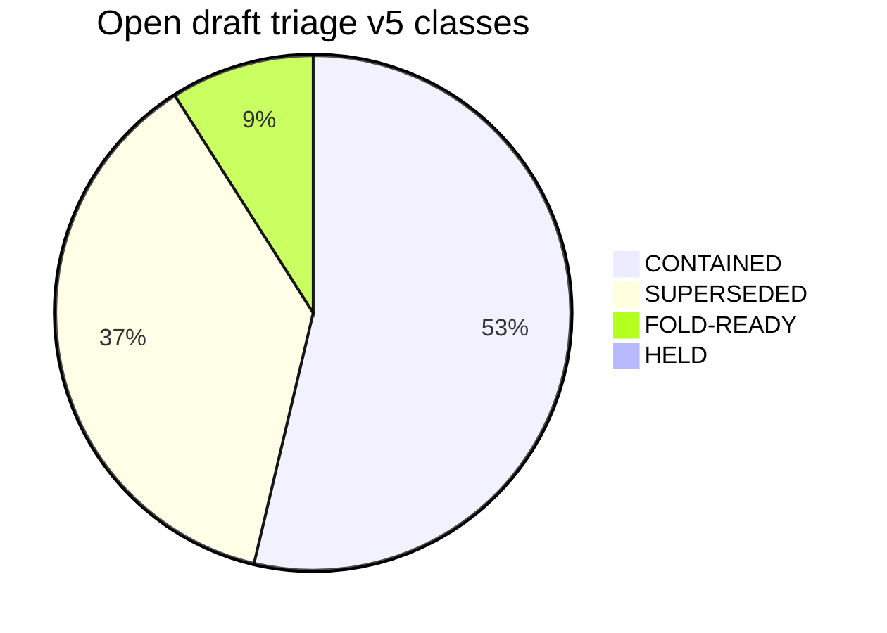
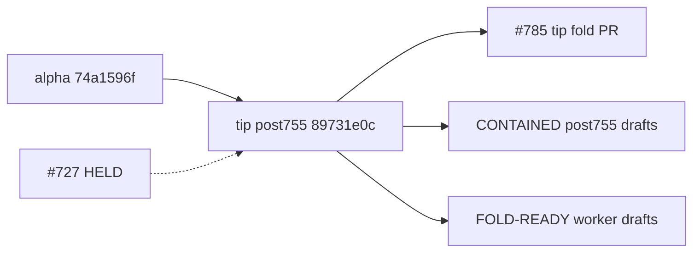

# Open draft triage — tip post755 refresh v5 (2026-10-09)

**Task id:** `q-mp-309`
**Live tip branch:** `cursor/mp-tip-post755`
**Tip SHA checked:** `89731e0c99edfa074b18e0757800411830b9418c` (`89731e0c`) — tip owner fold PR **#785** (`q-mp-026i`) in progress atop alpha cut `74a1596f` (after tip **#755**)
**Supersedes:** `q-mp-284` (v4, never drafted as a PR — backlog-only on `#801`) and tip-landed `q-mp-259` / open draft **#782** (v3)
**Prior triage (stale for navigation):** [`open-draft-triage-post755-2026-10-09-v3.md`](./open-draft-triage-post755-2026-10-09-v3.md) (`q-mp-259` / **#782** — leave open; comment `contained`)
**Machine-readable twin:** [`open-draft-triage-post755-2026-10-09-v5.json`](./open-draft-triage-post755-2026-10-09-v5.json)
**Generated (UTC):** 2026-10-09T23:32:29Z
**Scope:** report only — **do not close PRs**. Workers may comment `contained` / `superseded` only; tip owner folds into `cursor/mp-tip-post755`.
**Self note:** this triage lands as a new draft into **post755** — listed for completeness under FOLD-READY once opened.

## Hard rule (this doc)

> **Do not close PRs.** Prefer comments `contained` or `superseded` (with keeper / tip SHA). Closing remains a tip-owner / Andrew bulk-close action, not a worker action.
>
> **#727 is HELD** (Andrew decision). Do not comment on it, retarget it, fold it, or edit nullish from other agents.

## Tip context

Tip cut `cursor/mp-tip-post755` started at alpha `74a1596f` after tip **#755**. Tip-owner PR **#785** has since folded post755 worker payloads through tip HEAD `89731e0c` (including `q-mp-280` lint-bucket helper). Open drafts still declare base `cursor/mp-tip-post755` (or older tips) and need fold / leave-open decisions below.

`q-mp-284` (planned v4) was **not** opened as a dedicated draft — only enumerated inside backlog round-8 **#801**. This v5 is the live keeper; leave `#782` / `#801` open with `contained` / no-op as appropriate.

## Live tip ratchet ceilings (re-measured)

Commands on tip `89731e0c`:

```text
$ git rev-parse HEAD
  89731e0c99edfa074b18e0757800411830b9418c

$ npm run lint:ratchet   # exit 0
  ok   curly: 538 / ceiling 538
  ok   @typescript-eslint/no-non-null-assertion: 246 / ceiling 246
  ok   @typescript-eslint/no-confusing-void-expression: 86 / ceiling 86
  ok   radix: 6 / ceiling 6
  ok   default-case: 5 / ceiling 5
  ok   no-duplicate-imports: 78 / ceiling 78
  ok   @typescript-eslint/prefer-nullish-coalescing: 65 / ceiling 65
  ok   @typescript-eslint/prefer-optional-chain: 21 / ceiling 21
  ok   @typescript-eslint/switch-exhaustiveness-check: 8 / ceiling 8
  ok   @typescript-eslint/no-shadow: 9 / ceiling 9

$ find tests/unit \( -name '*.test.ts' -o -name '*.spec.ts' \) ! -path '*/_tokenmaxx_archive/*' | wc -l
  3169

$ rg -n 'hard:\s*450' src/games/hex/ai.ts
  hard: 450   ← HOLD untouched
```

## Enumeration

| Bucket | Count | Notes |
| --- | ---: | --- |
| Open drafts **total** | **245** | All open drafts at snapshot |
| **CONTAINED** | **131** | In tip `89731e0c` and/or alpha `74a1596f` via #785/#755 |
| **SUPERSEDED** | **91** | Stale tip base / topic replaced; leave open |
| **FOLD-READY** | **22** | Payload not on tip (includes tip PR #785) |
| **HELD** | **1** | #727 only |
| Open drafts **base** `cursor/mp-tip-post755` | **37** | 16 CONTAINED + 21 FOLD-READY |

Source: `gh pr list --state open --limit 300` @ snapshot; containment via patch-id / blob identity against tip `89731e0c` and alpha `74a1596f`.

## Classification legend

| Status | Meaning |
| --- | --- |
| **CONTAINED** | Payload already on tip `89731e0c` (via #785) and/or alpha `74a1596f` (via #755); leave PR open; comment `contained` |
| **SUPERSEDED** | Stale tip base or topic replaced by a newer keeper; leave open; comment `superseded by #NNN` |
| **FOLD-READY** | Unique payload not on tip; eligible for tip-owner fold (CI may still be catching up) |
| **HELD** | Tip-owner / Andrew hold — do not fold / do not touch |

## Containment method (counts)

| Method | Count | How |
| --- | ---: | --- |
| `stale-tip-base` | 89 | open on pre-post755 tip; payload not tip-equivalent |
| `blob-majority` | 55 | majority of changed-path blobs identical on tip (old tip bases) |
| `blob-identity` | 47 | all changed-path blobs identical on tip |
| `not-contained` | 21 | payload not on tip — fold candidate |
| `patch-id` | 20 | git show | git patch-id --stable vs tip commits 74a1596f..TIP |
| `prior-755+blob` | 8 | tip-owner #755 contained list + residual tip blob overlap |
| `topic-supersede` | 2 | topic replaced by newer keeper (triage / tip pointers) |
| `policy` | 1 | Andrew / tip-owner HOLD |
| `tip-pr` | 1 | tip fold PR itself |
| `blob-identity+tip-subject` | 1 | code blobs identical + tip subject fold (docs tip-advanced) |

## Status by base branch

| Base | CONTAINED | SUPERSEDED | FOLD-READY | HELD | Total |
| --- | ---: | ---: | ---: | ---: | ---: |
| `cursor/mp-tip-post477` | 28 | 39 | 0 | 0 | 67 |
| `cursor/mp-tip-post755` | 16 | 0 | 21 | 0 | 37 |
| `cursor/integration-fold-wave5-tip-4af0` | 11 | 18 | 0 | 0 | 29 |
| `cursor/mp-tip-post598` | 22 | 4 | 0 | 0 | 26 |
| `cursor/mp-tip-post748` | 24 | 1 | 0 | 0 | 25 |
| `cursor/mp-tip-post728` | 15 | 7 | 0 | 0 | 22 |
| `cursor/mp-tip-post700` | 7 | 7 | 0 | 0 | 14 |
| `cursor/mp-tip-post709` | 5 | 4 | 0 | 1 | 10 |
| `alpha` | 1 | 4 | 1 | 0 | 6 |
| `cursor/overnight-polish-integration-0494` | 2 | 4 | 0 | 0 | 6 |
| `cursor/playtest-recheck-fixes-a6fd` | 0 | 1 | 0 | 0 | 1 |
| `cursor/integration-fold-wave4-tip-36e4` | 0 | 1 | 0 | 0 | 1 |
| `cursor/friday-landing-preflight-v2-e939` | 0 | 1 | 0 | 0 | 1 |

## Status visual





## HELD

### #727 — `q-mp-186` — HELD

| Field | Value |
| --- | --- |
| Title | clear prefer-nullish-coalescing in owl-messages (−9) |
| Base / head | `cursor/mp-tip-post709` / `cursor/q-mp-186-nullish-owl-messages-0a20` |
| Fold-readiness | **HELD** — Andrew decision; do not retarget / do not fold / do not comment / do not edit nullish |
| Evidence | tip-owner HOLD chain; nullish ceiling remains **65** |

## FOLD-READY (payload not on tip)

Includes tip PR **#785** itself. Worker drafts below are the current post755 fold queue (plus this v5 once opened). CI noted at snapshot where available.

| PR | Task | Base | Head | Evidence (short) | CI @ snapshot |
| ---: | --- | --- | --- | --- | --- |
| #785 | `q-mp-026i` | `alpha` | `89731e0c` | tip-owner fold PR cursor/mp-tip-post755 → alpha @ head 89731e0c (tip folding in progress) | tip PR — checks in progress |
| #797 | `q-mp-261` | `cursor/mp-tip-post755` | `af571ec5` | payload not on tip; unmatched commits=1; blob same=1 diff=2 missing_on_tip=0 | 12/12 pass |
| #798 | `q-mp-205` | `cursor/mp-tip-post755` | `d52c4ae1` | payload not on tip; unmatched commits=2; blob same=0 diff=21 missing_on_tip=0 | 12/12 pass |
| #799 | `q-mp-219` | `cursor/mp-tip-post755` | `ebf45101` | payload not on tip; unmatched commits=1; blob same=0 diff=10 missing_on_tip=0 | 12/12 pass |
| #800 | `q-mp-194` | `cursor/mp-tip-post755` | `7351581e` | payload not on tip; unmatched commits=1; blob same=0 diff=9 missing_on_tip=0 | 12/12 pass |
| #801 | `q-mp-090h` | `cursor/mp-tip-post755` | `cb8e7e14` | payload not on tip; unmatched commits=1; blob same=0 diff=1 missing_on_tip=1 | 12/12 pass |
| #802 | `q-mp-290` | `cursor/mp-tip-post755` | `e028c5f3` | payload not on tip; unmatched commits=1; blob same=0 diff=4 missing_on_tip=0 | 12/12 pass |
| #803 | `q-mp-300` | `cursor/mp-tip-post755` | `53eb7f06` | payload not on tip; unmatched commits=1; blob same=0 diff=1 missing_on_tip=1 | 12/12 pass |
| #804 | `q-mp-303` | `cursor/mp-tip-post755` | `21771351` | payload not on tip; unmatched commits=1; blob same=0 diff=2 missing_on_tip=1 | 12/12 pass |
| #805 | `q-mp-305` | `cursor/mp-tip-post755` | `d2fb79d7` | payload not on tip; unmatched commits=1; blob same=0 diff=3 missing_on_tip=2 | 12/12 pass |
| #806 | `q-mp-307` | `cursor/mp-tip-post755` | `53a73256` | payload not on tip; unmatched commits=1; blob same=0 diff=2 missing_on_tip=2 | 12/12 pass |
| #807 | `q-mp-302` | `cursor/mp-tip-post755` | `3e6dee7d` | payload not on tip; unmatched commits=1; blob same=0 diff=2 missing_on_tip=1 | 12/12 pass |
| #808 | `q-mp-296` | `cursor/mp-tip-post755` | `c753c8d5` | payload not on tip; unmatched commits=1; blob same=0 diff=2 missing_on_tip=2 | 12/12 pass |
| #809 | `q-mp-299` | `cursor/mp-tip-post755` | `5ca4742e` | payload not on tip; unmatched commits=1; blob same=0 diff=2 missing_on_tip=1 | 12/12 pass |
| #810 | `q-mp-289` | `cursor/mp-tip-post755` | `73a96e4f` | payload not on tip; unmatched commits=1; blob same=0 diff=4 missing_on_tip=1 | 12/12 pass |
| #811 | `q-mp-301` | `cursor/mp-tip-post755` | `7fe3ac97` | payload not on tip; unmatched commits=1; blob same=0 diff=1 missing_on_tip=1 | 12/12 pass |
| #812 | `q-mp-090i` | `cursor/mp-tip-post755` | `232db0e6` | payload not on tip; unmatched commits=1; blob same=0 diff=1 missing_on_tip=1 | 12/12 pass |
| #813 | `q-mp-295` | `cursor/mp-tip-post755` | `7160faee` | payload not on tip; unmatched commits=1; blob same=0 diff=4 missing_on_tip=2 | no checks reported yet |
| #814 | `q-mp-298` | `cursor/mp-tip-post755` | `1c1ea3bf` | payload not on tip; unmatched commits=1; blob same=0 diff=6 missing_on_tip=6 | 12/12 pass |
| #815 | `q-mp-327` | `cursor/mp-tip-post755` | `35b53547` | payload not on tip; unmatched commits=1; blob same=0 diff=1 missing_on_tip=1 | 8 pass / 4 pending |
| #816 | `q-mp-322` | `cursor/mp-tip-post755` | `9b10d491` | payload not on tip; unmatched commits=1; blob same=0 diff=2 missing_on_tip=2 | 8 pass / 4 pending |
| #817 | `q-mp-323` | `cursor/mp-tip-post755` | `25f3622c` | payload not on tip; unmatched commits=1; blob same=0 diff=2 missing_on_tip=2 | 8 pass / 4 pending |

### Suggested fold order (tip owner) — unfolded post755 keepers

Skip CONTAINED / HELD. Prefer green 12/12 first. Serialize shared ceiling keys (`dup-imports` #798, `void` #799, `eqeqeq` #800). Docs/report-only drafts can batch.

| Order | PR | Why |
| ---: | ---: | --- |
| 1 | #802 | q-mp-290: refresh ratchet-ceiling-history SVG for tip post755 |
| 2 | #805 | q-mp-305: Rank-1 dead-CSS rescan on tip post755 (report-only; contains #766) |
| 3 | #810 | q-mp-289: remeasure CI unit wall budget / test-speed for tip post755 |
| 4 | #811 | q-mp-301: slowest unit-file inventory (report-only) for tip post755 |
| 5 | #801 | q-mp-090h: Oct 9i engineering backlog round 8 (25 tasks q-mp-284..308) for tip p |
| 6 | #812 | q-mp-090i: Oct 9j engineering backlog round 9 (25 tasks q-mp-309..333) for tip p |
| 7 | #797 | q-mp-261: refresh coverage-map after tip #755 folds |
| 8 | #803 | q-mp-300: characterize dice-selector enable/disable soft paths (tests-only) |
| 9 | #806 | q-mp-307: characterize stats-dashboard soft-fail residuals (tests-only) |
| 10 | #809 | q-mp-299: characterize main.ts soft-fail / route residuals (tests-only) |
| 11 | #808 | q-mp-296: UI cov r17 stars-bars board-ui + controller residuals (tests-only) |
| 12 | #813 | q-mp-295: UI coverage round 16 — owl branch residuals (tests only) |
| 13 | #814 | q-mp-298: mutation audit UI wave 9 — attribute/fraction/dice (tests-only) |
| 14 | #815 | q-mp-327: characterize graph-ui soft-fail / animate-handle / empty-graph (tests- |
| 15 | #816 | q-mp-322: UI cov r18 prime-gold board-ui + controller residuals (tests-only) |
| 16 | #817 | q-mp-323: UI cov r19 calla board-ui + controller residuals (tests-only) |
| 17 | #804 | q-mp-303: batch queens-guards board-3d layout reads (no visual change) |
| 18 | #807 | q-mp-302: batch star-track board-3d layout reads (no visual change) |
| 19 | #798 | q-mp-205: clear no-duplicate-imports in game-controller.ts (−31 → ceiling 47) |
| 20 | #799 | q-mp-219: clear no-confusing-void-expression in core helpers (−20 → ceiling 66) |
| 21 | #800 | q-mp-194: clear stricter eqeqeq outside rules.ts (−11 → ceiling 1) |
| — | #785 | Tip fold PR itself (not a worker fold target) |
| — | #727 | **HELD** — do not fold |

## CONTAINED on tip post755 (via #785) — leave open

Evidence: `git patch-id --stable` match against tip commits `74a1596f..89731e0c`, or identical tip blobs. Tip-owner / prior workers already commented `contained` on these; do not close.

| PR | Task | Method | Tip evidence |
| ---: | --- | --- | --- |
| #780 | `q-mp-264` | `patch-id` | tip ≈ `cece26a0` — all 1 unique commit patch-id(s) match tip #785 @ 89731e0c |
| #781 | `q-mp-276` | `patch-id` | tip ≈ `ade55c71` — all 1 unique commit patch-id(s) match tip #785 @ 89731e0c |
| #782 | `q-mp-259` | `patch-id` | tip ≈ `998557ca` — all 1 unique commit patch-id(s) match tip #785 @ 89731e0c |
| #783 | `q-mp-279` | `patch-id` | tip ≈ `93f510f5` — all 1 unique commit patch-id(s) match tip #785 @ 89731e0c |
| #784 | `q-mp-282` | `patch-id` | tip ≈ `dfac47f5` — all 2 unique commit patch-id(s) match tip #785 @ 89731e0c |
| #786 | `q-mp-268` | `patch-id` | tip ≈ `02af5c56` — all 1 unique commit patch-id(s) match tip #785 @ 89731e0c |
| #787 | `q-mp-278` | `patch-id` | tip ≈ `4e7a29ed` — all 1 unique commit patch-id(s) match tip #785 @ 89731e0c |
| #788 | `q-mp-267` | `patch-id` | tip ≈ `dc429baf` — all 1 unique commit patch-id(s) match tip #785 @ 89731e0c |
| #789 | `q-mp-273` | `patch-id` | tip ≈ `769fef91` — all 1 unique commit patch-id(s) match tip #785 @ 89731e0c |
| #790 | `q-mp-275` | `patch-id` | tip ≈ `d08ce17c` — all 1 unique commit patch-id(s) match tip #785 @ 89731e0c |
| #791 | `q-mp-260` | `patch-id` | tip ≈ `d2ee449c` — all 1 unique commit patch-id(s) match tip #785 @ 89731e0c |
| #792 | `q-mp-263` | `patch-id` | tip ≈ `94d27494` — all 1 unique commit patch-id(s) match tip #785 @ 89731e0c |
| #793 | `q-mp-274` | `blob-identity+tip-subject` | tip ≈ `1eee9898` — tip folded q-mp-274 @ 1eee9898; types blobs identical; knip docs tip-a |
| #794 | `q-mp-271` | `patch-id` | tip ≈ `8cda3022` — all 1 unique commit patch-id(s) match tip #785 @ 89731e0c |
| #795 | `q-mp-270` | `patch-id` | tip ≈ `a35ddb3a` — all 2 unique commit patch-id(s) match tip #785 @ 89731e0c |
| #796 | `q-mp-280` | `patch-id` | tip ≈ `89731e0c` — all 1 unique commit patch-id(s) match tip #785 @ 89731e0c |

Also CONTAINED on tip via #785 (base still `post748`): **#763, #776–#779** (patch-id).

## CONTAINED via alpha / #755 (old tip bases) — leave open

Primary post748 stack already tip-owned-commented `contained in alpha @ 74a1596f via #755` on #749–#754, #756–#762, #764–#775 (skipped #727 HELD; #763 later tip-folded).

Additional CONTAINED across older bases (blob-identity / blob-majority / prior-755): **115** drafts — full list in the JSON twin (`status == CONTAINED`). Notable: triage v2 **#758** / v3 **#782** blobs on tip; leave open with `contained` (this v5 is the navigation keeper).

| Notable | Note |
| ---: | --- |
| #758 | triage v2 — blobs on tip; superseded for navigation by v5 |
| #782 | triage v3 — patch-id contained on tip via #785; leave open with `contained` |
| #767 | testing-layers stamp superseded by tip `#791` / later remasures — classed SUPERSEDED |
| #779 | engine cov r8 — patch-id contained on tip (base still post748) |

## SUPERSEDED (leave open)

**91** drafts — mostly `stale-tip-base` on `post477` / wave5 / overnight / older tips without tip-equivalent blobs. Do not close. Comment `superseded by #<keeper>` only when a clear newer keeper exists.

Topic-supersede keepers called out:

| PR | Why |
| ---: | --- |
| #713 | superseded by tip post755 pointer re-anchor on #785 (q-mp-026i) |
| #737 | superseded by tip post755 pointer re-anchor on #785 (q-mp-026i) |
| #767 | stale testing-layers remasure on post748; tip advanced via #791+ |

Legacy stacks (`post728` / `post709` / `post700` / `post598` / `post477` / wave tips) remain outside the post755 fold queue unless tip-equivalent.

## Conflict / shared-file clusters (unfolded only)

| Cluster | PRs | Files | Fold note |
| --- | --- | --- | --- |
| Lint ceilings JSON | HOLD #727; unfold #798/#799/#800 | `docs/dev/lint-ratchet-ceilings.json` | Serialize; min-wins; do **not** fold #727 |
| Ratchet history SVG | #802 | `docs/dev/ratchet-ceiling-history.*` | Replaces older #763 tip blobs; fold when green |
| Coverage-map regenerate | #797 | `docs/dev/coverage-map.*` | Tip has pointer re-anchor only; full regenerate still FOLD-READY |
| Triage narrative | #782 / this v5 | `docs/dev/open-draft-triage-post755-*` | Leave #782 open with `contained`; fold v5 |
| Backlogs | #801 / #812 | `docs/dev/backlog-2026-10-09{i,j}.md` | Orthogonal docs; fold either order |

## Method

1. `git rev-parse HEAD` on `cursor/mp-tip-post755` → `89731e0c`.
2. `gh pr list --state open --limit 300` → all open drafts (bases include post755 + older tips + tip PR #785 → alpha).
3. Build tip patch-id index: `git rev-list 74a1596f..HEAD` × `git show \| git patch-id --stable`.
4. Per draft: unique commits vs declared base; match patch-ids; else compare changed-path blobs to tip; else majority/prior-755/stale-base rules.
5. Policy override: **#727 HELD** (no comment). Tip PR **#785** classified FOLD-READY (tip-pr).
6. Tip re-measure: `npm run lint:ratchet` (ceilings match table; `no-shadow` **9**); unit files → **3169**.
7. Leave #782 open; note `q-mp-284` v4 never drafted.
8. **No PR closes, merges, or ready-for-review flips** by this task. No `lint-ratchet-ceilings.json` / knip baseline / AI / rules / copy edits.

## Explicitly do **not** fold next

- **#727** — HELD; nullish untouched; do not comment.
- Any CONTAINED post755 (#780–#796 except gaps) / post748 tip-folded drafts — already on tip; leave open.
- SUPERSEDED stale-tip stacks without tip-owner retarget.
- Hard-rule HOLD AI/copy/rules/scoring work.

Next action: fold into tip by the tip owner
