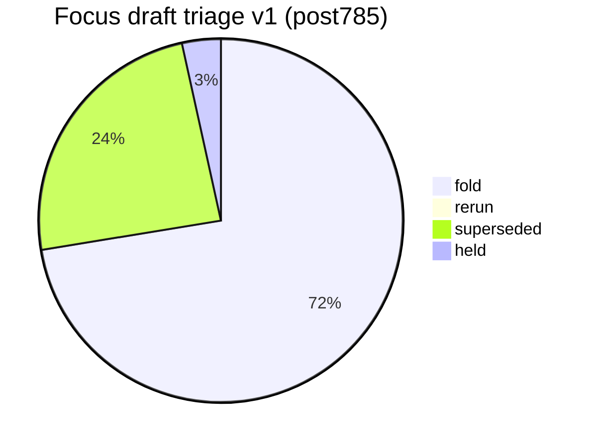
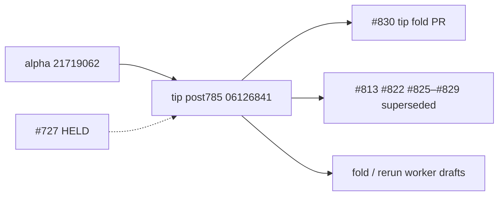

# Open draft triage — tip post785 v1 (2026-10-10)

**Task id:** `q-mp-334`
**Live tip branch:** `cursor/mp-tip-post785`
**Tip SHA checked:** `06126841f4dc3e15a0ab9e6d58df1dad8cc0a4b3` (`06126841`) — tip-owner fold PR **#830** (`q-mp-026j`) atop alpha `21719062` (post755 tip **#785** squash-merged)
**Alpha SHA:** `217190621fc55835bf82f5a4d3b8bd7666a25d9b` (`21719062`)
**Supersedes (navigation):** open drafts **#819** (v5 / `q-mp-309`) and **#782** (v3 / `q-mp-259`) — leave open; comment `contained` / `superseded` (do **not** close)
**Prior triage (stale for post785 navigation):** [`open-draft-triage-post755-2026-10-09-v5.md`](./open-draft-triage-post755-2026-10-09-v5.md)
**Machine-readable twin:** [`open-draft-triage-post785-2026-10-10-v1.json`](./open-draft-triage-post785-2026-10-10-v1.json)
**Generated (UTC):** 2026-10-10T02:13:24Z
**Scope:** report only — **do not close PRs**, do not mark ready, do not comment from this worker task. Tip owner folds into `cursor/mp-tip-post785`.
**Focus set:** `#813`, `#822`, `#825`–`#850`, tip PR `#830` (and any newer post785 drafts at snapshot). Broader open inventory summarized below.

## Hard rule (this doc)

> **Do not close PRs.** Prefer comments `contained` or `superseded` (with keeper / tip SHA). Closing remains a tip-owner / Andrew bulk-close action, not a worker action.
>
> **#727 is HELD** (Andrew decision). Do not comment on it, retarget it, fold it, or edit nullish from other agents.

## Tip context

Tip cut `cursor/mp-tip-post785` started at alpha `21719062` right after tip **#785** squash-merged. Tip HEAD has since advanced to `06126841` with tip-owner folds:

| Tip commit | Task                                                                     | Source draft |
| ---------- | ------------------------------------------------------------------------ | -----------: |
| `9580765b` | `q-mp-292: clear no-shadow in game-controller.ts (−6 → ceiling 3)`       |         #822 |
| `7bb3b3c1` | `docs(q-mp-026j): re-anchor AGENTS tip pointers to cursor/mp-tip-post78` |    tip-owner |
| `d6c9d8b9` | `test(ui): q-mp-295 UI cov r16 owl branch residuals`                     |         #813 |
| `c9b55cff` | `fix(lint): q-mp-320 brace no-confusing-void-expression in game-shell (` |         #825 |
| `8c81a16c` | `q-mp-329: batch prime-gold board-3d layout reads (no visual change)`    |         #826 |
| `7b30e657` | `fix(q-mp-321): clear no-duplicate-imports in ui + kings helpers (−5 → ` |         #827 |
| `02926472` | `docs(q-mp-313): remeasure post785 bundle headroom (sum-dominoes −76 B)` |         #828 |
| `2e126f09` | `q-mp-332: Knip unusedTypes demote batch 5 (Rank-3 −14 → baseline 47)`   |         #829 |
| `06126841` | `fix(q-mp-026j): drop duplicate Piece/PlayerOwner re-export after #829 ` |    tip-owner |

## Live tip ratchet ceilings (re-measured)

Commands on tip `06126841`:

```text
$ git rev-parse HEAD
  06126841f4dc3e15a0ab9e6d58df1dad8cc0a4b3

$ npm run lint:ratchet   # exit 0
  ok   curly: 538 / ceiling 538
  ok   @typescript-eslint/no-non-null-assertion: 246 / ceiling 246
  ok   @typescript-eslint/no-confusing-void-expression: 62 / ceiling 62
  ok   radix: 6 / ceiling 6
  ok   default-case: 5 / ceiling 5
  ok   no-duplicate-imports: 42 / ceiling 42
  ok   @typescript-eslint/prefer-nullish-coalescing: 65 / ceiling 65
  ok   @typescript-eslint/prefer-optional-chain: 21 / ceiling 21
  ok   @typescript-eslint/switch-exhaustiveness-check: 8 / ceiling 8
  ok   @typescript-eslint/no-shadow: 3 / ceiling 3
  ok   eqeqeq: 1 / ceiling 1
  ok   @typescript-eslint/return-await: 3 / ceiling 3

$ find tests/unit \( -name '*.test.ts' -o -name '*.spec.ts' \) ! -path '*/_tokenmaxx_archive/*' | wc -l
  3182

$ rg -n 'hard:\s*450' src/games/hex/ai.ts
  hard: 450   ← HOLD untouched
```

## Classification legend

| Status         | Meaning                                                                               |
| -------------- | ------------------------------------------------------------------------------------- |
| **fold**       | Unique payload not on tip; tip owner should fold (after CI green / ceiling reconcile) |
| **rerun**      | Payload still wanted, but rebase and/or CI re-run required before fold                |
| **superseded** | Payload already on tip 06126841 (or topic replaced); leave PR open                    |
| **held**       | Tip-owner / Andrew hold — do not fold / do not touch                                  |

## Enumeration (focus + open inventory)

| Bucket                            |   Count | Notes                                            |
| --------------------------------- | ------: | ------------------------------------------------ |
| Open drafts **total**             | **277** | `gh pr list --state open --limit 300` @ snapshot |
| Focus drafts classified           |  **29** | #813, #822, #825–#850, tip #830, HOLD #727       |
| **fold**                          |  **21** | Unique post785 payloads (+ tip PR + this v1)     |
| **rerun**                         |   **0** | none at refresh                                  |
| **superseded**                    |   **7** | Already tip-folded (#813/#822/#825–#829)         |
| **held**                          |   **1** | #727 only                                        |
| Open base `cursor/mp-tip-post785` |  **25** | worker drafts (excludes tip PR #830 → alpha)     |
| Open base `cursor/mp-tip-post755` |  **44** | stale tip base; see #819 v5 + notes below        |

## Status visual





## Focus triage table (primary)

Per-draft recommendation with GitHub check-run status on the **head SHA** (12 CI jobs).

|   PR | Task        | Base      | Head SHA                                   | Rec            | Checks @ head                          | Reason                                                                                                    |
| ---: | ----------- | --------- | ------------------------------------------ | -------------- | -------------------------------------- | --------------------------------------------------------------------------------------------------------- |
| #813 | `q-mp-295`  | `post755` | `7160faee6a7ee2c29ab0809b4796a88b665850b8` | **superseded** | **0/12** (no check-runs on head)       | Tip folded unique test + ui-coverage-round-16.md as d6c9d8b9; coverage-map regenerate stale; 0 check-runs |
| #822 | `q-mp-292`  | `post755` | `3c85400c35555b6c652a78425e590ea281b28ae7` | **superseded** | **11/12** (`unit` **failure**)         | Tip folded as 9580765b (no-shadow→3). unit failure was flaky AI calib; CONFLICTING                        |
| #825 | `q-mp-320`  | `post785` | `c72d61c7b19a18bb17769be115dafe65a31cbae2` | **superseded** | **12/12**                              | Tip folded as c9b55cff; game-shell.ts blob identical                                                      |
| #826 | `q-mp-329`  | `post785` | `3a8538a16ada8b456042a1e215195527e32cabb7` | **superseded** | **12/12**                              | Tip folded as 8c81a16c; blobs identical                                                                   |
| #827 | `q-mp-321`  | `post785` | `99671e992db129bdae9890ad0cece7ca14aad61b` | **superseded** | **12/12**                              | Tip folded as 7b30e657 (dup-imports→42)                                                                   |
| #828 | `q-mp-313`  | `post785` | `eb833770f4b85a4de646ae38f55b4d40683652db` | **superseded** | **12/12**                              | Tip folded as 02926472; docs blob identical                                                               |
| #829 | `q-mp-332`  | `post785` | `cb242c1e0181153f23a037cbdaf15767ee7ace79` | **superseded** | **11/12** (`unit` **failure**)         | Tip folded as 2e126f09 (+ tip-owner 06126841 board.ts re-export fix); 12/13 blobs identical; leave open   |
| #830 | `q-mp-026j` | `alpha`   | `06126841f4dc3e15a0ab9e6d58df1dad8cc0a4b3` | **fold**       | **9/12** (in progress)                 | Tip fold PR post785→alpha @ 06126841                                                                      |
| #831 | `q-mp-090j` | `post785` | `47ca886d23c900ef575f657831cbe5da8dc67cfb` | **fold**       | **12/12**                              | Backlog round 10 docs                                                                                     |
| #832 | `q-mp-325`  | `post785` | `e8ec224efc35d4fc2c0bd95cc2a0f473efb9aeeb` | **fold**       | **12/12**                              | Mutation audit UI wave 10 tests-only                                                                      |
| #833 | `q-mp-324`  | `post785` | `e72798e88ad222429d0572b53c5494db15ed616f` | **fold**       | **12/12**                              | Engine cov r10 tests-only                                                                                 |
| #834 | `q-mp-331`  | `post785` | `8ad9b94e8f6a98e0245e61254322032662815bf9` | **fold**       | **12/12**                              | Kings board-3d layout reads                                                                               |
| #835 | `q-mp-352`  | `post785` | `338216d3cfa87435f8b03c9ea8fa58c426e6ba80` | **fold**       | **12/12**                              | Kwatro-sinko board-3d layout reads                                                                        |
| #836 | `q-mp-351`  | `post785` | `6b77145c521b62ea5357fd137f9a6bcd3f5f47a8` | **fold**       | **12/12**                              | FIAR board-3d layout reads                                                                                |
| #837 | `q-mp-344`  | `post785` | `b4bc21920b8935571058e87e1360cbcb694c33e5` | **fold**       | **12/12**                              | tablet-gl void (−4→58); tip-owner min-wins void 58 on fold                                                |
| #838 | `q-mp-330`  | `post785` | `576c211e275134739c32c4e66def10c74a6d953c` | **fold**       | **12/12**                              | Pent-em-in board-3d layout reads                                                                          |
| #839 | `q-mp-343`  | `post785` | `78a787082c53856a8db55b4e03c162083d924622` | **fold**       | **12/12**                              | Emit-identity FAIL inventory refresh docs                                                                 |
| #840 | `q-mp-341`  | `post785` | `2313ada94388fd2076102a219534e2af54d162af` | **fold**       | **12/12**                              | Rank-1 dead-CSS rescan post785; contains #805/#766                                                        |
| #841 | `q-mp-335`  | `post785` | `75ab398cf87dc743a69ada670b43b8f86a165a18` | **fold**       | **12/12**                              | Unique (same=0 diff=2 new=0); success=12/12; mergeable=UNKNOWN                                            |
| #842 | `q-mp-358`  | `post785` | `1f46a93cd2f3febf112548508936fd8e150270fd` | **fold**       | **12/12**                              | Unique (same=0 diff=0 new=1); success=12/12; mergeable=MERGEABLE                                          |
| #843 | `q-mp-338`  | `post785` | `0af20eb6774d3e9512b0f99ab4f3538b3552303e` | **fold**       | **12/12**                              | Unique (same=0 diff=4 new=2); success=12/12; mergeable=MERGEABLE                                          |
| #844 | `q-mp-355`  | `post785` | `c5ee4d1b6714358ea631c4e3cb4e4e69f42a5e03` | **fold**       | **12/12**                              | Unique (same=0 diff=0 new=2); success=12/12; mergeable=UNKNOWN                                            |
| #845 | `q-mp-347`  | `post785` | `481364ac71d5963f874814b7bf11e1c3e8051df9` | **fold**       | **12/12**                              | Unique (same=0 diff=0 new=2); success=12/12; mergeable=MERGEABLE                                          |
| #846 | `q-mp-353`  | `post785` | `968a806626846061ff4f4b599378bc0e85770d16` | **fold**       | **12/12**                              | Unique (same=0 diff=1 new=1); success=12/12; mergeable=MERGEABLE                                          |
| #847 | `q-mp-354`  | `post785` | `be3c85c7800b9c7a3e9c4dc49534fdb8dc1c3642` | **fold**       | **12/12**                              | Unique (same=0 diff=0 new=1); success=12/12; mergeable=MERGEABLE                                          |
| #848 | `q-mp-348`  | `post785` | `3f4e2e180b0142d53fba138dc3f5afa7926c93bd` | **fold**       | **12/12**                              | Unique (same=0 diff=0 new=2); success=12/12; mergeable=MERGEABLE                                          |
| #849 | `q-mp-342`  | `post785` | `09882ac5d028d5e0c38ecb0822a4b0c99eaa588f` | **fold**       | **12/12**                              | Unique (same=0 diff=0 new=1); success=12/12; mergeable=UNKNOWN                                            |
| #850 | `q-mp-334`  | `post785` | `78557619f925284f958874c7848ac99d353cea37` | **fold**       | **4/12** (`lint`, `build` **failure**) | This triage v1 draft (q-mp-334)                                                                           |

Exact per-check conclusions are also in the JSON twin (`drafts[].checks`).

### Check-run detail (12-job rows)

|   PR | lint | audit | build | unit | e2e | knip | visual-baseline | e2e-fullgame | mobile-touch | zoom-reflow | forced-colors | e2e-cross-browser |
| ---: | ---- | ----- | ----- | ---- | --- | ---- | --------------- | ------------ | ------------ | ----------- | ------------- | ----------------- |
| #813 | —    | —     | —     | —    | —   | —    | —               | —            | —            | —           | —             | —                 |
| #822 | ✅   | ✅    | ✅    | ❌   | ✅  | ✅   | ✅              | ✅           | ✅           | ✅          | ✅            | ✅                |
| #825 | ✅   | ✅    | ✅    | ✅   | ✅  | ✅   | ✅              | ✅           | ✅           | ✅          | ✅            | ✅                |
| #826 | ✅   | ✅    | ✅    | ✅   | ✅  | ✅   | ✅              | ✅           | ✅           | ✅          | ✅            | ✅                |
| #827 | ✅   | ✅    | ✅    | ✅   | ✅  | ✅   | ✅              | ✅           | ✅           | ✅          | ✅            | ✅                |
| #828 | ✅   | ✅    | ✅    | ✅   | ✅  | ✅   | ✅              | ✅           | ✅           | ✅          | ✅            | ✅                |
| #829 | ✅   | ✅    | ✅    | ❌   | ✅  | ✅   | ✅              | ✅           | ✅           | ✅          | ✅            | ✅                |
| #830 | ✅   | ✅    | ✅    | ⏳   | ✅  | ✅   | ✅              | ⏳           | ✅           | ✅          | ✅            | ⏳                |
| #831 | ✅   | ✅    | ✅    | ✅   | ✅  | ✅   | ✅              | ✅           | ✅           | ✅          | ✅            | ✅                |
| #832 | ✅   | ✅    | ✅    | ✅   | ✅  | ✅   | ✅              | ✅           | ✅           | ✅          | ✅            | ✅                |
| #833 | ✅   | ✅    | ✅    | ✅   | ✅  | ✅   | ✅              | ✅           | ✅           | ✅          | ✅            | ✅                |
| #834 | ✅   | ✅    | ✅    | ✅   | ✅  | ✅   | ✅              | ✅           | ✅           | ✅          | ✅            | ✅                |
| #835 | ✅   | ✅    | ✅    | ✅   | ✅  | ✅   | ✅              | ✅           | ✅           | ✅          | ✅            | ✅                |
| #836 | ✅   | ✅    | ✅    | ✅   | ✅  | ✅   | ✅              | ✅           | ✅           | ✅          | ✅            | ✅                |
| #837 | ✅   | ✅    | ✅    | ✅   | ✅  | ✅   | ✅              | ✅           | ✅           | ✅          | ✅            | ✅                |
| #838 | ✅   | ✅    | ✅    | ✅   | ✅  | ✅   | ✅              | ✅           | ✅           | ✅          | ✅            | ✅                |
| #839 | ✅   | ✅    | ✅    | ✅   | ✅  | ✅   | ✅              | ✅           | ✅           | ✅          | ✅            | ✅                |
| #840 | ✅   | ✅    | ✅    | ✅   | ✅  | ✅   | ✅              | ✅           | ✅           | ✅          | ✅            | ✅                |
| #841 | ✅   | ✅    | ✅    | ✅   | ✅  | ✅   | ✅              | ✅           | ✅           | ✅          | ✅            | ✅                |
| #842 | ✅   | ✅    | ✅    | ✅   | ✅  | ✅   | ✅              | ✅           | ✅           | ✅          | ✅            | ✅                |
| #843 | ✅   | ✅    | ✅    | ✅   | ✅  | ✅   | ✅              | ✅           | ✅           | ✅          | ✅            | ✅                |
| #844 | ✅   | ✅    | ✅    | ✅   | ✅  | ✅   | ✅              | ✅           | ✅           | ✅          | ✅            | ✅                |
| #845 | ✅   | ✅    | ✅    | ✅   | ✅  | ✅   | ✅              | ✅           | ✅           | ✅          | ✅            | ✅                |
| #846 | ✅   | ✅    | ✅    | ✅   | ✅  | ✅   | ✅              | ✅           | ✅           | ✅          | ✅            | ✅                |
| #847 | ✅   | ✅    | ✅    | ✅   | ✅  | ✅   | ✅              | ✅           | ✅           | ✅          | ✅            | ✅                |
| #848 | ✅   | ✅    | ✅    | ✅   | ✅  | ✅   | ✅              | ✅           | ✅           | ✅          | ✅            | ✅                |
| #849 | ✅   | ✅    | ✅    | ✅   | ✅  | ✅   | ✅              | ✅           | ✅           | ✅          | ✅            | ✅                |
| #850 | ❌   | ✅    | ❌    | ✅   | —   | ✅   | ✅              | —            | —            | —           | —             | —                 |

## HELD

### #727 — `q-mp-186` — **held**

| Field          | Value                                                                                            |
| -------------- | ------------------------------------------------------------------------------------------------ |
| Title          | q-mp-186: clear prefer-nullish-coalescing in owl-messages (−9)                                   |
| Base / head    | `cursor/mp-tip-post709` / `54532ce5459ca15d880ece9a119a909e56745ef4`                             |
| Recommendation | **held** — Andrew decision; do not retarget / do not fold / do not comment / do not edit nullish |
| Evidence       | tip-owner HOLD chain; nullish ceiling remains **65** on tip                                      |

## Suggested fold order (tip owner) — post785 keepers

Skip **superseded** / **held**. Prefer green 12/12 first. Serialize shared ceiling keys (`void` #837). Docs/report-only can batch.

| Order |   PR | Why                                                                           |
| ----: | ---: | ----------------------------------------------------------------------------- |
|     1 | #831 | `q-mp-090j` — Backlog round 10 docs                                           |
|     2 | #832 | `q-mp-325` — Mutation audit UI wave 10 tests-only                             |
|     3 | #833 | `q-mp-324` — Engine cov r10 tests-only                                        |
|     4 | #834 | `q-mp-331` — Kings board-3d layout reads                                      |
|     5 | #835 | `q-mp-352` — Kwatro-sinko board-3d layout reads                               |
|     6 | #836 | `q-mp-351` — FIAR board-3d layout reads                                       |
|     7 | #837 | `q-mp-344` — tablet-gl void (−4→58); tip-owner min-wins void 58 on fold       |
|     8 | #838 | `q-mp-330` — Pent-em-in board-3d layout reads                                 |
|     9 | #839 | `q-mp-343` — Emit-identity FAIL inventory refresh docs                        |
|    10 | #840 | `q-mp-341` — Rank-1 dead-CSS rescan post785; contains #805/#766               |
|    11 | #841 | `q-mp-335` — Unique (same=0 diff=2 new=0); success=12/12; mergeable=UNKNOWN   |
|    12 | #842 | `q-mp-358` — Unique (same=0 diff=0 new=1); success=12/12; mergeable=MERGEABLE |
|    13 | #843 | `q-mp-338` — Unique (same=0 diff=4 new=2); success=12/12; mergeable=MERGEABLE |
|    14 | #844 | `q-mp-355` — Unique (same=0 diff=0 new=2); success=12/12; mergeable=UNKNOWN   |
|    15 | #845 | `q-mp-347` — Unique (same=0 diff=0 new=2); success=12/12; mergeable=MERGEABLE |
|    16 | #846 | `q-mp-353` — Unique (same=0 diff=1 new=1); success=12/12; mergeable=MERGEABLE |
|    17 | #847 | `q-mp-354` — Unique (same=0 diff=0 new=1); success=12/12; mergeable=MERGEABLE |
|    18 | #848 | `q-mp-348` — Unique (same=0 diff=0 new=2); success=12/12; mergeable=MERGEABLE |
|    19 | #849 | `q-mp-342` — Unique (same=0 diff=0 new=1); success=12/12; mergeable=UNKNOWN   |
|    20 | #850 | `q-mp-334` — This triage v1 draft (q-mp-334)                                  |
|     — | #830 | Tip fold PR itself (Grok Bot / tip owner → alpha)                             |
|     — | #727 | **held** — do not fold                                                        |

## Post755 leftovers (`#780`–`#824`) — navigation note

**44** drafts still declare base `cursor/mp-tip-post755`. Navigation keeper was **#819** (`q-mp-309` v5); that snapshot is **stale for post785**. Leave `#819` / `#782` / `#812` open with `contained` / `superseded` — do **not** close.

Within the user focus set, post755 drafts **#813** and **#822** are **superseded** by tip commits. Remaining post755 drafts are outside this v1 fold queue unless tip-owner retargets.

## Conflict / shared-file clusters (unfolded focus)

| Cluster                    | PRs                              | Files                                   | Fold note                                 |
| -------------------------- | -------------------------------- | --------------------------------------- | ----------------------------------------- |
| Lint ceilings JSON         | #837; HOLD #727                  | `docs/dev/lint-ratchet-ceilings.json`   | Serialize; min-wins; do **not** fold #727 |
| Board-3d layout reads      | #834–#836, #838                  | distinct `*-board-3d.ts`                | Orthogonal; any order when green          |
| Dead-CSS / inventory       | #840 (contains #805/#766)        | `docs/dev/dead-*`                       | Prefer #840 over stale post755 #805       |
| Triage / backlog narrative | #819/#782 → this v1 (#850); #831 | `docs/dev/open-draft-triage-*`, backlog | Leave old triage open; fold v1 + #831     |

## Method

1. Read `q-mp-334` from draft **#831** (backlog round-10 file on that PR head; not yet on tip); measure live tip `cursor/mp-tip-post785` @ `06126841` (spec tip SHA `21719062` is stale — tip advanced with #813/#822/#825–#829 folds + tip-owner board.ts fix).
2. Confirm no prior `open-draft-triage-post785-*` file; leave `#819`/`#782` open (navigation superseded by this v1).
3. Enumerate open drafts; focus `#813`, `#822`, `#825`–`#850`, tip `#830`, HOLD `#727`.
4. Per draft: changed-path blob identity vs tip; tip subject / commit fold evidence; `mergeable`; GitHub check-runs on **head SHA**.
5. Classify **fold** / **rerun** / **superseded** / **held**. Policy: **#727 held**.
6. Tip re-measure: `npm run lint:ratchet` (void **62**, shadow **3**, dup **42**); unit files → **3182**; Hex Hard **450** untouched.
7. **No PR closes, merges, ready flips, or comments** by this task. Docs/JSON only.

## Explicitly do **not** fold next

- **#727** — held; nullish untouched; do not comment.
- **#813 / #822 / #825–#829** — superseded; already on tip `06126841`.
- Stale post755 stacks without tip-owner retarget.
- Hard-rule HOLD AI/copy/rules/scoring work.

Next action: fold into tip by the tip owner
