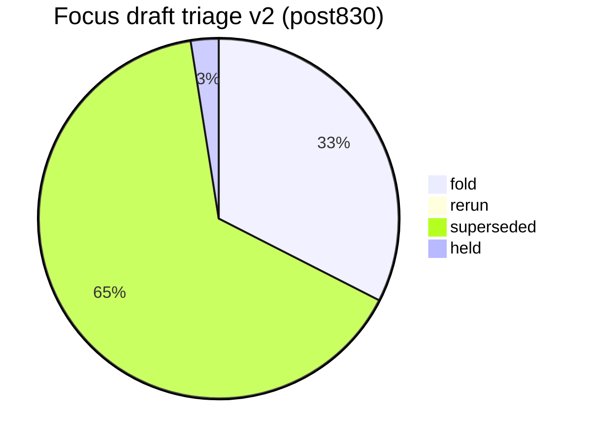
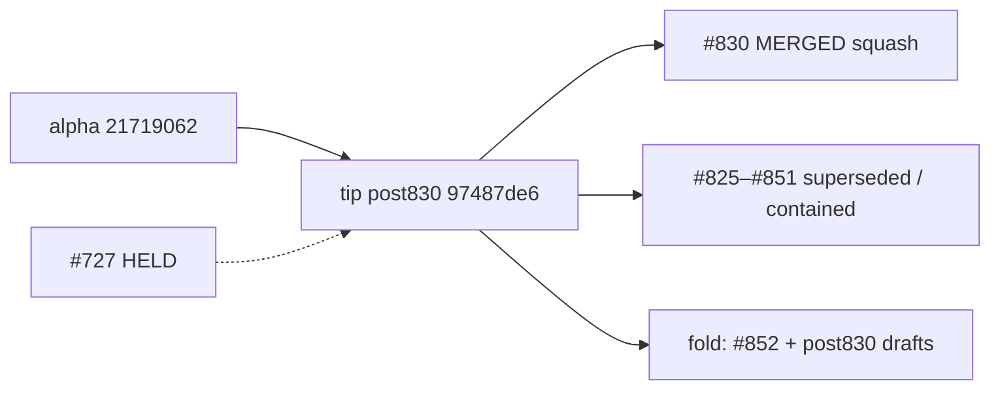

# Open draft triage — tip post830 v2 (2026-10-10)

**Task id:** `q-mp-360`
**Live tip branch:** `cursor/mp-tip-post830`
**Tip SHA checked:** `97487de6b6ad16a2f47a07dcff1076ff1d544aa4` (`97487de6`) — cut from alpha right after tip-fold PR **#830** (`q-mp-026j`) squash-merged; tip contains every fold through **#851**
**Alpha SHA:** `97487de6b6ad16a2f47a07dcff1076ff1d544aa4` (equals tip cut)
**Prior alpha (pre-#830):** `217190621fc55835bf82f5a4d3b8bd7666a25d9b` (`21719062`)
**Supersedes (navigation):** open draft **#850** (v1 / `q-mp-334`) — leave open; comment `contained` (do **not** close). Also navigationally supersedes **#819** (v5) / **#782** (v3).
**Prior triage (stale for post830 navigation):** [`open-draft-triage-post785-2026-10-10-v1.md`](./open-draft-triage-post785-2026-10-10-v1.md)
**Machine-readable twin:** [`open-draft-triage-post830-2026-10-10-v2.json`](./open-draft-triage-post830-2026-10-10-v2.json)
**Generated (UTC):** 2026-10-10T03:58:59.904Z
**Scope:** report only — **do not close PRs**, do not mark ready, do not comment / label from this worker task. Tip owner folds into `cursor/mp-tip-post830`.
**Focus set:** HELD **#727**, open post785 drafts **#825–#852** (incl. **#850** v1 / **#851** backlog / **#852**), open drafts into `cursor/mp-tip-post830` (**#853+** at snapshot).

## Hard rule (this doc)

> **Do not close PRs.** Prefer comments `contained` or `superseded` (with keeper / tip SHA). Closing remains a tip-owner / Andrew bulk-close action, not a worker action.
>
> **#727 is HELD** (Andrew decision). Do not comment on it, retarget it, fold it, or edit nullish from other agents.

## Tip context

Tip cut `cursor/mp-tip-post830` starts at alpha `97487de6` (= squash of **#830**). Relative to pre-#830 alpha `21719062`, the squash absorbed the entire post785 tip stack (folds through **#851**), including:

- Lint clears / layout batches / knip batch 5 / void tablet-gl (ceiling **58**)
- Round-10 + round-11 backlog docs (`backlog-2026-10-10a.md`, `backlog-2026-10-10b.md`)
- post785 triage v1 (`open-draft-triage-post785-2026-10-10-v1.{md,json}`)
- Engine cov r10, mutation UI wave 10, UI cov r16/r20/r21, emit-identity / dead-CSS / slowest-unit inventories, board-3d layout-read notes, soft-fail char tests

Live tip HEAD has **no additional commits** beyond the cut SHA at measurement time.

## Live tip ratchet ceilings (re-measured)

Commands on tip `97487de6`:

```text
$ git rev-parse HEAD
  97487de6b6ad16a2f47a07dcff1076ff1d544aa4

$ npm run lint:ratchet   # exit 0
  ok   curly: 538 / ceiling 538
  ok   @typescript-eslint/no-non-null-assertion: 246 / ceiling 246
  ok   @typescript-eslint/no-confusing-void-expression: 58 / ceiling 58
  ok   radix: 6 / ceiling 6
  ok   default-case: 5 / ceiling 5
  ok   no-duplicate-imports: 42 / ceiling 42
  ok   @typescript-eslint/prefer-nullish-coalescing: 65 / ceiling 65
  ok   @typescript-eslint/prefer-optional-chain: 21 / ceiling 21
  ok   @typescript-eslint/switch-exhaustiveness-check: 8 / ceiling 8
  ok   @typescript-eslint/no-shadow: 3 / ceiling 3
  ok   eqeqeq: 1 / ceiling 1
  ok   @typescript-eslint/return-await: 3 / ceiling 3

$ npm run typecheck:ratchet
  in-scope errors:     0
  out-of-scope errors: 216   ← AI residual (hard-rule HOLD)

$ find tests/unit \( -name '*.test.ts' -o -name '*.spec.ts' \) ! -path '*/_tokenmaxx_archive/*' | wc -l
  3192

$ npm run check:dev-docs
  docs scanned: 174; problems: 0

$ rg -n 'hard:\s*450' src/games/hex/ai.ts
  hard: 450   ← HOLD untouched
```

### Before → after tip metrics (v1 @ post785 `06126841` → v2 @ post830 `97487de6`)

| Metric                              |          v1 (post785) |            v2 (post830) |
| ----------------------------------- | --------------------: | ----------------------: |
| Tip SHA                             |            `06126841` |              `97487de6` |
| void ceiling                        |                    62 |                  **58** |
| unit test/spec files (excl archive) |                  3182 |                **3192** |
| Open base `cursor/mp-tip-post785`   |                    25 |                  **27** |
| Open base `cursor/mp-tip-post830`   | 0 (tip did not exist) |                  **13** |
| Focus **fold** recommendations      |                    21 |                  **13** |
| Focus **superseded**                |                     7 |                  **26** |
| Focus **held**                      |              1 (#727) |            **1** (#727) |
| `check:dev-docs` scanned            |                   159 | **174** → **175** w/ v2 |

## Classification legend

| Status         | Meaning                                                                                                    |
| -------------- | ---------------------------------------------------------------------------------------------------------- |
| **fold**       | Unique payload not on tip; tip owner should fold (after CI green / ceiling reconcile / retarget if needed) |
| **rerun**      | Payload still wanted, but rebase and/or CI re-run required before fold                                     |
| **superseded** | Payload already on tip `97487de6` (or tip-ahead vs stale head); leave PR open                              |
| **held**       | Tip-owner / Andrew hold — do not fold / do not touch                                                       |

## Enumeration (focus + open inventory)

| Bucket                            |   Count | Notes                                                    |
| --------------------------------- | ------: | -------------------------------------------------------- |
| Open drafts **total**             | **292** | `gh pr list --state open --limit 300` @ snapshot         |
| Focus drafts classified           |  **40** | #727 + open post785 + open post830 (excl. this v2 draft) |
| **fold**                          |  **13** | Unique residual vs tip                                   |
| **rerun**                         |   **0** | none at refresh                                          |
| **superseded**                    |  **26** | Absorbed by #830 squash / tip-ahead                      |
| **held**                          |   **1** | #727 only                                                |
| Open base `cursor/mp-tip-post830` |  **13** | new worker drafts into live tip                          |
| Open base `cursor/mp-tip-post785` |  **27** | stale tip base; almost all superseded                    |
| Open base `cursor/mp-tip-post755` |  **44** | stale; leave with contained/superseded                   |

## Status visual





## Focus triage table (primary)

Per-draft recommendation with GitHub check-run status on the **head SHA** (12 CI jobs).

|   PR | Task        | Base      | Head SHA                                   | Rec            | Checks @ head        | Reason                                                                                                                                                                                                                                            |
| ---: | ----------- | --------- | ------------------------------------------ | -------------- | -------------------- | ------------------------------------------------------------------------------------------------------------------------------------------------------------------------------------------------------------------------------------------------- |
| #727 | `q-mp-186`  | `post709` | `54532ce5459ca15d880ece9a119a909e56745ef4` | **held**       | **12/12**            | Andrew HOLD — prefer-nullish-coalescing in owl-messages (−9); do not fold / retarget / comment; nullish ceiling stays 65                                                                                                                          |
| #825 | `q-mp-320`  | `post785` | `c72d61c7b19a18bb17769be115dafe65a31cbae2` | **superseded** | **12/12**            | Payload blob-identical on tip 97487de6 (1 same; AGENTS/lint-ceiling noise ignored)                                                                                                                                                                |
| #826 | `q-mp-329`  | `post785` | `3a8538a16ada8b456042a1e215195527e32cabb7` | **superseded** | **12/12**            | Payload blob-identical on tip 97487de6 (2 same; AGENTS/lint-ceiling noise ignored)                                                                                                                                                                |
| #827 | `q-mp-321`  | `post785` | `99671e992db129bdae9890ad0cece7ca14aad61b` | **superseded** | **12/12**            | Tip-ahead: residual DIFF is stale older head vs tip keeper (src/games/kings-quadraphages/board.ts); payload otherwise on tip                                                                                                                      |
| #828 | `q-mp-313`  | `post785` | `eb833770f4b85a4de646ae38f55b4d40683652db` | **superseded** | **12/12**            | Payload blob-identical on tip 97487de6 (1 same; AGENTS/lint-ceiling noise ignored)                                                                                                                                                                |
| #829 | `q-mp-332`  | `post785` | `cb242c1e0181153f23a037cbdaf15767ee7ace79` | **superseded** | **11/12 (1 fail)**   | Tip-ahead: residual DIFF is stale older head vs tip keeper (src/games/kings-quadraphages/board.ts); payload otherwise on tip                                                                                                                      |
| #831 | `q-mp-090j` | `post785` | `47ca886d23c900ef575f657831cbe5da8dc67cfb` | **superseded** | **12/12**            | Payload blob-identical on tip 97487de6 (1 same; AGENTS/lint-ceiling noise ignored)                                                                                                                                                                |
| #832 | `q-mp-325`  | `post785` | `e8ec224efc35d4fc2c0bd95cc2a0f473efb9aeeb` | **superseded** | **12/12**            | Payload blob-identical on tip 97487de6 (6 same; AGENTS/lint-ceiling noise ignored)                                                                                                                                                                |
| #833 | `q-mp-324`  | `post785` | `e72798e88ad222429d0572b53c5494db15ed616f` | **superseded** | **12/12**            | Payload blob-identical on tip 97487de6 (2 same; AGENTS/lint-ceiling noise ignored)                                                                                                                                                                |
| #834 | `q-mp-331`  | `post785` | `8ad9b94e8f6a98e0245e61254322032662815bf9` | **superseded** | **12/12**            | Payload blob-identical on tip 97487de6 (11 same; AGENTS/lint-ceiling noise ignored)                                                                                                                                                               |
| #835 | `q-mp-352`  | `post785` | `338216d3cfa87435f8b03c9ea8fa58c426e6ba80` | **superseded** | **12/12**            | Payload blob-identical on tip 97487de6 (11 same; AGENTS/lint-ceiling noise ignored)                                                                                                                                                               |
| #836 | `q-mp-351`  | `post785` | `6b77145c521b62ea5357fd137f9a6bcd3f5f47a8` | **superseded** | **12/12**            | Payload blob-identical on tip 97487de6 (11 same; AGENTS/lint-ceiling noise ignored)                                                                                                                                                               |
| #837 | `q-mp-344`  | `post785` | `b4bc21920b8935571058e87e1360cbcb694c33e5` | **superseded** | **12/12**            | Payload blob-identical on tip 97487de6 (10 same; AGENTS/lint-ceiling noise ignored)                                                                                                                                                               |
| #838 | `q-mp-330`  | `post785` | `576c211e275134739c32c4e66def10c74a6d953c` | **superseded** | **12/12**            | Payload blob-identical on tip 97487de6 (11 same; AGENTS/lint-ceiling noise ignored)                                                                                                                                                               |
| #839 | `q-mp-343`  | `post785` | `78a787082c53856a8db55b4e03c162083d924622` | **superseded** | **12/12**            | Tip-ahead: residual DIFF is stale older head vs tip keeper (docs/wiki/development.md); payload otherwise on tip                                                                                                                                   |
| #840 | `q-mp-341`  | `post785` | `2313ada94388fd2076102a219534e2af54d162af` | **superseded** | **12/12**            | Payload blob-identical on tip 97487de6 (12 same; AGENTS/lint-ceiling noise ignored)                                                                                                                                                               |
| #841 | `q-mp-335`  | `post785` | `75ab398cf87dc743a69ada670b43b8f86a165a18` | **superseded** | **12/12**            | Tip-ahead: residual DIFF is stale older head vs tip keeper (docs/wiki/development.md); payload otherwise on tip                                                                                                                                   |
| #842 | `q-mp-358`  | `post785` | `1f46a93cd2f3febf112548508936fd8e150270fd` | **superseded** | **12/12**            | Payload blob-identical on tip 97487de6 (10 same; AGENTS/lint-ceiling noise ignored)                                                                                                                                                               |
| #843 | `q-mp-338`  | `post785` | `0af20eb6774d3e9512b0f99ab4f3538b3552303e` | **superseded** | **12/12**            | Payload blob-identical on tip 97487de6 (15 same; AGENTS/lint-ceiling noise ignored)                                                                                                                                                               |
| #844 | `q-mp-355`  | `post785` | `c5ee4d1b6714358ea631c4e3cb4e4e69f42a5e03` | **superseded** | **12/12**            | Payload blob-identical on tip 97487de6 (11 same; AGENTS/lint-ceiling noise ignored)                                                                                                                                                               |
| #845 | `q-mp-347`  | `post785` | `481364ac71d5963f874814b7bf11e1c3e8051df9` | **superseded** | **12/12**            | Payload blob-identical on tip 97487de6 (11 same; AGENTS/lint-ceiling noise ignored)                                                                                                                                                               |
| #846 | `q-mp-353`  | `post785` | `968a806626846061ff4f4b599378bc0e85770d16` | **superseded** | **12/12**            | Payload blob-identical on tip 97487de6 (11 same; AGENTS/lint-ceiling noise ignored)                                                                                                                                                               |
| #847 | `q-mp-354`  | `post785` | `be3c85c7800b9c7a3e9c4dc49534fdb8dc1c3642` | **superseded** | **12/12**            | Payload blob-identical on tip 97487de6 (10 same; AGENTS/lint-ceiling noise ignored)                                                                                                                                                               |
| #848 | `q-mp-348`  | `post785` | `3f4e2e180b0142d53fba138dc3f5afa7926c93bd` | **superseded** | **12/12**            | Payload blob-identical on tip 97487de6 (11 same; AGENTS/lint-ceiling noise ignored)                                                                                                                                                               |
| #849 | `q-mp-342`  | `post785` | `09882ac5d028d5e0c38ecb0822a4b0c99eaa588f` | **superseded** | **12/12**            | Tip-ahead: residual DIFF is stale older head vs tip keeper (src/games/kings-quadraphages/board.ts); payload otherwise on tip                                                                                                                      |
| #850 | `q-mp-334`  | `post785` | `b27147cd6b06b2e68da023ba1c078e8dc7f5d9b9` | **superseded** | **12/12**            | post785 triage v1 blobs on tip (contained); leave open — v2 (this doc) is navigation keeper for tip post830                                                                                                                                       |
| #851 | `q-mp-090k` | `post785` | `1db3ca7dda00713426cde44fa50575c0845b6df7` | **superseded** | **12/12**            | Round-11 backlog docs (backlog-2026-10-10b.md) blob-identical on tip post830; leave open with contained                                                                                                                                           |
| #852 | `q-mp-359`  | `post785` | `b72ba199bb92e3b5a6f8daf7829ed6001c102f32` | **fold**       | **12/12**            | Unique payload vs tip (9 same / 3 diff / 0 new): tests/helpers/ai-calibration/games.ts, tests/unit/ai-calibration-difficulty-order.test.ts, tests/unit/ai-determinism-harness.ts                                                                  |
| #853 | `q-mp-363`  | `post830` | `b1b1bb89b860bbb3f90d8fa314cfb2ac4eb398f6` | **fold**       | **4/12 (2 pending)** | Unique payload vs tip (0 same / 0 diff / 2 new): docs/dev/ci-permissions-persist-credentials-pin-audit-q-mp-363.json, docs/dev/ci-permissions-persist-credentials-pin-audit-q-mp-363.md                                                           |
| #854 | `q-mp-361`  | `post830` | `0184170d3a2874caf00c8a232c999d15d5735c06` | **fold**       | **8/12 (4 pending)** | Unique payload vs tip (0 same / 0 diff / 1 new): docs/dev/bundle-headroom-post830-2026-10-10.md                                                                                                                                                   |
| #855 | `q-mp-379`  | `post830` | `068cd5a678ee9d236dd90f026f9de1bfc552ee76` | **fold**       | **8/12 (4 pending)** | Unique payload vs tip (0 same / 0 diff / 1 new): tests/unit/q-mp-379-url-flags-residuals.test.ts                                                                                                                                                  |
| #856 | `q-mp-362`  | `post830` | `d0a1848e74dc2c45923b8d4e6bdf4238cd922f05` | **fold**       | **8/12 (4 pending)** | Unique payload vs tip (0 same / 0 diff / 1 new): docs/dev/copy-pins-residual-inventory-post830-2026-10-10.md                                                                                                                                      |
| #857 | `q-mp-377`  | `post830` | `803fa9d00a65dfd2646492719a3c1ad7d42687cc` | **fold**       | **5/12 (7 pending)** | Unique payload vs tip (0 same / 0 diff / 1 new): tests/unit/q-mp-377-game-loading-soft-fail.test.ts                                                                                                                                               |
| #858 | `q-mp-374`  | `post830` | `44235cf61ed00616f5a4309c763a1b59e8773ee2` | **fold**       | **5/12 (7 pending)** | Unique payload vs tip (0 same / 0 diff / 1 new): tests/unit/q-mp-374-grid-alignment-edge-residuals.test.ts                                                                                                                                        |
| #859 | `q-mp-378`  | `post830` | `aff0d520eb10dd9ff70622cebb6af48fb3c901c1` | **fold**       | **5/12 (7 pending)** | Unique payload vs tip (0 same / 0 diff / 1 new): tests/unit/q-mp-378-settings-flags-residuals.test.ts                                                                                                                                             |
| #860 | `q-mp-376`  | `post830` | `3a896185444743e6bb4b5fa84af117c066738ded` | **fold**       | **3/12 (3 pending)** | Unique payload vs tip (0 same / 0 diff / 1 new): tests/unit/q-mp-376-player-colors-residuals.test.ts                                                                                                                                              |
| #861 | `q-mp-384`  | `post830` | `18de7fa76a533eb687c2b8aff0ed9d3e3edc0c6a` | **fold**       | **2/12 (4 pending)** | Unique payload vs tip (0 same / 0 diff / 2 new): docs/dev/board3d-layout-reads-inventory-post830-2026-10-10.md, docs/dev/board3d-layout-reads-inventory-post830-2026-10-10.svg                                                                    |
| #862 | `q-mp-375`  | `post830` | `1fcb584cb448e8987ee9a61ac85de3a3a20e9f5a` | **fold**       | **1/12 (4 pending)** | Unique payload vs tip (0 same / 0 diff / 1 new): tests/unit/q-mp-375-owl-system-soft-fail.test.ts                                                                                                                                                 |
| #863 | `q-mp-364`  | `post830` | `2cc306812aea10fff9d2a537a5cc30cb0509ab0e` | **fold**       | **0/12 (5 pending)** | Unique payload vs tip (0 same / 1 diff / 3 new): docs/dev/lint-bucket-report.md, docs/dev/lint-bucket-snapshot-post830-2026-10-10.json, docs/dev/lint-bucket-snapshot-post830-2026-10-10.md, docs/dev/lint-bucket-snapshot-post830-2026-10-10.svg |
| #864 | `q-mp-383`  | `post830` | `39bfb67347c00f0bc354783493387cc1fb01359b` | **fold**       | **1/12 (5 pending)** | Unique payload vs tip (0 same / 0 diff / 1 new): tests/unit/q-mp-383-seat-labels-die-faces-residuals-char.test.ts                                                                                                                                 |

Exact per-check conclusions are also in the JSON twin (`drafts[].checks`).

### Check-run detail (12-job rows)

|   PR | lint | audit | build | unit | e2e | knip | visual-baseline | e2e-fullgame | mobile-touch | zoom-reflow | forced-colors | e2e-cross-browser |
| ---: | ---- | ----- | ----- | ---- | --- | ---- | --------------- | ------------ | ------------ | ----------- | ------------- | ----------------- |
| #727 | ✅   | ✅    | ✅    | ✅   | ✅  | ✅   | ✅              | ✅           | ✅           | ✅          | ✅            | ✅                |
| #825 | ✅   | ✅    | ✅    | ✅   | ✅  | ✅   | ✅              | ✅           | ✅           | ✅          | ✅            | ✅                |
| #826 | ✅   | ✅    | ✅    | ✅   | ✅  | ✅   | ✅              | ✅           | ✅           | ✅          | ✅            | ✅                |
| #827 | ✅   | ✅    | ✅    | ✅   | ✅  | ✅   | ✅              | ✅           | ✅           | ✅          | ✅            | ✅                |
| #828 | ✅   | ✅    | ✅    | ✅   | ✅  | ✅   | ✅              | ✅           | ✅           | ✅          | ✅            | ✅                |
| #829 | ✅   | ✅    | ✅    | ❌   | ✅  | ✅   | ✅              | ✅           | ✅           | ✅          | ✅            | ✅                |
| #831 | ✅   | ✅    | ✅    | ✅   | ✅  | ✅   | ✅              | ✅           | ✅           | ✅          | ✅            | ✅                |
| #832 | ✅   | ✅    | ✅    | ✅   | ✅  | ✅   | ✅              | ✅           | ✅           | ✅          | ✅            | ✅                |
| #833 | ✅   | ✅    | ✅    | ✅   | ✅  | ✅   | ✅              | ✅           | ✅           | ✅          | ✅            | ✅                |
| #834 | ✅   | ✅    | ✅    | ✅   | ✅  | ✅   | ✅              | ✅           | ✅           | ✅          | ✅            | ✅                |
| #835 | ✅   | ✅    | ✅    | ✅   | ✅  | ✅   | ✅              | ✅           | ✅           | ✅          | ✅            | ✅                |
| #836 | ✅   | ✅    | ✅    | ✅   | ✅  | ✅   | ✅              | ✅           | ✅           | ✅          | ✅            | ✅                |
| #837 | ✅   | ✅    | ✅    | ✅   | ✅  | ✅   | ✅              | ✅           | ✅           | ✅          | ✅            | ✅                |
| #838 | ✅   | ✅    | ✅    | ✅   | ✅  | ✅   | ✅              | ✅           | ✅           | ✅          | ✅            | ✅                |
| #839 | ✅   | ✅    | ✅    | ✅   | ✅  | ✅   | ✅              | ✅           | ✅           | ✅          | ✅            | ✅                |
| #840 | ✅   | ✅    | ✅    | ✅   | ✅  | ✅   | ✅              | ✅           | ✅           | ✅          | ✅            | ✅                |
| #841 | ✅   | ✅    | ✅    | ✅   | ✅  | ✅   | ✅              | ✅           | ✅           | ✅          | ✅            | ✅                |
| #842 | ✅   | ✅    | ✅    | ✅   | ✅  | ✅   | ✅              | ✅           | ✅           | ✅          | ✅            | ✅                |
| #843 | ✅   | ✅    | ✅    | ✅   | ✅  | ✅   | ✅              | ✅           | ✅           | ✅          | ✅            | ✅                |
| #844 | ✅   | ✅    | ✅    | ✅   | ✅  | ✅   | ✅              | ✅           | ✅           | ✅          | ✅            | ✅                |
| #845 | ✅   | ✅    | ✅    | ✅   | ✅  | ✅   | ✅              | ✅           | ✅           | ✅          | ✅            | ✅                |
| #846 | ✅   | ✅    | ✅    | ✅   | ✅  | ✅   | ✅              | ✅           | ✅           | ✅          | ✅            | ✅                |
| #847 | ✅   | ✅    | ✅    | ✅   | ✅  | ✅   | ✅              | ✅           | ✅           | ✅          | ✅            | ✅                |
| #848 | ✅   | ✅    | ✅    | ✅   | ✅  | ✅   | ✅              | ✅           | ✅           | ✅          | ✅            | ✅                |
| #849 | ✅   | ✅    | ✅    | ✅   | ✅  | ✅   | ✅              | ✅           | ✅           | ✅          | ✅            | ✅                |
| #850 | ✅   | ✅    | ✅    | ✅   | ✅  | ✅   | ✅              | ✅           | ✅           | ✅          | ✅            | ✅                |
| #851 | ✅   | ✅    | ✅    | ✅   | ✅  | ✅   | ✅              | ✅           | ✅           | ✅          | ✅            | ✅                |
| #852 | ✅   | ✅    | ✅    | ✅   | ✅  | ✅   | ✅              | ✅           | ✅           | ✅          | ✅            | ✅                |
| #853 | ✅   | ✅    | ⏳    | ⏳   | —   | ✅   | ✅              | —            | —            | —           | —             | —                 |
| #854 | ✅   | ✅    | ✅    | ⏳   | ⏳  | ✅   | ✅              | ⏳           | ✅           | ✅          | ✅            | ⏳                |
| #855 | ✅   | ✅    | ✅    | ⏳   | ⏳  | ✅   | ✅              | ⏳           | ✅           | ✅          | ✅            | ⏳                |
| #856 | ✅   | ✅    | ✅    | ⏳   | ⏳  | ✅   | ✅              | ⏳           | ✅           | ✅          | ✅            | ⏳                |
| #857 | ✅   | ✅    | ✅    | ⏳   | ⏳  | ✅   | ⏳              | ⏳           | ✅           | ⏳          | ⏳            | ⏳                |
| #858 | ✅   | ✅    | ✅    | ⏳   | ⏳  | ✅   | ⏳              | ⏳           | ⏳           | ✅          | ⏳            | ⏳                |
| #859 | ✅   | ✅    | ✅    | ⏳   | ⏳  | ✅   | ⏳              | ⏳           | ⏳           | ✅          | ⏳            | ⏳                |
| #860 | ✅   | ✅    | ⏳    | ⏳   | —   | ✅   | ⏳              | —            | —            | —           | —             | —                 |
| #861 | ⏳   | ✅    | ⏳    | ⏳   | —   | ✅   | ⏳              | —            | —            | —           | —             | —                 |
| #862 | ⏳   | ⏳    | —     | ⏳   | —   | ✅   | ⏳              | —            | —            | —           | —             | —                 |
| #863 | ⏳   | ⏳    | —     | ⏳   | —   | ⏳   | ⏳              | —            | —            | —           | —             | —                 |
| #864 | ⏳   | ✅    | ⏳    | ⏳   | —   | ⏳   | ⏳              | —            | —            | —           | —             | —                 |

## HELD

### #727 — `q-mp-186` — **held**

| Field          | Value                                                                                            |
| -------------- | ------------------------------------------------------------------------------------------------ |
| Title          | q-mp-186: clear prefer-nullish-coalescing in owl-messages (−9)                                   |
| Base / head    | `cursor/mp-tip-post709` / `54532ce5459ca15d880ece9a119a909e56745ef4`                             |
| Recommendation | **held** — Andrew decision; do not retarget / do not fold / do not comment / do not edit nullish |
| Evidence       | tip-owner HOLD chain; nullish ceiling remains **65** on tip                                      |
| Checks         | **12/12** success (stale base; still do not fold)                                                |

## Suggested fold order (tip owner) — post830 keepers

Skip **superseded** / **held**. Prefer green 12/12 first. Post830-base drafts need no retarget; **#852** still declares base `cursor/mp-tip-post785` (retarget recommended). Docs/report-only can batch. Serialize shared ceiling keys if any clear PRs appear later.

| Order |   PR | Task        | Why                                                                                                                      |
| ----: | ---: | ----------- | ------------------------------------------------------------------------------------------------------------------------ |
|     1 | #852 | `q-mp-359`  | Unique payload vs tip (9 same / 3 diff / 0 new): tests/helpers/ai-calibration/games.ts, tests/unit/ai-calibration-diffic |
|     2 | #853 | `q-mp-363`  | Unique payload vs tip (0 same / 0 diff / 2 new): docs/dev/ci-permissions-persist-credentials-pin-audit-q-mp-363.json, do |
|     3 | #860 | `q-mp-376`  | Unique payload vs tip (0 same / 0 diff / 1 new): tests/unit/q-mp-376-player-colors-residuals.test.ts                     |
|     4 | #854 | `q-mp-361`  | Unique payload vs tip (0 same / 0 diff / 1 new): docs/dev/bundle-headroom-post830-2026-10-10.md                          |
|     5 | #855 | `q-mp-379`  | Unique payload vs tip (0 same / 0 diff / 1 new): tests/unit/q-mp-379-url-flags-residuals.test.ts                         |
|     6 | #856 | `q-mp-362`  | Unique payload vs tip (0 same / 0 diff / 1 new): docs/dev/copy-pins-residual-inventory-post830-2026-10-10.md             |
|     7 | #861 | `q-mp-384`  | Unique payload vs tip (0 same / 0 diff / 2 new): docs/dev/board3d-layout-reads-inventory-post830-2026-10-10.md, docs/dev |
|     8 | #862 | `q-mp-375`  | Unique payload vs tip (0 same / 0 diff / 1 new): tests/unit/q-mp-375-owl-system-soft-fail.test.ts                        |
|     9 | #863 | `q-mp-364`  | Unique payload vs tip (0 same / 1 diff / 3 new): docs/dev/lint-bucket-report.md, docs/dev/lint-bucket-snapshot-post830-2 |
|    10 | #864 | `q-mp-383`  | Unique payload vs tip (0 same / 0 diff / 1 new): tests/unit/q-mp-383-seat-labels-die-faces-residuals-char.test.ts        |
|    11 | #857 | `q-mp-377`  | Unique payload vs tip (0 same / 0 diff / 1 new): tests/unit/q-mp-377-game-loading-soft-fail.test.ts                      |
|    12 | #858 | `q-mp-374`  | Unique payload vs tip (0 same / 0 diff / 1 new): tests/unit/q-mp-374-grid-alignment-edge-residuals.test.ts               |
|    13 | #859 | `q-mp-378`  | Unique payload vs tip (0 same / 0 diff / 1 new): tests/unit/q-mp-378-settings-flags-residuals.test.ts                    |
|     — | #727 | `q-mp-186`  | **held** — do not fold                                                                                                   |
|     — | #850 | `q-mp-334`  | **superseded** / contained by this v2 — leave open                                                                       |
|     — | #851 | `q-mp-090k` | **superseded** — backlog-10b on tip — leave open                                                                         |

## Post785 leftovers (`#825`–`#851`) — navigation note

**27** drafts still declare base `cursor/mp-tip-post785`. Tip **#830** squash absorbed nearly all unique payloads. Leave open with `contained` / `superseded` — do **not** close.

Only post785-base focus draft still carrying unique tip-missing payload at this snapshot: **#852** (`q-mp-359` queens-guards AI calibration / determinism harness — test-only).

## Conflict / shared-file clusters

| Cluster             | PRs                                   | Files                                                | Fold note                                      |
| ------------------- | ------------------------------------- | ---------------------------------------------------- | ---------------------------------------------- |
| Triage narrative    | #850 (v1) → this v2                   | `docs/dev/open-draft-triage-*`                       | Leave #850 open with `contained`; fold this v2 |
| Nullish HOLD        | #727                                  | `docs/dev/lint-ratchet-ceilings.json` + owl-messages | **Do not fold #727**                           |
| Bundle headroom     | #828 (stale −76) / #854 (post830 −77) | `docs/dev/bundle-headroom-*`                         | Prefer #854; leave #828 contained              |
| Copy-pins inventory | #790 (post755) / #856 (post830)       | `docs/dev/copy-pins-residual-*`                      | Prefer #856                                    |
| CI permissions pin  | #783 / #853                           | `docs/dev/ci-permissions-*`                          | Prefer #853                                    |

## Method

1. Read `q-mp-360` from tip `docs/dev/backlog-2026-10-10b.md` (spec base `cursor/mp-tip-post785` / tip `06126841` is **stale** — re-measure on `cursor/mp-tip-post830` @ `97487de6`).
2. Confirm open **#850** covers v1 only; no other open draft is a post830 triage v2 → proceed.
3. Enumerate open drafts: HELD **#727**, open post785 **#825–#852**, open post830 **#853+**.
4. Per draft: three-dot `tip...head` blob identity; ignore `AGENTS.md` + `lint-ratchet-ceilings.json` noise; tip-ahead stale DIFF → **superseded**; `mergeable`; GitHub check-runs on **head SHA**.
5. Classify **fold** / **rerun** / **superseded** / **held**. Policy: **#727 held**.
6. Tip re-measure: `npm run lint:ratchet` (void **58**, shadow **3**, dup **42**); unit files → **3192**; Hex Hard **450** untouched; `check:dev-docs` clean.
7. **No PR closes, merges, ready flips, comments, or labels** by this task. Docs/JSON only.

## Explicitly do **not** fold next

- **#727** — held; nullish untouched; do not comment.
- **#825–#851** (except any future unique residual) — superseded / tip-ahead; already on tip `97487de6`.
- Stale post755 / post748 / older stacks without tip-owner retarget.
- Hard-rule HOLD AI/copy/rules/scoring work.

Next action: fold into tip by the tip owner
