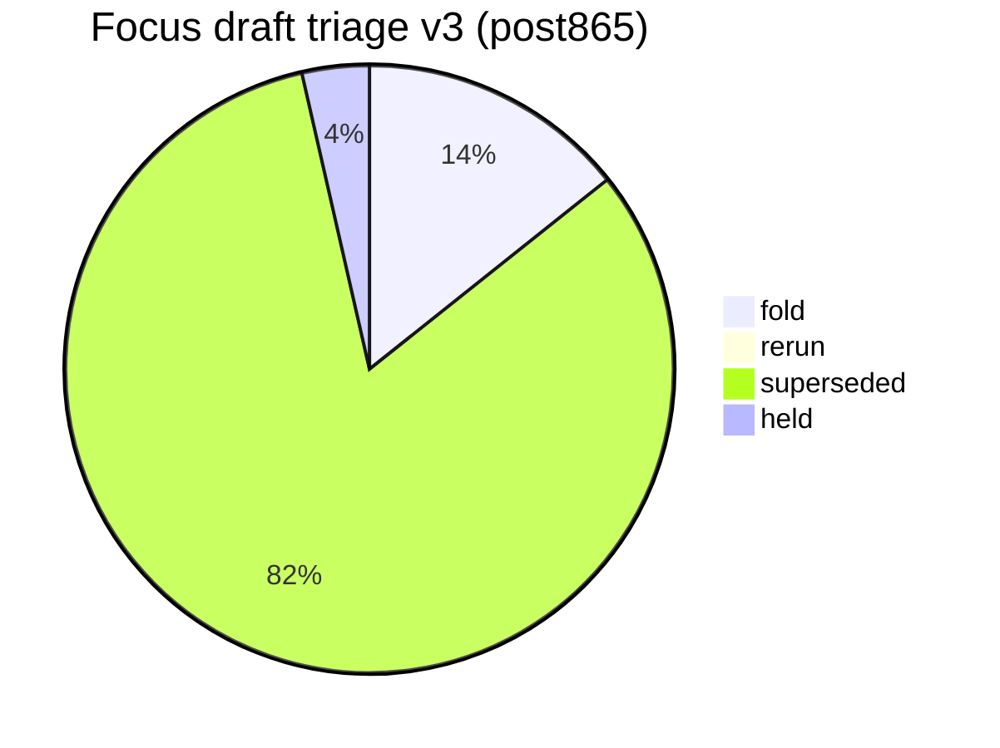
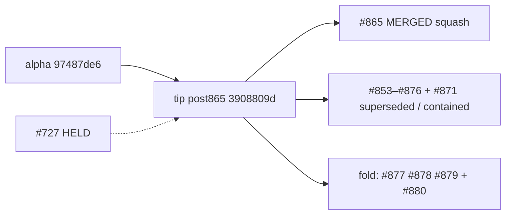

# Open draft triage — tip post865 v3 (2026-10-10)

**Task id:** `q-mp-385`
**Live tip branch:** `cursor/mp-tip-post865`
**Tip SHA checked:** `3908809d672ed70eede7b9c0ad63a6fa475e28e5` (`3908809d`) — cut from alpha right after tip-fold PR **#865** (`q-mp-026k`) squash-merged; tip contains every fold through **#876**; **#877**, **#878**, and round-12 backlog **#879** were deferred and are **not** on tip
**Alpha SHA:** `3908809d672ed70eede7b9c0ad63a6fa475e28e5` (equals tip cut)
**Prior alpha (pre-#865):** `97487de6b6ad16a2f47a07dcff1076ff1d544aa4` (`97487de6`)
**Supersedes (navigation):** open draft **#871** (v2 / `q-mp-360`) — leave open; comment `contained` (do **not** close). Also navigationally supersedes **#850** (v1) / **#819** (v5) / **#782** (v3).
**Prior triage (stale for post865 navigation):** [`open-draft-triage-post830-2026-10-10-v2.md`](./open-draft-triage-post830-2026-10-10-v2.md)
**Machine-readable twin:** [`open-draft-triage-post865-2026-10-10-v3.json`](./open-draft-triage-post865-2026-10-10-v3.json)
**Generated (UTC):** 2026-10-10T05:57:11.463Z
**Scope:** report only — **do not close PRs**, do not mark ready, do not comment / label from this worker task. Tip owner folds into `cursor/mp-tip-post865`.
**Focus set:** HELD **#727**, open post830 drafts **#853–#879** (incl. deferred **#877/#878/#879** and tip-contained **#853–#876** / **#871**), open drafts into `cursor/mp-tip-post865` (**#880+** at snapshot).

## Hard rule (this doc)

> **Do not close PRs.** Prefer comments `contained` or `superseded` (with keeper / tip SHA). Closing remains a tip-owner / Andrew bulk-close action, not a worker action.
>
> **#727 is HELD** (Andrew decision). Do not comment on it, retarget it, fold it, or edit nullish from other agents.

## Tip context

Tip cut `cursor/mp-tip-post865` starts at alpha `3908809d` (= squash of **#865**). Relative to pre-#865 alpha `97487de6`, the squash absorbed the entire post830 tip stack (folds through **#876**), including:

- post830 triage v2 (`open-draft-triage-post830-2026-10-10-v2.{md,json}`)
- Knip unusedTypes demote batch 6 → baseline **36** (live report **35**)
- Engine cov r11/r12, mutation UI w11/w12, UI cov r22/r23/r26, coverage-map refresh
- CI permissions pin, copy-pins inventory, lint-bucket snapshot, board-3d layout inventory
- Soft-fail / residuals characterization suites (url-flags, settings, player-colors, owl-system, grid-alignment, seat/die, game-loading)

**Deferred off tip (still open on base `cursor/mp-tip-post830`):** **#877** (void owl-component −3), **#878** (hex UI cov r25), **#879** (round-12 backlog `q-mp-385`…`409`).

Live tip HEAD has **no additional commits** beyond the cut SHA at measurement time. `AGENTS.md` tip pointer still says `cursor/mp-tip-post830` (stale label on tip tree — tip-owner housekeeping, not this task).

## Live tip ratchet ceilings (re-measured)

Commands on tip `3908809d`:

```text
$ git rev-parse HEAD
  3908809d672ed70eede7b9c0ad63a6fa475e28e5

$ npm run lint:ratchet   # exit 0
  ok   curly: 538 / ceiling 538
  ok   @typescript-eslint/no-non-null-assertion: 246 / ceiling 246
  ok   @typescript-eslint/no-confusing-void-expression: 58 / ceiling 58
  ok   radix: 6 / ceiling 6
  ok   default-case: 5 / ceiling 5
  ok   no-duplicate-imports: 42 / ceiling 42
  ok   @typescript-eslint/prefer-nullish-coalescing: 65 / ceiling 65
  ok   @typescript-eslint/prefer-optional-chain: 21 / ceiling 21
  ok   @typescript-eslint/switch-exhaustiveness-check: 8 / ceiling 8
  ok   @typescript-eslint/no-shadow: 3 / ceiling 3
  ok   eqeqeq: 1 / ceiling 1
  ok   @typescript-eslint/return-await: 3 / ceiling 3

$ npm run typecheck:ratchet
  in-scope errors:     0
  out-of-scope errors: 216   ← AI residual (hard-rule HOLD)

$ find tests/unit \( -name '*.test.ts' -o -name '*.spec.ts' \) ! -path '*/_tokenmaxx_archive/*' | wc -l
  3210

$ npx vitest list | wc -l
  12768

$ npm run report:knip
  unusedExports: 3  unusedTypes: 35  unlisted: 3  duplicates: 0
  (baseline unusedTypes still 36; live shrink NOTICE 36→35)

$ npm run check:dev-docs
  docs scanned: 188; problems: 0

$ rg -n 'hard:\s*450' src/games/hex/ai.ts
  hard: 450   ← HOLD untouched
```

### Before → after tip metrics (v2 @ post830 `97487de6` cut → v3 @ post865 `3908809d`)

| Metric                              |          v2 (post830 cut) |            v3 (post865) |
| ----------------------------------- | ------------------------: | ----------------------: |
| Tip SHA                             |                `97487de6` |              `3908809d` |
| void ceiling                        |                        58 |                  **58** |
| knip unusedTypes (baseline / live)  |                   47 / 43 |             **36 / 35** |
| unit test/spec files (excl archive) |                      3192 |                **3210** |
| Vitest list cases                   |                     12614 |               **12768** |
| Open base `cursor/mp-tip-post830`   |                        13 |                  **26** |
| Open base `cursor/mp-tip-post865`   |     0 (tip did not exist) |               **1** (#880) |
| Focus **fold** recommendations      |                        13 |              **4** |
| Focus **superseded**                |                        26 |             **23** |
| Focus **held**                      |                  1 (#727) |            **1** (#727) |
| `check:dev-docs` scanned            |                       174 | **188** → **190** w/ v3 |

## Classification legend

| Status         | Meaning                                                                                                    |
| -------------- | ---------------------------------------------------------------------------------------------------------- |
| **fold**       | Unique payload not on tip; tip owner should fold (after CI green / ceiling reconcile / retarget if needed) |
| **rerun**      | Payload still wanted, but rebase and/or CI re-run required before fold                                     |
| **superseded** | Payload already on tip `3908809d` (or tip-ahead vs stale head); leave PR open                              |
| **held**       | Tip-owner / Andrew hold — do not fold / do not touch                                                       |

## Enumeration (focus + open inventory)

| Bucket                            |   Count | Notes                                                    |
| --------------------------------- | ------: | -------------------------------------------------------- |
| Open drafts **total**             | **300** | `gh pr list --state open --limit 300` @ snapshot (cap)  |
| Focus drafts classified           |  **28** | #727 + open post830 #853–#879 + open post865             |
| **fold**                          |   **4** | Unique residual vs tip                                   |
| **rerun**                         |   **0** | none at refresh                                          |
| **superseded**                    |  **23** | Absorbed by #865 squash / tip-ahead                      |
| **held**                          |   **1** | #727 only                                                |
| Open base `cursor/mp-tip-post865` |   **1** | new worker drafts into live tip                          |
| Open base `cursor/mp-tip-post830` |  **26** | stale tip base; fold leftovers + tip-contained           |
| Open base `cursor/mp-tip-post785` |  **27** | stale; leave with contained/superseded                   |
| Open base `cursor/mp-tip-post755` |  **44** | stale; leave with contained/superseded                   |

## Status visual





## Focus triage table (primary)

Per-draft recommendation with GitHub check-run status on the **head SHA** (12 CI jobs).

|   PR | Task        | Base      | Head SHA                                   | Rec            | Checks @ head        | Reason |
| ---: | ----------- | --------- | ------------------------------------------ | -------------- | -------------------- | ------ |
| #727 | `q-mp-186` | `post709` | `54532ce5459ca15d880ece9a119a909e56745ef4` | **held** | **12/12** | Andrew HOLD — prefer-nullish-coalescing in owl-messages (−9); do not fold / retarget / comment; nullish ceiling stays 65 |
| #853 | `q-mp-363` | `post830` | `b1b1bb89b860bbb3f90d8fa314cfb2ac4eb398f6` | **superseded** | **12/12** | Payload blob-identical on tip 3908809d via #865 squash; leave open with contained |
| #854 | `q-mp-361` | `post830` | `0184170d3a2874caf00c8a232c999d15d5735c06` | **superseded** | **12/12** | Payload blob-identical on tip 3908809d via #865 squash; leave open with contained |
| #855 | `q-mp-379` | `post830` | `068cd5a678ee9d236dd90f026f9de1bfc552ee76` | **superseded** | **12/12** | Payload blob-identical on tip 3908809d via #865 squash; leave open with contained |
| #856 | `q-mp-362` | `post830` | `d0a1848e74dc2c45923b8d4e6bdf4238cd922f05` | **superseded** | **12/12** | Payload blob-identical on tip 3908809d via #865 squash; leave open with contained |
| #857 | `q-mp-377` | `post830` | `803fa9d00a65dfd2646492719a3c1ad7d42687cc` | **superseded** | **12/12** | Payload blob-identical on tip 3908809d via #865 squash; leave open with contained |
| #858 | `q-mp-374` | `post830` | `44235cf61ed00616f5a4309c763a1b59e8773ee2` | **superseded** | **12/12** | Payload blob-identical on tip 3908809d via #865 squash; leave open with contained |
| #859 | `q-mp-378` | `post830` | `aff0d520eb10dd9ff70622cebb6af48fb3c901c1` | **superseded** | **12/12** | Payload blob-identical on tip 3908809d via #865 squash; leave open with contained |
| #860 | `q-mp-376` | `post830` | `3a896185444743e6bb4b5fa84af117c066738ded` | **superseded** | **12/12** | Payload blob-identical on tip 3908809d via #865 squash; leave open with contained |
| #861 | `q-mp-384` | `post830` | `18de7fa76a533eb687c2b8aff0ed9d3e3edc0c6a` | **superseded** | **12/12** | Payload blob-identical on tip 3908809d via #865 squash; leave open with contained |
| #862 | `q-mp-375` | `post830` | `1fcb584cb448e8987ee9a61ac85de3a3a20e9f5a` | **superseded** | **12/12** | Payload blob-identical on tip 3908809d via #865 squash; leave open with contained |
| #863 | `q-mp-364` | `post830` | `2cc306812aea10fff9d2a537a5cc30cb0509ab0e` | **superseded** | **12/12** | Payload blob-identical on tip 3908809d via #865 squash; leave open with contained |
| #864 | `q-mp-383` | `post830` | `39bfb67347c00f0bc354783493387cc1fb01359b` | **superseded** | **12/12** | Payload blob-identical on tip 3908809d via #865 squash; leave open with contained |
| #866 | `q-mp-365` | `post830` | `e70c2d38d938f5ea30f201a8e8667d7d6b475abd` | **superseded** | **12/12** | Tip-ahead or tip-contained via #865 squash @ 3908809d: residual DIFF vs tip keeper (docs/dev/knip-report.md); leave open with contained |
| #867 | `q-mp-368` | `post830` | `7ec33e0707d607b07e277acbd17defaf6ff26f4f` | **superseded** | **12/12** | Payload blob-identical on tip 3908809d via #865 squash; leave open with contained |
| #868 | `q-mp-369` | `post830` | `7d12795d4b7a7fbda27043ac02fff569d1eab3de` | **superseded** | **12/12** | Payload blob-identical on tip 3908809d via #865 squash; leave open with contained |
| #869 | `q-mp-356` | `post830` | `d959a9b14e0754491b4dc3bca4f590ddf2b8ef7d` | **superseded** | **12/12** | Tip-ahead or tip-contained via #865 squash @ 3908809d: residual DIFF vs tip keeper (docs/dev/knip-report.md); leave open with contained |
| #870 | `q-mp-380` | `post830` | `e822aa751e3c3be873154e5282d35888cd420161` | **superseded** | **12/12** | Payload blob-identical on tip 3908809d via #865 squash; leave open with contained |
| #871 | `q-mp-360` | `post830` | `9d375d76c3aa313d8da84bfe432a4e0d40e5d08d` | **superseded** | **12/12** | Payload blob-identical on tip 3908809d via #865 squash; leave open with contained |
| #872 | `q-mp-373` | `post830` | `649fd8f02dc6fdcb74089f328426d8e31a7c4d66` | **superseded** | **12/12** | Payload blob-identical on tip 3908809d via #865 squash; leave open with contained |
| #873 | `q-mp-336` | `post830` | `2d699cf967a881129c9b8e3a8344b252ca01cde9` | **superseded** | **12/12** | Payload blob-identical on tip 3908809d via #865 squash; leave open with contained |
| #874 | `q-mp-349` | `post830` | `8a8f4ac315cb7de81cb1050791713b455891bc7c` | **superseded** | **12/12** | Payload blob-identical on tip 3908809d via #865 squash; leave open with contained |
| #875 | `q-mp-350` | `post830` | `3126d8c0df9d590df1e03612e9dfcab3215471e7` | **superseded** | **12/12** | Payload blob-identical on tip 3908809d via #865 squash; leave open with contained |
| #876 | `q-mp-372` | `post830` | `f5408ee7bd69fa5c1eadb5cd7ab68303233d8c4a` | **superseded** | **12/12** | Payload blob-identical on tip 3908809d via #865 squash; leave open with contained |
| #877 | `q-mp-366` | `post830` | `42ae924e382ac1641840b43f92f3dcf50dbc75f3` | **fold** | **12/12** | Unique payload vs tip (7 same / 1 diff / 0 new): src/ui/owl/owl-component.ts |
| #878 | `q-mp-371` | `post830` | `914a723c1dac753d2d02c7a01ace88a22bdd2156` | **fold** | **12/12** | Unique payload vs tip (7 same / 0 diff / 2 new): docs/dev/ui-coverage-round-25.md, tests/unit/burn-1010-ui-cov-r25-hex.test.ts |
| #879 | `q-mp-090l` | `post830` | `3895a6bce04731e5c7b284bd517682714ec51e5f` | **fold** | **12/12** | Unique payload vs tip (7 same / 0 diff / 1 new): backlog-2026-10-10c.md (open draft #879; not yet on tip) |
| #880 | `q-mp-395` | `post865` | `6dd6da9ea4dbf2e98f9911cfd54143b731af1ffa` | **fold** | **3/12 (9 pending)** | Unique payload vs tip (0 same / 1 diff / 0 new): src/ui/reduced-motion.ts |

Exact per-check conclusions are also in the JSON twin (`drafts[].checks`).

### Check-run detail (12-job rows)

|   PR | lint | audit | build | unit | e2e | knip | visual-baseline | e2e-fullgame | mobile-touch | zoom-reflow | forced-colors | e2e-cross-browser |
| ---: | ---- | ----- | ----- | ---- | --- | ---- | --------------- | ------------ | ------------ | ----------- | ------------- | ----------------- |
| #727 | ✅ | ✅ | ✅ | ✅ | ✅ | ✅ | ✅ | ✅ | ✅ | ✅ | ✅ | ✅ |
| #853 | ✅ | ✅ | ✅ | ✅ | ✅ | ✅ | ✅ | ✅ | ✅ | ✅ | ✅ | ✅ |
| #854 | ✅ | ✅ | ✅ | ✅ | ✅ | ✅ | ✅ | ✅ | ✅ | ✅ | ✅ | ✅ |
| #855 | ✅ | ✅ | ✅ | ✅ | ✅ | ✅ | ✅ | ✅ | ✅ | ✅ | ✅ | ✅ |
| #856 | ✅ | ✅ | ✅ | ✅ | ✅ | ✅ | ✅ | ✅ | ✅ | ✅ | ✅ | ✅ |
| #857 | ✅ | ✅ | ✅ | ✅ | ✅ | ✅ | ✅ | ✅ | ✅ | ✅ | ✅ | ✅ |
| #858 | ✅ | ✅ | ✅ | ✅ | ✅ | ✅ | ✅ | ✅ | ✅ | ✅ | ✅ | ✅ |
| #859 | ✅ | ✅ | ✅ | ✅ | ✅ | ✅ | ✅ | ✅ | ✅ | ✅ | ✅ | ✅ |
| #860 | ✅ | ✅ | ✅ | ✅ | ✅ | ✅ | ✅ | ✅ | ✅ | ✅ | ✅ | ✅ |
| #861 | ✅ | ✅ | ✅ | ✅ | ✅ | ✅ | ✅ | ✅ | ✅ | ✅ | ✅ | ✅ |
| #862 | ✅ | ✅ | ✅ | ✅ | ✅ | ✅ | ✅ | ✅ | ✅ | ✅ | ✅ | ✅ |
| #863 | ✅ | ✅ | ✅ | ✅ | ✅ | ✅ | ✅ | ✅ | ✅ | ✅ | ✅ | ✅ |
| #864 | ✅ | ✅ | ✅ | ✅ | ✅ | ✅ | ✅ | ✅ | ✅ | ✅ | ✅ | ✅ |
| #866 | ✅ | ✅ | ✅ | ✅ | ✅ | ✅ | ✅ | ✅ | ✅ | ✅ | ✅ | ✅ |
| #867 | ✅ | ✅ | ✅ | ✅ | ✅ | ✅ | ✅ | ✅ | ✅ | ✅ | ✅ | ✅ |
| #868 | ✅ | ✅ | ✅ | ✅ | ✅ | ✅ | ✅ | ✅ | ✅ | ✅ | ✅ | ✅ |
| #869 | ✅ | ✅ | ✅ | ✅ | ✅ | ✅ | ✅ | ✅ | ✅ | ✅ | ✅ | ✅ |
| #870 | ✅ | ✅ | ✅ | ✅ | ✅ | ✅ | ✅ | ✅ | ✅ | ✅ | ✅ | ✅ |
| #871 | ✅ | ✅ | ✅ | ✅ | ✅ | ✅ | ✅ | ✅ | ✅ | ✅ | ✅ | ✅ |
| #872 | ✅ | ✅ | ✅ | ✅ | ✅ | ✅ | ✅ | ✅ | ✅ | ✅ | ✅ | ✅ |
| #873 | ✅ | ✅ | ✅ | ✅ | ✅ | ✅ | ✅ | ✅ | ✅ | ✅ | ✅ | ✅ |
| #874 | ✅ | ✅ | ✅ | ✅ | ✅ | ✅ | ✅ | ✅ | ✅ | ✅ | ✅ | ✅ |
| #875 | ✅ | ✅ | ✅ | ✅ | ✅ | ✅ | ✅ | ✅ | ✅ | ✅ | ✅ | ✅ |
| #876 | ✅ | ✅ | ✅ | ✅ | ✅ | ✅ | ✅ | ✅ | ✅ | ✅ | ✅ | ✅ |
| #877 | ✅ | ✅ | ✅ | ✅ | ✅ | ✅ | ✅ | ✅ | ✅ | ✅ | ✅ | ✅ |
| #878 | ✅ | ✅ | ✅ | ✅ | ✅ | ✅ | ✅ | ✅ | ✅ | ✅ | ✅ | ✅ |
| #879 | ✅ | ✅ | ✅ | ✅ | ✅ | ✅ | ✅ | ✅ | ✅ | ✅ | ✅ | ✅ |
| #880 | ⏳ | ✅ | ✅ | ⏳ | ⏳ | ✅ | ⏳ | ⏳ | ⏳ | ⏳ | ⏳ | ⏳ |

## HELD

### #727 — `q-mp-186` — **held**

| Field          | Value                                                                                            |
| -------------- | ------------------------------------------------------------------------------------------------ |
| Title          | q-mp-186: clear prefer-nullish-coalescing in owl-messages (−9)                                   |
| Base / head    | `cursor/mp-tip-post709` / `54532ce5459ca15d880ece9a119a909e56745ef4`                             |
| Recommendation | **held** — Andrew decision; do not retarget / do not fold / do not comment / do not edit nullish |
| Evidence       | tip-owner HOLD chain; nullish ceiling remains **65** on tip                                      |
| Checks         | **12/12** success (stale base; still do not fold)                                                |

## Suggested fold order (tip owner) — post865 keepers

Skip **superseded** / **held**. Prefer green 12/12 first. Post830-base fold leftovers (**#877/#878/#879**) need retarget to `cursor/mp-tip-post865`. Docs/report-only can batch. Serialize shared void ceiling: tip owner takes **min** of **#877** (−3 → 55) and **#880** (−2 → 56).

| Order |   PR | Task        | Why |
| ----: | ---: | ----------- | --- |
|     1 | #877 | `q-mp-366` | Unique payload vs tip (7 same / 1 diff / 0 new): src/ui/owl/owl-component.ts |
|     2 | #878 | `q-mp-371` | Unique payload vs tip (7 same / 0 diff / 2 new): docs/dev/ui-coverage-round-25.md, tests/unit/burn-1010-ui-cov-r25-hex.test.ts |
|     3 | #879 | `q-mp-090l` | Unique payload vs tip (7 same / 0 diff / 1 new): backlog-2026-10-10c.md (open draft #879; not yet on tip) |
|     4 | #880 | `q-mp-395` | Unique payload vs tip (0 same / 1 diff / 0 new): src/ui/reduced-motion.ts |
|     — | #727 | `q-mp-186`  | **held** — do not fold                                                                                                   |
|     — | #871 | `q-mp-360`  | **superseded** / contained by this v3 — leave open                                                                       |
|     — | #853–#876 | (folded ids) | **superseded** — on tip via #865 — leave open with contained                                                             |

## Post830 leftovers (`#853`–`#879`) — navigation note

**26** drafts still declare base `cursor/mp-tip-post830`. Tip **#865** squash absorbed **#853–#876** (+ **#871** triage v2). Leave those open with `contained` / `superseded` — do **not** close.

Still carrying unique tip-missing payload at this snapshot:

- **#877** (`q-mp-366`) — void brace clear in `owl-component.ts` (−3); retarget + fold; serialize void ceiling with **#880**
- **#878** (`q-mp-371`) — hex UI coverage round 25 (tests-only + doc)
- **#879** (`q-mp-090l`) — round-12 backlog doc (basename `backlog-2026-10-10c.md` on open draft #879) listing `q-mp-385`…`409`

## Conflict / shared-file clusters

| Cluster             | PRs                                   | Files                                                | Fold note                                      |
| ------------------- | ------------------------------------- | ---------------------------------------------------- | ---------------------------------------------- |
| Triage narrative    | #871 (v2) → this v3                   | `docs/dev/open-draft-triage-*`                       | Leave #871 open with `contained`; fold this v3 |
| Nullish HOLD        | #727                                  | `docs/dev/lint-ratchet-ceilings.json` + owl-messages | **Do not fold #727**                           |
| Void ceiling        | #877 (−3 owl) / #880 (−2 reduced-motion) | `docs/dev/lint-ratchet-ceilings.json` + hosts     | Tip owner **min** after both folds             |
| Round-12 backlog    | #879                                  | backlog-2026-10-10c.md (on #879 only)              | Fold early so workers retarget post865         |
| Knip report tip-ahead | #866 / #869                         | `docs/dev/knip-report.md`                            | Leave contained; tip has batch-6 baseline 36   |

## Method

1. Read `q-mp-385` from draft **#879** (basename `backlog-2026-10-10c.md`; not yet on tip) — spec base `cursor/mp-tip-post830` / tip `bcf6f825` is **stale**; re-measure on `cursor/mp-tip-post865` @ `3908809d`.
2. Confirm open **#871** covers v2 only; no other open draft is a post865 triage v3 → proceed.
3. Enumerate open drafts: HELD **#727**, open post830 **#853–#879**, open post865 **#880+**.
4. Per draft: three-dot `tip...head` blob identity; ignore `AGENTS.md` + `lint-ratchet-ceilings.json` noise; tip-ahead stale DIFF → **superseded**; `mergeable`; GitHub check-runs on **head SHA**.
5. Classify **fold** / **rerun** / **superseded** / **held**. Policy: **#727 held**.
6. Tip re-measure: `npm run lint:ratchet` (void **58**, shadow **3**, dup **42**); unit files → **3210**; knip unusedTypes live **35** / baseline **36**; Hex Hard **450** untouched; `check:dev-docs` clean.
7. **No PR closes, merges, ready flips, comments, or labels** by this task. Docs/JSON only.

## Explicitly do **not** fold next

- **#727** — held; nullish untouched; do not comment.
- **#853–#876** and **#871** — superseded / tip-contained via #865; already on tip `3908809d`.
- Stale post785 / post755 / older stacks without tip-owner retarget.
- Hard-rule HOLD AI/copy/rules/scoring work.

Next action: fold into tip by the tip owner
