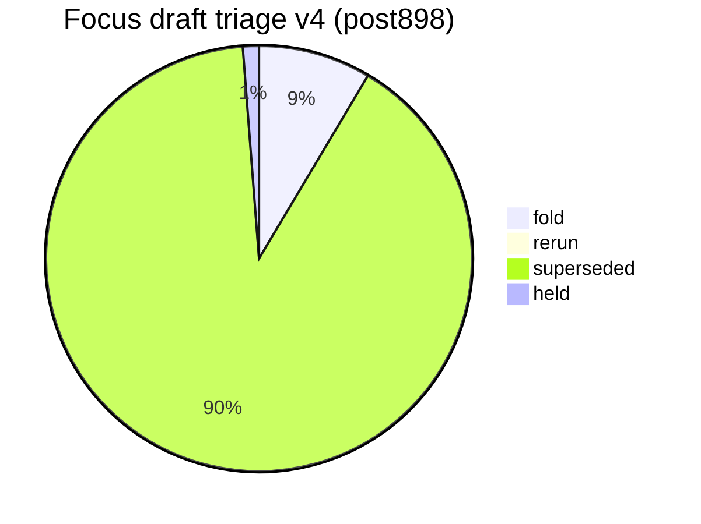
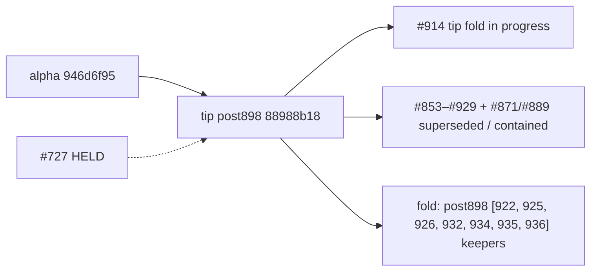

# Open draft triage — tip post898 v4 (2026-10-10)

**Task id:** `q-mp-444`
**Live tip branch:** `cursor/mp-tip-post898`
**Tip SHA checked:** `88988b18e9bcf7734ca28993958cbd373adcdc86` (`88988b18`) — cut from alpha `946d6f95` after tip-fold PR **#898**; tip owner **#914** folded leftovers **#900–#913** plus post898 keepers through **#929** (void → **51**, nnnull → **241**); tip head still moving
**Alpha SHA:** `946d6f956b54de10e08240ba8b26194c2e3b779d` (`946d6f95`) — tip cut base (pre-#914 folds)
**Supersedes (navigation):** open draft **#889** (v3 / `q-mp-385`) and **#871** (v2 / `q-mp-360`) — leave open; comment `contained` (do **not** close). Also navigationally supersedes **#850** (v1) / **#819** (v5).
**Prior triage (stale for post898 navigation):** [`open-draft-triage-post865-2026-10-10-v3.md`](./open-draft-triage-post865-2026-10-10-v3.md)
**Machine-readable twin:** [`open-draft-triage-post898-v4-2026-10-10.json`](./open-draft-triage-post898-v4-2026-10-10.json)
**Status visual:** [`open-draft-triage-post898-v4-2026-10-10.svg`](./open-draft-triage-post898-v4-2026-10-10.svg)
**Generated (UTC):** 2026-10-10T08:52:23.738Z
**Scope:** report only — **do not close PRs**, do not mark ready, do not comment / label from this worker task. Tip owner folds into `cursor/mp-tip-post898`.
**Focus set:** HELD **#727**, open post830 **#853–#879**, open post865 **#880–#913**, open post898 **#915–#937** at snapshot (excl. this v4 PR until opened).

## Hard rule (this doc)

> **Do not close PRs.** Prefer comments `contained` or `superseded` (with keeper / tip SHA). Closing remains a tip-owner / Andrew bulk-close action, not a worker action.
>
> **#727 is HELD** (Andrew decision). Do not comment on it, retarget it, fold it, or edit nullish from other agents.

## Tip context

Tip cut `cursor/mp-tip-post898` starts at alpha `946d6f95` (= squash of **#898**). Tip **#914** has absorbed **#900–#913** and many post898 keepers already. Live tip HEAD at measurement: `88988b18`.

**Alpha #898 already contained** (comments posted by tip owner; leave open): **#877–#897**, **#899**. **#878/#879** still show open on base post830 but payloads are tip-identical.

## Live tip ratchet ceilings (re-measured)

Commands on tip `88988b18`:

```text
$ git rev-parse HEAD
  88988b18e9bcf7734ca28993958cbd373adcdc86

$ npm run lint:ratchet   # exit 0
  ok   curly: 538 / ceiling 538
  ok   @typescript-eslint/no-non-null-assertion: 241 / ceiling 241
  ok   @typescript-eslint/no-confusing-void-expression: 51 / ceiling 51
  ok   radix: 6 / ceiling 6
  ok   default-case: 5 / ceiling 5
  ok   no-duplicate-imports: 42 / ceiling 42
  ok   @typescript-eslint/prefer-nullish-coalescing: 65 / ceiling 65
  ok   @typescript-eslint/prefer-optional-chain: 21 / ceiling 21
  ok   @typescript-eslint/switch-exhaustiveness-check: 8 / ceiling 8
  ok   @typescript-eslint/no-shadow: 3 / ceiling 3
  ok   eqeqeq: 1 / ceiling 1
  ok   @typescript-eslint/return-await: 3 / ceiling 3

$ npm run typecheck:ratchet
  in-scope errors:     0
  out-of-scope errors: 216   ← AI residual (hard-rule HOLD)

$ find tests/unit \( -name '*.test.ts' -o -name '*.spec.ts' \) ! -path '*/_tokenmaxx_archive/*' | wc -l
  3239

$ npx vitest list | wc -l
  13022

$ npm run report:knip
  unusedExports: 3  unusedTypes: 32  unlisted: 3  duplicates: 0
  (baseline unusedTypes still 36; live shrink NOTICE 36→32)

$ npm run check:dev-docs
  docs scanned: 223; problems: 0   ← tip tree md count before this v4 md

$ rg -n 'hard:\s*450' src/games/hex/ai.ts
  hard: 450   ← HOLD untouched
```

### Before → after tip metrics (v3 @ post865 cut `3908809d` → v4 @ post898 `88988b18`)

| Metric                              |      v3 (post865 cut) |               v4 (post898) |
| ----------------------------------- | --------------------: | -------------------------: |
| Tip SHA                             |            `3908809d` |                 `88988b18` |
| void ceiling                        |                    58 |                     **51** |
| nnnull ceiling                      |                   246 |                    **241** |
| knip unusedTypes (baseline / live)  |               36 / 35 |                **36 / 32** |
| unit test/spec files (excl archive) |                  3210 |                   **3239** |
| Vitest list cases                   |                 12768 |                  **13022** |
| Open base `cursor/mp-tip-post865`   |                    16 |                     **33** |
| Open base `cursor/mp-tip-post898`   | 0 (tip did not exist) |                     **23** |
| Focus **fold** recommendations      |                    19 |          **7** (+ this v4) |
| Focus **superseded**                |                    23 |                     **74** |
| Focus **held**                      |              1 (#727) |               **1** (#727) |
| `check:dev-docs` scanned (tip md)   |                   188 | **223** → **224** w/ v4 md |

## Classification legend

| Status         | Meaning                                                                                                    |
| -------------- | ---------------------------------------------------------------------------------------------------------- |
| **fold**       | Unique payload not on tip; tip owner should fold (after CI green / ceiling reconcile / retarget if needed) |
| **rerun**      | Payload still wanted, but rebase and/or CI re-run required before fold                                     |
| **superseded** | Payload already on tip `88988b18` (or tip-ahead vs stale head); leave PR open                              |
| **held**       | Tip-owner / Andrew hold — do not fold / do not touch                                                       |

## Enumeration (focus + open inventory)

| Bucket                            |   Count | Notes                                           |
| --------------------------------- | ------: | ----------------------------------------------- |
| Open drafts **total**             | **360** | `gh pr list --state open` paginated @ snapshot  |
| Focus drafts classified           |  **82** | #727 + post830 + post865 + post898 focus set    |
| **fold**                          |   **7** | Unique residual vs tip                          |
| **rerun**                         |   **0** | none at refresh                                 |
| **superseded**                    |  **74** | Absorbed by #898/#914 / tip-ahead               |
| **held**                          |   **1** | #727 only                                       |
| Open base `cursor/mp-tip-post898` |  **23** | live tip worker drafts (+ tip PR #914 on alpha) |
| Open base `cursor/mp-tip-post865` |  **33** | stale tip base; tip-contained leftovers         |
| Open base `cursor/mp-tip-post830` |  **25** | stale; leave with contained/superseded          |
| Open base `cursor/mp-tip-post785` |  **27** | stale; leave with contained/superseded          |

## Status visual





## Focus triage table (primary)

Per-draft recommendation with GitHub check-run status on the **head SHA** (12 CI jobs).

|   PR | Task        | Base      | Head SHA                                   | Rec            | Checks @ head         | Reason                                                                                                                                                                                                                                                                                                                                                              |
| ---: | ----------- | --------- | ------------------------------------------ | -------------- | --------------------- | ------------------------------------------------------------------------------------------------------------------------------------------------------------------------------------------------------------------------------------------------------------------------------------------------------------------------------------------------------------------- |
| #727 | `q-mp-186`  | `post709` | `54532ce5459ca15d880ece9a119a909e56745ef4` | **held**       | **12/12**             | Andrew HOLD — prefer-nullish-coalescing in owl-messages (−9); do not fold / retarget / comment; nullish ceiling stays 65                                                                                                                                                                                                                                            |
| #853 | `q-mp-363`  | `post830` | `b1b1bb89b860bbb3f90d8fa314cfb2ac4eb398f6` | **superseded** | **12/12**             | Payload blob-identical on tip 88988b18 (via #898 alpha squash and/or tip #914 folds); leave open with contained                                                                                                                                                                                                                                                     |
| #854 | `q-mp-361`  | `post830` | `0184170d3a2874caf00c8a232c999d15d5735c06` | **superseded** | **12/12**             | Payload blob-identical on tip 88988b18 (via #898 alpha squash and/or tip #914 folds); leave open with contained                                                                                                                                                                                                                                                     |
| #855 | `q-mp-379`  | `post830` | `068cd5a678ee9d236dd90f026f9de1bfc552ee76` | **superseded** | **12/12**             | Payload blob-identical on tip 88988b18 (via #898 alpha squash and/or tip #914 folds); leave open with contained                                                                                                                                                                                                                                                     |
| #856 | `q-mp-362`  | `post830` | `d0a1848e74dc2c45923b8d4e6bdf4238cd922f05` | **superseded** | **12/12**             | Payload blob-identical on tip 88988b18 (via #898 alpha squash and/or tip #914 folds); leave open with contained                                                                                                                                                                                                                                                     |
| #857 | `q-mp-377`  | `post830` | `803fa9d00a65dfd2646492719a3c1ad7d42687cc` | **superseded** | **12/12**             | Payload blob-identical on tip 88988b18 (via #898 alpha squash and/or tip #914 folds); leave open with contained                                                                                                                                                                                                                                                     |
| #858 | `q-mp-374`  | `post830` | `44235cf61ed00616f5a4309c763a1b59e8773ee2` | **superseded** | **12/12**             | Payload blob-identical on tip 88988b18 (via #898 alpha squash and/or tip #914 folds); leave open with contained                                                                                                                                                                                                                                                     |
| #859 | `q-mp-378`  | `post830` | `aff0d520eb10dd9ff70622cebb6af48fb3c901c1` | **superseded** | **12/12**             | Payload blob-identical on tip 88988b18 (via #898 alpha squash and/or tip #914 folds); leave open with contained                                                                                                                                                                                                                                                     |
| #860 | `q-mp-376`  | `post830` | `3a896185444743e6bb4b5fa84af117c066738ded` | **superseded** | **12/12**             | Payload blob-identical on tip 88988b18 (via #898 alpha squash and/or tip #914 folds); leave open with contained                                                                                                                                                                                                                                                     |
| #861 | `q-mp-384`  | `post830` | `18de7fa76a533eb687c2b8aff0ed9d3e3edc0c6a` | **superseded** | **12/12**             | Tip-ahead or tip-contained @ 88988b18: residual DIFF vs tip keeper (docs/dev/board3d-layout-reads-inventory-post830-2026-10-10.md); leave open with contained                                                                                                                                                                                                       |
| #862 | `q-mp-375`  | `post830` | `1fcb584cb448e8987ee9a61ac85de3a3a20e9f5a` | **superseded** | **12/12**             | Payload blob-identical on tip 88988b18 (via #898 alpha squash and/or tip #914 folds); leave open with contained                                                                                                                                                                                                                                                     |
| #863 | `q-mp-364`  | `post830` | `2cc306812aea10fff9d2a537a5cc30cb0509ab0e` | **superseded** | **12/12**             | Tip-ahead or tip-contained @ 88988b18: residual DIFF vs tip keeper (docs/dev/lint-bucket-report.md); leave open with contained                                                                                                                                                                                                                                      |
| #864 | `q-mp-383`  | `post830` | `39bfb67347c00f0bc354783493387cc1fb01359b` | **superseded** | **12/12**             | Payload blob-identical on tip 88988b18 (via #898 alpha squash and/or tip #914 folds); leave open with contained                                                                                                                                                                                                                                                     |
| #866 | `q-mp-365`  | `post830` | `e70c2d38d938f5ea30f201a8e8667d7d6b475abd` | **superseded** | **12/12**             | Tip-ahead or tip-contained @ 88988b18: residual DIFF vs tip keeper (docs/dev/knip-report.md); leave open with contained                                                                                                                                                                                                                                             |
| #867 | `q-mp-368`  | `post830` | `7ec33e0707d607b07e277acbd17defaf6ff26f4f` | **superseded** | **12/12**             | Payload blob-identical on tip 88988b18 (via #898 alpha squash and/or tip #914 folds); leave open with contained                                                                                                                                                                                                                                                     |
| #868 | `q-mp-369`  | `post830` | `7d12795d4b7a7fbda27043ac02fff569d1eab3de` | **superseded** | **12/12**             | Payload blob-identical on tip 88988b18 (via #898 alpha squash and/or tip #914 folds); leave open with contained                                                                                                                                                                                                                                                     |
| #869 | `q-mp-356`  | `post830` | `d959a9b14e0754491b4dc3bca4f590ddf2b8ef7d` | **superseded** | **12/12**             | Tip-ahead or tip-contained @ 88988b18: residual DIFF vs tip keeper (docs/dev/knip-report.md, src/ui/pointer-hygiene.ts); leave open with contained                                                                                                                                                                                                                  |
| #870 | `q-mp-380`  | `post830` | `e822aa751e3c3be873154e5282d35888cd420161` | **superseded** | **12/12**             | Payload blob-identical on tip 88988b18 (via #898 alpha squash and/or tip #914 folds); leave open with contained                                                                                                                                                                                                                                                     |
| #871 | `q-mp-360`  | `post830` | `9d375d76c3aa313d8da84bfe432a4e0d40e5d08d` | **superseded** | **12/12**             | Prior open-draft triage (v2/v3); leave open with contained — this v4 is the navigation keeper @ tip 88988b18                                                                                                                                                                                                                                                        |
| #872 | `q-mp-373`  | `post830` | `649fd8f02dc6fdcb74089f328426d8e31a7c4d66` | **superseded** | **12/12**             | Payload blob-identical on tip 88988b18 (via #898 alpha squash and/or tip #914 folds); leave open with contained                                                                                                                                                                                                                                                     |
| #873 | `q-mp-336`  | `post830` | `2d699cf967a881129c9b8e3a8344b252ca01cde9` | **superseded** | **12/12**             | Tip-ahead or tip-contained @ 88988b18: residual DIFF vs tip keeper (docs/dev/coverage-map.md, docs/dev/coverage-map.svg, docs/wiki/coverage-map.md); leave open with contained                                                                                                                                                                                      |
| #874 | `q-mp-349`  | `post830` | `8a8f4ac315cb7de81cb1050791713b455891bc7c` | **superseded** | **12/12**             | Payload blob-identical on tip 88988b18 (via #898 alpha squash and/or tip #914 folds); leave open with contained                                                                                                                                                                                                                                                     |
| #875 | `q-mp-350`  | `post830` | `3126d8c0df9d590df1e03612e9dfcab3215471e7` | **superseded** | **12/12**             | Payload blob-identical on tip 88988b18 (via #898 alpha squash and/or tip #914 folds); leave open with contained                                                                                                                                                                                                                                                     |
| #876 | `q-mp-372`  | `post830` | `f5408ee7bd69fa5c1eadb5cd7ab68303233d8c4a` | **superseded** | **12/12**             | Payload blob-identical on tip 88988b18 (via #898 alpha squash and/or tip #914 folds); leave open with contained                                                                                                                                                                                                                                                     |
| #878 | `q-mp-371`  | `post830` | `914a723c1dac753d2d02c7a01ace88a22bdd2156` | **superseded** | **12/12**             | Payload blob-identical on tip 88988b18 (via #898 alpha squash and/or tip #914 folds); leave open with contained                                                                                                                                                                                                                                                     |
| #879 | `q-mp-090l` | `post830` | `3895a6bce04731e5c7b284bd517682714ec51e5f` | **superseded** | **12/12**             | Payload blob-identical on tip 88988b18 (via #898 alpha squash and/or tip #914 folds); leave open with contained                                                                                                                                                                                                                                                     |
| #880 | `q-mp-395`  | `post865` | `6dd6da9ea4dbf2e98f9911cfd54143b731af1ffa` | **superseded** | **12/12**             | Payload blob-identical on tip 88988b18 (via #898 alpha squash and/or tip #914 folds); leave open with contained                                                                                                                                                                                                                                                     |
| #881 | `q-mp-393`  | `post865` | `ca8ceb0c4b5856b19f7580a87cdb9916e47e0c60` | **superseded** | **12/12**             | Tip-ahead or tip-contained @ 88988b18: residual DIFF vs tip keeper (docs/wiki/development.md); leave open with contained                                                                                                                                                                                                                                            |
| #882 | `q-mp-391`  | `post865` | `6490c49573d157d03321fc110cc4afda193f6126` | **superseded** | **12/12**             | Payload blob-identical on tip 88988b18 (via #898 alpha squash and/or tip #914 folds); leave open with contained                                                                                                                                                                                                                                                     |
| #883 | `q-mp-390`  | `post865` | `db932a83735a13084c61a5a50877191618aa110e` | **superseded** | **12/12**             | Payload blob-identical on tip 88988b18 (via #898 alpha squash and/or tip #914 folds); leave open with contained                                                                                                                                                                                                                                                     |
| #884 | `q-mp-404`  | `post865` | `5b077ecca82b207887e8700b579d0a0df4a7c736` | **superseded** | **12/12**             | Payload blob-identical on tip 88988b18 (via #898 alpha squash and/or tip #914 folds); leave open with contained                                                                                                                                                                                                                                                     |
| #885 | `q-mp-406`  | `post865` | `ec76d833651659ee282ab72ab0a9ebb8ce0acc5c` | **superseded** | **12/12**             | Payload blob-identical on tip 88988b18 (via #898 alpha squash and/or tip #914 folds); leave open with contained                                                                                                                                                                                                                                                     |
| #886 | `q-mp-386`  | `post865` | `145a6e76505f3092d9e5d1d811be61138dc0f0df` | **superseded** | **12/12**             | Tip-ahead or tip-contained @ 88988b18: residual DIFF vs tip keeper (docs/dev/testing-layers-2026-10-09.md, docs/wiki/development.md); leave open with contained                                                                                                                                                                                                     |
| #887 | `q-mp-388`  | `post865` | `018d7aa0d1abf3d54cff7d25b15ce347fb9050ed` | **superseded** | **12/12**             | Payload blob-identical on tip 88988b18 (via #898 alpha squash and/or tip #914 folds); leave open with contained                                                                                                                                                                                                                                                     |
| #888 | `q-mp-394`  | `post865` | `0d0dda77dc301ab01ac210e3e1c5585a1560a3c9` | **superseded** | **12/12**             | Payload blob-identical on tip 88988b18 (via #898 alpha squash and/or tip #914 folds); leave open with contained                                                                                                                                                                                                                                                     |
| #889 | `q-mp-385`  | `post865` | `7cd8ce9808ab0ab8f6837ecad6ad9b62d4aade7a` | **superseded** | **12/12**             | Prior open-draft triage (v2/v3); leave open with contained — this v4 is the navigation keeper @ tip 88988b18                                                                                                                                                                                                                                                        |
| #890 | `q-mp-398`  | `post865` | `e017342de0d211b6cd8e3cd46797bfab70037e3a` | **superseded** | **12/12**             | Payload blob-identical on tip 88988b18 (via #898 alpha squash and/or tip #914 folds); leave open with contained                                                                                                                                                                                                                                                     |
| #891 | `q-mp-392`  | `post865` | `5cc3c94c9f42d309a2ed08decb8e0df2ff008625` | **superseded** | **12/12**             | Payload blob-identical on tip 88988b18 (via #898 alpha squash and/or tip #914 folds); leave open with contained                                                                                                                                                                                                                                                     |
| #892 | `q-mp-399`  | `post865` | `81d42ae281758fa9d3ef5ae898f5b617fa29aafe` | **superseded** | **12/12**             | Payload blob-identical on tip 88988b18 (via #898 alpha squash and/or tip #914 folds); leave open with contained                                                                                                                                                                                                                                                     |
| #893 | `q-mp-403`  | `post865` | `1bfbfb652cf12f883b3becafeea39acbb954d6fd` | **superseded** | **12/12**             | Payload blob-identical on tip 88988b18 (via #898 alpha squash and/or tip #914 folds); leave open with contained                                                                                                                                                                                                                                                     |
| #894 | `q-mp-397`  | `post865` | `b162ec0897365d40a1fa4cc777f54782168b0fe0` | **superseded** | **12/12**             | Payload blob-identical on tip 88988b18 (via #898 alpha squash and/or tip #914 folds); leave open with contained                                                                                                                                                                                                                                                     |
| #895 | `q-mp-400`  | `post865` | `d7ca2d5666ac57f6ec30489e2a060f86525be073` | **superseded** | **12/12**             | Payload blob-identical on tip 88988b18 (via #898 alpha squash and/or tip #914 folds); leave open with contained                                                                                                                                                                                                                                                     |
| #896 | `q-mp-402`  | `post865` | `0a45ae7ab2e93b31e06c96429e7a5fe8e915ed45` | **superseded** | **12/12**             | Payload blob-identical on tip 88988b18 (via #898 alpha squash and/or tip #914 folds); leave open with contained                                                                                                                                                                                                                                                     |
| #897 | `q-mp-090m` | `post865` | `c75d7dce56dd31166f3eafc5e8d5405e80179b26` | **superseded** | **12/12**             | Payload blob-identical on tip 88988b18 (via #898 alpha squash and/or tip #914 folds); leave open with contained                                                                                                                                                                                                                                                     |
| #899 | `q-mp-401`  | `post865` | `a2b923098033929913de4c7b5f98f2c07d2503e5` | **superseded** | **12/12**             | Payload blob-identical on tip 88988b18 (via #898 alpha squash and/or tip #914 folds); leave open with contained                                                                                                                                                                                                                                                     |
| #900 | `q-mp-413`  | `post865` | `0d743ced1afb1165117eb2f54f5af689a2d119ea` | **superseded** | **12/12**             | Tip-ahead or tip-contained @ 88988b18: residual DIFF vs tip keeper (docs/wiki/development.md); leave open with contained                                                                                                                                                                                                                                            |
| #901 | `q-mp-423`  | `post865` | `9b7ecc715a41b0f6af3bf9c1dae0774390e7f238` | **superseded** | **12/12**             | Tip-ahead or tip-contained @ 88988b18: residual DIFF vs tip keeper (docs/wiki/development.md); leave open with contained                                                                                                                                                                                                                                            |
| #902 | `q-mp-430`  | `post865` | `6f26d2246e197355919bcfe55571538a6d5c6fc8` | **superseded** | **12/12**             | Tip-ahead or tip-contained @ 88988b18: residual DIFF vs tip keeper (docs/wiki/development.md); leave open with contained                                                                                                                                                                                                                                            |
| #903 | `q-mp-414`  | `post865` | `cca2440b27ec1a417fe67f0ab11f56958bdd8f6f` | **superseded** | **12/12**             | Tip-ahead or tip-contained @ 88988b18: residual DIFF vs tip keeper (docs/wiki/development.md); leave open with contained                                                                                                                                                                                                                                            |
| #904 | `q-mp-422`  | `post865` | `79b3eeaef9bbc5f2c2a85ce6533468682a3beba8` | **superseded** | **12/12**             | Tip-ahead or tip-contained @ 88988b18: residual DIFF vs tip keeper (docs/wiki/development.md, vitest.config.ts); leave open with contained                                                                                                                                                                                                                          |
| #905 | `q-mp-415`  | `post865` | `fa0b94f93f91a0e50e25f5749a73bfe04f393a45` | **superseded** | **12/12**             | Tip-ahead or tip-contained @ 88988b18: residual DIFF vs tip keeper (docs/wiki/development.md); leave open with contained                                                                                                                                                                                                                                            |
| #906 | `q-mp-431`  | `post865` | `34f933e2d2f3b361030bd8ecfa8baedde7fdb41e` | **superseded** | **12/12**             | Tip-ahead or tip-contained @ 88988b18: residual DIFF vs tip keeper (docs/wiki/development.md); leave open with contained                                                                                                                                                                                                                                            |
| #907 | `q-mp-421`  | `post865` | `c3e90cc84efb5fb0b490f3f46fdaf5a241c8dc8c` | **superseded** | **12/12**             | Tip-ahead or tip-contained @ 88988b18: residual DIFF vs tip keeper (docs/wiki/development.md); leave open with contained                                                                                                                                                                                                                                            |
| #908 | `q-mp-418`  | `post865` | `a55babb35a75c32220c92dcfdb8bd3c2f1c349b7` | **superseded** | **12/12**             | Tip-ahead or tip-contained @ 88988b18: residual DIFF vs tip keeper (docs/wiki/development.md); leave open with contained                                                                                                                                                                                                                                            |
| #909 | `q-mp-420`  | `post865` | `e4516364f9a2c54595bf7029a885e76cf4aaac1e` | **superseded** | **12/12**             | Tip-ahead or tip-contained @ 88988b18: residual DIFF vs tip keeper (docs/wiki/development.md, vitest.config.ts); leave open with contained                                                                                                                                                                                                                          |
| #910 | `q-mp-416`  | `post865` | `2eba17e5cbfea9a3ceffa0b4345739eef89f0c44` | **superseded** | **12/12**             | Tip-ahead or tip-contained @ 88988b18: residual DIFF vs tip keeper (docs/dev/lint-bucket-report.md, docs/dev/testing-layers-2026-10-09.md, docs/wiki/development.md); leave open with contained                                                                                                                                                                     |
| #911 | `q-mp-428`  | `post865` | `d7f7c8aaa9880bf7c22a04c4155681cbdd272bf5` | **superseded** | **12/12**             | Tip-ahead or tip-contained @ 88988b18: residual DIFF vs tip keeper (docs/wiki/development.md); leave open with contained                                                                                                                                                                                                                                            |
| #912 | `q-mp-429`  | `post865` | `d94996e07c8a05eb5484cd337d050b2134b2af08` | **superseded** | **12/12**             | Tip-ahead or tip-contained @ 88988b18: residual DIFF vs tip keeper (docs/dev/testing-layers-2026-10-09.md, docs/wiki/development.md); leave open with contained                                                                                                                                                                                                     |
| #913 | `q-mp-417`  | `post865` | `6149cc16aa2b8f7673b8ed47f20856d1dcef65b7` | **superseded** | **12/12**             | Tip-ahead or tip-contained @ 88988b18: residual DIFF vs tip keeper (docs/dev/testing-layers-2026-10-09.md, docs/wiki/development.md); leave open with contained                                                                                                                                                                                                     |
| #915 | `q-mp-425`  | `post898` | `6ce61084945f9af2c22e38f760b23baa8afa5a54` | **superseded** | **12/12**             | Payload blob-identical on tip 88988b18 (via #898 alpha squash and/or tip #914 folds); leave open with contained                                                                                                                                                                                                                                                     |
| #916 | `q-mp-424`  | `post898` | `3b1eea0582e8fe90079bbc2bd0a0cec5cb099aa7` | **superseded** | **12/12**             | Payload blob-identical on tip 88988b18 (via #898 alpha squash and/or tip #914 folds); leave open with contained                                                                                                                                                                                                                                                     |
| #917 | `q-mp-427`  | `post898` | `cf8c93731fb535dcd9ea0b57c9b475ae2425e3c5` | **superseded** | **12/12**             | Payload blob-identical on tip 88988b18 (via #898 alpha squash and/or tip #914 folds); leave open with contained                                                                                                                                                                                                                                                     |
| #918 | `q-mp-419`  | `post898` | `a310f431272a657d66c98c6a49056c0dbb699d98` | **superseded** | **12/12**             | Payload blob-identical on tip 88988b18 (via #898 alpha squash and/or tip #914 folds); leave open with contained                                                                                                                                                                                                                                                     |
| #919 | `q-mp-426`  | `post898` | `362dcfe27fe2399f3f5e0bb8d5ab7cb0101e57ee` | **superseded** | **12/12**             | Payload blob-identical on tip 88988b18 (via #898 alpha squash and/or tip #914 folds); leave open with contained                                                                                                                                                                                                                                                     |
| #920 | `q-mp-432`  | `post898` | `787256b2efff886b8c8ec9c34a61ad5f7f7c7076` | **superseded** | **12/12**             | Payload blob-identical on tip 88988b18 (via #898 alpha squash and/or tip #914 folds); leave open with contained                                                                                                                                                                                                                                                     |
| #921 | `q-mp-090n` | `post898` | `b833d5824f2447f2c922ad0d1ff7d46843da955a` | **superseded** | **12/12**             | Payload blob-identical on tip 88988b18 (via #898 alpha squash and/or tip #914 folds); leave open with contained                                                                                                                                                                                                                                                     |
| #922 | `q-mp-443`  | `post898` | `6399674570f58c78a758da42263bc249765aab45` | **fold**       | **12/12**             | Unique payload vs tip (0 same / 0 diff / 3 new): docs/dev/copy-pins-residual-inventory-post898-2026-10-10.json, docs/dev/copy-pins-residual-inventory-post898-2026-10-10.md, docs/dev/copy-pins-residual-inventory-post898-2026-10-10.svg                                                                                                                           |
| #923 | `q-mp-448`  | `post898` | `4922453c4bae0bf93464633eb621487a08e959cc` | **superseded** | **12/12**             | Payload blob-identical on tip 88988b18 (via #898 alpha squash and/or tip #914 folds); leave open with contained                                                                                                                                                                                                                                                     |
| #924 | `q-mp-439`  | `post898` | `8f7400db8614e81fc3d5a8ad80903db5d95ea509` | **superseded** | **12/12**             | Payload blob-identical on tip 88988b18 (via #898 alpha squash and/or tip #914 folds); leave open with contained                                                                                                                                                                                                                                                     |
| #925 | `q-mp-455`  | `post898` | `ab182224225a8cde53b124d9b45442ec2b24454d` | **fold**       | **11/12 (1 pending)** | Unique payload vs tip (0 same / 0 diff / 1 new): tests/unit/q-mp-455-safe-web-storage-feature-flags-residuals.test.ts                                                                                                                                                                                                                                               |
| #926 | `q-mp-440`  | `post898` | `b9c8d7430cf43bb82c499e863d00c57d5b2c1687` | **fold**       | **4/12 (8 pending)**  | Unique payload vs tip (0 same / 3 diff / 2 new): docs/dev/board3d-layout-reads-inventory-2026-10-09.md, docs/dev/board3d-layout-reads-inventory-post830-2026-10-10.md, docs/dev/board3d-layout-reads-inventory-post865-2026-10-10.md, docs/dev/board3d-layout-reads-inventory-post898-2026-10-10.md, docs/dev/board3d-layout-reads-inventory-post898-2026-10-10.svg |
| #927 | `q-mp-453`  | `post898` | `d7e0368f9f8fe7a346d87bd9c4784b839b84e9f4` | **superseded** | **12/12**             | Payload blob-identical on tip 88988b18 (via #898 alpha squash and/or tip #914 folds); leave open with contained                                                                                                                                                                                                                                                     |
| #928 | `q-mp-441`  | `post898` | `a66ac15cd9995c70acb85b869cc731b85b49d3c0` | **superseded** | **11/12 (1 pending)** | Tip-ahead or tip-contained @ 88988b18: residual DIFF vs tip keeper (docs/dev/lint-bucket-report.md, docs/dev/lint-bucket-snapshot-post898-2026-10-10.json, docs/dev/lint-bucket-snapshot-post898-2026-10-10.md, docs/dev/lint-bucket-snapshot-post898-2026-10-10.svg); leave open with contained                                                                    |
| #929 | `q-mp-445`  | `post898` | `713b03f1b924249eb4beb98c6614c2a6de6843fc` | **superseded** | **8/12 (4 pending)**  | Tip-ahead or tip-contained @ 88988b18: residual DIFF vs tip keeper (docs/dev/testing-layers-2026-10-09.md, docs/wiki/development.md); leave open with contained                                                                                                                                                                                                     |
| #930 | `q-mp-438`  | `post898` | `ec427d2df982b2a339d907769c28da083156242f` | **superseded** | **12/12**             | Payload blob-identical on tip 88988b18 (via #898 alpha squash and/or tip #914 folds); leave open with contained                                                                                                                                                                                                                                                     |
| #931 | `q-mp-447`  | `post898` | `c15397dd7439588df35767e8e1c363c76889d467` | **superseded** | **12/12**             | Payload blob-identical on tip 88988b18 (via #898 alpha squash and/or tip #914 folds); leave open with contained                                                                                                                                                                                                                                                     |
| #932 | `q-mp-454`  | `post898` | `e75c0af8401b94490599d01aa79465446bc1c484` | **fold**       | **12/12**             | Unique payload vs tip (0 same / 1 diff / 1 new): tests/unit/q-mp-454-game-selector-soft-fail-residuals.test.ts, vitest.config.ts                                                                                                                                                                                                                                    |
| #933 | `q-mp-457`  | `post898` | `78205241e2be22608d9e365ab5c260df134ed911` | **superseded** | **12/12**             | Payload blob-identical on tip 88988b18 (via #898 alpha squash and/or tip #914 folds); leave open with contained                                                                                                                                                                                                                                                     |
| #934 | `q-mp-090o` | `post898` | `d73174c8ca516add5522f077d1c424b86b09bd85` | **fold**       | **11/12 (1 pending)** | Unique payload vs tip (0 same / 0 diff / 1 new): backlog-2026-10-10f.md                                                                                                                                                                                                                                                                                             |
| #935 | `q-mp-456`  | `post898` | `8cf29381812be3640a6cb817152eed149a3e973e` | **fold**       | **0/12 (12 failure)** | Unique payload vs tip (0 same / 0 diff / 2 new): docs/dev/engine-coverage-round-15.md, tests/unit/engine-coverage-round-15-burn-1008.test.ts                                                                                                                                                                                                                        |
| #936 | `q-mp-446`  | `post898` | `19fa9196bca8f47c980f1aaa089af524b1542f71` | **fold**       | **9/12 (3 pending)**  | Unique payload vs tip (0 same / 0 diff / 3 new): docs/dev/ci-unit-wall-budget-post898-2026-10-10.json, docs/dev/ci-unit-wall-budget-post898-2026-10-10.md, docs/dev/ci-unit-wall-budget-post898-2026-10-10.svg                                                                                                                                                      |
| #937 | `q-mp-442`  | `post898` | `ba39054ad03a38952b39a736689b11f4c74dac29` | **superseded** | **9/12 (3 pending)**  | Tip-ahead or tip-contained @ 88988b18: residual DIFF vs tip keeper (docs/dev/coverage-map.md, docs/dev/coverage-map.svg, docs/wiki/coverage-map.md); leave open with contained                                                                                                                                                                                      |

Exact per-check conclusions are also in the JSON twin (`drafts[].checks`).

### Check-run detail (12-job rows)

|   PR | lint | audit | build | unit | e2e | knip | visual-baseline | e2e-fullgame | mobile-touch | zoom-reflow | forced-colors | e2e-cross-browser |
| ---: | ---- | ----- | ----- | ---- | --- | ---- | --------------- | ------------ | ------------ | ----------- | ------------- | ----------------- |
| #727 | ✅   | ✅    | ✅    | ✅   | ✅  | ✅   | ✅              | ✅           | ✅           | ✅          | ✅            | ✅                |
| #853 | ✅   | ✅    | ✅    | ✅   | ✅  | ✅   | ✅              | ✅           | ✅           | ✅          | ✅            | ✅                |
| #854 | ✅   | ✅    | ✅    | ✅   | ✅  | ✅   | ✅              | ✅           | ✅           | ✅          | ✅            | ✅                |
| #855 | ✅   | ✅    | ✅    | ✅   | ✅  | ✅   | ✅              | ✅           | ✅           | ✅          | ✅            | ✅                |
| #856 | ✅   | ✅    | ✅    | ✅   | ✅  | ✅   | ✅              | ✅           | ✅           | ✅          | ✅            | ✅                |
| #857 | ✅   | ✅    | ✅    | ✅   | ✅  | ✅   | ✅              | ✅           | ✅           | ✅          | ✅            | ✅                |
| #858 | ✅   | ✅    | ✅    | ✅   | ✅  | ✅   | ✅              | ✅           | ✅           | ✅          | ✅            | ✅                |
| #859 | ✅   | ✅    | ✅    | ✅   | ✅  | ✅   | ✅              | ✅           | ✅           | ✅          | ✅            | ✅                |
| #860 | ✅   | ✅    | ✅    | ✅   | ✅  | ✅   | ✅              | ✅           | ✅           | ✅          | ✅            | ✅                |
| #861 | ✅   | ✅    | ✅    | ✅   | ✅  | ✅   | ✅              | ✅           | ✅           | ✅          | ✅            | ✅                |
| #862 | ✅   | ✅    | ✅    | ✅   | ✅  | ✅   | ✅              | ✅           | ✅           | ✅          | ✅            | ✅                |
| #863 | ✅   | ✅    | ✅    | ✅   | ✅  | ✅   | ✅              | ✅           | ✅           | ✅          | ✅            | ✅                |
| #864 | ✅   | ✅    | ✅    | ✅   | ✅  | ✅   | ✅              | ✅           | ✅           | ✅          | ✅            | ✅                |
| #866 | ✅   | ✅    | ✅    | ✅   | ✅  | ✅   | ✅              | ✅           | ✅           | ✅          | ✅            | ✅                |
| #867 | ✅   | ✅    | ✅    | ✅   | ✅  | ✅   | ✅              | ✅           | ✅           | ✅          | ✅            | ✅                |
| #868 | ✅   | ✅    | ✅    | ✅   | ✅  | ✅   | ✅              | ✅           | ✅           | ✅          | ✅            | ✅                |
| #869 | ✅   | ✅    | ✅    | ✅   | ✅  | ✅   | ✅              | ✅           | ✅           | ✅          | ✅            | ✅                |
| #870 | ✅   | ✅    | ✅    | ✅   | ✅  | ✅   | ✅              | ✅           | ✅           | ✅          | ✅            | ✅                |
| #871 | ✅   | ✅    | ✅    | ✅   | ✅  | ✅   | ✅              | ✅           | ✅           | ✅          | ✅            | ✅                |
| #872 | ✅   | ✅    | ✅    | ✅   | ✅  | ✅   | ✅              | ✅           | ✅           | ✅          | ✅            | ✅                |
| #873 | ✅   | ✅    | ✅    | ✅   | ✅  | ✅   | ✅              | ✅           | ✅           | ✅          | ✅            | ✅                |
| #874 | ✅   | ✅    | ✅    | ✅   | ✅  | ✅   | ✅              | ✅           | ✅           | ✅          | ✅            | ✅                |
| #875 | ✅   | ✅    | ✅    | ✅   | ✅  | ✅   | ✅              | ✅           | ✅           | ✅          | ✅            | ✅                |
| #876 | ✅   | ✅    | ✅    | ✅   | ✅  | ✅   | ✅              | ✅           | ✅           | ✅          | ✅            | ✅                |
| #878 | ✅   | ✅    | ✅    | ✅   | ✅  | ✅   | ✅              | ✅           | ✅           | ✅          | ✅            | ✅                |
| #879 | ✅   | ✅    | ✅    | ✅   | ✅  | ✅   | ✅              | ✅           | ✅           | ✅          | ✅            | ✅                |
| #880 | ✅   | ✅    | ✅    | ✅   | ✅  | ✅   | ✅              | ✅           | ✅           | ✅          | ✅            | ✅                |
| #881 | ✅   | ✅    | ✅    | ✅   | ✅  | ✅   | ✅              | ✅           | ✅           | ✅          | ✅            | ✅                |
| #882 | ✅   | ✅    | ✅    | ✅   | ✅  | ✅   | ✅              | ✅           | ✅           | ✅          | ✅            | ✅                |
| #883 | ✅   | ✅    | ✅    | ✅   | ✅  | ✅   | ✅              | ✅           | ✅           | ✅          | ✅            | ✅                |
| #884 | ✅   | ✅    | ✅    | ✅   | ✅  | ✅   | ✅              | ✅           | ✅           | ✅          | ✅            | ✅                |
| #885 | ✅   | ✅    | ✅    | ✅   | ✅  | ✅   | ✅              | ✅           | ✅           | ✅          | ✅            | ✅                |
| #886 | ✅   | ✅    | ✅    | ✅   | ✅  | ✅   | ✅              | ✅           | ✅           | ✅          | ✅            | ✅                |
| #887 | ✅   | ✅    | ✅    | ✅   | ✅  | ✅   | ✅              | ✅           | ✅           | ✅          | ✅            | ✅                |
| #888 | ✅   | ✅    | ✅    | ✅   | ✅  | ✅   | ✅              | ✅           | ✅           | ✅          | ✅            | ✅                |
| #889 | ✅   | ✅    | ✅    | ✅   | ✅  | ✅   | ✅              | ✅           | ✅           | ✅          | ✅            | ✅                |
| #890 | ✅   | ✅    | ✅    | ✅   | ✅  | ✅   | ✅              | ✅           | ✅           | ✅          | ✅            | ✅                |
| #891 | ✅   | ✅    | ✅    | ✅   | ✅  | ✅   | ✅              | ✅           | ✅           | ✅          | ✅            | ✅                |
| #892 | ✅   | ✅    | ✅    | ✅   | ✅  | ✅   | ✅              | ✅           | ✅           | ✅          | ✅            | ✅                |
| #893 | ✅   | ✅    | ✅    | ✅   | ✅  | ✅   | ✅              | ✅           | ✅           | ✅          | ✅            | ✅                |
| #894 | ✅   | ✅    | ✅    | ✅   | ✅  | ✅   | ✅              | ✅           | ✅           | ✅          | ✅            | ✅                |
| #895 | ✅   | ✅    | ✅    | ✅   | ✅  | ✅   | ✅              | ✅           | ✅           | ✅          | ✅            | ✅                |
| #896 | ✅   | ✅    | ✅    | ✅   | ✅  | ✅   | ✅              | ✅           | ✅           | ✅          | ✅            | ✅                |
| #897 | ✅   | ✅    | ✅    | ✅   | ✅  | ✅   | ✅              | ✅           | ✅           | ✅          | ✅            | ✅                |
| #899 | ✅   | ✅    | ✅    | ✅   | ✅  | ✅   | ✅              | ✅           | ✅           | ✅          | ✅            | ✅                |
| #900 | ✅   | ✅    | ✅    | ✅   | ✅  | ✅   | ✅              | ✅           | ✅           | ✅          | ✅            | ✅                |
| #901 | ✅   | ✅    | ✅    | ✅   | ✅  | ✅   | ✅              | ✅           | ✅           | ✅          | ✅            | ✅                |
| #902 | ✅   | ✅    | ✅    | ✅   | ✅  | ✅   | ✅              | ✅           | ✅           | ✅          | ✅            | ✅                |
| #903 | ✅   | ✅    | ✅    | ✅   | ✅  | ✅   | ✅              | ✅           | ✅           | ✅          | ✅            | ✅                |
| #904 | ✅   | ✅    | ✅    | ✅   | ✅  | ✅   | ✅              | ✅           | ✅           | ✅          | ✅            | ✅                |
| #905 | ✅   | ✅    | ✅    | ✅   | ✅  | ✅   | ✅              | ✅           | ✅           | ✅          | ✅            | ✅                |
| #906 | ✅   | ✅    | ✅    | ✅   | ✅  | ✅   | ✅              | ✅           | ✅           | ✅          | ✅            | ✅                |
| #907 | ✅   | ✅    | ✅    | ✅   | ✅  | ✅   | ✅              | ✅           | ✅           | ✅          | ✅            | ✅                |
| #908 | ✅   | ✅    | ✅    | ✅   | ✅  | ✅   | ✅              | ✅           | ✅           | ✅          | ✅            | ✅                |
| #909 | ✅   | ✅    | ✅    | ✅   | ✅  | ✅   | ✅              | ✅           | ✅           | ✅          | ✅            | ✅                |
| #910 | ✅   | ✅    | ✅    | ✅   | ✅  | ✅   | ✅              | ✅           | ✅           | ✅          | ✅            | ✅                |
| #911 | ✅   | ✅    | ✅    | ✅   | ✅  | ✅   | ✅              | ✅           | ✅           | ✅          | ✅            | ✅                |
| #912 | ✅   | ✅    | ✅    | ✅   | ✅  | ✅   | ✅              | ✅           | ✅           | ✅          | ✅            | ✅                |
| #913 | ✅   | ✅    | ✅    | ✅   | ✅  | ✅   | ✅              | ✅           | ✅           | ✅          | ✅            | ✅                |
| #915 | ✅   | ✅    | ✅    | ✅   | ✅  | ✅   | ✅              | ✅           | ✅           | ✅          | ✅            | ✅                |
| #916 | ✅   | ✅    | ✅    | ✅   | ✅  | ✅   | ✅              | ✅           | ✅           | ✅          | ✅            | ✅                |
| #917 | ✅   | ✅    | ✅    | ✅   | ✅  | ✅   | ✅              | ✅           | ✅           | ✅          | ✅            | ✅                |
| #918 | ✅   | ✅    | ✅    | ✅   | ✅  | ✅   | ✅              | ✅           | ✅           | ✅          | ✅            | ✅                |
| #919 | ✅   | ✅    | ✅    | ✅   | ✅  | ✅   | ✅              | ✅           | ✅           | ✅          | ✅            | ✅                |
| #920 | ✅   | ✅    | ✅    | ✅   | ✅  | ✅   | ✅              | ✅           | ✅           | ✅          | ✅            | ✅                |
| #921 | ✅   | ✅    | ✅    | ✅   | ✅  | ✅   | ✅              | ✅           | ✅           | ✅          | ✅            | ✅                |
| #922 | ✅   | ✅    | ✅    | ✅   | ✅  | ✅   | ✅              | ✅           | ✅           | ✅          | ✅            | ✅                |
| #923 | ✅   | ✅    | ✅    | ✅   | ✅  | ✅   | ✅              | ✅           | ✅           | ✅          | ✅            | ✅                |
| #924 | ✅   | ✅    | ✅    | ✅   | ✅  | ✅   | ✅              | ✅           | ✅           | ✅          | ✅            | ✅                |
| #925 | ✅   | ✅    | ✅    | ✅   | ✅  | ✅   | ✅              | ✅           | ✅           | ✅          | ✅            | ⏳                |
| #926 | ✅   | ✅    | ✅    | ⏳   | ⏳  | ✅   | ⏳              | ⏳           | ⏳           | ⏳          | ⏳            | ⏳                |
| #927 | ✅   | ✅    | ✅    | ✅   | ✅  | ✅   | ✅              | ✅           | ✅           | ✅          | ✅            | ✅                |
| #928 | ✅   | ✅    | ✅    | ✅   | ✅  | ✅   | ✅              | ✅           | ✅           | ✅          | ✅            | ⏳                |
| #929 | ✅   | ✅    | ✅    | ⏳   | ⏳  | ✅   | ✅              | ⏳           | ✅           | ✅          | ✅            | ⏳                |
| #930 | ✅   | ✅    | ✅    | ✅   | ✅  | ✅   | ✅              | ✅           | ✅           | ✅          | ✅            | ✅                |
| #931 | ✅   | ✅    | ✅    | ✅   | ✅  | ✅   | ✅              | ✅           | ✅           | ✅          | ✅            | ✅                |
| #932 | ✅   | ✅    | ✅    | ✅   | ✅  | ✅   | ✅              | ✅           | ✅           | ✅          | ✅            | ✅                |
| #933 | ✅   | ✅    | ✅    | ✅   | ✅  | ✅   | ✅              | ✅           | ✅           | ✅          | ✅            | ✅                |
| #934 | ✅   | ✅    | ✅    | ✅   | ✅  | ✅   | ✅              | ✅           | ✅           | ✅          | ✅            | ⏳                |
| #935 | ❌   | ❌    | ❌    | ❌   | ❌  | ❌   | ❌              | ❌           | ❌           | ❌          | ❌            | ❌                |
| #936 | ✅   | ✅    | ✅    | ⏳   | ✅  | ✅   | ✅              | ⏳           | ✅           | ✅          | ✅            | ⏳                |
| #937 | ✅   | ✅    | ✅    | ✅   | ⏳  | ✅   | ✅              | ⏳           | ✅           | ✅          | ✅            | ⏳                |

## HELD

### #727 — `q-mp-186` — **held**

| Field          | Value                                                                                            |
| -------------- | ------------------------------------------------------------------------------------------------ |
| Title          | q-mp-186: clear prefer-nullish-coalescing in owl-messages (−9)                                   |
| Base / head    | `cursor/mp-tip-post709` / `54532ce5459ca15d880ece9a119a909e56745ef4`                             |
| Recommendation | **held** — Andrew decision; do not retarget / do not fold / do not comment / do not edit nullish |
| Evidence       | tip-owner HOLD chain; nullish ceiling remains **65** on tip                                      |
| Checks         | **12/12** success (stale base; still do not fold)                                                |

## Suggested fold order (tip owner) — post898 keepers

Skip **superseded** / **held**. Prefer green 12/12 first. Docs/report-only can batch.

| Order |          PR | Task         | Why                                                                                                                                          |
| ----: | ----------: | ------------ | -------------------------------------------------------------------------------------------------------------------------------------------- |
|     1 |    _(this)_ | `q-mp-444`   | This triage v4 deliverable (docs/json/svg only); tip owner should fold after 12/12 green                                                     |
|     2 |        #922 | `q-mp-443`   | Unique payload vs tip (0 same / 0 diff / 3 new): docs/dev/copy-pins-residual-inventory-post898-2026-10-10.json, docs/dev/copy-pins-residu…   |
|     3 |        #925 | `q-mp-455`   | Unique payload vs tip (0 same / 0 diff / 1 new): tests/unit/q-mp-455-safe-web-storage-feature-flags-residuals.test.ts                        |
|     4 |        #926 | `q-mp-440`   | Unique payload vs tip (0 same / 3 diff / 2 new): docs/dev/board3d-layout-reads-inventory-2026-10-09.md, docs/dev/board3d-layout-reads-inv…   |
|     5 |        #932 | `q-mp-454`   | Unique payload vs tip (0 same / 1 diff / 1 new): tests/unit/q-mp-454-game-selector-soft-fail-residuals.test.ts, vitest.config.ts             |
|     6 |        #934 | `q-mp-090o`  | Unique payload vs tip (0 same / 0 diff / 1 new): backlog-2026-10-10f.md                                                                      |
|     7 |        #935 | `q-mp-456`   | Unique payload vs tip (0 same / 0 diff / 2 new): docs/dev/engine-coverage-round-15.md, tests/unit/engine-coverage-round-15-burn-1008.test.ts |
|     8 |        #936 | `q-mp-446`   | Unique payload vs tip (0 same / 0 diff / 3 new): docs/dev/ci-unit-wall-budget-post898-2026-10-10.json, docs/dev/ci-unit-wall-budget-post8…   |
|     — |        #727 | `q-mp-186`   | **held** — do not fold                                                                                                                       |
|     — | #889 / #871 | triage v3/v2 | **superseded** / contained by this v4 — leave open                                                                                           |
|     — |   #853–#929 | (folded ids) | **superseded** — on tip via #898/#914 — leave open with contained                                                                            |

## Post865 leftovers (`#880`–`#913`) — navigation note

**33** drafts still declare base `cursor/mp-tip-post865`. Alpha **#898** + tip **#914** absorbed their payloads (or tip-ahead shared docs). Leave open with `contained` / `superseded` — do **not** close.

Still carrying unique tip-missing payload at this snapshot (base `cursor/mp-tip-post898`):

- **#922** (`q-mp-443`) — copy-pins-residual-inventory-post898-2026-10-10.json, copy-pins-residual-inventory-post898-2026-10-10.md, copy-pins-residual-inventory-post898-2026-10-10.svg
- **#925** (`q-mp-455`) — tests/unit/q-mp-455-safe-web-storage-feature-flags-residuals.test.ts
- **#926** (`q-mp-440`) — board3d-layout-reads-inventory-2026-10-09.md, board3d-layout-reads-inventory-post830-2026-10-10.md, board3d-layout-reads-inventory-post865-2026-10-10.md, board3d-layout-reads-inventory-post898-2026-10-10.md
- **#932** (`q-mp-454`) — tests/unit/q-mp-454-game-selector-soft-fail-residuals.test.ts, vitest.config.ts
- **#934** (`q-mp-090o`) — backlog-2026-10-10f.md
- **#935** (`q-mp-456`) — engine-coverage-round-15.md, tests/unit/engine-coverage-round-15-burn-1008.test.ts
- **#936** (`q-mp-446`) — ci-unit-wall-budget-post898-2026-10-10.json, ci-unit-wall-budget-post898-2026-10-10.md, ci-unit-wall-budget-post898-2026-10-10.svg

## Conflict / shared-file clusters

| Cluster            | PRs                             | Files                                    | Fold note                                        |
| ------------------ | ------------------------------- | ---------------------------------------- | ------------------------------------------------ |
| Triage narrative   | #889 (v3) / #871 (v2) → this v4 | open-draft-triage-* under docs/dev/      | Leave #889/#871 open with `contained`; fold v4   |
| Nullish HOLD       | #727                            | lint-ratchet-ceilings + owl-messages     | **Do not fold #727**                             |
| Board-3d inventory | #926 vs tip-contained #905/#861 | board3d-layout-reads-inventory-post898-* | Fold #926 (post898 stamp); leave older contained |
| Typecheck OOS map  | #931 vs tip-contained #907/#881 | typecheck-oos-216-hold-map-post898-*     | Fold #931 after CI green; leave older contained  |
| Round-15 backlog   | #934                            | backlog-2026-10-10f.md                   | Fold early for next worker wave                  |

## Method

1. Read `q-mp-444` from tip basename `backlog-2026-10-10e.md` (also open on **#921**) — measured baseline of **6** open post898 drafts is **stale**; re-measure on live tip `88988b18`.
2. Confirm open **#889** covers v3 only; no other open draft is a post898 triage v4 → proceed.
3. Enumerate open drafts: HELD **#727**, open post830 **#853–#879**, open post865 **#880–#913**, open post898 focus set.
4. Per draft: three-dot `tip...head` blob identity; ignore `AGENTS.md` + lint-ratchet-ceilings noise; tip-ahead shared-doc DIFF → **superseded**; material `new`/`diff` → **fold**; GitHub check-runs on **head SHA**.
5. Classify **fold** / **rerun** / **superseded** / **held**. Policy: **#727 held**.
6. Tip re-measure @ `88988b18`: void **51**, nnnull **241**; unit files → **3239**; knip unusedTypes live **32** / baseline **36**; Hex Hard **450** untouched; `check:dev-docs` clean.
7. **No PR closes, merges, ready flips, comments, or labels** by this task. Docs/JSON/SVG only.

## Explicitly do **not** fold next

- **#727** — held; nullish untouched; do not comment.
- Tip-contained post830/post865/post898 drafts and prior triage **#871/#889** — superseded via #898/#914; already on tip `88988b18` (or tip-ahead).
- Stale post785 / post755 / older stacks without tip-owner retarget.
- Hard-rule HOLD AI/copy/rules/scoring work.

Next action: fold into tip by the tip owner
