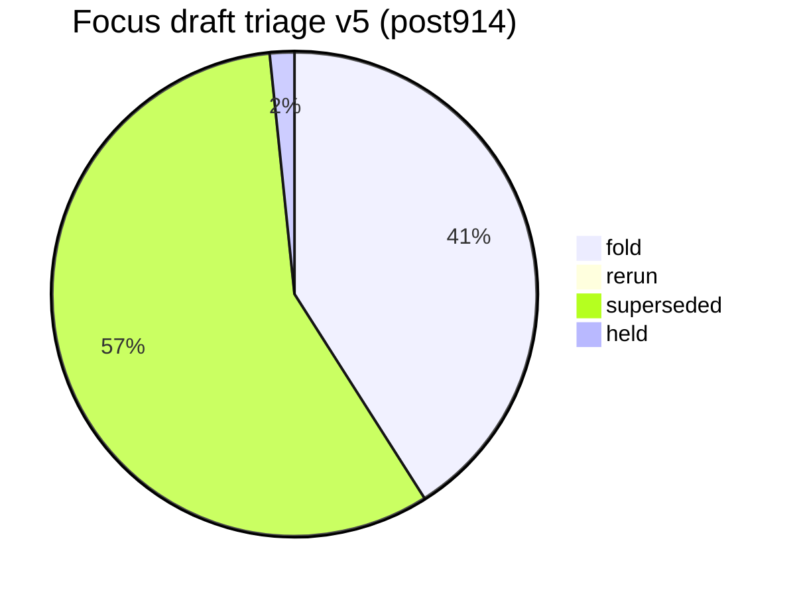
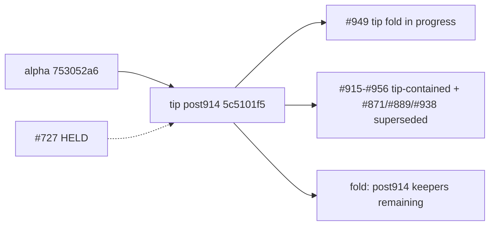

# Open draft triage — tip post914 v5 (2026-10-10)

**Task id:** `q-mp-494`
**Live tip branch:** `cursor/mp-tip-post914`
**Tip SHA checked:** `5c5101f59422d8b9f9142c7a6852b5d9d148e5f9` (`5c5101f5`) — cut from alpha `753052a6` after tip-fold PR **#914** squash-merged; tip owner **#949** folding leftovers **#929–#971** (tip head still moving)
**Alpha SHA:** `753052a6844e80c6264d1d2480deafa5a9e7b59c` (`753052a6`) — tip cut base (post898 tip fold squash)
**Supersedes (navigation):** open draft **#938** (v4 / `q-mp-444`), **#889** (v3 / `q-mp-385`), **#871** (v2 / `q-mp-360`) — leave open; comment `contained` (do **not** close). Also navigationally supersedes **#850** (v1) / **#819** (v5).
**Prior triage (stale for post914 navigation):** [`open-draft-triage-post898-v4-2026-10-10.md`](./open-draft-triage-post898-v4-2026-10-10.md)
**Machine-readable twin:** [`open-draft-triage-post914-v5-2026-10-10.json`](./open-draft-triage-post914-v5-2026-10-10.json)
**Status visual:** [`open-draft-triage-post914-v5-2026-10-10.svg`](./open-draft-triage-post914-v5-2026-10-10.svg)
**Generated (UTC):** 2026-10-10T10:12:00.000Z
**Scope:** report only — **do not close PRs**, do not mark ready, do not comment / label from this worker task. Tip owner folds into `cursor/mp-tip-post914`.
**Focus set:** HELD **#727**, prior triage **#819/#850/#871/#889/#938**, open post898 **#915–#938**, open post914 **#939–#971** at snapshot (excl. this v5 PR until opened).

## Hard rule (this doc)

> **Do not close PRs.** Prefer comments `contained` or `superseded` (with keeper / tip SHA). Closing remains a tip-owner / Andrew bulk-close action, not a worker action.
>
> **#727 is HELD** (Andrew decision). Do not comment on it, retarget it, fold it, or edit nullish from other agents.

## Tip context

Tip cut `cursor/mp-tip-post914` starts at alpha `753052a6` (= squash of **#914**). Tip owner **#949** (draft into `alpha`) is folding post898 leftovers and post914 worker keepers. Live tip HEAD at measurement: `5c5101f5`.

Backlog audit baseline (stale): **14** open into post914 @ `e43a25d2`. **Live re-measure:** **32** open into post914 (tip #949 already folded payloads for **#939/#940/#941/#942/#943/#944/#956**; newer workers through **#971**).

## Live tip ratchet ceilings (re-measured)

Commands on tip `5c5101f5`:

```text
$ git rev-parse HEAD
  5c5101f59422d8b9f9142c7a6852b5d9d148e5f9

$ npm run lint:ratchet   # exit 0
  ok   curly: 538 / ceiling 538
  ok   @typescript-eslint/no-non-null-assertion: 241 / ceiling 241
  ok   @typescript-eslint/no-confusing-void-expression: 51 / ceiling 51
  ok   radix: 6 / ceiling 6
  ok   default-case: 5 / ceiling 5
  ok   no-duplicate-imports: 42 / ceiling 42
  ok   @typescript-eslint/prefer-nullish-coalescing: 65 / ceiling 65
  ok   @typescript-eslint/prefer-optional-chain: 21 / ceiling 21
  ok   @typescript-eslint/switch-exhaustiveness-check: 8 / ceiling 8
  ok   @typescript-eslint/no-shadow: 3 / ceiling 3
  ok   eqeqeq: 1 / ceiling 1
  ok   @typescript-eslint/return-await: 3 / ceiling 3

$ npm run typecheck:ratchet
  in-scope errors:     0
  out-of-scope errors: 216   ← AI residual (hard-rule HOLD)

$ find tests/unit \( -name '*.test.ts' -o -name '*.spec.ts' \) ! -path '*/_tokenmaxx_archive/*' | wc -l
  3245

$ npx vitest list | wc -l
  13100

$ npm run report:knip
  unusedExports: 3  unusedTypes: 32  unlisted: 3  duplicates: 0
  (baseline unusedTypes still 36; live shrink NOTICE 36→32)

$ npm run check:dev-docs
  docs scanned: 234; problems: 0   ← tip tree md count before this v5 md

$ rg -n 'hard:\s*450' src/games/hex/ai.ts
  hard: 450   ← HOLD untouched
```

### Before → after tip metrics (v4 @ post898 `697b9609` → v5 @ post914 `5c5101f5`)

| Metric                              |      v4 (post898) |               v5 (post914) |
| ----------------------------------- | ----------------: | -------------------------: |
| Tip SHA                             |        `697b9609` |                 `5c5101f5` |
| void ceiling                        |                51 |                     **51** |
| nnnull ceiling                      |               241 |                    **241** |
| knip unusedTypes (baseline / live)  |           36 / 32 |                **36 / 32** |
| unit test/spec files (excl archive) |              3240 |                   **3245** |
| Vitest list cases                   |             13036 |                  **13100** |
| Open base `cursor/mp-tip-post898`   |                24 |                     **24** |
| Open base `cursor/mp-tip-post914`   | 0 (tip did not exist) |                 **32** |
| Focus **fold** recommendations      |                 4 |          **25** (+ this v5) |
| Focus **superseded**                |                77 |                     **35** |
| Focus **held**                      |          1 (#727) |               **1** (#727) |
| `check:dev-docs` scanned (tip md)   |               225 | **234** → **237** w/ v5 md/json/svg |

## Classification legend

| Status         | Meaning |
| -------------- | ------- |
| **fold**       | Unique `only_head` payload not on tip; tip owner should fold (after CI green) |
| **rerun**      | Payload still wanted, but rebase and/or CI re-run required before fold |
| **superseded** | Payload already on tip `5c5101f5` (blob-identical) or tip-ahead on both-touched paths; leave PR open |
| **held**       | Tip-owner / Andrew hold — do not fold / do not touch |

## Enumeration (focus + open inventory)

| Bucket                            |   Count | Notes |
| --------------------------------- | ------: | ----- |
| Open drafts **total**             | **393** | `gh api` paginated @ snapshot |
| Focus drafts classified           |  **61** | #727 + prior triage + post898 + post914 |
| **fold**                          |   **25** | Unique residual vs tip |
| **rerun**                         |   **0** | none at refresh |
| **superseded**                    |  **35** | Absorbed by #914 / tip #949 / tip-ahead / prior triage |
| **held**                          |   **1** | #727 only |
| Open base `cursor/mp-tip-post914` |  **32** | live tip worker drafts (+ tip PR #949 on alpha) |
| Open base `cursor/mp-tip-post898` |  **24** | stale tip base; tip-contained leftovers |
| Open base `cursor/mp-tip-post865` |  **33** | stale; leave with contained/superseded |
| Open base `cursor/mp-tip-post830` |  **25** | stale; leave with contained/superseded |
| Open base `cursor/mp-tip-post785` |  **27** | stale; leave with contained/superseded |

## Status visual





## Focus triage table (primary)

Per-draft recommendation with GitHub check-run status on the **head SHA** (12 CI jobs).

|   PR | Task        | Base      | Head SHA                                   | Rec            | Checks @ head         | Reason |
| ---: | ----------- | --------- | ------------------------------------------ | -------------- | --------------------- | ------ |
| #727 | `q-mp-186`  | `post709` | `54532ce5459ca15d880ece9a119a909e56745ef4` | **held** | **12/12** | Andrew HOLD — prefer-nullish-coalescing in owl-messages (−9); do not fold / retarget / comment; nullish ceiling stays 65 |
| #819 | `q-mp-309`  | `post755` | `7d87294895a39624c66f52a0cca88e6c4707b91a` | **superseded** | **12/12** | Prior open-draft triage; leave open with contained — this v5 is the navigation keeper @ tip 5c5101f5 |
| #850 | `q-mp-334`  | `post785` | `b27147cd6b06b2e68da023ba1c078e8dc7f5d9b9` | **superseded** | **12/12** | Prior open-draft triage; leave open with contained — this v5 is the navigation keeper @ tip 5c5101f5 |
| #871 | `q-mp-360`  | `post830` | `9d375d76c3aa313d8da84bfe432a4e0d40e5d08d` | **superseded** | **12/12** | Prior open-draft triage; leave open with contained — this v5 is the navigation keeper @ tip 5c5101f5 |
| #889 | `q-mp-385`  | `post865` | `7cd8ce9808ab0ab8f6837ecad6ad9b62d4aade7a` | **superseded** | **12/12** | Prior open-draft triage; leave open with contained — this v5 is the navigation keeper @ tip 5c5101f5 |
| #915 | `q-mp-425`  | `post898` | `6ce61084945f9af2c22e38f760b23baa8afa5a54` | **superseded** | **12/12** | Payload blob-identical on tip 5c5101f5 (via #914 alpha squash and/or tip #949 folds); leave open with contained |
| #916 | `q-mp-424`  | `post898` | `3b1eea0582e8fe90079bbc2bd0a0cec5cb099aa7` | **superseded** | **12/12** | Payload blob-identical on tip 5c5101f5 (via #914 alpha squash and/or tip #949 folds); leave open with contained |
| #917 | `q-mp-427`  | `post898` | `cf8c93731fb535dcd9ea0b57c9b475ae2425e3c5` | **superseded** | **12/12** | Payload blob-identical on tip 5c5101f5 (via #914 alpha squash and/or tip #949 folds); leave open with contained |
| #918 | `q-mp-419`  | `post898` | `a310f431272a657d66c98c6a49056c0dbb699d98` | **superseded** | **12/12** | Payload blob-identical on tip 5c5101f5 (via #914 alpha squash and/or tip #949 folds); leave open with contained |
| #919 | `q-mp-426`  | `post898` | `362dcfe27fe2399f3f5e0bb8d5ab7cb0101e57ee` | **superseded** | **12/12** | Payload blob-identical on tip 5c5101f5 (via #914 alpha squash and/or tip #949 folds); leave open with contained |
| #920 | `q-mp-432`  | `post898` | `787256b2efff886b8c8ec9c34a61ad5f7f7c7076` | **superseded** | **12/12** | Payload blob-identical on tip 5c5101f5 (via #914 alpha squash and/or tip #949 folds); leave open with contained |
| #921 | `q-mp-090n`  | `post898` | `b833d5824f2447f2c922ad0d1ff7d46843da955a` | **superseded** | **12/12** | Tip-ahead or tip-contained @ 5c5101f5: residual DIFF vs tip keeper (vitest.config.ts); leave open with contained |
| #922 | `q-mp-443`  | `post898` | `12b1bbcb05ae0fa4054a0bcb7f27d08432358b87` | **superseded** | **12/12** | Tip-ahead or tip-contained @ 5c5101f5: residual DIFF vs tip keeper (docs/dev/board3d-layout-reads-inventory-2026-10-09.md, docs/dev/board3d-layout-reads-inventory-post830-2026-10-10.md, docs/dev/board3d-layout-reads-inventory-post865-2026-10-10.md, docs/dev/copy-pins-residual-inventory-post898-2026-10-10.json, docs/dev/copy-pins-residual-inventory-post898-2026-10-10.md, docs/dev/copy-pins-residual-inventory-post898-2026-10-10.svg); leave open with contained |
| #923 | `q-mp-448`  | `post898` | `4922453c4bae0bf93464633eb621487a08e959cc` | **superseded** | **12/12** | Tip-ahead or tip-contained @ 5c5101f5: residual DIFF vs tip keeper (docs/dev/board3d-layout-reads-inventory-2026-10-09.md, docs/dev/board3d-layout-reads-inventory-post830-2026-10-10.md, docs/dev/board3d-layout-reads-inventory-post865-2026-10-10.md, docs/dev/coverage-map.md, docs/dev/coverage-map.svg, docs/dev/lint-bucket-report.md); leave open with contained |
| #924 | `q-mp-439`  | `post898` | `8f7400db8614e81fc3d5a8ad80903db5d95ea509` | **superseded** | **12/12** | Tip-ahead or tip-contained @ 5c5101f5: residual DIFF vs tip keeper (docs/dev/board3d-layout-reads-inventory-2026-10-09.md, docs/dev/board3d-layout-reads-inventory-post830-2026-10-10.md, docs/dev/board3d-layout-reads-inventory-post865-2026-10-10.md, docs/dev/coverage-map.md, docs/dev/coverage-map.svg, docs/dev/lint-bucket-report.md); leave open with contained |
| #925 | `q-mp-455`  | `post898` | `ab182224225a8cde53b124d9b45442ec2b24454d` | **superseded** | **12/12** | Tip-ahead or tip-contained @ 5c5101f5: residual DIFF vs tip keeper (docs/dev/board3d-layout-reads-inventory-2026-10-09.md, docs/dev/board3d-layout-reads-inventory-post830-2026-10-10.md, docs/dev/board3d-layout-reads-inventory-post865-2026-10-10.md, docs/dev/coverage-map.md, docs/dev/coverage-map.svg, docs/dev/lint-bucket-report.md); leave open with contained |
| #926 | `q-mp-440`  | `post898` | `b9c8d7430cf43bb82c499e863d00c57d5b2c1687` | **superseded** | **12/12** | Tip-ahead or tip-contained @ 5c5101f5: residual DIFF vs tip keeper (docs/dev/coverage-map.md, docs/dev/coverage-map.svg, docs/dev/lint-bucket-report.md, docs/wiki/coverage-map.md, docs/wiki/development.md, vitest.config.ts); leave open with contained |
| #927 | `q-mp-453`  | `post898` | `d7e0368f9f8fe7a346d87bd9c4784b839b84e9f4` | **superseded** | **12/12** | Tip-ahead or tip-contained @ 5c5101f5: residual DIFF vs tip keeper (docs/dev/board3d-layout-reads-inventory-2026-10-09.md, docs/dev/board3d-layout-reads-inventory-post830-2026-10-10.md, docs/dev/board3d-layout-reads-inventory-post865-2026-10-10.md, docs/dev/coverage-map.md, docs/dev/coverage-map.svg, docs/dev/lint-bucket-report.md); leave open with contained |
| #928 | `q-mp-441`  | `post898` | `a66ac15cd9995c70acb85b869cc731b85b49d3c0` | **superseded** | **12/12** | Tip-ahead or tip-contained @ 5c5101f5: residual DIFF vs tip keeper (docs/dev/board3d-layout-reads-inventory-2026-10-09.md, docs/dev/board3d-layout-reads-inventory-post830-2026-10-10.md, docs/dev/board3d-layout-reads-inventory-post865-2026-10-10.md, docs/dev/coverage-map.md, docs/dev/coverage-map.svg, docs/dev/lint-bucket-report.md); leave open with contained |
| #929 | `q-mp-445`  | `post898` | `05523f45dc5c986a1d6cbcc92ba0c8d347a367f5` | **superseded** | **12/12** | Tip-ahead or tip-contained @ 5c5101f5: residual DIFF vs tip keeper (docs/dev/lint-bucket-report.md, docs/dev/testing-layers-2026-10-09.md, docs/wiki/development.md, vitest.config.ts); leave open with contained |
| #930 | `q-mp-438`  | `post898` | `ec427d2df982b2a339d907769c28da083156242f` | **superseded** | **12/12** | Tip-ahead or tip-contained @ 5c5101f5: residual DIFF vs tip keeper (docs/dev/board3d-layout-reads-inventory-2026-10-09.md, docs/dev/board3d-layout-reads-inventory-post830-2026-10-10.md, docs/dev/board3d-layout-reads-inventory-post865-2026-10-10.md, docs/dev/coverage-map.md, docs/dev/coverage-map.svg, docs/dev/lint-bucket-report.md); leave open with contained |
| #931 | `q-mp-447`  | `post898` | `c15397dd7439588df35767e8e1c363c76889d467` | **superseded** | **12/12** | Tip-ahead or tip-contained @ 5c5101f5: residual DIFF vs tip keeper (docs/dev/board3d-layout-reads-inventory-2026-10-09.md, docs/dev/board3d-layout-reads-inventory-post830-2026-10-10.md, docs/dev/board3d-layout-reads-inventory-post865-2026-10-10.md, docs/dev/coverage-map.md, docs/dev/coverage-map.svg, docs/dev/lint-bucket-report.md); leave open with contained |
| #932 | `q-mp-454`  | `post898` | `e75c0af8401b94490599d01aa79465446bc1c484` | **superseded** | **12/12** | Tip-ahead or tip-contained @ 5c5101f5: residual DIFF vs tip keeper (docs/dev/board3d-layout-reads-inventory-2026-10-09.md, docs/dev/board3d-layout-reads-inventory-post830-2026-10-10.md, docs/dev/board3d-layout-reads-inventory-post865-2026-10-10.md, docs/dev/coverage-map.md, docs/dev/coverage-map.svg, docs/dev/lint-bucket-report.md); leave open with contained |
| #933 | `q-mp-457`  | `post898` | `78205241e2be22608d9e365ab5c260df134ed911` | **superseded** | **12/12** | Tip-ahead or tip-contained @ 5c5101f5: residual DIFF vs tip keeper (docs/dev/board3d-layout-reads-inventory-2026-10-09.md, docs/dev/board3d-layout-reads-inventory-post830-2026-10-10.md, docs/dev/board3d-layout-reads-inventory-post865-2026-10-10.md, docs/dev/coverage-map.md, docs/dev/coverage-map.svg, docs/dev/lint-bucket-report.md); leave open with contained |
| #934 | `q-mp-090o`  | `post898` | `d73174c8ca516add5522f077d1c424b86b09bd85` | **superseded** | **12/12** | Tip-ahead or tip-contained @ 5c5101f5: residual DIFF vs tip keeper (docs/dev/board3d-layout-reads-inventory-2026-10-09.md, docs/dev/board3d-layout-reads-inventory-post830-2026-10-10.md, docs/dev/board3d-layout-reads-inventory-post865-2026-10-10.md, docs/dev/coverage-map.md, docs/dev/coverage-map.svg, docs/dev/lint-bucket-report.md); leave open with contained |
| #935 | `q-mp-456`  | `post898` | `8cf29381812be3640a6cb817152eed149a3e973e` | **superseded** | **0/12 (12 failure)** | Tip-ahead or tip-contained @ 5c5101f5: residual DIFF vs tip keeper (docs/dev/board3d-layout-reads-inventory-2026-10-09.md, docs/dev/board3d-layout-reads-inventory-post830-2026-10-10.md, docs/dev/board3d-layout-reads-inventory-post865-2026-10-10.md, docs/dev/coverage-map.md, docs/dev/coverage-map.svg, docs/dev/lint-bucket-report.md); leave open with contained |
| #936 | `q-mp-446`  | `post898` | `19fa9196bca8f47c980f1aaa089af524b1542f71` | **superseded** | **12/12** | Tip-ahead or tip-contained @ 5c5101f5: residual DIFF vs tip keeper (docs/dev/board3d-layout-reads-inventory-2026-10-09.md, docs/dev/board3d-layout-reads-inventory-post830-2026-10-10.md, docs/dev/board3d-layout-reads-inventory-post865-2026-10-10.md, docs/dev/coverage-map.md, docs/dev/coverage-map.svg, docs/dev/lint-bucket-report.md); leave open with contained |
| #937 | `q-mp-442`  | `post898` | `ba39054ad03a38952b39a736689b11f4c74dac29` | **superseded** | **12/12** | Tip-ahead or tip-contained @ 5c5101f5: residual DIFF vs tip keeper (docs/dev/board3d-layout-reads-inventory-2026-10-09.md, docs/dev/board3d-layout-reads-inventory-post830-2026-10-10.md, docs/dev/board3d-layout-reads-inventory-post865-2026-10-10.md, docs/dev/lint-bucket-report.md, docs/wiki/development.md, vitest.config.ts); leave open with contained |
| #938 | `q-mp-444`  | `post898` | `99c02ce0af683494d6f8fc304b5a133331b8e5e1` | **superseded** | **12/12** | Prior open-draft triage; leave open with contained — this v5 is the navigation keeper @ tip 5c5101f5 |
| #939 | `q-mp-462`  | `post914` | `98c4657a21766a3b4f02d75985c2a228acd4acd0` | **superseded** | **12/12** | Payload blob-identical on tip 5c5101f5 (via #914 alpha squash and/or tip #949 folds); leave open with contained |
| #940 | `q-mp-461`  | `post914` | `78e0a6da9dfdfb2e136619bb0ce988d58fcfda7a` | **superseded** | **12/12** | Payload blob-identical on tip 5c5101f5 (via #914 alpha squash and/or tip #949 folds); leave open with contained |
| #941 | `q-mp-475`  | `post914` | `fdf2e8cb9bcdf267bf650627c72064f6d646dc78` | **superseded** | **12/12** | Payload blob-identical on tip 5c5101f5 (via #914 alpha squash and/or tip #949 folds); leave open with contained |
| #942 | `q-mp-476`  | `post914` | `0b527668b2258722f2b2f3c88f6e8e9fa7433c51` | **superseded** | **12/12** | Payload blob-identical on tip 5c5101f5 (via #914 alpha squash and/or tip #949 folds); leave open with contained |
| #943 | `q-mp-472`  | `post914` | `3d85b06f21835b62a1c66a7bedc8329d1425586f` | **superseded** | **12/12** | Payload blob-identical on tip 5c5101f5 (via #914 alpha squash and/or tip #949 folds); leave open with contained |
| #944 | `q-mp-464`  | `post914` | `613b424309d72687a53d44b66b0b27ffff58265d` | **superseded** | **12/12** | Payload blob-identical on tip 5c5101f5 (via #914 alpha squash and/or tip #949 folds); leave open with contained |
| #945 | `q-mp-484`  | `post914` | `ba22df2ba288c7c8f5a1dfc4bdd8c8ab6421436a` | **fold** | **12/12** | Unique payload vs tip (0 same / 0 diff / 1 new; only_head=1): tests/unit/q-mp-484-pwa-register-soft-fail-residuals.test.ts |
| #946 | `q-mp-474`  | `post914` | `0a96d74bd51097a48456fc27a3490c2efd47e8fa` | **fold** | **12/12** | Unique payload vs tip (0 same / 0 diff / 1 new; only_head=1): tests/unit/q-mp-474-fraction-bar-ui-soft-fail-residuals.test.ts |
| #947 | `q-mp-463`  | `post914` | `55f890bb8f3e7b635616da3ea1650a2e5512204b` | **fold** | **12/12** | Unique payload vs tip (0 same / 1 diff / 3 new; only_head=4): docs/dev/knip-live-metrics-drift-inventory-post914-2026-10-10.json, docs/dev/knip-live-metrics-drift-inventory-post914-2026-10-10.md, docs/dev/knip-live-metrics-drift-inventory-post914-2026-10-10.svg, docs/dev/knip-report.md |
| #948 | `q-mp-481`  | `post914` | `20b40143966a525b2776d78e96b7c39f0a001696` | **fold** | **12/12** | Unique payload vs tip (0 same / 0 diff / 2 new; only_head=2): docs/dev/ui-coverage-round-43.md, tests/unit/burn-1010-ui-cov-r43-juggle.test.ts |
| #950 | `q-mp-473`  | `post914` | `659304d80e210c986be3907c9b0d300ec37d6a1d` | **fold** | **12/12** | Unique payload vs tip (0 same / 0 diff / 1 new; only_head=1): tests/unit/q-mp-473-polyomino-ui-soft-fail-residuals.test.ts |
| #951 | `q-mp-467`  | `post914` | `b3b1538213b391265e86e3637c55d04e410bb533` | **fold** | **12/12** | Unique payload vs tip (0 same / 0 diff / 2 new; only_head=2): docs/dev/ui-coverage-round-38.md, tests/unit/burn-1010-ui-cov-r38-remainder-islands.test.ts |
| #952 | `q-mp-471`  | `post914` | `8049c9d258dede52568a1bf34d247f5dd750a1af` | **fold** | **12/12** | Unique payload vs tip (0 same / 0 diff / 2 new; only_head=2): docs/dev/ui-coverage-round-42.md, tests/unit/burn-1010-ui-cov-r42-calla.test.ts |
| #953 | `q-mp-470`  | `post914` | `e1d7f6957fb8e5646d7b257b9758e5d4db2e91ed` | **fold** | **12/12** | Unique payload vs tip (0 same / 0 diff / 4 new; only_head=4): docs/dev/ui-coverage-round-41.md, tests/unit/mp3d-ui-cov-r41-host-residuals.test.ts, tests/unit/mp3d-ui-cov-r41-prime-gold-residuals.test.ts, tests/unit/mp3d-ui-cov-r41-tablet-gl-layout-residuals.test.ts |
| #954 | `q-mp-477`  | `post914` | `14b9681a2dbca2bead24d733275e18dae822ad4c` | **fold** | **12/12** | Unique payload vs tip (0 same / 0 diff / 2 new; only_head=2): docs/dev/engine-coverage-round-16.md, tests/unit/engine-coverage-round-16-burn-1008.test.ts |
| #955 | `q-mp-090p`  | `post914` | `b633a26e9fccee48727b430895b37e2b7c803f2d` | **fold** | **12/12** | Unique payload vs tip (0 same / 0 diff / 1 new; only_head=1): docs/dev/backlog-2026-10-10g.md |
| #956 | `q-mp-460`  | `post914` | `c0fc5b6136c37535cc54835a8f6bc3461608214e` | **superseded** | **12/12** | Payload blob-identical on tip 5c5101f5 (via #914 alpha squash and/or tip #949 folds); leave open with contained |
| #957 | `q-mp-478`  | `post914` | `e502a601a19bbed02be999beddf6cec7ea54a7b4` | **fold** | **12/12** | Unique payload vs tip (0 same / 0 diff / 6 new; only_head=6): docs/dev/mutation-audit-ui-16-after.json, docs/dev/mutation-audit-ui-16-baseline.json, docs/dev/mutation-audit-ui-16.md, tests/unit/mutation-ui16-graph-ui.test.ts, tests/unit/mutation-ui16-owl-component.test.ts, tests/unit/mutation-ui16-pwa-register.test.ts |
| #958 | `q-mp-490`  | `post914` | `dcacf1f1bb47f1e73f74b85dad4f5ae2d65c4573` | **fold** | **12/12** | Unique payload vs tip (0 same / 4 diff / 2 new; only_head=6): docs/dev/board3d-layout-reads-inventory-2026-10-09.md, docs/dev/board3d-layout-reads-inventory-post830-2026-10-10.md, docs/dev/board3d-layout-reads-inventory-post865-2026-10-10.md, docs/dev/board3d-layout-reads-inventory-post898-2026-10-10.md, docs/dev/board3d-layout-reads-inventory-post914-2026-10-10.md, docs/dev/board3d-layout-reads-inventory-post914-2026-10-10.svg |
| #959 | `q-mp-498`  | `post914` | `dd9d3a9da7e802455a06db9a8df57f019ae56c18` | **fold** | **10/12 (2 pending)** | Unique payload vs tip (0 same / 1 diff / 0 new; only_head=1): src/pwa/bootstrap-owl.ts |
| #960 | `q-mp-487`  | `post914` | `78f01fdb5653948b00845cf418974881c901dc81` | **fold** | **12/12** | Unique payload vs tip (0 same / 1 diff / 0 new; only_head=1): docs/wiki/coverage-map.md |
| #961 | `q-mp-489`  | `post914` | `e8065689e27adbd795563644ab9949430f4667ad` | **fold** | **12/12** | Unique payload vs tip (0 same / 0 diff / 3 new; only_head=3): docs/dev/ci-permissions-persist-credentials-pin-audit-q-mp-489.json, docs/dev/ci-permissions-persist-credentials-pin-audit-q-mp-489.md, docs/dev/ci-permissions-persist-credentials-pin-audit-q-mp-489.svg |
| #962 | `q-mp-493`  | `post914` | `c4e547000aeba062eb4b61c3d2ee56a9bed19b51` | **fold** | **12/12** | Unique payload vs tip (0 same / 0 diff / 3 new; only_head=3): docs/dev/copy-pins-residual-inventory-post914-2026-10-10.json, docs/dev/copy-pins-residual-inventory-post914-2026-10-10.md, docs/dev/copy-pins-residual-inventory-post914-2026-10-10.svg |
| #963 | `q-mp-497`  | `post914` | `23c1b726f65b8b769e950443127353f8a417717d` | **fold** | **12/12** | Unique payload vs tip (0 same / 0 diff / 3 new; only_head=3): docs/dev/typecheck-oos-216-hold-map-post914-2026-10-10.json, docs/dev/typecheck-oos-216-hold-map-post914-2026-10-10.md, docs/dev/typecheck-oos-216-hold-map-post914-2026-10-10.svg |
| #964 | `q-mp-504`  | `post914` | `bf6dacd3bfa33c1ddf6b1050588664774de9518b` | **fold** | **12/12** | Unique payload vs tip (0 same / 0 diff / 1 new; only_head=1): tests/unit/q-mp-504-storage-sanitize-soft-fail-residuals.test.ts |
| #965 | `q-mp-491`  | `post914` | `1e002edace3890ef1ed6c86689edf4f742ccfb06` | **fold** | **12/12** | Unique payload vs tip (0 same / 1 diff / 3 new; only_head=3): docs/dev/lint-bucket-snapshot-post914-2026-10-10.json, docs/dev/lint-bucket-snapshot-post914-2026-10-10.md, docs/dev/lint-bucket-snapshot-post914-2026-10-10.svg |
| #966 | `q-mp-503`  | `post914` | `0be251fc19e737d8c1135cb2c25dd33201e33a40` | **fold** | **10/12 (2 pending)** | Unique payload vs tip (0 same / 0 diff / 1 new; only_head=1): tests/unit/q-mp-503-highlight-ui-soft-fail-residuals.test.ts |
| #967 | `q-mp-488`  | `post914` | `632ee30cb98b6176e76a64959139679426ebb5a9` | **fold** | **11/12 (1 pending)** | Unique payload vs tip (0 same / 0 diff / 3 new; only_head=3): docs/dev/bundle-headroom-post914-2026-10-10.json, docs/dev/bundle-headroom-post914-2026-10-10.md, docs/dev/bundle-headroom-post914-2026-10-10.svg |
| #968 | `q-mp-500`  | `post914` | `6df5a3da912acc7242437675c2407c6787b46ea2` | **fold** | **8/12 (4 pending)** | Unique payload vs tip (0 same / 0 diff / 2 new; only_head=2): docs/dev/ui-coverage-round-45.md, tests/unit/burn-1010-ui-cov-r45-fraction-pinball.test.ts |
| #969 | `q-mp-502`  | `post914` | `62a6985527e774add8eb86f7ce661034dab26ecb` | **fold** | **11/12 (1 pending)** | Unique payload vs tip (0 same / 0 diff / 2 new; only_head=2): docs/dev/ui-coverage-round-47.md, tests/unit/burn-1010-ui-cov-r47-kings.test.ts |
| #970 | `q-mp-501`  | `post914` | `23a6ae56d230826fbe397a3498daccf79c3a6493` | **fold** | **8/12 (4 failure)** | Unique payload vs tip (0 same / 0 diff / 2 new; only_head=2): docs/dev/ui-coverage-round-46.md, tests/unit/burn-1010-ui-cov-r46-contig-60.test.ts |
| #971 | `q-mp-090q`  | `post914` | `0cd88cbbead4f8ca00f8cb511d49641024368772` | **fold** | **8/12 (4 pending)** | Unique payload vs tip (0 same / 0 diff / 1 new; only_head=1): docs/dev/backlog-2026-10-10h.md |

Exact per-check conclusions are also in the JSON twin (`drafts[].checks`).

### Check-run detail (12-job rows)

|   PR | lint | audit | build | unit | e2e | knip | visual-baseline | e2e-fullgame | mobile-touch | zoom-reflow | forced-colors | e2e-cross-browser |
| ---: | ---- | ---- | ---- | ---- | ---- | ---- | ---- | ---- | ---- | ---- | ---- | ---- |
| #727 | ✅ | ✅ | ✅ | ✅ | ✅ | ✅ | ✅ | ✅ | ✅ | ✅ | ✅ | ✅ |
| #819 | ✅ | ✅ | ✅ | ✅ | ✅ | ✅ | ✅ | ✅ | ✅ | ✅ | ✅ | ✅ |
| #850 | ✅ | ✅ | ✅ | ✅ | ✅ | ✅ | ✅ | ✅ | ✅ | ✅ | ✅ | ✅ |
| #871 | ✅ | ✅ | ✅ | ✅ | ✅ | ✅ | ✅ | ✅ | ✅ | ✅ | ✅ | ✅ |
| #889 | ✅ | ✅ | ✅ | ✅ | ✅ | ✅ | ✅ | ✅ | ✅ | ✅ | ✅ | ✅ |
| #915 | ✅ | ✅ | ✅ | ✅ | ✅ | ✅ | ✅ | ✅ | ✅ | ✅ | ✅ | ✅ |
| #916 | ✅ | ✅ | ✅ | ✅ | ✅ | ✅ | ✅ | ✅ | ✅ | ✅ | ✅ | ✅ |
| #917 | ✅ | ✅ | ✅ | ✅ | ✅ | ✅ | ✅ | ✅ | ✅ | ✅ | ✅ | ✅ |
| #918 | ✅ | ✅ | ✅ | ✅ | ✅ | ✅ | ✅ | ✅ | ✅ | ✅ | ✅ | ✅ |
| #919 | ✅ | ✅ | ✅ | ✅ | ✅ | ✅ | ✅ | ✅ | ✅ | ✅ | ✅ | ✅ |
| #920 | ✅ | ✅ | ✅ | ✅ | ✅ | ✅ | ✅ | ✅ | ✅ | ✅ | ✅ | ✅ |
| #921 | ✅ | ✅ | ✅ | ✅ | ✅ | ✅ | ✅ | ✅ | ✅ | ✅ | ✅ | ✅ |
| #922 | ✅ | ✅ | ✅ | ✅ | ✅ | ✅ | ✅ | ✅ | ✅ | ✅ | ✅ | ✅ |
| #923 | ✅ | ✅ | ✅ | ✅ | ✅ | ✅ | ✅ | ✅ | ✅ | ✅ | ✅ | ✅ |
| #924 | ✅ | ✅ | ✅ | ✅ | ✅ | ✅ | ✅ | ✅ | ✅ | ✅ | ✅ | ✅ |
| #925 | ✅ | ✅ | ✅ | ✅ | ✅ | ✅ | ✅ | ✅ | ✅ | ✅ | ✅ | ✅ |
| #926 | ✅ | ✅ | ✅ | ✅ | ✅ | ✅ | ✅ | ✅ | ✅ | ✅ | ✅ | ✅ |
| #927 | ✅ | ✅ | ✅ | ✅ | ✅ | ✅ | ✅ | ✅ | ✅ | ✅ | ✅ | ✅ |
| #928 | ✅ | ✅ | ✅ | ✅ | ✅ | ✅ | ✅ | ✅ | ✅ | ✅ | ✅ | ✅ |
| #929 | ✅ | ✅ | ✅ | ✅ | ✅ | ✅ | ✅ | ✅ | ✅ | ✅ | ✅ | ✅ |
| #930 | ✅ | ✅ | ✅ | ✅ | ✅ | ✅ | ✅ | ✅ | ✅ | ✅ | ✅ | ✅ |
| #931 | ✅ | ✅ | ✅ | ✅ | ✅ | ✅ | ✅ | ✅ | ✅ | ✅ | ✅ | ✅ |
| #932 | ✅ | ✅ | ✅ | ✅ | ✅ | ✅ | ✅ | ✅ | ✅ | ✅ | ✅ | ✅ |
| #933 | ✅ | ✅ | ✅ | ✅ | ✅ | ✅ | ✅ | ✅ | ✅ | ✅ | ✅ | ✅ |
| #934 | ✅ | ✅ | ✅ | ✅ | ✅ | ✅ | ✅ | ✅ | ✅ | ✅ | ✅ | ✅ |
| #935 | ❌ | ❌ | ❌ | ❌ | ❌ | ❌ | ❌ | ❌ | ❌ | ❌ | ❌ | ❌ |
| #936 | ✅ | ✅ | ✅ | ✅ | ✅ | ✅ | ✅ | ✅ | ✅ | ✅ | ✅ | ✅ |
| #937 | ✅ | ✅ | ✅ | ✅ | ✅ | ✅ | ✅ | ✅ | ✅ | ✅ | ✅ | ✅ |
| #938 | ✅ | ✅ | ✅ | ✅ | ✅ | ✅ | ✅ | ✅ | ✅ | ✅ | ✅ | ✅ |
| #939 | ✅ | ✅ | ✅ | ✅ | ✅ | ✅ | ✅ | ✅ | ✅ | ✅ | ✅ | ✅ |
| #940 | ✅ | ✅ | ✅ | ✅ | ✅ | ✅ | ✅ | ✅ | ✅ | ✅ | ✅ | ✅ |
| #941 | ✅ | ✅ | ✅ | ✅ | ✅ | ✅ | ✅ | ✅ | ✅ | ✅ | ✅ | ✅ |
| #942 | ✅ | ✅ | ✅ | ✅ | ✅ | ✅ | ✅ | ✅ | ✅ | ✅ | ✅ | ✅ |
| #943 | ✅ | ✅ | ✅ | ✅ | ✅ | ✅ | ✅ | ✅ | ✅ | ✅ | ✅ | ✅ |
| #944 | ✅ | ✅ | ✅ | ✅ | ✅ | ✅ | ✅ | ✅ | ✅ | ✅ | ✅ | ✅ |
| #945 | ✅ | ✅ | ✅ | ✅ | ✅ | ✅ | ✅ | ✅ | ✅ | ✅ | ✅ | ✅ |
| #946 | ✅ | ✅ | ✅ | ✅ | ✅ | ✅ | ✅ | ✅ | ✅ | ✅ | ✅ | ✅ |
| #947 | ✅ | ✅ | ✅ | ✅ | ✅ | ✅ | ✅ | ✅ | ✅ | ✅ | ✅ | ✅ |
| #948 | ✅ | ✅ | ✅ | ✅ | ✅ | ✅ | ✅ | ✅ | ✅ | ✅ | ✅ | ✅ |
| #950 | ✅ | ✅ | ✅ | ✅ | ✅ | ✅ | ✅ | ✅ | ✅ | ✅ | ✅ | ✅ |
| #951 | ✅ | ✅ | ✅ | ✅ | ✅ | ✅ | ✅ | ✅ | ✅ | ✅ | ✅ | ✅ |
| #952 | ✅ | ✅ | ✅ | ✅ | ✅ | ✅ | ✅ | ✅ | ✅ | ✅ | ✅ | ✅ |
| #953 | ✅ | ✅ | ✅ | ✅ | ✅ | ✅ | ✅ | ✅ | ✅ | ✅ | ✅ | ✅ |
| #954 | ✅ | ✅ | ✅ | ✅ | ✅ | ✅ | ✅ | ✅ | ✅ | ✅ | ✅ | ✅ |
| #955 | ✅ | ✅ | ✅ | ✅ | ✅ | ✅ | ✅ | ✅ | ✅ | ✅ | ✅ | ✅ |
| #956 | ✅ | ✅ | ✅ | ✅ | ✅ | ✅ | ✅ | ✅ | ✅ | ✅ | ✅ | ✅ |
| #957 | ✅ | ✅ | ✅ | ✅ | ✅ | ✅ | ✅ | ✅ | ✅ | ✅ | ✅ | ✅ |
| #958 | ✅ | ✅ | ✅ | ✅ | ✅ | ✅ | ✅ | ✅ | ✅ | ✅ | ✅ | ✅ |
| #959 | ✅ | ✅ | ✅ | ✅ | ✅ | ✅ | ✅ | ⏳ | ✅ | ✅ | ✅ | ⏳ |
| #960 | ✅ | ✅ | ✅ | ✅ | ✅ | ✅ | ✅ | ✅ | ✅ | ✅ | ✅ | ✅ |
| #961 | ✅ | ✅ | ✅ | ✅ | ✅ | ✅ | ✅ | ✅ | ✅ | ✅ | ✅ | ✅ |
| #962 | ✅ | ✅ | ✅ | ✅ | ✅ | ✅ | ✅ | ✅ | ✅ | ✅ | ✅ | ✅ |
| #963 | ✅ | ✅ | ✅ | ✅ | ✅ | ✅ | ✅ | ✅ | ✅ | ✅ | ✅ | ✅ |
| #964 | ✅ | ✅ | ✅ | ✅ | ✅ | ✅ | ✅ | ✅ | ✅ | ✅ | ✅ | ✅ |
| #965 | ✅ | ✅ | ✅ | ✅ | ✅ | ✅ | ✅ | ✅ | ✅ | ✅ | ✅ | ✅ |
| #966 | ✅ | ✅ | ✅ | ✅ | ✅ | ✅ | ✅ | ⏳ | ✅ | ✅ | ✅ | ⏳ |
| #967 | ✅ | ✅ | ✅ | ✅ | ✅ | ✅ | ✅ | ✅ | ✅ | ✅ | ✅ | ⏳ |
| #968 | ✅ | ✅ | ✅ | ⏳ | ⏳ | ✅ | ✅ | ⏳ | ✅ | ✅ | ✅ | ⏳ |
| #969 | ✅ | ✅ | ✅ | ✅ | ✅ | ✅ | ✅ | ✅ | ✅ | ✅ | ✅ | ⏳ |
| #970 | ✅ | ✅ | ✅ | ❌ | ❌ | ✅ | ✅ | ❌ | ✅ | ✅ | ✅ | ❌ |
| #971 | ✅ | ✅ | ✅ | ⏳ | ⏳ | ✅ | ✅ | ⏳ | ✅ | ✅ | ✅ | ⏳ |

## HELD

### #727 — `q-mp-186` — **held**

| Field          | Value |
| -------------- | ----- |
| Title          | q-mp-186: clear prefer-nullish-coalescing in owl-messages (−9) |
| Base / head    | `cursor/mp-tip-post709` / `54532ce5459ca15d880ece9a119a909e56745ef4` |
| Recommendation | **held** — Andrew decision; do not retarget / do not fold / do not comment / do not edit nullish |
| Evidence       | tip-owner HOLD chain; nullish ceiling remains **65** on tip |
| Checks         | **12/12** success (stale base; still do not fold) |

## Suggested fold order (tip owner) — post914 keepers

Skip **superseded** / **held**. Prefer green 12/12 first. Docs/report-only can batch.

| Order |          PR | Task         | Why |
| ----: | ----------: | ------------ | --- |
|     1 |    _(this)_ | `q-mp-494`   | This triage v5 deliverable (docs/json/svg only); tip owner should fold after 12/12 green |
|     2 |        #945 | `q-mp-484`   | Unique only_head vs tip (1 paths): tests/unit/q-mp-484-pwa-register-soft-fail-residuals.test.ts |
|     3 |        #946 | `q-mp-474`   | Unique only_head vs tip (1 paths): tests/unit/q-mp-474-fraction-bar-ui-soft-fail-residuals.test.ts |
|     4 |        #947 | `q-mp-463`   | Unique only_head vs tip (4 paths): docs/dev/knip-live-metrics-drift-inventory-post914-2026-10-10.json, docs/dev/knip-live-metrics-drift-i… |
|     5 |        #948 | `q-mp-481`   | Unique only_head vs tip (2 paths): docs/dev/ui-coverage-round-43.md, tests/unit/burn-1010-ui-cov-r43-juggle.test.ts |
|     6 |        #950 | `q-mp-473`   | Unique only_head vs tip (1 paths): tests/unit/q-mp-473-polyomino-ui-soft-fail-residuals.test.ts |
|     7 |        #951 | `q-mp-467`   | Unique only_head vs tip (2 paths): docs/dev/ui-coverage-round-38.md, tests/unit/burn-1010-ui-cov-r38-remainder-islands.test.ts |
|     8 |        #952 | `q-mp-471`   | Unique only_head vs tip (2 paths): docs/dev/ui-coverage-round-42.md, tests/unit/burn-1010-ui-cov-r42-calla.test.ts |
|     9 |        #953 | `q-mp-470`   | Unique only_head vs tip (4 paths): docs/dev/ui-coverage-round-41.md, tests/unit/mp3d-ui-cov-r41-host-residuals.test.ts, tests/unit/mp3d-u… |
|    10 |        #954 | `q-mp-477`   | Unique only_head vs tip (2 paths): docs/dev/engine-coverage-round-16.md, tests/unit/engine-coverage-round-16-burn-1008.test.ts |
|    11 |        #955 | `q-mp-090p`   | Unique only_head vs tip (1 paths): docs/dev/backlog-2026-10-10g.md |
|    12 |        #957 | `q-mp-478`   | Unique only_head vs tip (6 paths): docs/dev/mutation-audit-ui-16-after.json, docs/dev/mutation-audit-ui-16-baseline.json, docs/dev/mutati… |
|    13 |        #958 | `q-mp-490`   | Unique only_head vs tip (6 paths): docs/dev/board3d-layout-reads-inventory-2026-10-09.md, docs/dev/board3d-layout-reads-inventory-post830… |
|    14 |        #959 | `q-mp-498`   | Unique only_head vs tip (1 paths): src/pwa/bootstrap-owl.ts |
|    15 |        #960 | `q-mp-487`   | Unique only_head vs tip (1 paths): docs/wiki/coverage-map.md |
|    16 |        #961 | `q-mp-489`   | Unique only_head vs tip (3 paths): docs/dev/ci-permissions-persist-credentials-pin-audit-q-mp-489.json, docs/dev/ci-permissions-persist-c… |
|    17 |        #962 | `q-mp-493`   | Unique only_head vs tip (3 paths): docs/dev/copy-pins-residual-inventory-post914-2026-10-10.json, docs/dev/copy-pins-residual-inventory-p… |
|    18 |        #963 | `q-mp-497`   | Unique only_head vs tip (3 paths): docs/dev/typecheck-oos-216-hold-map-post914-2026-10-10.json, docs/dev/typecheck-oos-216-hold-map-post9… |
|    19 |        #964 | `q-mp-504`   | Unique only_head vs tip (1 paths): tests/unit/q-mp-504-storage-sanitize-soft-fail-residuals.test.ts |
|    20 |        #965 | `q-mp-491`   | Unique only_head vs tip (3 paths): docs/dev/lint-bucket-snapshot-post914-2026-10-10.json, docs/dev/lint-bucket-snapshot-post914-2026-10-1… |
|    21 |        #966 | `q-mp-503`   | Unique only_head vs tip (1 paths): tests/unit/q-mp-503-highlight-ui-soft-fail-residuals.test.ts |
|    22 |        #967 | `q-mp-488`   | Unique only_head vs tip (3 paths): docs/dev/bundle-headroom-post914-2026-10-10.json, docs/dev/bundle-headroom-post914-2026-10-10.md, docs… |
|    23 |        #968 | `q-mp-500`   | Unique only_head vs tip (2 paths): docs/dev/ui-coverage-round-45.md, tests/unit/burn-1010-ui-cov-r45-fraction-pinball.test.ts |
|    24 |        #969 | `q-mp-502`   | Unique only_head vs tip (2 paths): docs/dev/ui-coverage-round-47.md, tests/unit/burn-1010-ui-cov-r47-kings.test.ts |
|    25 |        #970 | `q-mp-501`   | Unique only_head vs tip (2 paths): docs/dev/ui-coverage-round-46.md, tests/unit/burn-1010-ui-cov-r46-contig-60.test.ts |
|    26 |        #971 | `q-mp-090q`   | Unique only_head vs tip (1 paths): docs/dev/backlog-2026-10-10h.md |
|     — |        #727 | `q-mp-186`   | **held** — do not fold |
|     — | #938 / #889 / #871 | triage v4/v3/v2 | **superseded** / contained by this v5 — leave open |
|     — | tip-contained early post914 | #939/#940/#941/#942/#943/#944/#956 | **superseded** — on tip via #949 — leave open with contained |

## Post898 leftovers (`#915`–`#938`) — navigation note

**24** drafts still declare base `cursor/mp-tip-post898`. Alpha **#914** + tip **#949** absorbed their unique payloads (or tip-ahead shared docs). Leave open with `contained` / `superseded` — do **not** close.

Still carrying unique tip-missing payload at this snapshot (base `cursor/mp-tip-post914`):

- **#945** (`q-mp-484`) — tests/unit/q-mp-484-pwa-register-soft-fail-residuals.test.ts
- **#946** (`q-mp-474`) — tests/unit/q-mp-474-fraction-bar-ui-soft-fail-residuals.test.ts
- **#947** (`q-mp-463`) — docs/dev/knip-live-metrics-drift-inventory-post914-2026-10-10.json, docs/dev/knip-live-metrics-drift-inventory-post914-2026-10-10.md, docs/dev/knip-live-metrics-drift-inventory-post914-2026-10-10.svg, docs/dev/knip-report.md
- **#948** (`q-mp-481`) — docs/dev/ui-coverage-round-43.md, tests/unit/burn-1010-ui-cov-r43-juggle.test.ts
- **#950** (`q-mp-473`) — tests/unit/q-mp-473-polyomino-ui-soft-fail-residuals.test.ts
- **#951** (`q-mp-467`) — docs/dev/ui-coverage-round-38.md, tests/unit/burn-1010-ui-cov-r38-remainder-islands.test.ts
- **#952** (`q-mp-471`) — docs/dev/ui-coverage-round-42.md, tests/unit/burn-1010-ui-cov-r42-calla.test.ts
- **#953** (`q-mp-470`) — docs/dev/ui-coverage-round-41.md, tests/unit/mp3d-ui-cov-r41-host-residuals.test.ts, tests/unit/mp3d-ui-cov-r41-prime-gold-residuals.test.ts, tests/unit/mp3d-ui-cov-r41-tablet-gl-layout-residuals.test.ts
- **#954** (`q-mp-477`) — docs/dev/engine-coverage-round-16.md, tests/unit/engine-coverage-round-16-burn-1008.test.ts
- **#955** (`q-mp-090p`) — docs/dev/backlog-2026-10-10g.md
- **#957** (`q-mp-478`) — docs/dev/mutation-audit-ui-16-after.json, docs/dev/mutation-audit-ui-16-baseline.json, docs/dev/mutation-audit-ui-16.md, tests/unit/mutation-ui16-graph-ui.test.ts…
- **#958** (`q-mp-490`) — docs/dev/board3d-layout-reads-inventory-2026-10-09.md, docs/dev/board3d-layout-reads-inventory-post830-2026-10-10.md, docs/dev/board3d-layout-reads-inventory-post865-2026-10-10.md, docs/dev/board3d-layout-reads-inventory-post898-2026-10-10.md…
- **#959** (`q-mp-498`) — src/pwa/bootstrap-owl.ts
- **#960** (`q-mp-487`) — docs/wiki/coverage-map.md
- **#961** (`q-mp-489`) — docs/dev/ci-permissions-persist-credentials-pin-audit-q-mp-489.json, docs/dev/ci-permissions-persist-credentials-pin-audit-q-mp-489.md, docs/dev/ci-permissions-persist-credentials-pin-audit-q-mp-489.svg
- **#962** (`q-mp-493`) — docs/dev/copy-pins-residual-inventory-post914-2026-10-10.json, docs/dev/copy-pins-residual-inventory-post914-2026-10-10.md, docs/dev/copy-pins-residual-inventory-post914-2026-10-10.svg
- **#963** (`q-mp-497`) — docs/dev/typecheck-oos-216-hold-map-post914-2026-10-10.json, docs/dev/typecheck-oos-216-hold-map-post914-2026-10-10.md, docs/dev/typecheck-oos-216-hold-map-post914-2026-10-10.svg
- **#964** (`q-mp-504`) — tests/unit/q-mp-504-storage-sanitize-soft-fail-residuals.test.ts
- **#965** (`q-mp-491`) — docs/dev/lint-bucket-snapshot-post914-2026-10-10.json, docs/dev/lint-bucket-snapshot-post914-2026-10-10.md, docs/dev/lint-bucket-snapshot-post914-2026-10-10.svg
- **#966** (`q-mp-503`) — tests/unit/q-mp-503-highlight-ui-soft-fail-residuals.test.ts
- **#967** (`q-mp-488`) — docs/dev/bundle-headroom-post914-2026-10-10.json, docs/dev/bundle-headroom-post914-2026-10-10.md, docs/dev/bundle-headroom-post914-2026-10-10.svg
- **#968** (`q-mp-500`) — docs/dev/ui-coverage-round-45.md, tests/unit/burn-1010-ui-cov-r45-fraction-pinball.test.ts
- **#969** (`q-mp-502`) — docs/dev/ui-coverage-round-47.md, tests/unit/burn-1010-ui-cov-r47-kings.test.ts
- **#970** (`q-mp-501`) — docs/dev/ui-coverage-round-46.md, tests/unit/burn-1010-ui-cov-r46-contig-60.test.ts
- **#971** (`q-mp-090q`) — docs/dev/backlog-2026-10-10h.md

## Older tip stacks (post865 / post830 / post785 / post755) — leave open

| Base | Open count | Navigation |
| ---- | ---------: | ---------- |
| `cursor/mp-tip-post865` | **33** | Tip-contained / tip-ahead via #898/#914; leave open with `contained` / `superseded` — do **not** close |
| `cursor/mp-tip-post830` | **25** | Tip-contained / tip-ahead via #898/#914; leave open with `contained` / `superseded` — do **not** close |
| `cursor/mp-tip-post785` | **27** | Tip-contained / tip-ahead via #898/#914; leave open with `contained` / `superseded` — do **not** close |
| `cursor/mp-tip-post755` | **44** | Tip-contained / tip-ahead via #898/#914; leave open with `contained` / `superseded` — do **not** close |

## Conflict / shared-file clusters

| Cluster | PRs | Files | Fold note |
| ------- | --- | ----- | --------- |
| Triage narrative | #938/#889/#871 → this v5 | open-draft-triage-* | Leave prior open with `contained`; fold v5 |
| Nullish HOLD | #727 | owl-messages + ceilings | **Do not fold #727** |
| Round-16 backlog | #955 | backlog-2026-10-10g.md | Fold early for next worker wave |
| Early post914 folded | #939/#940/#941/#942/#943/#944/#956 | emit-identity / dead-CSS / eslint / soft-fail / slowest-unit | Tip #949 absorbed — leave open with contained |
| Void brace (−1) | #959 | src/pwa/bootstrap-owl.ts | Fold after CI green; ceiling down on tip-owner reconcile |
| UI cov / soft-fail | remaining fold tests-only | tests/unit + coverage docs | Tip owner min-wins; serialize vitest.config |
| Docs inventories | remaining fold docs-only | knip / board3d / copy-pins / lint-bucket / bundle | Docs-only keepers; batch fold OK |

## Method

1. Read `q-mp-494` from draft PR **#955** — measured baseline of **14** open post914 drafts is **stale**; re-measure on live tip → **32** open @ `5c5101f5`.
2. Confirm open **#938** covers v4 only; no other open draft is a post914 triage v5 → proceed.
3. Enumerate open drafts: HELD **#727**, prior triage keepers, open post898 **#915–#938**, open post914 **#939–#971**.
4. Per draft: merge-base `only_head` uniqueness + three-dot blob identity; ignore `AGENTS.md` + lint-ratchet-ceilings noise; tip-ahead both-touched DIFF → **superseded**; `only_head` → **fold**; GitHub check-runs on **head SHA**.
5. Classify **fold** / **rerun** / **superseded** / **held**. Policy: **#727 held**.
6. Tip re-measure @ `5c5101f5`: void **51**, nnnull **241**; unit files → **3245**; vitest list → **13100**; knip unusedTypes live **32** / baseline **36**; Hex Hard **450** untouched; `check:dev-docs` clean.
7. **No PR closes, merges, ready flips, comments, or labels** by this task. Docs/JSON/SVG only.

## Explicitly do **not** fold next

- **#727** — held; nullish untouched; do not comment.
- Tip-contained post898 drafts, tip-folded early post914 **#939/#940/#941/#942/#943/#944/#956**, and prior triage **#938/#889/#871** — superseded via #914 / #949; already on tip `5c5101f5` (or tip-ahead).
- Stale post865 / post830 / post785 / post755 / older stacks without tip-owner retarget.
- Hard-rule HOLD AI/copy/rules/scoring work.

Next action: fold into tip by the tip owner
