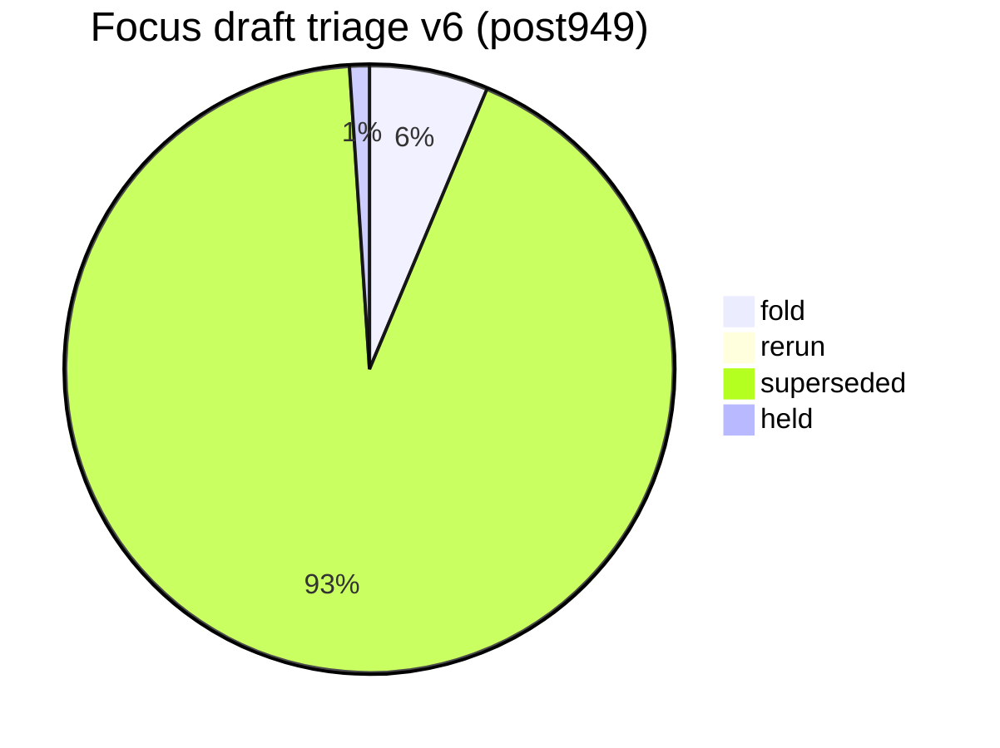
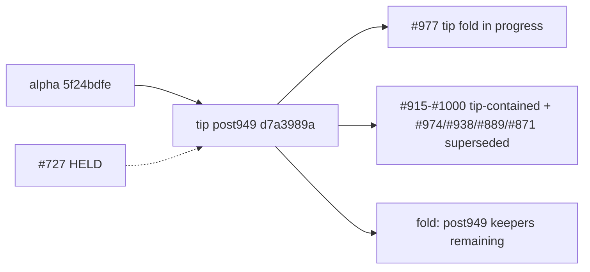

# Open draft triage — tip post949 v6 (2026-10-10)

**Task id:** `q-mp-539`
**Live tip branch:** `cursor/mp-tip-post949`
**Tip SHA checked:** `d7a3989a25c15c3294c93d2fe3e5fc5f043fef66` (`d7a3989a`) — cut from alpha `5f24bdfe` after tip-fold PR **#949** squash-merged; tip owner **#977** folding leftovers **#978–#1006** (tip head still moving)
**Alpha SHA:** `5f24bdfe40aa1d89f07dccad1c774784b1a489cf` (`5f24bdfe`) — tip cut base (post914 tip fold squash)
**Supersedes (navigation):** open draft **#974** (v5 / `q-mp-494`), **#938** (v4 / `q-mp-444`), **#889** (v3 / `q-mp-385`), **#871** (v2 / `q-mp-360`) — leave open; comment `contained` (do **not** close). Also navigationally supersedes **#850** (v1) / **#819** (v5).
**Prior triage (stale for post949 navigation):** [`open-draft-triage-post914-v5-2026-10-10.md`](./open-draft-triage-post914-v5-2026-10-10.md)
**Machine-readable twin:** [`open-draft-triage-post949-v6-2026-10-10.json`](./open-draft-triage-post949-v6-2026-10-10.json)
**Status visual:** [`open-draft-triage-post949-v6-2026-10-10.svg`](./open-draft-triage-post949-v6-2026-10-10.svg)
**Generated (UTC):** 2026-10-10T14:23:44.000Z
**Scope:** report only — **do not close PRs**, do not mark ready, do not comment / label from this worker task. Tip owner folds into `cursor/mp-tip-post949`.
**Focus set:** HELD **#727**, prior triage **#819/#850/#871/#889/#938/#974**, open post898 **#915–#938**, open post914 **#939–#976**, open post949 **#978–#1006** at snapshot (excl. this v6 PR until opened).

## Hard rule (this doc)

> **Do not close PRs.** Prefer comments `contained` or `superseded` (with keeper / tip SHA). Closing remains a tip-owner / Andrew bulk-close action, not a worker action.
>
> **#727 is HELD** (Andrew decision). Do not comment on it, retarget it, fold it, or edit nullish from other agents.

## Tip context

Tip cut `cursor/mp-tip-post949` starts at alpha `5f24bdfe` (= squash of **#949**). Tip owner **#977** (draft into `alpha`) is folding post914 leftovers and post949 worker keepers. Live tip HEAD at measurement: `d7a3989a`.

Backlog audit baseline (stale): **15** open into post949 + **30** post914 + **24** post898. **Live re-measure:** **29** open into post949, **37** into post914, **24** into post898 (tip #977 already folded many post949 payloads through **#1000** including void brace **#999**).

## Live tip ratchet ceilings (re-measured)

Commands on tip `d7a3989a`:

```text
$ git rev-parse HEAD
  d7a3989a25c15c3294c93d2fe3e5fc5f043fef66

$ npm run lint:ratchet   # exit 0
  ok   curly: 538 / ceiling 538
  ok   @typescript-eslint/no-non-null-assertion: 239 / ceiling 239
  ok   @typescript-eslint/no-confusing-void-expression: 48 / ceiling 48
  ok   radix: 6 / ceiling 6
  ok   default-case: 5 / ceiling 5
  ok   no-duplicate-imports: 42 / ceiling 42
  ok   @typescript-eslint/prefer-nullish-coalescing: 65 / ceiling 65
  ok   @typescript-eslint/prefer-optional-chain: 21 / ceiling 21
  ok   @typescript-eslint/switch-exhaustiveness-check: 8 / ceiling 8
  ok   @typescript-eslint/no-shadow: 3 / ceiling 3
  ok   eqeqeq: 1 / ceiling 1
  ok   @typescript-eslint/return-await: 3 / ceiling 3

$ npm run typecheck:ratchet
  in-scope errors:     0
  out-of-scope errors: 216   ← AI residual (hard-rule HOLD)

$ find tests/unit \( -name '*.test.ts' -o -name '*.spec.ts' \) ! -path '*/_tokenmaxx_archive/*' | wc -l
  3280

$ npx vitest list | wc -l
  13408

$ npm run report:knip
  unusedExports: 3  unusedTypes: 32  unlisted: 3  duplicates: 0
  (baseline unusedTypes still 36; live shrink NOTICE 36→32)

$ npm run check:dev-docs
  docs scanned: 270; problems: 0   ← tip tree md count before this v6 md

$ rg -n 'hard:\s*450' src/games/hex/ai.ts
  hard: 450   ← HOLD untouched
```

### Before → after tip metrics (v5 @ post914 `5c5101f5` → v6 @ post949 `d7a3989a`)

| Metric                              |      v5 (post914) |               v6 (post949) |
| ----------------------------------- | ----------------: | -------------------------: |
| Tip SHA                             |        `5c5101f5` |                 `d7a3989a` |
| void ceiling                        |                51 |                     **48** |
| nnnull ceiling                      |               241 |                    **239** |
| knip unusedTypes (baseline / live)  |           36 / 32 |                **36 / 32** |
| unit test/spec files (excl archive) |              3245 |                   **3280** |
| Vitest list cases                   |             13100 |                  **13408** |
| Open base `cursor/mp-tip-post914`   |                32 |                     **37** |
| Open base `cursor/mp-tip-post949`   | 0 (tip did not exist) |                 **29** |
| Open base `cursor/mp-tip-post898`   |                24 |                     **24** |
| Focus **fold** recommendations      |                25 |          **6** (+ this v6) |
| Focus **superseded**                |                35 |                     **88** |
| Focus **held**                      |          1 (#727) |               **1** (#727) |
| `check:dev-docs` scanned (tip md)   |               233 | **270** → **271** w/ v6 md (+json/svg twins) |

## Classification legend

| Status         | Meaning |
| -------------- | ------- |
| **fold**       | Unique `only_head` payload not on tip; tip owner should fold (after CI green) |
| **rerun**      | Payload still wanted, but rebase and/or CI re-run required before fold |
| **superseded** | Payload already on tip `d7a3989a` (blob-identical) or tip-ahead on both-touched paths; leave PR open with `contained` |
| **held**       | Tip-owner / Andrew hold — do not fold / do not touch |

## Enumeration (focus + open inventory)

| Bucket                            |   Count | Notes |
| --------------------------------- | ------: | ----- |
| Open drafts **total**             | **427** | `gh api` paginated @ snapshot |
| Focus drafts classified           |  **95** | #727 + prior triage + post898 + post914 + post949 |
| **fold**                          |   **6** | Unique residual vs tip |
| **rerun**                         |   **0** | none at refresh |
| **superseded**                    |  **88** | Absorbed by #949 / tip #977 / tip-ahead / prior triage |
| **held**                          |   **1** | #727 only |
| Open base `cursor/mp-tip-post949` |  **29** | live tip worker drafts (+ tip PR #977 on alpha) |
| Open base `cursor/mp-tip-post914` |  **37** | stale tip base; tip-contained leftovers |
| Open base `cursor/mp-tip-post898` |  **24** | stale tip base; tip-contained leftovers |
| Open base `cursor/mp-tip-post865` |  **33** | stale; leave with contained/superseded |
| Open base `cursor/mp-tip-post830` |  **25** | stale; leave with contained/superseded |
| Open base `cursor/mp-tip-post785` |  **27** | stale; leave with contained/superseded |

## Status visual





## Focus triage table (primary)

Per-draft recommendation with GitHub check-run status on the **head SHA** (12 CI jobs).

|   PR | Task        | Base      | Head SHA                                   | Rec            | Checks @ head         | Reason |
| ---: | ----------- | --------- | ------------------------------------------ | -------------- | --------------------- | ------ |
| #727 | `q-mp-186` | `post709` | `54532ce5459ca15d880ece9a119a909e56745ef4` | **held** | **12/12** | Andrew HOLD — prefer-nullish-coalescing in owl-messages (−9); do not fold / retarget / comment; nullish ceiling stays 65 |
| #819 | `q-mp-309` | `post755` | `7d87294895a39624c66f52a0cca88e6c4707b91a` | **superseded** | **12/12** | Prior open-draft triage; leave open with contained — this v6 is the navigation keeper @ tip d7a3989a |
| #850 | `q-mp-334` | `post785` | `b27147cd6b06b2e68da023ba1c078e8dc7f5d9b9` | **superseded** | **12/12** | Prior open-draft triage; leave open with contained — this v6 is the navigation keeper @ tip d7a3989a |
| #871 | `q-mp-360` | `post830` | `9d375d76c3aa313d8da84bfe432a4e0d40e5d08d` | **superseded** | **12/12** | Prior open-draft triage; leave open with contained — this v6 is the navigation keeper @ tip d7a3989a |
| #889 | `q-mp-385` | `post865` | `7cd8ce9808ab0ab8f6837ecad6ad9b62d4aade7a` | **superseded** | **12/12** | Prior open-draft triage; leave open with contained — this v6 is the navigation keeper @ tip d7a3989a |
| #915 | `q-mp-425` | `post898` | `6ce61084945f9af2c22e38f760b23baa8afa5a54` | **superseded** | **12/12** | Payload blob-identical on tip d7a3989a (via #949 alpha squash and/or tip #977 folds); leave open with contained |
| #916 | `q-mp-424` | `post898` | `3b1eea0582e8fe90079bbc2bd0a0cec5cb099aa7` | **superseded** | **12/12** | Payload blob-identical on tip d7a3989a (via #949 alpha squash and/or tip #977 folds); leave open with contained |
| #917 | `q-mp-427` | `post898` | `cf8c93731fb535dcd9ea0b57c9b475ae2425e3c5` | **superseded** | **12/12** | Payload blob-identical on tip d7a3989a (via #949 alpha squash and/or tip #977 folds); leave open with contained |
| #918 | `q-mp-419` | `post898` | `a310f431272a657d66c98c6a49056c0dbb699d98` | **superseded** | **12/12** | Payload blob-identical on tip d7a3989a (via #949 alpha squash and/or tip #977 folds); leave open with contained |
| #919 | `q-mp-426` | `post898` | `362dcfe27fe2399f3f5e0bb8d5ab7cb0101e57ee` | **superseded** | **12/12** | Payload blob-identical on tip d7a3989a (via #949 alpha squash and/or tip #977 folds); leave open with contained |
| #920 | `q-mp-432` | `post898` | `787256b2efff886b8c8ec9c34a61ad5f7f7c7076` | **superseded** | **12/12** | Payload blob-identical on tip d7a3989a (via #949 alpha squash and/or tip #977 folds); leave open with contained |
| #921 | `q-mp-090n` | `post898` | `b833d5824f2447f2c922ad0d1ff7d46843da955a` | **superseded** | **12/12** | Tip-ahead or tip-contained @ d7a3989a: residual DIFF vs tip keeper (vitest.config.ts); leave open with contained |
| #922 | `q-mp-443` | `post898` | `12b1bbcb05ae0fa4054a0bcb7f27d08432358b87` | **superseded** | **12/12** | Tip-ahead or tip-contained @ d7a3989a: residual DIFF vs tip keeper (docs/dev/board3d-layout-reads-inventory-2026-10-09.md, docs/dev/board3d-layout-reads-inventory-post830-2026-10-10.md, docs/dev/board3d-layout-reads-inventory-post865-2026-10-10.md, docs/dev/copy-pins-residual-inventory-post898-2026-10-10.json, docs/dev/copy-pins-residual-inventory-post898-2026-10-10.md, docs/dev/copy-pins-residual-inventory-post898-2026-10-10.svg); leave open with contained |
| #923 | `q-mp-448` | `post898` | `4922453c4bae0bf93464633eb621487a08e959cc` | **superseded** | **12/12** | Tip-ahead or tip-contained @ d7a3989a: residual DIFF vs tip keeper (docs/dev/board3d-layout-reads-inventory-2026-10-09.md, docs/dev/board3d-layout-reads-inventory-post830-2026-10-10.md, docs/dev/board3d-layout-reads-inventory-post865-2026-10-10.md, docs/dev/coverage-map.md, docs/dev/coverage-map.svg, docs/dev/lint-bucket-report.md); leave open with contained |
| #924 | `q-mp-439` | `post898` | `8f7400db8614e81fc3d5a8ad80903db5d95ea509` | **superseded** | **12/12** | Tip-ahead or tip-contained @ d7a3989a: residual DIFF vs tip keeper (docs/dev/board3d-layout-reads-inventory-2026-10-09.md, docs/dev/board3d-layout-reads-inventory-post830-2026-10-10.md, docs/dev/board3d-layout-reads-inventory-post865-2026-10-10.md, docs/dev/coverage-map.md, docs/dev/coverage-map.svg, docs/dev/lint-bucket-report.md); leave open with contained |
| #925 | `q-mp-455` | `post898` | `ab182224225a8cde53b124d9b45442ec2b24454d` | **superseded** | **12/12** | Tip-ahead or tip-contained @ d7a3989a: residual DIFF vs tip keeper (docs/dev/board3d-layout-reads-inventory-2026-10-09.md, docs/dev/board3d-layout-reads-inventory-post830-2026-10-10.md, docs/dev/board3d-layout-reads-inventory-post865-2026-10-10.md, docs/dev/coverage-map.md, docs/dev/coverage-map.svg, docs/dev/lint-bucket-report.md); leave open with contained |
| #926 | `q-mp-440` | `post898` | `b9c8d7430cf43bb82c499e863d00c57d5b2c1687` | **superseded** | **12/12** | Tip-ahead or tip-contained @ d7a3989a: residual DIFF vs tip keeper (docs/dev/board3d-layout-reads-inventory-2026-10-09.md, docs/dev/board3d-layout-reads-inventory-post830-2026-10-10.md, docs/dev/board3d-layout-reads-inventory-post865-2026-10-10.md, docs/dev/board3d-layout-reads-inventory-post898-2026-10-10.md, docs/dev/coverage-map.md, docs/dev/coverage-map.svg); leave open with contained |
| #927 | `q-mp-453` | `post898` | `d7e0368f9f8fe7a346d87bd9c4784b839b84e9f4` | **superseded** | **12/12** | Tip-ahead or tip-contained @ d7a3989a: residual DIFF vs tip keeper (docs/dev/board3d-layout-reads-inventory-2026-10-09.md, docs/dev/board3d-layout-reads-inventory-post830-2026-10-10.md, docs/dev/board3d-layout-reads-inventory-post865-2026-10-10.md, docs/dev/coverage-map.md, docs/dev/coverage-map.svg, docs/dev/lint-bucket-report.md); leave open with contained |
| #928 | `q-mp-441` | `post898` | `a66ac15cd9995c70acb85b869cc731b85b49d3c0` | **superseded** | **12/12** | Tip-ahead or tip-contained @ d7a3989a: residual DIFF vs tip keeper (docs/dev/board3d-layout-reads-inventory-2026-10-09.md, docs/dev/board3d-layout-reads-inventory-post830-2026-10-10.md, docs/dev/board3d-layout-reads-inventory-post865-2026-10-10.md, docs/dev/coverage-map.md, docs/dev/coverage-map.svg, docs/dev/lint-bucket-report.md); leave open with contained |
| #929 | `q-mp-445` | `post898` | `05523f45dc5c986a1d6cbcc92ba0c8d347a367f5` | **superseded** | **12/12** | Tip-ahead or tip-contained @ d7a3989a: residual DIFF vs tip keeper (docs/dev/board3d-layout-reads-inventory-2026-10-09.md, docs/dev/board3d-layout-reads-inventory-post830-2026-10-10.md, docs/dev/board3d-layout-reads-inventory-post865-2026-10-10.md, docs/dev/board3d-layout-reads-inventory-post898-2026-10-10.md, docs/dev/coverage-map.md, docs/dev/coverage-map.svg); leave open with contained |
| #930 | `q-mp-438` | `post898` | `ec427d2df982b2a339d907769c28da083156242f` | **superseded** | **12/12** | Tip-ahead or tip-contained @ d7a3989a: residual DIFF vs tip keeper (docs/dev/board3d-layout-reads-inventory-2026-10-09.md, docs/dev/board3d-layout-reads-inventory-post830-2026-10-10.md, docs/dev/board3d-layout-reads-inventory-post865-2026-10-10.md, docs/dev/coverage-map.md, docs/dev/coverage-map.svg, docs/dev/lint-bucket-report.md); leave open with contained |
| #931 | `q-mp-447` | `post898` | `c15397dd7439588df35767e8e1c363c76889d467` | **superseded** | **12/12** | Tip-ahead or tip-contained @ d7a3989a: residual DIFF vs tip keeper (docs/dev/board3d-layout-reads-inventory-2026-10-09.md, docs/dev/board3d-layout-reads-inventory-post830-2026-10-10.md, docs/dev/board3d-layout-reads-inventory-post865-2026-10-10.md, docs/dev/coverage-map.md, docs/dev/coverage-map.svg, docs/dev/lint-bucket-report.md); leave open with contained |
| #932 | `q-mp-454` | `post898` | `e75c0af8401b94490599d01aa79465446bc1c484` | **superseded** | **12/12** | Tip-ahead or tip-contained @ d7a3989a: residual DIFF vs tip keeper (docs/dev/board3d-layout-reads-inventory-2026-10-09.md, docs/dev/board3d-layout-reads-inventory-post830-2026-10-10.md, docs/dev/board3d-layout-reads-inventory-post865-2026-10-10.md, docs/dev/coverage-map.md, docs/dev/coverage-map.svg, docs/dev/lint-bucket-report.md); leave open with contained |
| #933 | `q-mp-457` | `post898` | `78205241e2be22608d9e365ab5c260df134ed911` | **superseded** | **12/12** | Tip-ahead or tip-contained @ d7a3989a: residual DIFF vs tip keeper (docs/dev/board3d-layout-reads-inventory-2026-10-09.md, docs/dev/board3d-layout-reads-inventory-post830-2026-10-10.md, docs/dev/board3d-layout-reads-inventory-post865-2026-10-10.md, docs/dev/coverage-map.md, docs/dev/coverage-map.svg, docs/dev/lint-bucket-report.md); leave open with contained |
| #934 | `q-mp-090o` | `post898` | `d73174c8ca516add5522f077d1c424b86b09bd85` | **superseded** | **12/12** | Tip-ahead or tip-contained @ d7a3989a: residual DIFF vs tip keeper (docs/dev/board3d-layout-reads-inventory-2026-10-09.md, docs/dev/board3d-layout-reads-inventory-post830-2026-10-10.md, docs/dev/board3d-layout-reads-inventory-post865-2026-10-10.md, docs/dev/coverage-map.md, docs/dev/coverage-map.svg, docs/dev/lint-bucket-report.md); leave open with contained |
| #935 | `q-mp-456` | `post898` | `8cf29381812be3640a6cb817152eed149a3e973e` | **superseded** | **0/12 (12 failure)** | Tip-ahead or tip-contained @ d7a3989a: residual DIFF vs tip keeper (docs/dev/board3d-layout-reads-inventory-2026-10-09.md, docs/dev/board3d-layout-reads-inventory-post830-2026-10-10.md, docs/dev/board3d-layout-reads-inventory-post865-2026-10-10.md, docs/dev/coverage-map.md, docs/dev/coverage-map.svg, docs/dev/lint-bucket-report.md); leave open with contained |
| #936 | `q-mp-446` | `post898` | `19fa9196bca8f47c980f1aaa089af524b1542f71` | **superseded** | **12/12** | Tip-ahead or tip-contained @ d7a3989a: residual DIFF vs tip keeper (docs/dev/board3d-layout-reads-inventory-2026-10-09.md, docs/dev/board3d-layout-reads-inventory-post830-2026-10-10.md, docs/dev/board3d-layout-reads-inventory-post865-2026-10-10.md, docs/dev/coverage-map.md, docs/dev/coverage-map.svg, docs/dev/lint-bucket-report.md); leave open with contained |
| #937 | `q-mp-442` | `post898` | `ba39054ad03a38952b39a736689b11f4c74dac29` | **superseded** | **12/12** | Tip-ahead or tip-contained @ d7a3989a: residual DIFF vs tip keeper (docs/dev/board3d-layout-reads-inventory-2026-10-09.md, docs/dev/board3d-layout-reads-inventory-post830-2026-10-10.md, docs/dev/board3d-layout-reads-inventory-post865-2026-10-10.md, docs/dev/coverage-map.md, docs/dev/coverage-map.svg, docs/dev/lint-bucket-report.md); leave open with contained |
| #938 | `q-mp-444` | `post898` | `99c02ce0af683494d6f8fc304b5a133331b8e5e1` | **superseded** | **12/12** | Prior open-draft triage; leave open with contained — this v6 is the navigation keeper @ tip d7a3989a |
| #939 | `q-mp-462` | `post914` | `98c4657a21766a3b4f02d75985c2a228acd4acd0` | **superseded** | **12/12** | Payload blob-identical on tip d7a3989a (via #949 alpha squash and/or tip #977 folds); leave open with contained |
| #940 | `q-mp-461` | `post914` | `78e0a6da9dfdfb2e136619bb0ce988d58fcfda7a` | **superseded** | **12/12** | Payload blob-identical on tip d7a3989a (via #949 alpha squash and/or tip #977 folds); leave open with contained |
| #941 | `q-mp-475` | `post914` | `fdf2e8cb9bcdf267bf650627c72064f6d646dc78` | **superseded** | **12/12** | Payload blob-identical on tip d7a3989a (via #949 alpha squash and/or tip #977 folds); leave open with contained |
| #942 | `q-mp-476` | `post914` | `0b527668b2258722f2b2f3c88f6e8e9fa7433c51` | **superseded** | **12/12** | Payload blob-identical on tip d7a3989a (via #949 alpha squash and/or tip #977 folds); leave open with contained |
| #943 | `q-mp-472` | `post914` | `3d85b06f21835b62a1c66a7bedc8329d1425586f` | **superseded** | **12/12** | Tip-ahead or tip-contained @ d7a3989a: residual DIFF vs tip keeper (vitest.config.ts); leave open with contained |
| #944 | `q-mp-464` | `post914` | `613b424309d72687a53d44b66b0b27ffff58265d` | **superseded** | **12/12** | Tip-ahead or tip-contained @ d7a3989a: residual DIFF vs tip keeper (docs/dev/lint-bucket-report.md); leave open with contained |
| #945 | `q-mp-484` | `post914` | `ba22df2ba288c7c8f5a1dfc4bdd8c8ab6421436a` | **superseded** | **12/12** | Tip-ahead or tip-contained @ d7a3989a: residual DIFF vs tip keeper (docs/wiki/development.md); leave open with contained |
| #946 | `q-mp-474` | `post914` | `0a96d74bd51097a48456fc27a3490c2efd47e8fa` | **superseded** | **12/12** | Payload blob-identical on tip d7a3989a (via #949 alpha squash and/or tip #977 folds); leave open with contained |
| #947 | `q-mp-463` | `post914` | `55f890bb8f3e7b635616da3ea1650a2e5512204b` | **superseded** | **12/12** | Tip-ahead or tip-contained @ d7a3989a: residual DIFF vs tip keeper (docs/dev/knip-report.md); leave open with contained |
| #948 | `q-mp-481` | `post914` | `20b40143966a525b2776d78e96b7c39f0a001696` | **superseded** | **12/12** | Payload blob-identical on tip d7a3989a (via #949 alpha squash and/or tip #977 folds); leave open with contained |
| #950 | `q-mp-473` | `post914` | `659304d80e210c986be3907c9b0d300ec37d6a1d` | **superseded** | **12/12** | Payload blob-identical on tip d7a3989a (via #949 alpha squash and/or tip #977 folds); leave open with contained |
| #951 | `q-mp-467` | `post914` | `b3b1538213b391265e86e3637c55d04e410bb533` | **superseded** | **12/12** | Payload blob-identical on tip d7a3989a (via #949 alpha squash and/or tip #977 folds); leave open with contained |
| #952 | `q-mp-471` | `post914` | `8049c9d258dede52568a1bf34d247f5dd750a1af` | **superseded** | **12/12** | Payload blob-identical on tip d7a3989a (via #949 alpha squash and/or tip #977 folds); leave open with contained |
| #953 | `q-mp-470` | `post914` | `e1d7f6957fb8e5646d7b257b9758e5d4db2e91ed` | **superseded** | **12/12** | Payload blob-identical on tip d7a3989a (via #949 alpha squash and/or tip #977 folds); leave open with contained |
| #954 | `q-mp-477` | `post914` | `14b9681a2dbca2bead24d733275e18dae822ad4c` | **superseded** | **12/12** | Payload blob-identical on tip d7a3989a (via #949 alpha squash and/or tip #977 folds); leave open with contained |
| #955 | `q-mp-090p` | `post914` | `b633a26e9fccee48727b430895b37e2b7c803f2d` | **superseded** | **12/12** | Tip-ahead or tip-contained @ d7a3989a: residual DIFF vs tip keeper (docs/wiki/development.md); leave open with contained |
| #956 | `q-mp-460` | `post914` | `c0fc5b6136c37535cc54835a8f6bc3461608214e` | **superseded** | **12/12** | Tip-ahead or tip-contained @ d7a3989a: residual DIFF vs tip keeper (docs/wiki/development.md); leave open with contained |
| #957 | `q-mp-478` | `post914` | `e502a601a19bbed02be999beddf6cec7ea54a7b4` | **superseded** | **12/12** | Payload blob-identical on tip d7a3989a (via #949 alpha squash and/or tip #977 folds); leave open with contained |
| #958 | `q-mp-490` | `post914` | `dcacf1f1bb47f1e73f74b85dad4f5ae2d65c4573` | **superseded** | **12/12** | Tip-ahead or tip-contained @ d7a3989a: residual DIFF vs tip keeper (docs/wiki/development.md); leave open with contained |
| #959 | `q-mp-498` | `post914` | `dd9d3a9da7e802455a06db9a8df57f019ae56c18` | **superseded** | **12/12** | Tip-ahead or tip-contained @ d7a3989a: residual DIFF vs tip keeper (docs/dev/lint-bucket-report.md, docs/wiki/development.md); leave open with contained |
| #960 | `q-mp-487` | `post914` | `78f01fdb5653948b00845cf418974881c901dc81` | **superseded** | **12/12** | Tip-ahead or tip-contained @ d7a3989a: residual DIFF vs tip keeper (docs/wiki/coverage-map.md, docs/wiki/development.md); leave open with contained |
| #961 | `q-mp-489` | `post914` | `e8065689e27adbd795563644ab9949430f4667ad` | **superseded** | **12/12** | Tip-ahead or tip-contained @ d7a3989a: residual DIFF vs tip keeper (docs/wiki/development.md); leave open with contained |
| #962 | `q-mp-493` | `post914` | `c4e547000aeba062eb4b61c3d2ee56a9bed19b51` | **superseded** | **12/12** | Tip-ahead or tip-contained @ d7a3989a: residual DIFF vs tip keeper (docs/wiki/development.md); leave open with contained |
| #963 | `q-mp-497` | `post914` | `23c1b726f65b8b769e950443127353f8a417717d` | **superseded** | **12/12** | Tip-ahead or tip-contained @ d7a3989a: residual DIFF vs tip keeper (docs/wiki/development.md); leave open with contained |
| #964 | `q-mp-504` | `post914` | `bf6dacd3bfa33c1ddf6b1050588664774de9518b` | **superseded** | **12/12** | Tip-ahead or tip-contained @ d7a3989a: residual DIFF vs tip keeper (docs/wiki/development.md); leave open with contained |
| #965 | `q-mp-491` | `post914` | `1e002edace3890ef1ed6c86689edf4f742ccfb06` | **superseded** | **12/12** | Tip-ahead or tip-contained @ d7a3989a: residual DIFF vs tip keeper (docs/dev/lint-bucket-report.md, docs/wiki/development.md); leave open with contained |
| #966 | `q-mp-503` | `post914` | `0be251fc19e737d8c1135cb2c25dd33201e33a40` | **superseded** | **12/12** | Tip-ahead or tip-contained @ d7a3989a: residual DIFF vs tip keeper (docs/wiki/development.md); leave open with contained |
| #967 | `q-mp-488` | `post914` | `632ee30cb98b6176e76a64959139679426ebb5a9` | **superseded** | **12/12** | Tip-ahead or tip-contained @ d7a3989a: residual DIFF vs tip keeper (docs/wiki/development.md); leave open with contained |
| #968 | `q-mp-500` | `post914` | `6df5a3da912acc7242437675c2407c6787b46ea2` | **superseded** | **12/12** | Tip-ahead or tip-contained @ d7a3989a: residual DIFF vs tip keeper (docs/dev/lint-bucket-report.md, docs/wiki/development.md, vitest.config.ts); leave open with contained |
| #969 | `q-mp-502` | `post914` | `62a6985527e774add8eb86f7ce661034dab26ecb` | **superseded** | **12/12** | Tip-ahead or tip-contained @ d7a3989a: residual DIFF vs tip keeper (docs/wiki/development.md); leave open with contained |
| #970 | `q-mp-501` | `post914` | `16af28d99c970828713de24611791c1e73bb47e0` | **superseded** | **12/12** | Tip-ahead or tip-contained @ d7a3989a: residual DIFF vs tip keeper (docs/dev/lint-bucket-report.md, docs/wiki/development.md, vitest.config.ts); leave open with contained |
| #971 | `q-mp-090q` | `post914` | `0cd88cbbead4f8ca00f8cb511d49641024368772` | **superseded** | **12/12** | Tip-ahead or tip-contained @ d7a3989a: residual DIFF vs tip keeper (docs/dev/lint-bucket-report.md, docs/wiki/development.md, vitest.config.ts); leave open with contained |
| #972 | `q-mp-507` | `post914` | `e7feed00fdd7ebf291e7d35c1f5632e720f1c7aa` | **superseded** | **12/12** | Tip-ahead or tip-contained @ d7a3989a: residual DIFF vs tip keeper (docs/dev/lint-bucket-report.md, docs/wiki/development.md, vitest.config.ts); leave open with contained |
| #973 | `q-mp-496` | `post914` | `11e3ad18788aa240340dc97b63bf5767d46934f3` | **superseded** | **12/12** | Tip-ahead or tip-contained @ d7a3989a: residual DIFF vs tip keeper (docs/dev/lint-bucket-report.md, docs/wiki/development.md, vitest.config.ts); leave open with contained |
| #974 | `q-mp-494` | `post914` | `64c0d6d0fc81e77fef68a8e18d23b2d4446904c3` | **superseded** | **12/12** | Prior open-draft triage; leave open with contained — this v6 is the navigation keeper @ tip d7a3989a |
| #975 | `q-mp-492` | `post914` | `e61bce0fec27428509a651d7e141ea95c271bba3` | **superseded** | **12/12** | Tip-ahead or tip-contained @ d7a3989a: residual DIFF vs tip keeper (docs/dev/lint-bucket-report.md, docs/wiki/coverage-map.md, docs/wiki/development.md, vitest.config.ts); leave open with contained |
| #976 | `q-mp-506` | `post914` | `26b3d0d277341f3914c7da8b39859d7b2bfab96a` | **superseded** | **12/12** | Tip-ahead or tip-contained @ d7a3989a: residual DIFF vs tip keeper (docs/dev/knip-report.md, docs/dev/lint-bucket-report.md, docs/wiki/development.md); leave open with contained |
| #978 | `q-mp-515` | `post949` | `fe92787ca8a84e079f327310fe6797a3789dd1ab` | **superseded** | **12/12** | Payload blob-identical on tip d7a3989a (via #949 alpha squash and/or tip #977 folds); leave open with contained |
| #979 | `q-mp-514` | `post949` | `9a180827ffe9bc50d9fd0a50e030f1d7cd41909e` | **superseded** | **12/12** | Payload blob-identical on tip d7a3989a (via #949 alpha squash and/or tip #977 folds); leave open with contained |
| #980 | `q-mp-512` | `post949` | `aa145d0e923fc4cfb281a498207ef8f32163aec7` | **superseded** | **12/12** | Payload blob-identical on tip d7a3989a (via #949 alpha squash and/or tip #977 folds); leave open with contained |
| #981 | `q-mp-521` | `post949` | `8f8a210579ab432dfe5f9d1e0b0704c66d0b2da1` | **superseded** | **12/12** | Payload blob-identical on tip d7a3989a (via #949 alpha squash and/or tip #977 folds); leave open with contained |
| #982 | `q-mp-510` | `post949` | `60787f14854d29ac94371a7e2635a678e0e7ee45` | **superseded** | **12/12** | Payload blob-identical on tip d7a3989a (via #949 alpha squash and/or tip #977 folds); leave open with contained |
| #983 | `q-mp-511` | `post949` | `8a7ad4064aad565e6c530d6052292636de0779a9` | **superseded** | **12/12** | Payload blob-identical on tip d7a3989a (via #949 alpha squash and/or tip #977 folds); leave open with contained |
| #984 | `q-mp-523` | `post949` | `21eb6b478094ccf6570a3e78b3fc46d2ea33a194` | **superseded** | **12/12** | Payload blob-identical on tip d7a3989a (via #949 alpha squash and/or tip #977 folds); leave open with contained |
| #985 | `q-mp-513` | `post949` | `b19cd85e59fbd67b445010b38af1fd6c185f6258` | **superseded** | **12/12** | Payload blob-identical on tip d7a3989a (via #949 alpha squash and/or tip #977 folds); leave open with contained |
| #986 | `q-mp-522` | `post949` | `0f1707e423dd5a5a26e9df4c5ec7cad138f6c4c6` | **superseded** | **12/12** | Payload blob-identical on tip d7a3989a (via #949 alpha squash and/or tip #977 folds); leave open with contained |
| #987 | `q-mp-527` | `post949` | `c268bdfd40f39fc10a05b113a04a0677aeda180e` | **superseded** | **12/12** | Payload blob-identical on tip d7a3989a (via #949 alpha squash and/or tip #977 folds); leave open with contained |
| #988 | `q-mp-526` | `post949` | `1de056017b8a2ca4577cdd58d7fb5ffae5ff87de` | **superseded** | **12/12** | Payload blob-identical on tip d7a3989a (via #949 alpha squash and/or tip #977 folds); leave open with contained |
| #989 | `q-mp-516` | `post949` | `694027f5fe85bcc5733b13fa5ba88f2c47f2dbf7` | **superseded** | **12/12** | Payload blob-identical on tip d7a3989a (via #949 alpha squash and/or tip #977 folds); leave open with contained |
| #990 | `q-mp-525` | `post949` | `75d8fafbea402b38b9c7031b43beada5a1148076` | **superseded** | **12/12** | Payload blob-identical on tip d7a3989a (via #949 alpha squash and/or tip #977 folds); leave open with contained |
| #991 | `q-mp-520` | `post949` | `67f8f273bafcfd4c6c2299a2c1cf33840826071b` | **superseded** | **12/12** | Payload blob-identical on tip d7a3989a (via #949 alpha squash and/or tip #977 folds); leave open with contained |
| #992 | `q-mp-519` | `post949` | `56307c36914714ec29f0f84978732a10bc498d85` | **superseded** | **12/12** | Payload blob-identical on tip d7a3989a (via #949 alpha squash and/or tip #977 folds); leave open with contained |
| #993 | `q-mp-518` | `post949` | `3ea9f0edf068872587c4354ba0b9a9168385ef35` | **superseded** | **12/12** | Payload blob-identical on tip d7a3989a (via #949 alpha squash and/or tip #977 folds); leave open with contained |
| #994 | `q-mp-517` | `post949` | `277e318e248568dd62e80e3e1e02af71938c05bb` | **superseded** | **12/12** | Payload blob-identical on tip d7a3989a (via #949 alpha squash and/or tip #977 folds); leave open with contained |
| #995 | `q-mp-090r` | `post949` | `7e43d4df360cf65a7103dcd49a2954bd70a1460e` | **superseded** | **12/12** | Payload blob-identical on tip d7a3989a (via #949 alpha squash and/or tip #977 folds); leave open with contained |
| #996 | `q-mp-532` | `post949` | `fc7170aeba97820fa39e88a4e75d93fc403c87fd` | **superseded** | **12/12** | Payload blob-identical on tip d7a3989a (via #949 alpha squash and/or tip #977 folds); leave open with contained |
| #997 | `q-mp-534` | `post949` | `4d2bdc5432adc74bffa44eb2ea91939ddea3aed7` | **superseded** | **12/12** | Payload blob-identical on tip d7a3989a (via #949 alpha squash and/or tip #977 folds); leave open with contained |
| #998 | `q-mp-535` | `post949` | `9ec9f9d5ca2b6677ab04b2832c34bb0dab9c37c6` | **superseded** | **12/12** | Payload blob-identical on tip d7a3989a (via #949 alpha squash and/or tip #977 folds); leave open with contained |
| #999 | `q-mp-544` | `post949` | `5c18a3eb308b42e6cce8114ccb3792999a16fcc4` | **superseded** | **12/12** | Payload blob-identical on tip d7a3989a (via #949 alpha squash and/or tip #977 folds); leave open with contained |
| #1000 | `q-mp-533` | `post949` | `0f5445b5c3ba93aed94464003fed438ac6804106` | **superseded** | **12/12** | Payload blob-identical on tip d7a3989a (via #949 alpha squash and/or tip #977 folds); leave open with contained |
| #1001 | `q-mp-537` | `post949` | `90d77eccbf9e6c1eedfcc8f6e3ac5ad93f3b592e` | **fold** | **12/12** | Unique payload vs tip (0 same / 3 diff / 0 new; only_head=2): docs/dev/coverage-map.md, docs/dev/coverage-map.svg |
| #1002 | `q-mp-547` | `post949` | `811fc1c6eaffb9b5d6bd443a360f9ca922a6fcb5` | **fold** | **12/12** | Unique payload vs tip (0 same / 0 diff / 2 new; only_head=2): docs/dev/engine-coverage-round-19.md, tests/unit/engine-coverage-round-19-burn-1008.test.ts |
| #1003 | `q-mp-538` | `post949` | `4f91ac7240db2b1746e9c96d1b5dc4a035889a2a` | **fold** | **8/12 (4 pending)** | Unique payload vs tip (0 same / 0 diff / 3 new; only_head=3): docs/dev/copy-pins-residual-inventory-post949-2026-10-10.json, docs/dev/copy-pins-residual-inventory-post949-2026-10-10.md, docs/dev/copy-pins-residual-inventory-post949-2026-10-10.svg |
| #1004 | `q-mp-540` | `post949` | `e1a435226e43a1fc71bf03cfaaee925cefa673ef` | **fold** | **8/12 (4 pending)** | Unique payload vs tip (0 same / 2 diff / 0 new; only_head=2): docs/dev/testing-layers-2026-10-09.md, docs/wiki/development.md |
| #1005 | `q-mp-542` | `post949` | `7f698b6ebd0bb39525abaf5a9550e05351a68be0` | **fold** | **4/12 (8 pending)** | Unique payload vs tip (0 same / 0 diff / 3 new; only_head=3): docs/dev/typecheck-oos-216-hold-map-post949-2026-10-10.json, docs/dev/typecheck-oos-216-hold-map-post949-2026-10-10.md, docs/dev/typecheck-oos-216-hold-map-post949-2026-10-10.svg |
| #1006 | `q-mp-549` | `post949` | `4676afb2bc0eb1c42c49c806ee1ec27a98648d3d` | **fold** | **4/12 (8 pending)** | Unique payload vs tip (0 same / 0 diff / 1 new; only_head=1): tests/unit/q-mp-549-game-route-mounts-soft-fail-residuals.test.ts |

Exact per-check conclusions are also in the JSON twin (`drafts[].checks`).

### Check-run detail (12-job rows)

|   PR | lint | audit | build | unit | e2e | knip | visual-baseline | e2e-fullgame | mobile-touch | zoom-reflow | forced-colors | e2e-cross-browser |
| ---: | ---- | ---- | ---- | ---- | ---- | ---- | ---- | ---- | ---- | ---- | ---- | ---- |
| #727 | ✅ | ✅ | ✅ | ✅ | ✅ | ✅ | ✅ | ✅ | ✅ | ✅ | ✅ | ✅ |
| #819 | ✅ | ✅ | ✅ | ✅ | ✅ | ✅ | ✅ | ✅ | ✅ | ✅ | ✅ | ✅ |
| #850 | ✅ | ✅ | ✅ | ✅ | ✅ | ✅ | ✅ | ✅ | ✅ | ✅ | ✅ | ✅ |
| #871 | ✅ | ✅ | ✅ | ✅ | ✅ | ✅ | ✅ | ✅ | ✅ | ✅ | ✅ | ✅ |
| #889 | ✅ | ✅ | ✅ | ✅ | ✅ | ✅ | ✅ | ✅ | ✅ | ✅ | ✅ | ✅ |
| #915 | ✅ | ✅ | ✅ | ✅ | ✅ | ✅ | ✅ | ✅ | ✅ | ✅ | ✅ | ✅ |
| #916 | ✅ | ✅ | ✅ | ✅ | ✅ | ✅ | ✅ | ✅ | ✅ | ✅ | ✅ | ✅ |
| #917 | ✅ | ✅ | ✅ | ✅ | ✅ | ✅ | ✅ | ✅ | ✅ | ✅ | ✅ | ✅ |
| #918 | ✅ | ✅ | ✅ | ✅ | ✅ | ✅ | ✅ | ✅ | ✅ | ✅ | ✅ | ✅ |
| #919 | ✅ | ✅ | ✅ | ✅ | ✅ | ✅ | ✅ | ✅ | ✅ | ✅ | ✅ | ✅ |
| #920 | ✅ | ✅ | ✅ | ✅ | ✅ | ✅ | ✅ | ✅ | ✅ | ✅ | ✅ | ✅ |
| #921 | ✅ | ✅ | ✅ | ✅ | ✅ | ✅ | ✅ | ✅ | ✅ | ✅ | ✅ | ✅ |
| #922 | ✅ | ✅ | ✅ | ✅ | ✅ | ✅ | ✅ | ✅ | ✅ | ✅ | ✅ | ✅ |
| #923 | ✅ | ✅ | ✅ | ✅ | ✅ | ✅ | ✅ | ✅ | ✅ | ✅ | ✅ | ✅ |
| #924 | ✅ | ✅ | ✅ | ✅ | ✅ | ✅ | ✅ | ✅ | ✅ | ✅ | ✅ | ✅ |
| #925 | ✅ | ✅ | ✅ | ✅ | ✅ | ✅ | ✅ | ✅ | ✅ | ✅ | ✅ | ✅ |
| #926 | ✅ | ✅ | ✅ | ✅ | ✅ | ✅ | ✅ | ✅ | ✅ | ✅ | ✅ | ✅ |
| #927 | ✅ | ✅ | ✅ | ✅ | ✅ | ✅ | ✅ | ✅ | ✅ | ✅ | ✅ | ✅ |
| #928 | ✅ | ✅ | ✅ | ✅ | ✅ | ✅ | ✅ | ✅ | ✅ | ✅ | ✅ | ✅ |
| #929 | ✅ | ✅ | ✅ | ✅ | ✅ | ✅ | ✅ | ✅ | ✅ | ✅ | ✅ | ✅ |
| #930 | ✅ | ✅ | ✅ | ✅ | ✅ | ✅ | ✅ | ✅ | ✅ | ✅ | ✅ | ✅ |
| #931 | ✅ | ✅ | ✅ | ✅ | ✅ | ✅ | ✅ | ✅ | ✅ | ✅ | ✅ | ✅ |
| #932 | ✅ | ✅ | ✅ | ✅ | ✅ | ✅ | ✅ | ✅ | ✅ | ✅ | ✅ | ✅ |
| #933 | ✅ | ✅ | ✅ | ✅ | ✅ | ✅ | ✅ | ✅ | ✅ | ✅ | ✅ | ✅ |
| #934 | ✅ | ✅ | ✅ | ✅ | ✅ | ✅ | ✅ | ✅ | ✅ | ✅ | ✅ | ✅ |
| #935 | ❌ | ❌ | ❌ | ❌ | ❌ | ❌ | ❌ | ❌ | ❌ | ❌ | ❌ | ❌ |
| #936 | ✅ | ✅ | ✅ | ✅ | ✅ | ✅ | ✅ | ✅ | ✅ | ✅ | ✅ | ✅ |
| #937 | ✅ | ✅ | ✅ | ✅ | ✅ | ✅ | ✅ | ✅ | ✅ | ✅ | ✅ | ✅ |
| #938 | ✅ | ✅ | ✅ | ✅ | ✅ | ✅ | ✅ | ✅ | ✅ | ✅ | ✅ | ✅ |
| #939 | ✅ | ✅ | ✅ | ✅ | ✅ | ✅ | ✅ | ✅ | ✅ | ✅ | ✅ | ✅ |
| #940 | ✅ | ✅ | ✅ | ✅ | ✅ | ✅ | ✅ | ✅ | ✅ | ✅ | ✅ | ✅ |
| #941 | ✅ | ✅ | ✅ | ✅ | ✅ | ✅ | ✅ | ✅ | ✅ | ✅ | ✅ | ✅ |
| #942 | ✅ | ✅ | ✅ | ✅ | ✅ | ✅ | ✅ | ✅ | ✅ | ✅ | ✅ | ✅ |
| #943 | ✅ | ✅ | ✅ | ✅ | ✅ | ✅ | ✅ | ✅ | ✅ | ✅ | ✅ | ✅ |
| #944 | ✅ | ✅ | ✅ | ✅ | ✅ | ✅ | ✅ | ✅ | ✅ | ✅ | ✅ | ✅ |
| #945 | ✅ | ✅ | ✅ | ✅ | ✅ | ✅ | ✅ | ✅ | ✅ | ✅ | ✅ | ✅ |
| #946 | ✅ | ✅ | ✅ | ✅ | ✅ | ✅ | ✅ | ✅ | ✅ | ✅ | ✅ | ✅ |
| #947 | ✅ | ✅ | ✅ | ✅ | ✅ | ✅ | ✅ | ✅ | ✅ | ✅ | ✅ | ✅ |
| #948 | ✅ | ✅ | ✅ | ✅ | ✅ | ✅ | ✅ | ✅ | ✅ | ✅ | ✅ | ✅ |
| #950 | ✅ | ✅ | ✅ | ✅ | ✅ | ✅ | ✅ | ✅ | ✅ | ✅ | ✅ | ✅ |
| #951 | ✅ | ✅ | ✅ | ✅ | ✅ | ✅ | ✅ | ✅ | ✅ | ✅ | ✅ | ✅ |
| #952 | ✅ | ✅ | ✅ | ✅ | ✅ | ✅ | ✅ | ✅ | ✅ | ✅ | ✅ | ✅ |
| #953 | ✅ | ✅ | ✅ | ✅ | ✅ | ✅ | ✅ | ✅ | ✅ | ✅ | ✅ | ✅ |
| #954 | ✅ | ✅ | ✅ | ✅ | ✅ | ✅ | ✅ | ✅ | ✅ | ✅ | ✅ | ✅ |
| #955 | ✅ | ✅ | ✅ | ✅ | ✅ | ✅ | ✅ | ✅ | ✅ | ✅ | ✅ | ✅ |
| #956 | ✅ | ✅ | ✅ | ✅ | ✅ | ✅ | ✅ | ✅ | ✅ | ✅ | ✅ | ✅ |
| #957 | ✅ | ✅ | ✅ | ✅ | ✅ | ✅ | ✅ | ✅ | ✅ | ✅ | ✅ | ✅ |
| #958 | ✅ | ✅ | ✅ | ✅ | ✅ | ✅ | ✅ | ✅ | ✅ | ✅ | ✅ | ✅ |
| #959 | ✅ | ✅ | ✅ | ✅ | ✅ | ✅ | ✅ | ✅ | ✅ | ✅ | ✅ | ✅ |
| #960 | ✅ | ✅ | ✅ | ✅ | ✅ | ✅ | ✅ | ✅ | ✅ | ✅ | ✅ | ✅ |
| #961 | ✅ | ✅ | ✅ | ✅ | ✅ | ✅ | ✅ | ✅ | ✅ | ✅ | ✅ | ✅ |
| #962 | ✅ | ✅ | ✅ | ✅ | ✅ | ✅ | ✅ | ✅ | ✅ | ✅ | ✅ | ✅ |
| #963 | ✅ | ✅ | ✅ | ✅ | ✅ | ✅ | ✅ | ✅ | ✅ | ✅ | ✅ | ✅ |
| #964 | ✅ | ✅ | ✅ | ✅ | ✅ | ✅ | ✅ | ✅ | ✅ | ✅ | ✅ | ✅ |
| #965 | ✅ | ✅ | ✅ | ✅ | ✅ | ✅ | ✅ | ✅ | ✅ | ✅ | ✅ | ✅ |
| #966 | ✅ | ✅ | ✅ | ✅ | ✅ | ✅ | ✅ | ✅ | ✅ | ✅ | ✅ | ✅ |
| #967 | ✅ | ✅ | ✅ | ✅ | ✅ | ✅ | ✅ | ✅ | ✅ | ✅ | ✅ | ✅ |
| #968 | ✅ | ✅ | ✅ | ✅ | ✅ | ✅ | ✅ | ✅ | ✅ | ✅ | ✅ | ✅ |
| #969 | ✅ | ✅ | ✅ | ✅ | ✅ | ✅ | ✅ | ✅ | ✅ | ✅ | ✅ | ✅ |
| #970 | ✅ | ✅ | ✅ | ✅ | ✅ | ✅ | ✅ | ✅ | ✅ | ✅ | ✅ | ✅ |
| #971 | ✅ | ✅ | ✅ | ✅ | ✅ | ✅ | ✅ | ✅ | ✅ | ✅ | ✅ | ✅ |
| #972 | ✅ | ✅ | ✅ | ✅ | ✅ | ✅ | ✅ | ✅ | ✅ | ✅ | ✅ | ✅ |
| #973 | ✅ | ✅ | ✅ | ✅ | ✅ | ✅ | ✅ | ✅ | ✅ | ✅ | ✅ | ✅ |
| #974 | ✅ | ✅ | ✅ | ✅ | ✅ | ✅ | ✅ | ✅ | ✅ | ✅ | ✅ | ✅ |
| #975 | ✅ | ✅ | ✅ | ✅ | ✅ | ✅ | ✅ | ✅ | ✅ | ✅ | ✅ | ✅ |
| #976 | ✅ | ✅ | ✅ | ✅ | ✅ | ✅ | ✅ | ✅ | ✅ | ✅ | ✅ | ✅ |
| #978 | ✅ | ✅ | ✅ | ✅ | ✅ | ✅ | ✅ | ✅ | ✅ | ✅ | ✅ | ✅ |
| #979 | ✅ | ✅ | ✅ | ✅ | ✅ | ✅ | ✅ | ✅ | ✅ | ✅ | ✅ | ✅ |
| #980 | ✅ | ✅ | ✅ | ✅ | ✅ | ✅ | ✅ | ✅ | ✅ | ✅ | ✅ | ✅ |
| #981 | ✅ | ✅ | ✅ | ✅ | ✅ | ✅ | ✅ | ✅ | ✅ | ✅ | ✅ | ✅ |
| #982 | ✅ | ✅ | ✅ | ✅ | ✅ | ✅ | ✅ | ✅ | ✅ | ✅ | ✅ | ✅ |
| #983 | ✅ | ✅ | ✅ | ✅ | ✅ | ✅ | ✅ | ✅ | ✅ | ✅ | ✅ | ✅ |
| #984 | ✅ | ✅ | ✅ | ✅ | ✅ | ✅ | ✅ | ✅ | ✅ | ✅ | ✅ | ✅ |
| #985 | ✅ | ✅ | ✅ | ✅ | ✅ | ✅ | ✅ | ✅ | ✅ | ✅ | ✅ | ✅ |
| #986 | ✅ | ✅ | ✅ | ✅ | ✅ | ✅ | ✅ | ✅ | ✅ | ✅ | ✅ | ✅ |
| #987 | ✅ | ✅ | ✅ | ✅ | ✅ | ✅ | ✅ | ✅ | ✅ | ✅ | ✅ | ✅ |
| #988 | ✅ | ✅ | ✅ | ✅ | ✅ | ✅ | ✅ | ✅ | ✅ | ✅ | ✅ | ✅ |
| #989 | ✅ | ✅ | ✅ | ✅ | ✅ | ✅ | ✅ | ✅ | ✅ | ✅ | ✅ | ✅ |
| #990 | ✅ | ✅ | ✅ | ✅ | ✅ | ✅ | ✅ | ✅ | ✅ | ✅ | ✅ | ✅ |
| #991 | ✅ | ✅ | ✅ | ✅ | ✅ | ✅ | ✅ | ✅ | ✅ | ✅ | ✅ | ✅ |
| #992 | ✅ | ✅ | ✅ | ✅ | ✅ | ✅ | ✅ | ✅ | ✅ | ✅ | ✅ | ✅ |
| #993 | ✅ | ✅ | ✅ | ✅ | ✅ | ✅ | ✅ | ✅ | ✅ | ✅ | ✅ | ✅ |
| #994 | ✅ | ✅ | ✅ | ✅ | ✅ | ✅ | ✅ | ✅ | ✅ | ✅ | ✅ | ✅ |
| #995 | ✅ | ✅ | ✅ | ✅ | ✅ | ✅ | ✅ | ✅ | ✅ | ✅ | ✅ | ✅ |
| #996 | ✅ | ✅ | ✅ | ✅ | ✅ | ✅ | ✅ | ✅ | ✅ | ✅ | ✅ | ✅ |
| #997 | ✅ | ✅ | ✅ | ✅ | ✅ | ✅ | ✅ | ✅ | ✅ | ✅ | ✅ | ✅ |
| #998 | ✅ | ✅ | ✅ | ✅ | ✅ | ✅ | ✅ | ✅ | ✅ | ✅ | ✅ | ✅ |
| #999 | ✅ | ✅ | ✅ | ✅ | ✅ | ✅ | ✅ | ✅ | ✅ | ✅ | ✅ | ✅ |
| #1000 | ✅ | ✅ | ✅ | ✅ | ✅ | ✅ | ✅ | ✅ | ✅ | ✅ | ✅ | ✅ |
| #1001 | ✅ | ✅ | ✅ | ✅ | ✅ | ✅ | ✅ | ✅ | ✅ | ✅ | ✅ | ✅ |
| #1002 | ✅ | ✅ | ✅ | ✅ | ✅ | ✅ | ✅ | ✅ | ✅ | ✅ | ✅ | ✅ |
| #1003 | ✅ | ✅ | ✅ | ⏳ | ⏳ | ✅ | ✅ | ⏳ | ✅ | ✅ | ✅ | ⏳ |
| #1004 | ✅ | ✅ | ✅ | ⏳ | ⏳ | ✅ | ✅ | ⏳ | ✅ | ✅ | ✅ | ⏳ |
| #1005 | ✅ | ✅ | ✅ | ⏳ | ⏳ | ✅ | ⏳ | ⏳ | ⏳ | ⏳ | ⏳ | ⏳ |
| #1006 | ✅ | ✅ | ✅ | ⏳ | ⏳ | ✅ | ⏳ | ⏳ | ⏳ | ⏳ | ⏳ | ⏳ |

## HELD

### #727 — `q-mp-186` — **held**

| Field          | Value |
| -------------- | ----- |
| Title          | q-mp-186: clear prefer-nullish-coalescing in owl-messages (−9) |
| Base / head    | `cursor/mp-tip-post709` / `54532ce5459ca15d880ece9a119a909e56745ef4` |
| Recommendation | **held** — Andrew decision; do not retarget / do not fold / do not comment / do not edit nullish |
| Evidence       | tip-owner HOLD chain; nullish ceiling remains **65** on tip |
| Checks         | **12/12** success (stale base; still do not fold) |

## Suggested fold order (tip owner) — post949 keepers

Skip **superseded** / **held**. Prefer green 12/12 first. Docs/report-only can batch.

| Order |          PR | Task         | Why |
| ----: | ----------: | ------------ | --- |
|     1 |    _(this)_ | `q-mp-539`   | This triage v6 deliverable (docs/json/svg only); tip owner should fold after 12/12 green |
|     2 | #1001 | `q-mp-537` | Unique only_head vs tip (2 paths): docs/dev/coverage-map.md, docs/dev/coverage-map.svg |
|     3 | #1002 | `q-mp-547` | Unique only_head vs tip (2 paths): docs/dev/engine-coverage-round-19.md, tests/unit/engine-coverage-round-19-burn-1008.test.ts |
|     4 | #1003 | `q-mp-538` | Unique only_head vs tip (3 paths): docs/dev/copy-pins-residual-inventory-post949-2026-10-10.json, docs/dev/copy-pins-residual-inventory-post949-2026-10-10.md, docs/dev/copy-pins-residual-inventory-post949-2026-10-10.svg |
|     5 | #1004 | `q-mp-540` | Unique only_head vs tip (2 paths): docs/dev/testing-layers-2026-10-09.md, docs/wiki/development.md |
|     6 | #1005 | `q-mp-542` | Unique only_head vs tip (3 paths): docs/dev/typecheck-oos-216-hold-map-post949-2026-10-10.json, docs/dev/typecheck-oos-216-hold-map-post949-2026-10-10.md, docs/dev/typecheck-oos-216-hold-map-post949-2026-10-10.svg |
|     7 | #1006 | `q-mp-549` | Unique only_head vs tip (1 paths): tests/unit/q-mp-549-game-route-mounts-soft-fail-residuals.test.ts |
|     — |        #727 | `q-mp-186`   | **held** — do not fold |
|     — | #974 / #938 / #889 / #871 | triage v5/v4/v3/v2 | **superseded** / contained by this v6 — leave open |
|     — | tip-contained post949 / post914 / post898 | #915–#1000 (excl. fold keepers) | **superseded** — on tip via #949 / #977 — leave open with contained |

## Post914 leftovers (`#939`–`#976`) — navigation note

**37** drafts still declare base `cursor/mp-tip-post914`. Alpha **#949** + tip **#977** absorbed their unique payloads (or tip-ahead shared docs). Leave open with `contained` / `superseded` — do **not** close.

Still carrying unique tip-missing payload at this snapshot (base `cursor/mp-tip-post949`):

- **#1001** (`q-mp-537`) — docs/dev/coverage-map.md, docs/dev/coverage-map.svg
- **#1002** (`q-mp-547`) — docs/dev/engine-coverage-round-19.md, tests/unit/engine-coverage-round-19-burn-1008.test.ts
- **#1003** (`q-mp-538`) — docs/dev/copy-pins-residual-inventory-post949-2026-10-10.json, docs/dev/copy-pins-residual-inventory-post949-2026-10-10.md, docs/dev/copy-pins-residual-inventory-post949-2026-10-10.svg
- **#1004** (`q-mp-540`) — docs/dev/testing-layers-2026-10-09.md, docs/wiki/development.md
- **#1005** (`q-mp-542`) — docs/dev/typecheck-oos-216-hold-map-post949-2026-10-10.json, docs/dev/typecheck-oos-216-hold-map-post949-2026-10-10.md, docs/dev/typecheck-oos-216-hold-map-post949-2026-10-10.svg
- **#1006** (`q-mp-549`) — tests/unit/q-mp-549-game-route-mounts-soft-fail-residuals.test.ts

## Older tip stacks (post914 / post898 / post865 / post830 / post785 / post755) — leave open

| Base | Open count | Navigation |
| ---- | ---------: | ---------- |
| `cursor/mp-tip-post914` | **37** | Tip-contained / tip-ahead via #949/#977; leave open with `contained` / `superseded` — do **not** close |
| `cursor/mp-tip-post898` | **24** | Tip-contained / tip-ahead via #914/#949; leave open with `contained` / `superseded` — do **not** close |
| `cursor/mp-tip-post865` | **33** | Tip-contained / tip-ahead via #898/#914/#949; leave open with `contained` / `superseded` — do **not** close |
| `cursor/mp-tip-post830` | **25** | Tip-contained / tip-ahead via #898/#914/#949; leave open with `contained` / `superseded` — do **not** close |
| `cursor/mp-tip-post785` | **27** | Tip-contained / tip-ahead via #898/#914/#949; leave open with `contained` / `superseded` — do **not** close |
| `cursor/mp-tip-post755` | **44** | Tip-contained / tip-ahead via #898/#914/#949; leave open with `contained` / `superseded` — do **not** close |

## Conflict / shared-file clusters

| Cluster | PRs | Files | Fold note |
| ------- | --- | ----- | --------- |
| Triage narrative | #974/#938/#889/#871 → this v6 | open-draft-triage-* | Leave prior open with `contained`; fold v6 |
| Nullish HOLD | #727 | owl-messages + ceilings | **Do not fold #727** |
| Coverage map refresh | #1001 | docs/dev/coverage-map.md/.svg | Tip-ahead wiki twin; fold docs keepers |
| Engine cov r19 | #1002 | engine-coverage-round-19 + test | Tests-only keeper |
| Copy-pins post949 | #1003 | copy-pins-residual-inventory-post949-* | Docs-only; batch fold OK |
| Wiki unit counts | #1004 | testing-layers + wiki/development.md | Docs count remasure; serialize with #540 series |
| Typecheck OOS HOLD map | #1005 | typecheck-oos-216-hold-map-post949-* | Docs-only; batch fold OK |
| Game-route-mounts soft-fail | #1006 | q-mp-549 soft-fail residuals test | Tests-only keeper |
| Tip-contained early post949 | #978–#1000 | inventories / UI cov / soft-fail / void #999 | Tip #977 absorbed — leave open with contained |

## Method

1. Read `q-mp-539` from `docs/dev/backlog-2026-10-10r.md` — measured baseline of **15** open post949 drafts is **stale**; re-measure on live tip → **29** open @ `d7a3989a`.
2. Confirm open **#974** covers v5 only; no other open draft is a post949 triage v6 → proceed.
3. Enumerate open drafts: HELD **#727**, prior triage keepers, open post898 **#915–#938**, open post914 **#939–#976**, open post949 **#978–#1006**.
4. Per draft: merge-base `only_head` uniqueness + three-dot blob identity; ignore `AGENTS.md` + lint-ratchet-ceilings noise; tip-ahead both-touched DIFF → **superseded**; `only_head` → **fold**; GitHub check-runs on **head SHA**.
5. Classify **fold** / **rerun** / **superseded** / **held**. Policy: **#727 held**.
6. Tip re-measure @ `d7a3989a`: void **48**, nnnull **239**; unit files → **3280**; vitest list → **13408**; knip unusedTypes live **32** / baseline **36**; Hex Hard **450** untouched; `check:dev-docs` clean.
7. **No PR closes, merges, ready flips, comments, or labels** by this task. Docs/JSON/SVG only.

## Explicitly do **not** fold next

- **#727** — held; nullish untouched; do not comment.
- Tip-contained post898 / post914 drafts, tip-folded early post949 **#978–#1000**, and prior triage **#974/#938/#889/#871** — superseded via #949 / #977; already on tip `d7a3989a` (or tip-ahead).
- Stale post865 / post830 / post785 / post755 / older stacks without tip-owner retarget.
- Hard-rule HOLD AI/copy/rules/scoring work.

Next action: fold into tip by the tip owner
