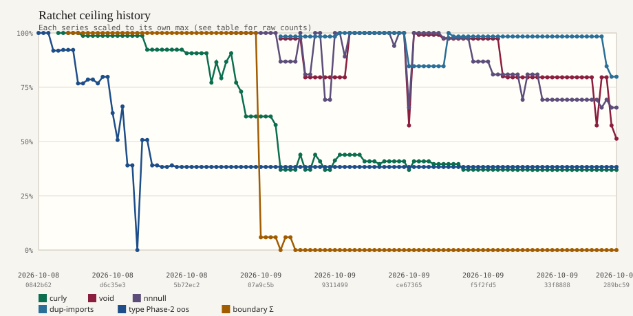

# Ratchet ceiling history

Task: `q-mp-074` / refresh `q-mp-236`. Generated `2026-10-09T20:28:35.128Z` via `git log --all`.

Tracks report-only ceilings over git history:

- **curly / void / nnnull / dup-imports** — `docs/dev/lint-ratchet-ceilings.json` → `rules.*`
- **type Phase-2 out-of-scope** — `docs/dev/type-ratchet-phase2-baseline.json` → `outOfScopeErrors`
- **boundary sum** — `docs/dev/module-boundaries-ceilings.json` → sum of `ceilings.*`

## Live tip snapshot (`2392693`)

| Metric                                        | Ceiling |
| --------------------------------------------- | ------: |
| curly                                         |     538 |
| no-confusing-void-expression                  |     118 |
| no-non-null-assertion                         |     254 |
| no-duplicate-imports                          |      99 |
| prefer-nullish-coalescing (HOLD; not charted) |      65 |

Chart series are normalized independently; raw counts are in the history table.

Chart (each series normalized to its own max):

Regenerate with `npm run report:ratchet-history` (no network; reads local git only).

| SHA       | Date       | curly | void | nnnull | dup | type oos | boundary Σ | Subject                                                                            |
| --------- | ---------- | ----: | ---: | -----: | --: | -------: | ---------: | ---------------------------------------------------------------------------------- |
| `0842b62` | 2026-10-08 |     — |    — |      — |   — |      564 |          — | docs: Phase-2 type-ratchet plan + baseline for AI/rules (burn-1007)                |
| `cdc52b4` | 2026-10-08 |     — |    — |      — |   — |      564 |          — | docs(dev): Phase 2 type-ratchet plan + report-only baseline                        |
| `293ca1d` | 2026-10-08 |     — |    — |      — |   — |      564 |          — | docs: fold #502 Phase-2 type-ratchet plan; supersede #503                          |
| `8719398` | 2026-10-08 |     — |    — |      — |   — |      518 |          — | fix(types): clear Phase-2 Batch 0+1 ratchet errors (burn-1008)                     |
| `79b59a5` | 2026-10-08 |  1456 |    — |      — |   — |      518 |          — | chore(lint): enable TS lint ratchet + curly ceiling (burn-1008)                    |
| `df04cc1` | 2026-10-08 |  1456 |    — |      — |   — |      520 |          — | merge(#517): input-race guards; raise Phase-2 ceiling to 520                       |
| `38e7c77` | 2026-10-08 |  1456 |    — |      — |   — |      520 |         17 | test: module-boundary import-graph audit + check:boundaries ratchet                |
| `0c82baf` | 2026-10-08 |  1456 |    — |      — |   — |      520 |         17 | docs: note Vite mp3d↔game circular chunks in boundary ceilings                     |
| `b92b51c` | 2026-10-08 |  1456 |    — |      — |   — |      433 |         17 | fix(types): Phase-2 type-ratchet Batch 2 (rules-heavy non-AI)                      |
| `e169269` | 2026-10-08 |  1437 |    — |      — |   — |      433 |         17 | merge(#520): TS lint ratchet + curly ceiling (post-#518 autofix)                   |
| `a16a326` | 2026-10-08 |  1437 |    — |      — |   — |      443 |         17 | fix(types): Phase-2 Batch 3 UI/shell type-ratchet (burn-1008)                      |
| `3475bb0` | 2026-10-08 |  1437 |    — |      — |   — |      443 |         17 | docs: refresh #523 boundary ceilings tipSha after #518/#520/#521                   |
| `ba5856d` | 2026-10-08 |  1437 |    — |      — |   — |      433 |         17 | fix(types): Batch-2 type-ratchet compliant recut (supersedes #537)                 |
| `1dcd825` | 2026-10-08 |  1437 |    — |      — |   — |      450 |         17 | fix(types): Phase-2 type-ratchet Batch 4 prime-gold UI/types (burn-1008)           |
| `4336f93` | 2026-10-08 |  1437 |    — |      — |   — |      450 |         17 | fix(types): Phase-2 type-ratchet Batch 4 prime-gold UI/types (burn-1008)           |
| `d6c35e3` | 2026-10-08 |  1437 |    — |      — |   — |      356 |         17 | merge(#544): type-ratchet Batch-3 UI/shell + re-baseline 433→356                   |
| `e562175` | 2026-10-08 |  1437 |    — |      — |   — |      286 |         17 | merge(#551): type-ratchet Batch-4 prime-gold UI/types + re-baseline 356→286        |
| `785212d` | 2026-10-08 |  1437 |    — |      — |   — |      373 |         17 | fix(types): Phase-2 type-ratchet Batch 5 UI/shell compliant re-cut (burn-1008)     |
| `62a9173` | 2026-10-08 |  1437 |    — |      — |   — |      220 |         17 | fix(types): Phase-2 type-ratchet Batch 6 non-AI rules/engine (burn-1008)           |
| `c383a5d` | 2026-10-08 |  1437 |    — |      — |   — |      220 |         17 | fix(types): Phase-2 type-ratchet Batch 6 non-AI rules/engine (burn-1008)           |
| `13812c5` | 2026-10-08 |  1437 |    — |      — |   — |        0 |         17 | docs(types): lower Phase-2 ceiling 220→0 for AI type-only option                   |
| `0dc1e95` | 2026-10-08 |  1437 |    — |      — |   — |      286 |         17 | chore(types): refresh Phase-2 baseline tipSha after #553 fold                      |
| `84f7d03` | 2026-10-08 |  1344 |    — |      — |   — |      286 |         17 | fix(lint): restore curly:all ratchet after fold growth (1484→1344)                 |
| `6e75e5d` | 2026-10-08 |  1344 |    — |      — |   — |      220 |         17 | chore(types): refresh Phase-2 baseline tipSha after #557 fold                      |
| `ffc8aff` | 2026-10-08 |  1344 |    — |      — |   — |      220 |         17 | fix(types): fold #557 Batch-6 emit-identical rules/engine (! only)                 |
| `e65493c` | 2026-10-08 |  1344 |    — |      — |   — |      216 |         17 | fix(types): Phase-2 type-ratchet Batch 7 shell/helper floor (burn-1008)            |
| `caad3eb` | 2026-10-08 |  1344 |    — |      — |   — |      216 |         17 | chore(types): refresh Phase-2 baseline tipSha after Batch 7                        |
| `a2f1376` | 2026-10-08 |  1344 |    — |      — |   — |      220 |         17 | chore(types): refresh Phase-2 baseline tipSha after #561 fold                      |
| `ff2c12a` | 2026-10-08 |  1344 |    — |      — |   — |      216 |         17 | fix(types): Phase-2 type-ratchet Batch 8 helper-test floor (burn-1008)             |
| `82bfaad` | 2026-10-08 |  1344 |    — |      — |   — |      216 |         17 | chore(types): refresh Phase-2 baseline tipSha after Batch 8                        |
| `5b72ec2` | 2026-10-08 |  1320 |    — |      — |   — |      216 |         17 | restore alpha AI/copy surfaces per owner decision (pre-Friday)                     |
| `0bc7cb4` | 2026-10-08 |  1320 |    — |      — |   — |      216 |         17 | chore(types): refresh Phase-2 baseline tipSha after Batch 9                        |
| `bc5062d` | 2026-10-08 |  1320 |    — |      — |   — |      216 |         17 | fix(types): Phase-2 type-ratchet Batch 9 post-restore UI/shell floor (burn-1008)   |
| `5d1433e` | 2026-10-08 |  1320 |    — |      — |   — |      216 |         17 | Tip fold wave5: Batch7–9, UI/engine coverage, mutation audits (#477)               |
| `d1cbc58` | 2026-10-08 |  1320 |    — |      — |   — |      216 |         17 | chore(types): refresh Phase-2 baseline tipSha after #582 fold                      |
| `375acdc` | 2026-10-08 |  1123 |    — |      — |   — |      216 |         17 | fix(lint): q-mp-040 curly:all braces in core/pwa/demos                             |
| `bbb07b5` | 2026-10-09 |  1260 |    — |      — |   — |      216 |         17 | fix(lint): q-mp-041 curly:all braces in src/ui/** excl. three (−60)                |
| `a5c1018` | 2026-10-09 |  1153 |    — |      — |   — |      216 |         17 | q-mp-042: curly:all braces in src/ui/three (−167 ceiling)                          |
| `9701396` | 2026-10-09 |  1263 |    — |      — |   — |      216 |         17 | fix(lint): q-mp-043 curly:all braces in games/*/board-ui.ts (−57)                  |
| `9ec0b66` | 2026-10-09 |  1320 |    — |    387 |   — |      216 |         17 | chore(lint): q-mp-045 ratchet no-non-null-assertion (ceiling 387)                  |
| `bd53536` | 2026-10-09 |  1123 |    — |    387 |   — |      216 |         17 | fix(lint): q-mp-040 curly:all braces in core/pwa/demos                             |
| `9d11d61` | 2026-10-09 |  1063 |    — |    387 |   — |      216 |         17 | fix(lint): q-mp-041 curly:all braces in src/ui/** excl. three (−60)                |
| `8e35ee2` | 2026-10-09 |   896 |    — |    387 |   — |      216 |         17 | q-mp-042: curly:all braces in src/ui/three (−167 ceiling)                          |
| `8cbdcb6` | 2026-10-09 |   896 |    — |    387 |   — |      216 |         17 | chore(lint): re-measure curly:all ceiling to 896 after #590+#592+#596              |
| `db9f606` | 2026-10-09 |   896 |    — |    387 |   — |      216 |         17 | chore(lint): q-mp-045 ratchet no-non-null-assertion (ceiling 387)                  |
| `07a9c5b` | 2026-10-09 |   896 |    — |    387 |   — |      216 |          1 | chore(boundaries): q-mp-104 delete eight dead re-export barrels                    |
| `f1264e1` | 2026-10-09 |   896 |    — |    387 |   — |      216 |          1 | test(boundaries): q-mp-104 deep-import callers of deleted barrels                  |
| `e27cf63` | 2026-10-09 |   896 |    — |    387 |   — |      216 |          1 | fix(lint): q-mp-043 curly:all braces in games/*/board-ui.ts (−57)                  |
| `b290d9e` | 2026-10-09 |   839 |    — |    387 |   — |      216 |          1 | chore(lint): lower curly ceiling to measured count after #608 fold (q-mp-026)      |
| `7922f9a` | 2026-10-09 |   539 |  224 |    336 | 122 |      216 |          0 | q-mp-026: land tip cursor/mp-tip-post477 (folds through batch 4) (#598)            |
| `1b001c6` | 2026-10-09 |   539 |  224 |    336 | 122 |      216 |          1 | chore(boundaries): q-mp-104 delete eight dead re-export barrels                    |
| `7d59901` | 2026-10-09 |   539 |  224 |    336 | 122 |      216 |          1 | test(boundaries): q-mp-104 deep-import callers of deleted barrels                  |
| `5741a82` | 2026-10-09 |   539 |  224 |    336 | 122 |      216 |          0 | fix(boundaries): q-mp-105 split last mixed UI dice barrel                          |
| `03eb1ee` | 2026-10-09 |   639 |  224 |    387 | 122 |      216 |          0 | fix(lint): q-mp-103 curly:all braces in game-controller.ts (−200)                  |
| `3320d89` | 2026-10-09 |   539 |  183 |    313 | 122 |      216 |          0 | q-mp-026d: tip fold batch 5 (#700)                                                 |
| `a016375` | 2026-10-09 |   539 |  183 |    313 | 122 |      216 |          0 | fix(boundaries): q-mp-105 split last mixed UI dice barrel                          |
| `d57ffe3` | 2026-10-09 |   639 |  183 |    387 | 122 |      216 |          0 | fix(lint): q-mp-103 curly:all braces in game-controller.ts (−200)                  |
| `c490c19` | 2026-10-09 |   595 |  183 |    387 | 122 |      216 |          0 | fix(lint): q-mp-121 curly:all braces in games types/layout/serialization (−44)     |
| `cdd2f8b` | 2026-10-09 |   538 |  183 |    268 | 122 |      216 |          0 | q-mp-026e: tip fold batch 6 (#699/#701/#702) (#709)                                |
| `b588420` | 2026-10-09 |   538 |  183 |    268 | 122 |      216 |          0 | q-mp-026f: tip fold onto cursor/mp-tip-post709 (#728)                              |
| `9311499` | 2026-10-09 |   601 |  183 |    387 | 122 |      216 |          0 | fix(lint): curly:all braces in src/core/** (−38 ceiling) (q-mp-125)                |
| `bc2c575` | 2026-10-09 |   639 |  183 |    387 | 124 |      216 |          0 | chore(lint): ratchet no-duplicate-imports ceiling at 124 (q-mp-127)                |
| `c25f013` | 2026-10-09 |   639 |  183 |    345 | 124 |      216 |          0 | fix(lint): clear board-ui no-non-null-assertion (q-mp-131)                         |
| `7a99d9f` | 2026-10-09 |   639 |  230 |    387 | 124 |      216 |          0 | chore(lint): q-mp-128 ratchet no-confusing-void-expression (ceiling 230)           |
| `ae68bda` | 2026-10-09 |   639 |  230 |    387 | 124 |      216 |          0 | docs: q-mp-138 Vite mp3d↔game circular-chunk packaging note                        |
| `4e1ccb3` | 2026-10-09 |   639 |  230 |    387 | 124 |      216 |          0 | chore(ci): q-mp-128 unique commit to attach GitHub Actions suite                   |
| `11a554b` | 2026-10-09 |   595 |  230 |    387 | 124 |      216 |          0 | chore(lint): q-mp-128 ratchet no-confusing-void-expression (ceiling 230)           |
| `654e73f` | 2026-10-09 |   595 |  230 |    387 | 124 |      216 |          0 | fix(lint): q-mp-130 add radix to dice-demo parseInt + ceiling 6                    |
| `93f62fc` | 2026-10-09 |   595 |  230 |    387 | 124 |      216 |          0 | chore(q-mp-133): quarantine production-dead src/core/hex to tests/helpers/core-hex |
| `0706601` | 2026-10-09 |   577 |  230 |    387 | 124 |      216 |          0 | fix(lint): q-mp-126 brace-form curly:all in src/main.ts (−18)                      |
| `e58179f` | 2026-10-09 |   595 |  230 |    387 | 124 |      216 |          0 | fix(lint): q-mp-129 clear non-HOLD default-case sites + ratchet to 6               |
| `4a1d0d0` | 2026-10-09 |   595 |  230 |    387 | 124 |      216 |          0 | feat(lint): q-mp-140 ratchet prefer-nullish-coalescing (ceiling 96)                |
| `166a858` | 2026-10-09 |   595 |  230 |    364 | 124 |      216 |          0 | fix(lint): q-mp-150 clear three/ no-non-null-assertion (−23 ceiling)               |
| `235d523` | 2026-10-09 |   595 |  230 |    387 | 124 |      216 |          0 | fix(lint): q-mp-148 prefer-optional-chain non-HOLD + ceiling 21                    |
| `7fca911` | 2026-10-09 |   595 |  230 |    387 | 124 |      216 |          0 | docs: q-mp-138 Vite mp3d↔game circular-chunk packaging note                        |
| `ce67365` | 2026-10-09 |   538 |  132 |    254 | 105 |      216 |          0 | q-mp-026g: tip fold onto cursor/mp-tip-post728 (#748)                              |
| `2cc5698` | 2026-10-09 |   595 |  230 |    387 | 105 |      216 |          0 | chore(lint): q-mp-128 ratchet no-confusing-void-expression (ceiling 230)           |
| `e292af3` | 2026-10-09 |   595 |  228 |    387 | 105 |      216 |          0 | chore(tip): lower no-confusing-void-expression ceiling 230→228                     |
| `c83e6cd` | 2026-10-09 |   595 |  228 |    387 | 105 |      216 |          0 | fix(lint): q-mp-130 add radix to dice-demo parseInt + ceiling 6                    |
| `2c0bb6f` | 2026-10-09 |   595 |  228 |    387 | 105 |      216 |          0 | fix(lint): q-mp-129 clear non-HOLD default-case sites + ratchet to 6               |
| `308735e` | 2026-10-09 |   577 |  228 |    387 | 105 |      216 |          0 | fix(lint): q-mp-126 brace-form curly:all in src/main.ts (−18)                      |
| `5b5fc6d` | 2026-10-09 |   577 |  228 |    387 | 105 |      216 |          0 | chore(q-mp-133): quarantine production-dead src/core/hex to tests/helpers/core-hex |
| `b6392de` | 2026-10-09 |   577 |  224 |    378 | 105 |      216 |          0 | chore(tip): lower ceilings after #675 hex quarantine                               |
| `e607958` | 2026-10-09 |   577 |  224 |    378 | 124 |      216 |          0 | chore(lint): ratchet no-duplicate-imports ceiling at 124 (q-mp-127)                |
| `ee770c8` | 2026-10-09 |   577 |  224 |    378 | 122 |      216 |          0 | chore(tip): lower no-duplicate-imports ceiling 124→122                             |
| `47f4ed5` | 2026-10-09 |   577 |  224 |    378 | 122 |      216 |          0 | fix(lint): curly:all braces in src/core/** (−38 ceiling) (q-mp-125)                |
| `0454239` | 2026-10-09 |   539 |  224 |    378 | 122 |      216 |          0 | chore(tip): lower curly ceiling after #664 src/core braces → 539                   |
| `4e459ea` | 2026-10-09 |   539 |  224 |    378 | 122 |      216 |          0 | fix(lint): clear board-ui no-non-null-assertion (q-mp-131)                         |
| `b2c4442` | 2026-10-09 |   539 |  224 |    336 | 122 |      216 |          0 | chore(tip): lower nnnull ceiling after #666 board-ui guards → 336                  |
| `03fff4d` | 2026-10-09 |   539 |  224 |    336 | 122 |      216 |          0 | q-mp-141: ratchet @typescript-eslint/switch-exhaustiveness-check (ceiling 8)       |
| `f5f2fd5` | 2026-10-09 |   539 |  224 |    336 | 122 |      216 |          0 | feat(lint): q-mp-140 ratchet prefer-nullish-coalescing (ceiling 96)                |
| `8c87c98` | 2026-10-09 |   539 |  224 |    336 | 122 |      216 |          0 | fix(lint): q-mp-150 clear three/ no-non-null-assertion (−23 ceiling)               |
| `aef7e9e` | 2026-10-09 |   539 |  224 |    313 | 122 |      216 |          0 | chore(tip): lower nnnull ceiling after #683 three/ guards                          |
| `555915a` | 2026-10-09 |   539 |  224 |    313 | 122 |      216 |          0 | fix(lint): q-mp-148 prefer-optional-chain non-HOLD + ceiling 21                    |
| `fd0ba92` | 2026-10-09 |   539 |  184 |    313 | 122 |      216 |          0 | chore(tip): lower void ceiling after #682 game-route-mounts braces                 |
| `0c5623d` | 2026-10-09 |   539 |  183 |    313 | 122 |      216 |          0 | chore(tip): prettier hex board-ui + lower void ceiling to 183                      |
| `b990c92` | 2026-10-09 |   539 |  183 |    313 | 122 |      216 |          0 | feat(lint): q-mp-141 ratchet switch-exhaustiveness-check (ceiling 8)               |
| `9c90834` | 2026-10-09 |   538 |  183 |    313 | 122 |      216 |          0 | fix(lint): q-mp-168 brace kings-quadraphages board-renderer curly (−1)             |
| `17d248b` | 2026-10-09 |   539 |  183 |    268 | 122 |      216 |          0 | fix(lint): q-mp-162 clear games shell no-non-null-assertion (−45 ceiling)          |
| `5dcf4ef` | 2026-10-09 |   539 |  183 |    313 | 122 |      216 |          0 | q-mp-157: ratchet @typescript-eslint/no-shadow (ceiling 13)                        |
| `00167d1` | 2026-10-09 |   538 |  183 |    313 | 122 |      216 |          0 | fix(lint): q-mp-168 brace kings-quadraphages board-renderer curly (−1)             |
| `02e2cbe` | 2026-10-09 |   538 |  183 |    313 | 122 |      216 |          0 | fix(lint): q-mp-162 clear games shell no-non-null-assertion (−45 ceiling)          |
| `423867c` | 2026-10-09 |   538 |  183 |    268 | 122 |      216 |          0 | chore(tip): reconcile lint ceilings after #701+#702 fold                           |
| `3f5cc06` | 2026-10-09 |   538 |  183 |    268 | 122 |      216 |          0 | fix(q-mp-184): clear prefer-nullish-coalescing in fraction-bar-ui (−18)            |
| `7f84b33` | 2026-10-09 |   538 |  183 |    268 | 122 |      216 |          0 | q-mp-185: clear prefer-nullish-coalescing in highlight-ui (−11)                    |
| `33f8888` | 2026-10-09 |   538 |  183 |    268 | 122 |      216 |          0 | fix(q-mp-184): clear prefer-nullish-coalescing in fraction-bar-ui (−18)            |
| `f3ad8b4` | 2026-10-09 |   538 |  183 |    268 | 122 |      216 |          0 | q-mp-157: ratchet @typescript-eslint/no-shadow (ceiling 13)                        |
| `6698ed2` | 2026-10-09 |   538 |  183 |    268 | 122 |      216 |          0 | chore(tip): reconcile lint-ratchet notes after q-mp-184/157/159 fold               |
| `8680f83` | 2026-10-09 |   538 |  183 |    268 | 122 |      216 |          0 | chore(tip): remeasure lint ceilings after q-mp-185 nullish fold                    |
| `cfe8294` | 2026-10-09 |   538 |  183 |    268 | 122 |      216 |          0 | fix(q-mp-186): clear prefer-nullish-coalescing in owl-messages (−9)                |
| `6150dc6` | 2026-10-09 |   538 |  183 |    268 | 122 |      216 |          0 | chore(lint): q-mp-206 remove demo console.log; ratchet no-console at 23            |
| `6e6d065` | 2026-10-09 |   538 |  183 |    268 | 122 |      216 |          0 | chore(q-mp-186): note tip re-measure in nullish ceiling (retrigger CI)             |
| `54532ce` | 2026-10-09 |   538 |  183 |    268 | 122 |      216 |          0 | merge: tip post709; remeasure nullish ceiling 65 → 56                              |
| `3125a0b` | 2026-10-09 |   538 |  132 |    268 | 122 |      216 |          0 | chore(lint): q-mp-180 lower no-confusing-void-expression ceiling 183→132           |
| `32ab0bd` | 2026-10-09 |   538 |  183 |    254 | 122 |      216 |          0 | fix(q-mp-225): clear graph/algorithms no-non-null-assertion (−14)                  |
| `08d504c` | 2026-10-09 |   538 |  183 |    268 | 105 |      216 |          0 | q-mp-226: clear no-duplicate-imports in */board-ui.ts (−17 → ceiling 105)          |
| `7664bcd` | 2026-10-09 |   538 |  132 |    254 |  99 |      216 |          0 | fix(q-mp-227): clear no-duplicate-imports in src/demos/** (−6 → 99)                |
| `289bc59` | 2026-10-09 |   538 |  118 |    254 |  99 |      216 |          0 | chore(lint): q-mp-218 re-measure no-confusing-void-expression ceiling 132→118      |
