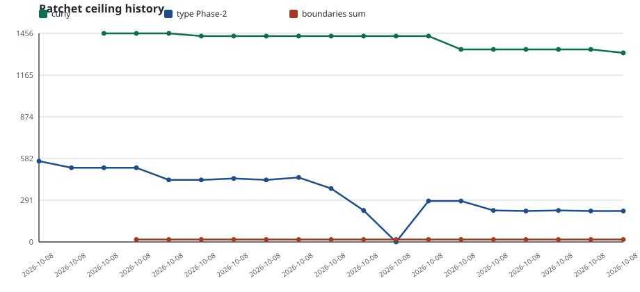

# Ratchet ceiling history

Task: `q-mp-074`. Regenerated by `node scripts/report-ratchet-history.mjs`.

Tracks git history of:

- `docs/dev/lint-ratchet-ceilings.json` → `rules.curly`
- `docs/dev/type-ratchet-phase2-baseline.json` → `outOfScopeErrors`
- `docs/dev/module-boundaries-ceilings.json` → sum of `ceilings.*`

Commits that only refresh tipSha / notes without changing these numbers are omitted. Generated at `2026-10-09T03:16:44+00:00`.

## Chart

## Table

| date | sha | curly | type Phase-2 | boundaries sum | subject |
| --- | --- | ---: | ---: | ---: | --- |
| 2026-10-08 | `0842b629` | — | 564 | — | docs: Phase-2 type-ratchet plan + baseline for AI/rules (burn-1007) |
| 2026-10-08 | `87193983` | — | 518 | — | fix(types): clear Phase-2 Batch 0+1 ratchet errors (burn-1008) |
| 2026-10-08 | `79b59a5a` | 1456 | 518 | — | chore(lint): enable TS lint ratchet + curly ceiling (burn-1008) |
| 2026-10-08 | `38e7c77a` | 1456 | 518 | 17 | test: module-boundary import-graph audit + check:boundaries ratchet |
| 2026-10-08 | `b92b51c4` | 1456 | 433 | 17 | fix(types): Phase-2 type-ratchet Batch 2 (rules-heavy non-AI) |
| 2026-10-08 | `e1692696` | 1437 | 433 | 17 | merge(#520): TS lint ratchet + curly ceiling (post-#518 autofix) |
| 2026-10-08 | `a16a326a` | 1437 | 443 | 17 | fix(types): Phase-2 Batch 3 UI/shell type-ratchet (burn-1008) |
| 2026-10-08 | `ba5856d6` | 1437 | 433 | 17 | fix(types): Batch-2 type-ratchet compliant recut (supersedes #537) |
| 2026-10-08 | `1dcd8252` | 1437 | 450 | 17 | fix(types): Phase-2 type-ratchet Batch 4 prime-gold UI/types (burn-1008) |
| 2026-10-08 | `785212dd` | 1437 | 373 | 17 | fix(types): Phase-2 type-ratchet Batch 5 UI/shell compliant re-cut (burn-1008) |
| 2026-10-08 | `62a9173b` | 1437 | 220 | 17 | fix(types): Phase-2 type-ratchet Batch 6 non-AI rules/engine (burn-1008) |
| 2026-10-08 | `13812c59` | 1437 | 0 | 17 | docs(types): lower Phase-2 ceiling 220→0 for AI type-only option |
| 2026-10-08 | `0dc1e953` | 1437 | 286 | 17 | chore(types): refresh Phase-2 baseline tipSha after #553 fold |
| 2026-10-08 | `84f7d032` | 1344 | 286 | 17 | fix(lint): restore curly:all ratchet after fold growth (1484→1344) |
| 2026-10-08 | `6e75e5d9` | 1344 | 220 | 17 | chore(types): refresh Phase-2 baseline tipSha after #557 fold |
| 2026-10-08 | `e65493c3` | 1344 | 216 | 17 | fix(types): Phase-2 type-ratchet Batch 7 shell/helper floor (burn-1008) |
| 2026-10-08 | `a2f13767` | 1344 | 220 | 17 | chore(types): refresh Phase-2 baseline tipSha after #561 fold |
| 2026-10-08 | `ff2c12a9` | 1344 | 216 | 17 | fix(types): Phase-2 type-ratchet Batch 8 helper-test floor (burn-1008) |
| 2026-10-08 | `5b72ec21` | 1320 | 216 | 17 | restore alpha AI/copy surfaces per owner decision (pre-Friday) |
