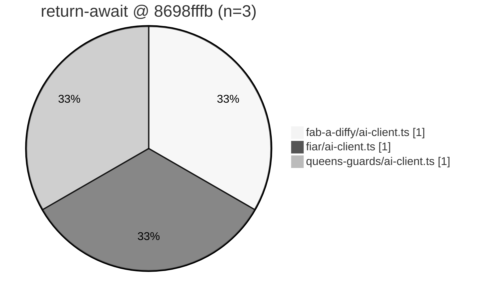

# Docs: `@typescript-eslint/return-await` residual inventory (tip post949 — ai-client trio)

**Task id:** `q-mp-512` (P3, report-only)  
**Tip base:** `cursor/mp-tip-post949` @ `8698fffb` (`8698fffb85b1e3d2289e54a665fac6162d3bdee4`)  
**Measured at:** `2026-10-10T12:22:01Z` (UTC)  
**Machine summary:** [`return-await-residuals-post949-2026-10-10.json`](./return-await-residuals-post949-2026-10-10.json)  
**Visual:** [`return-await-residuals-post949-2026-10-10.svg`](./return-await-residuals-post949-2026-10-10.svg)  
**Deliverable:** docs / data / chart only — **ZERO** edits to `ai-client` files or any `ai*.ts`.

## Acceptance (from backlog q-mp-512)

- [x] Re-measure `@typescript-eslint/return-await` on live tip **post949** (spec named post914 — stale; restamped here)
- [x] Dated list + tip SHA under `docs/dev/` (`…-post949-2026-10-10.md` + `.json` + `.svg`)
- [x] Explicitly defers product clear to undrafted `q-mp-247` and ceiling intro to `q-mp-316` / `#820`
- [x] No AI product edits; no ratchet raises; no `ai-client` / `ai*.ts` touches
- [x] `npm run check:dev-docs` clean

## Spec staleness

| Field | Backlog stamp (`q-mp-512` in `backlog-2026-10-10h.md`) | Live tip (this inventory) |
| --- | --- | --- |
| Tip branch | `cursor/mp-tip-post914` | **`cursor/mp-tip-post949`** |
| Tip SHA (audit) | `f5d3d04a` (backlog doc header) | **`8698fffb`** (`q-mp-026o` tip-pointer re-anchor on post949 cut) |
| Suggested basename | `return-await-residuals-post914-2026-10-10` | **`return-await-residuals-post949-2026-10-10`** |
| return-await | **3** / 3 | **3** / 3 (unchanged) |
| Files | fab / fiar / queens `ai-client.ts` ×1 | same trio ×1 (lines **46** / **45** / **46**) |

**Verdict:** Residual surface is **flat**. Tip advanced post914 → post949; the return-await set did not move.

## Duplicate check (open drafts)

| PR / id | Base | Title | Overlap |
| --- | --- | --- | --- |
| undrafted `q-mp-247` | — | return-await ai-client clear (−3) | **CONTAINED** — product clear owner; this ticket inventory only. Left alone. |
| [#820](https://github.com/fuzzywigg/math-pentathlon/pull/820) `q-mp-316` | post755 | introduce return-await ratchet ceiling at 3 | **CONTAINED** — ceiling intro; tip already has the key at **3**. Left open (no comment). |
| [#786](https://github.com/fuzzywigg/math-pentathlon/pull/786) `q-mp-268` | post755 | clear return-await in idle-warm + mounts (−4) | **CONTAINED** — tip-folded; residual now ai-client trio only. Left open. |
| [#944](https://github.com/fuzzywigg/math-pentathlon/pull/944) `q-mp-464` | post914 | eslint non-ceilinged residuals refresh | **CONTAINED** — has a return-await **section** inside the broad overlay inventory; does **not** own a dedicated return-await stamp. Left open. |
| [#978](https://github.com/fuzzywigg/math-pentathlon/pull/978) `q-mp-515` | post949 | brace void in idle-warm (−1) | **None** — different ceiling key (`no-confusing-void-expression`) |
| Other open drafts into `cursor/mp-tip-post949` | post949 | (none else at measure time) | No competing owner for this dedicated inventory |

No open draft into `cursor/mp-tip-post949` already owns a dedicated return-await residual inventory → proceed.

## Method

```text
npm run report:lint-buckets -- --top 20
npm run lint:ratchet
npx eslint --rule '@typescript-eslint/return-await: [error, always]' \
  src/games/fab-a-diffy/ai-client.ts \
  src/games/fiar/ai-client.ts \
  src/games/queens-guards/ai-client.ts
npm run check:dev-docs
```

Ceilings source: [`docs/dev/lint-ratchet-ceilings.json`](./lint-ratchet-ceilings.json) (`@typescript-eslint/return-await`: **3**).  
Probe: same rule as `scripts/check-lint-ratchet.mjs` / `report:lint-buckets`.

## Live tip snapshot

| Metric | Value |
| --- | ---: |
| Tip branch | `cursor/mp-tip-post949` |
| Tip SHA | `8698fffb` |
| `@typescript-eslint/return-await` | **3** / ceiling **3** |
| Headroom | **0** |
| Δ vs backlog measured baseline | **0** |
| Files with hits | **3** (all `*/ai-client.ts`) |
| Hits outside ai-client trio | **0** |

### `npm run lint:ratchet` (excerpt)

```text
ok   @typescript-eslint/return-await: 3 / ceiling 3
Lint ratchet passed.
```

### `npm run report:lint-buckets -- --top 20` (excerpt)

```text
@typescript-eslint/return-await: 3 / ceiling 3
  path buckets:
       1  src/games/fab-a-diffy
       1  src/games/fiar
       1  src/games/queens-guards
  densest files (top 20):
       1  src/games/fab-a-diffy/ai-client.ts
       1  src/games/fiar/ai-client.ts
       1  src/games/queens-guards/ai-client.ts
```

## Residual table

| File | Hits | Line:col | Pattern (report-only) | Disposition |
| --- | ---: | --- | --- | --- |
| `src/games/fab-a-diffy/ai-client.ts` | 1 | 46:10 | `return getClient().request({...})` without `await` | AI-client style — undrafted `q-mp-247`; **no edit here** |
| `src/games/fiar/ai-client.ts` | 1 | 45:10 | same | AI-client style — undrafted `q-mp-247`; **no edit here** |
| `src/games/queens-guards/ai-client.ts` | 1 | 46:10 | same | AI-client style — undrafted `q-mp-247`; **no edit here** |

Totals: **3** / **3**. All three are bare `return` of a Promise from `getClient().request(...)` inside `async` move helpers. Clearing would be a pure style/`return await` brace change under `@typescript-eslint/return-await: always` — still owned by **undrafted `q-mp-247`**, not this inventory. Ceiling introduction remains **`q-mp-316`** / `#820`.

## Visual




```text
fab-a-diffy/ai-client.ts      █ 1  (L46)
fiar/ai-client.ts             █ 1  (L45)
queens-guards/ai-client.ts    █ 1  (L46)
```

## Why this ticket does not clear

- Hard rules + worker brief: **ZERO** edits to ai-client files or any `ai*.ts`.
- Product clear remains undrafted **`q-mp-247`** (series owner for the −3 style clear).
- Ceiling intro remains **`q-mp-316`** / open `#820` (tip already carries ceiling **3**).
- No ratchet raise or lower in this PR (inventory only; lower would follow a future clear fold).

## Tip ceilings restated (context only; not edited)

From live `npm run lint:ratchet` @ `8698fffb`:

| Rule | Live / ceiling |
| --- | ---: |
| curly | 538 / 538 |
| no-non-null-assertion | 241 / 241 |
| no-confusing-void-expression | **50** / **50** |
| radix | 6 / 6 |
| default-case | 5 / 5 |
| no-duplicate-imports | 42 / 42 |
| prefer-nullish-coalescing | 65 / 65 |
| prefer-optional-chain | 21 / 21 |
| switch-exhaustiveness-check | 8 / 8 |
| no-shadow | 3 / 3 |
| eqeqeq | 1 / 1 |
| **return-await** | **3** / **3** |

Note: backlog header still showed void **51**/51 @ `f5d3d04a`; live tip post949 has void **50**/50 (bootstrap-owl fold). return-await unchanged.

## Hard-rule holds

- Hex Hard assert stays **450ms**
- No AI search / scoring / difficulty / timing changes
- No `*/rules.ts`, legal-move, or scoring-path edits
- No player-facing copy or aria/label string changes
- No `memory/` files

## Verification commands (run on this branch)

```text
npm run report:lint-buckets -- --top 20
npm run lint:ratchet
npm run check:dev-docs
npm run verify
npm run test:unit
```

Expected for this docs-only change: lint buckets / ratchet return-await stay **3**/3; `check:dev-docs` problems **0**; `verify` and `test:unit` pass unchanged vs tip @ `8698fffb`.

**Next action: fold into tip by the tip owner.**
