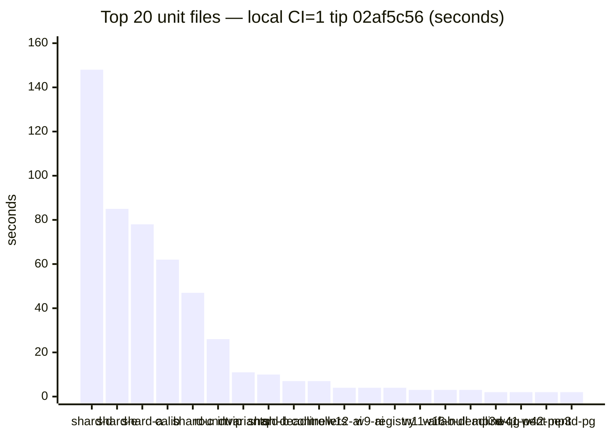
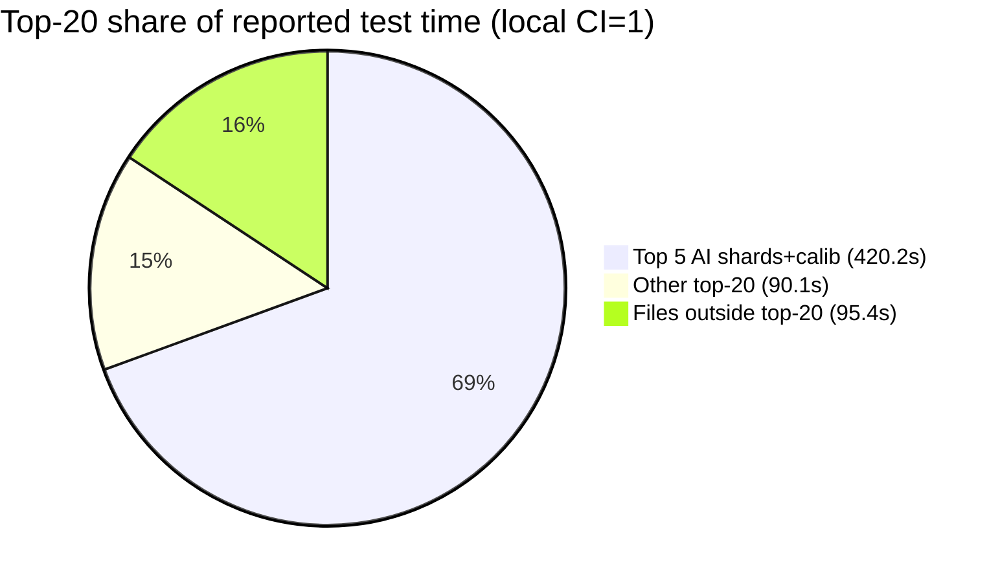

# Slowest unit-file inventory — 2026-10-09

**Task id:** `q-mp-301` (P3, report-only)  
**Tip audited:** `cursor/mp-tip-post755` @ `02af5c56` (full `02af5c56be8179c07de33958cfb2440529a16727`)  
**Deliverable:** this doc only (no `src/`, test, ratchet, or CI workflow edits)

## Purpose

File-level duration ranking for the Vitest unit suite on tip post755, so later harness-only split/skip work has a measured top-N map. Orthogonal to the **unit wall-budget** page ([`docs/wiki/ci-unit-budget.md`](../wiki/ci-unit-budget.md) / backlog `q-mp-289` / open [#746](https://github.com/fuzzywigg/math-pentathlon/pull/746)) — that page owns job wall ~8 min; **this page owns per-file seconds**.

## Hard-rule HOLD (explicit)

Workers following this inventory must **not**:

- Change AI search, scoring, difficulty, or move timing
- Touch Hex Hard play deadline (**450ms** stays) — live pin `src/games/hex/ai.ts` `hard: 450`; characterization `tests/unit/ai-hard-midgame-identity.test.ts` `expect(HEX_MS.hard).toBeLessThanOrEqual(450)`
- Edit `*/rules.ts`, legal-move, or scoring paths
- Add Stars & Bars history caps
- Enable the two AI benches under `CI=1` (`tablet-ai-hard-latency.bench`, `ai-move-time-midgame.bench`) — see [`ai-timing-ci-skip-inventory-2026-10-09.md`](./ai-timing-ci-skip-inventory-2026-10-09.md)
- Assert or loosen AI-timing / scoring thresholds while chasing suite wall time

Hygiene proposals below are **TEST-HARNESS-ONLY** (file splits, project/pool isolation, `retry` under CI, optional `maxWorkers` experiments). No product or AI deadline edits.

## Duplicate check (open tip drafts `#776`–`#801`)

| Related draft / prior                                                                                                                                      | Overlap                                        | Action                                  |
| ---------------------------------------------------------------------------------------------------------------------------------------------------------- | ---------------------------------------------- | --------------------------------------- |
| [#801](https://github.com/fuzzywigg/math-pentathlon/pull/801) `q-mp-090h` backlog 09i                                                                      | Defines this task; does not ship the inventory | Leave open                              |
| [#746](https://github.com/fuzzywigg/math-pentathlon/pull/746) / wiki `ci-unit-budget.md` / `q-mp-289`                                                      | Job wall budget + AI-bench skips               | Narrative sibling; keep this file-level |
| [#729](https://github.com/fuzzywigg/math-pentathlon/pull/729) / [`ai-timing-flake-inventory-2026-10-09.md`](./ai-timing-flake-inventory-2026-10-09.md)     | Flake rates for AI shards                      | Complementary; no duration ranking      |
| [#693](https://github.com/fuzzywigg/math-pentathlon/pull/693) / [`ai-timing-ci-skip-inventory-2026-10-09.md`](./ai-timing-ci-skip-inventory-2026-10-09.md) | CI skip HOLD for benches                       | Complementary                           |
| Open tip drafts `#776`–`#800`                                                                                                                              | lint / knip / coverage / layout-read / triage  | No slowest-file inventory               |

No open draft already owns `q-mp-301` / `slowest-unit-file-inventory-2026-10-09.md` → full task proceeds.

## Method

### Suite size (tip `02af5c56`)

| Metric                                  |                                         Count | How                                                                                                      |
| --------------------------------------- | --------------------------------------------: | -------------------------------------------------------------------------------------------------------- |
| Unit files (excl. `_tokenmaxx_archive`) |                                      **3163** | `find tests/unit \( -name '*.test.ts' -o -name '*.spec.ts' \) ! -path '*/_tokenmaxx_archive/*' \| wc -l` |
| Files reported by Vitest under `CI=1`   |    **3161** passed / **2** skipped (**3163**) | Local + GHA summary                                                                                      |
| Cases (Vitest summary)                  | **12318** passed / **44** skipped (**12362**) | Local + GHA summary                                                                                      |

### Primary: local tip run (`CI=1`, full unit job shape)

Host: cloud agent. Command (same script CI uses — **not** `--project unit-shared` alone; nearly all of the top-N live in `unit-node`):

```bash
git rev-parse HEAD   # 02af5c56be8179c07de33958cfb2440529a16727
CI=1 npm run test:unit -- --reporter=default
# Test Files  3161 passed | 2 skipped (3163)
# Tests       12318 passed | 44 skipped (12362)
# Duration    247.82s (transform 23.03s, setup 5.57s, import 28.44s, tests 605.76s, environment 1930.59s)
```

Per-file durations parsed from Vitest default file lines (`✓ |project| path (N tests) Xms`). Artifact: `/opt/cursor/artifacts/q-mp-301-local-file-durations.json`.

### Corroboration: GHA unit job on tip-stack PR #801

| Field        | Value                                                                                                                                                                                       |
| ------------ | ------------------------------------------------------------------------------------------------------------------------------------------------------------------------------------------- |
| Workflow run | [`37999819714`](https://github.com/fuzzywigg/math-pentathlon/actions/runs/37999819714) (PR [#801](https://github.com/fuzzywigg/math-pentathlon/pull/801) head `cb8e7e14`, base tip post755) |
| Unit job     | ~6m10s wall; Vitest **Duration 348.43s** (tests **833.89s**)                                                                                                                                |
| Suite size   | Same **3163** files / **12362** cases                                                                                                                                                       |
| Parse        | Same file-line pattern (ANSI stripped) → `/opt/cursor/artifacts/q-mp-301-ci-file-durations.json`                                                                                            |

Local and GHA share the same top-5 order; GHA is ~1.3–1.5× slower on the AI shards (expected on shared runners).

## Top 20 slowest unit files (local tip `02af5c56`, `CI=1`)

Sum of top-20 file durations: **510.3s** of **605.7s** reported test time (**84.2%**). On GHA #801: top-20 **693.2s** / **833.9s** (**83.1%**).

| Rank | File                                            | Project         | Local CI=1 (s) | GHA #801 (s) | Tests          | Hygiene note                                                                    |
| ---: | ----------------------------------------------- | --------------- | -------------: | -----------: | -------------- | ------------------------------------------------------------------------------- |
|    1 | `ai-determinism-shard-d.test.ts`                | `unit-node`     |         147.94 |       222.96 | 8              | **HOLD** — AI determinism; harness-only pool/timeout only (see flake inventory) |
|    2 | `ai-determinism-shard-e.test.ts`                | `unit-node`     |          85.15 |       116.33 | 10             | **HOLD** — AI determinism                                                       |
|    3 | `ai-determinism-shard-a.test.ts`                | `unit-node`     |          77.57 |       100.17 | 8              | **HOLD** — AI determinism                                                       |
|    4 | `ai-calibration-difficulty-order.test.ts`       | `unit-node`     |          62.30 |        73.62 | 20 (3 skipped) | **HOLD** — AI calibration; no scoring/difficulty retune                         |
|    5 | `ai-determinism-shard-c.test.ts`                | `unit-node`     |          47.19 |        70.97 | 8              | **HOLD** — AI determinism                                                       |
|    6 | `state-roundtrip-fuzz.test.ts`                  | `unit-node`     |          25.83 |        35.41 | 22             | Split by game/engine or property-count shards (harness only)                    |
|    7 | `engine-property-invariants.test.ts`            | `unit-node`     |          10.98 |        14.05 | 32             | Shard invariants by game family (harness only)                                  |
|    8 | `ai-determinism-shard-b.test.ts`                | `unit-node`     |          10.42 |         6.99 | 8              | **HOLD** — AI determinism                                                       |
|    9 | `queens-hex-ai-play-deadline.test.ts`           | `unit-node`     |           7.18 |         6.80 | 9              | **HOLD** — play-deadline characterization; Hex Hard **450ms** untouched         |
|   10 | `existing-games-controllers.test.ts`            | `unit-isolated` |           6.74 |         7.39 | 67             | Split by game controller (already `unit-isolated`)                              |
|   11 | `burn-wave12-win-draw-ai.test.ts`               | `unit-node`     |           4.28 |         5.67 | 19             | **HOLD** — AI win/draw surface                                                  |
|   12 | `burn-wave9-win-draw-ai.test.ts`                | `unit-node`     |           3.76 |         5.44 | 24             | **HOLD** — AI win/draw surface                                                  |
|   13 | `burn-1008-registry-module-contract.test.ts`    | `unit-isolated` |           3.50 |         3.28 | 129            | Split registry contract by domain (already isolated)                            |
|   14 | `burn-wave11-win-draw-ai.test.ts`               | `unit-node`     |           3.29 |         3.19 | 18             | **HOLD** — AI win/draw surface                                                  |
|   15 | `burn-wave16-ai-null-gates.test.ts`             | `unit-node`     |           2.56 |         2.72 | 19             | **HOLD** — AI null-gate surface                                                 |
|   16 | `fab-a-diffy-ai-play-deadline.test.ts`          | `unit-node`     |           2.52 |         4.31 | 4              | **HOLD** — play-deadline; no deadline raise                                     |
|   17 | `mp3d-queens-guards-board-select.test.ts`       | `unit-isolated` |           2.41 |         2.70 | 6              | Keep isolated; optional thin lifecycle split                                    |
|   18 | `burn-wave41-pent-ai-difficulties.test.ts`      | `unit-node`     |           2.40 |         2.55 | 8              | **HOLD** — AI difficulty surface                                                |
|   19 | `burn-wave42-pent-ai-difficulty-random.test.ts` | `unit-node`     |           2.23 |         3.70 | 4              | **HOLD** — AI difficulty/random surface                                         |
|   20 | `mp3d-prime-gold-full-game-ai.test.ts`          | `unit-isolated` |           2.03 |         2.17 | 3              | **HOLD** — full-game AI path; no scoring/timing edits                           |

Paths are under `tests/unit/` (basename shown for width).

### Bar visual — local top 20 (seconds)



### Concentration (local)



## Recommended harness hygiene (no AI-timing / Hex Hard edits)

Priority is **non-HOLD** files first; AI ranks 1–5 dominate wall but are already covered by flake / CI-skip inventories and must not be “fixed” by raising deadlines.

1. **`state-roundtrip-fuzz.test.ts` (~26s local / ~35s GHA)** — split into per-game or N-case shards under `unit-node` so one slow engine does not serialize the whole file.
2. **`engine-property-invariants.test.ts` (~11s / ~14s)** — same pattern: shard by game family; keep property asserts; do not touch rules/scoring implementations.
3. **`existing-games-controllers.test.ts` (~7s, already `unit-isolated`)** — split by controller/game to cut isolate cost and improve parallel fill.
4. **`burn-1008-registry-module-contract.test.ts` (129 tests, ~3.5s)** — domain splits for maintainability more than wall; already isolated.
5. **AI determinism / calibration / play-deadline files** — **HOLD**. If GHA headroom tightens, prefer harness-only moves already listed in [`ai-timing-flake-inventory-2026-10-09.md`](./ai-timing-flake-inventory-2026-10-09.md) (per-file `retry`, dedicated pool/`maxWorkers: 1`, CI-only longer `testTimeout`). Do **not** change Hex Hard **450ms**, `HARD_FLAG_MS`, or scoring asserts. Do **not** remove `describe.skipIf(!!process.env.CI)` on the two AI latency benches.

## Why not `--project unit-shared` alone?

Backlog verify sketch mentioned `CI=1 npx vitest run --project unit-shared --reporter=verbose`. On tip, **0 of the top-10** files are in `unit-shared` (they are `unit-node` / `unit-isolated`). Measuring only `unit-shared` would miss the real wall contributors. Inventory therefore uses the full unit job (`npm run test:unit` / all three projects), matching CI.

## Hex Hard pin (untouched)

```text
$ rg -n 'hard:\s*450' src/games/hex/ai.ts
21:  hard: 450,

$ rg -n 'toBeLessThanOrEqual\(450\)' tests/unit/ai-hard-midgame-identity.test.ts
63:    expect(HEX_MS.hard).toBeLessThanOrEqual(450);
```

## Related

- Unit wall budget + AI-bench skips: [`docs/wiki/ci-unit-budget.md`](../wiki/ci-unit-budget.md)
- AI-timing CI-skip HOLD: [`docs/dev/ai-timing-ci-skip-inventory-2026-10-09.md`](./ai-timing-ci-skip-inventory-2026-10-09.md)
- AI flake inventory: [`docs/dev/ai-timing-flake-inventory-2026-10-09.md`](./ai-timing-flake-inventory-2026-10-09.md)
- Testing-layer file/case tables: [`docs/dev/testing-layers-2026-10-09.md`](./testing-layers-2026-10-09.md)

## Verify (this PR)

```bash
npm run check:dev-docs
rg -n 'hard:\s*450' src/games/hex/ai.ts
npm run lint
npm run typecheck
npm run lint:ratchet
# unit suite already measured under CI=1 for this inventory (Duration 247.82s)
```
