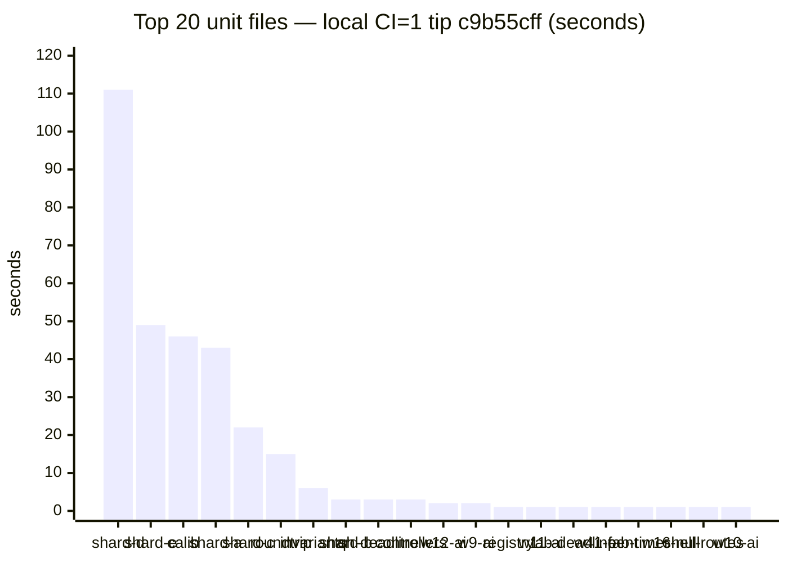
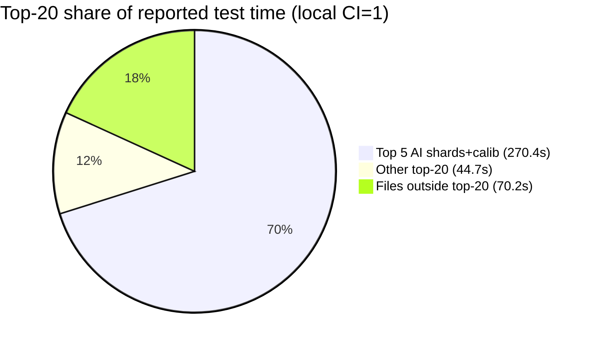

# Slowest unit-file inventory — 2026-10-10

**Task id:** `q-mp-342` (P3, report-only)  
**Tip audited:** `cursor/mp-tip-post785` @ `02926472` (full `02926472a430627e0f4e70af7cab5f5d0a8394b8`)  
**Measured on:** tip commit `c9b55cff` (full `c9b55cff8c3832ff502179fe66f14ecaa400e95d`) — same **3182** unit files as tip HEAD (intervening tip folds were docs / lint / layout-read only)  
**Deliverable:** this sibling doc only (no `src/`, test, ratchet, wiki wall-budget, or CI workflow edits)

## Purpose

Refresh the file-level duration ranking for the Vitest unit suite on tip post785 after suite growth past the prior inventory stamp (**3163** @ `02af5c56`). Orthogonal to the **unit wall-budget** page ([`docs/wiki/ci-unit-budget.md`](../wiki/ci-unit-budget.md) / open [#843](https://github.com/fuzzywigg/math-pentathlon/pull/843) `q-mp-338`) — that page owns job wall; **this page owns per-file seconds**.

## Hard-rule HOLD (explicit)

Workers following this inventory must **not**:

- Change AI search, scoring, difficulty, or move timing
- Touch Hex Hard play deadline (**450ms** stays) — live pin `src/games/hex/ai.ts` `hard: 450`; characterization `tests/unit/ai-hard-midgame-identity.test.ts` `expect(HEX_MS.hard).toBeLessThanOrEqual(450)`
- Edit `*/rules.ts`, legal-move, or scoring paths
- Add Stars & Bars history caps
- Enable the two AI benches under `CI=1` (`tablet-ai-hard-latency.bench`, `ai-move-time-midgame.bench`) — see [`ai-timing-ci-skip-inventory-2026-10-09.md`](./ai-timing-ci-skip-inventory-2026-10-09.md)
- Assert or loosen AI-timing / scoring thresholds while chasing suite wall time
- Edit wiki wall-budget cells owned by `q-mp-338` / [#843](https://github.com/fuzzywigg/math-pentathlon/pull/843)

Hygiene proposals below are **TEST-HARNESS-ONLY** (file splits, project/pool isolation, `retry` under CI, optional `maxWorkers` experiments). No product or AI deadline edits.

## Duplicate check (open tip drafts)

| Related draft / prior                                                                                                                                      | Overlap                                         | Action                                                         |
| ---------------------------------------------------------------------------------------------------------------------------------------------------------- | ----------------------------------------------- | -------------------------------------------------------------- |
| [#831](https://github.com/fuzzywigg/math-pentathlon/pull/831) `q-mp-090j` backlog 10a                                                                      | Defines this task; does not ship the inventory  | Leave open                                                     |
| [#811](https://github.com/fuzzywigg/math-pentathlon/pull/811) / [`slowest-unit-file-inventory-2026-10-09.md`](./slowest-unit-file-inventory-2026-10-09.md) | Prior tip post755 stamp (**3163** @ `02af5c56`) | **contained** — leave open; this sibling refreshes for post785 |
| [#843](https://github.com/fuzzywigg/math-pentathlon/pull/843) `q-mp-338` wall-budget wiki                                                                  | Job wall + AI-bench skip smoke                  | Narrative sibling; keep this file-level                        |
| [#841](https://github.com/fuzzywigg/math-pentathlon/pull/841) `q-mp-335` testing-layers counts                                                             | File/case count tables                          | Complementary; no duration ranking                             |
| [#813](https://github.com/fuzzywigg/math-pentathlon/pull/813) / [#822](https://github.com/fuzzywigg/math-pentathlon/pull/822)                              | UI coverage / no-shadow (unrelated)             | No overlap                                                     |
| Other open tip drafts `#825`–`#848`                                                                                                                        | lint / knip / coverage / layout-read / emit-id  | No slowest-file inventory                                      |

No open draft already owns `q-mp-342` / `slowest-unit-file-inventory-2026-10-10.md` → full task proceeds.

## Method

### Suite size (tip `02926472` / measure `c9b55cff`)

| Metric                                  |                                         Count | How                                                                                                      |
| --------------------------------------- | --------------------------------------------: | -------------------------------------------------------------------------------------------------------- |
| Unit files (excl. `_tokenmaxx_archive`) |                                      **3182** | `find tests/unit \( -name '*.test.ts' -o -name '*.spec.ts' \) ! -path '*/_tokenmaxx_archive/*' \| wc -l` |
| Cases listed (`npx vitest list`)        |                                     **12490** | tip HEAD `02926472`                                                                                      |
| Files reported by Vitest under `CI=1`   |    **3180** passed / **2** skipped (**3182**) | Local measure on `c9b55cff`                                                                              |
| Cases (Vitest summary)                  | **12478** passed / **44** skipped (**12522**) | Local measure on `c9b55cff`                                                                              |

### Before → after (inventory stamps)

| Stamp                                                                            | Tip / SHA          | Unit files | Vitest cases (run) | Wall Duration | Reported tests time | Top-20 sum |
| -------------------------------------------------------------------------------- | ------------------ | ---------: | -----------------: | ------------: | ------------------: | ---------: |
| Prior [#811](https://github.com/fuzzywigg/math-pentathlon/pull/811) `2026-10-09` | post755 `02af5c56` |   **3163** |          **12362** |       247.82s |             605.76s |     510.3s |
| This refresh `2026-10-10`                                                        | post785 `c9b55cff` |   **3182** |          **12522** |       157.63s |             385.27s |     315.1s |

Host/runner variance dominates absolute seconds; rankings (AI shards + calibration first) are the durable signal.

### Primary: local tip run (`CI=1`, full unit job shape)

Host: cloud agent. Command (same script CI uses — **not** `--project unit-shared` alone; nearly all of the top-N live in `unit-node`):

```bash
git rev-parse HEAD   # c9b55cff8c3832ff502179fe66f14ecaa400e95d
CI=1 npm run test:unit -- --reporter=default
# Test Files  3180 passed | 2 skipped (3182)
# Tests       12478 passed | 44 skipped (12522)
# Duration    157.63s (transform 16.03s, setup 3.78s, import 20.56s, tests 385.27s, environment 1031.13s)
```

Per-file durations parsed from Vitest default file lines (`✓ |project| path (N tests) Xms`). Artifact: `/opt/cursor/artifacts/q-mp-342-local-file-durations.json` (3180 passed-file rows).

AI benches skipped under `CI=1` (same HOLD as wall-budget page):

```text
↓ |unit-isolated| tests/unit/tablet-ai-hard-latency.bench.test.ts (10 tests | 10 skipped)
↓ |unit-shared| tests/unit/ai-move-time-midgame.bench.test.ts (1 test | 1 skipped)
```

## Top 20 slowest unit files (local tip `c9b55cff`, `CI=1`)

Sum of top-20 file durations: **315.1s** of **385.27s** reported test time (**81.8%**).

| Rank | File                                                 | Project         | Local CI=1 (s) | Tests | Hygiene note                                                                    |
| ---: | ---------------------------------------------------- | --------------- | -------------: | ----: | ------------------------------------------------------------------------------- |
|    1 | `ai-determinism-shard-d.test.ts`                     | `unit-node`     |         110.88 |     8 | **HOLD** — AI determinism; harness-only pool/timeout only (see flake inventory) |
|    2 | `ai-determinism-shard-e.test.ts`                     | `unit-node`     |          48.87 |    10 | **HOLD** — AI determinism                                                       |
|    3 | `ai-calibration-difficulty-order.test.ts`            | `unit-node`     |          46.46 |    20 | **HOLD** — AI calibration; no scoring/difficulty retune                         |
|    4 | `ai-determinism-shard-a.test.ts`                     | `unit-node`     |          42.68 |     8 | **HOLD** — AI determinism                                                       |
|    5 | `ai-determinism-shard-c.test.ts`                     | `unit-node`     |          21.51 |     8 | **HOLD** — AI determinism                                                       |
|    6 | `state-roundtrip-fuzz.test.ts`                       | `unit-node`     |          14.74 |    22 | Split by game/engine or property-count shards (harness only)                    |
|    7 | `engine-property-invariants.test.ts`                 | `unit-node`     |           5.76 |    32 | Shard invariants by game family (harness only)                                  |
|    8 | `ai-determinism-shard-b.test.ts`                     | `unit-node`     |           3.48 |     8 | **HOLD** — AI determinism                                                       |
|    9 | `queens-hex-ai-play-deadline.test.ts`                | `unit-node`     |           3.47 |     9 | **HOLD** — play-deadline characterization; Hex Hard **450ms** untouched         |
|   10 | `existing-games-controllers.test.ts`                 | `unit-isolated` |           2.98 |    67 | Split by game controller (already `unit-isolated`)                              |
|   11 | `burn-wave12-win-draw-ai.test.ts`                    | `unit-node`     |           2.23 |    19 | **HOLD** — AI win/draw surface                                                  |
|   12 | `burn-wave9-win-draw-ai.test.ts`                     | `unit-node`     |           1.76 |    24 | **HOLD** — AI win/draw surface                                                  |
|   13 | `burn-1008-registry-module-contract.test.ts`         | `unit-isolated` |           1.47 |   129 | Split registry contract by domain (already isolated)                            |
|   14 | `burn-wave11-win-draw-ai.test.ts`                    | `unit-node`     |           1.40 |    18 | **HOLD** — AI win/draw surface                                                  |
|   15 | `fab-a-diffy-ai-play-deadline.test.ts`               | `unit-node`     |           1.38 |     4 | **HOLD** — play-deadline; no deadline raise                                     |
|   16 | `burn-wave41-pent-ai-difficulties.test.ts`           | `unit-node`     |           1.37 |     8 | **HOLD** — AI difficulty surface                                                |
|   17 | `overnight-wave55-fab-controller-vsai-timer.test.ts` | `unit-shared`   |           1.24 |     1 | Controller/timer surface; harness isolation only — no AI deadline edits         |
|   18 | `burn-wave16-ai-null-gates.test.ts`                  | `unit-node`     |           1.18 |    19 | **HOLD** — AI null-gate surface                                                 |
|   19 | `burn-1007-main-shell-routes.test.ts`                | `unit-isolated` |           1.10 |     6 | Already isolated; optional thinner route shards                                 |
|   20 | `burn-wave10-win-draw-ai.test.ts`                    | `unit-node`     |           1.09 |    17 | **HOLD** — AI win/draw surface                                                  |

Paths are under `tests/unit/` (basename shown for width).

### Rank delta vs `2026-10-09` inventory (same basenames)

| Signal                   | Notes                                                                                                            |
| ------------------------ | ---------------------------------------------------------------------------------------------------------------- |
| Top-5 composition        | Still AI determinism shards + calibration (order: d → e → **calib** → a → c; calib moved above shard-a)          |
| Non-HOLD harness targets | Unchanged: `state-roundtrip-fuzz`, `engine-property-invariants`, `existing-games-controllers`, registry contract |
| New in top-20            | `overnight-wave55-fab-controller-vsai-timer`, `burn-1007-main-shell-routes`, `burn-wave10-win-draw-ai`           |
| Dropped from top-20      | `mp3d-queens-guards-board-select`, `burn-wave42-pent-ai-difficulty-random`, `mp3d-prime-gold-full-game-ai`       |

### Bar visual — local top 20 (seconds)



### Concentration (local)



## Recommended harness hygiene (no AI-timing / Hex Hard edits)

Priority is **non-HOLD** files first; AI ranks 1–5 dominate wall but are already covered by flake / CI-skip inventories and must not be “fixed” by raising deadlines.

1. **`state-roundtrip-fuzz.test.ts` (~15s local)** — split into per-game or N-case shards under `unit-node` so one slow engine does not serialize the whole file.
2. **`engine-property-invariants.test.ts` (~6s)** — same pattern: shard by game family; keep property asserts; do not touch rules/scoring implementations.
3. **`existing-games-controllers.test.ts` (~3s, already `unit-isolated`)** — split by controller/game to cut isolate cost and improve parallel fill.
4. **`burn-1008-registry-module-contract.test.ts` (129 tests, ~1.5s)** — domain splits for maintainability more than wall; already isolated.
5. **AI determinism / calibration / play-deadline files** — **HOLD**. If GHA headroom tightens, prefer harness-only moves already listed in [`ai-timing-flake-inventory-2026-10-09.md`](./ai-timing-flake-inventory-2026-10-09.md) (per-file `retry`, dedicated pool/`maxWorkers: 1`, CI-only longer `testTimeout`). Do **not** change Hex Hard **450ms**, `HARD_FLAG_MS`, or scoring asserts. Do **not** remove `describe.skipIf(!!process.env.CI)` on the two AI latency benches.

## Why not `--project unit-shared` alone?

Backlog verify sketch mentions `CI=1 npm run test:unit -- --reporter=verbose`. On tip, **0 of the top-10** files are in `unit-shared` (they are `unit-node` / `unit-isolated`; rank 17 is the first `unit-shared` entry). Measuring only `unit-shared` would miss the real wall contributors. Inventory therefore uses the full unit job (`npm run test:unit` / all three projects), matching CI.

## Hex Hard pin (untouched)

```text
$ rg -n 'hard:\s*450' src/games/hex/ai.ts
21:  hard: 450,

$ rg -n 'toBeLessThanOrEqual\(450\)' tests/unit/ai-hard-midgame-identity.test.ts
63:    expect(HEX_MS.hard).toBeLessThanOrEqual(450);
```

## Related

- Prior inventory (post755): [`docs/dev/slowest-unit-file-inventory-2026-10-09.md`](./slowest-unit-file-inventory-2026-10-09.md)
- Unit wall budget + AI-bench skips (owned by `q-mp-338` / [#843](https://github.com/fuzzywigg/math-pentathlon/pull/843)): [`docs/wiki/ci-unit-budget.md`](../wiki/ci-unit-budget.md)
- AI-timing CI-skip HOLD: [`docs/dev/ai-timing-ci-skip-inventory-2026-10-09.md`](./ai-timing-ci-skip-inventory-2026-10-09.md)
- AI flake inventory: [`docs/dev/ai-timing-flake-inventory-2026-10-09.md`](./ai-timing-flake-inventory-2026-10-09.md)
- Testing-layer file/case tables (`q-mp-335` / [#841](https://github.com/fuzzywigg/math-pentathlon/pull/841)): [`docs/dev/testing-layers-2026-10-09.md`](./testing-layers-2026-10-09.md)

## Verify (this PR)

```bash
find tests/unit \( -name '*.test.ts' -o -name '*.spec.ts' \) ! -path '*/_tokenmaxx_archive/*' | wc -l   # 3182
npx vitest list | wc -l   # 12490
rg -n 'hard:\s*450' src/games/hex/ai.ts
npm run check:dev-docs
npm run verify
npm run test:unit
```
