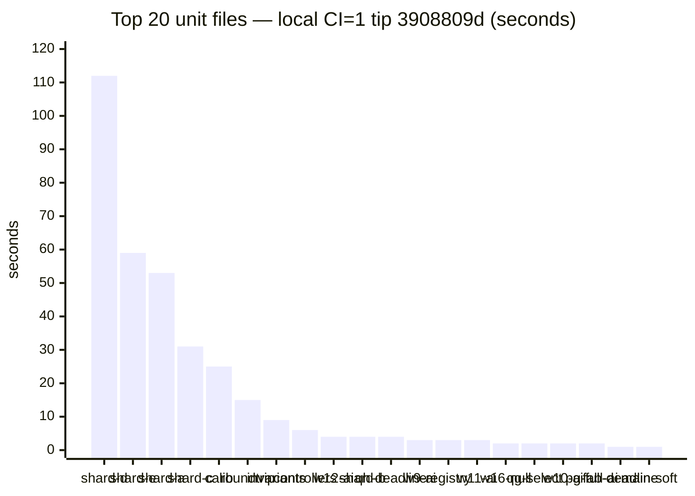
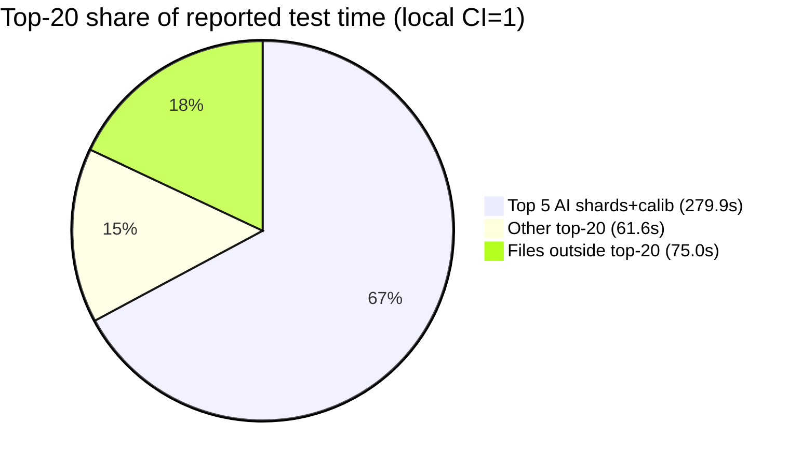

# Slowest unit-file inventory — 2026-10-10b (tip post865)

**Task id:** `q-mp-392` (P3, report-only)  
**Tip audited:** `cursor/mp-tip-post865` @ `3908809d` (full `3908809d672ed70eede7b9c0ad63a6fa475e28e5`)  
**Measured on:** tip HEAD `3908809d` (live post865 tree; backlog `q-mp-392` stamped post830 **3194** / **12614** — **stale**)  
**Deliverable:** this sibling doc only (no `src/`, test, ratchet, wiki wall-budget, or CI workflow edits)

## Purpose

Refresh the file-level duration ranking for the Vitest unit suite on tip post865 after suite growth past the prior inventory stamp (**3182** @ post785 / [#849](https://github.com/fuzzywigg/math-pentathlon/pull/849) `q-mp-342`). Orthogonal to the **unit wall-budget** page ([`docs/wiki/ci-unit-budget.md`](../wiki/ci-unit-budget.md) / open [#843](https://github.com/fuzzywigg/math-pentathlon/pull/843) `q-mp-338`) — that page owns job wall; **this page owns per-file seconds**.

## Hard-rule HOLD (explicit)

Workers following this inventory must **not**:

- Change AI search, scoring, difficulty, or move timing
- Touch Hex Hard play deadline (**450ms** stays) — live pin `src/games/hex/ai.ts` `hard: 450`; characterization `tests/unit/ai-hard-midgame-identity.test.ts` `expect(HEX_MS.hard).toBeLessThanOrEqual(450)`
- Edit `*/rules.ts`, legal-move, or scoring paths
- Add Stars & Bars history caps
- Enable the two AI benches under `CI=1` (`tablet-ai-hard-latency.bench`, `ai-move-time-midgame.bench`) — see [`ai-timing-ci-skip-inventory-2026-10-09.md`](./ai-timing-ci-skip-inventory-2026-10-09.md)
- Assert or loosen AI-timing / scoring thresholds while chasing suite wall time
- Edit wiki wall-budget cells owned by `q-mp-338` / [#843](https://github.com/fuzzywigg/math-pentathlon/pull/843)

Hygiene proposals below are **TEST-HARNESS-ONLY** (file splits, project/pool isolation, `retry` under CI, optional `maxWorkers` experiments). No product or AI deadline edits.

## Duplicate check (open tip drafts)

| Related draft / prior                                                                                                                                         | Overlap                                         | Action                                                           |
| ------------------------------------------------------------------------------------------------------------------------------------------------------------- | ----------------------------------------------- | ---------------------------------------------------------------- |
| [#879](https://github.com/fuzzywigg/math-pentathlon/pull/879) `q-mp-090l` backlog 10c                                                                         | Defines this task; does not ship the inventory  | Leave open                                                       |
| [#849](https://github.com/fuzzywigg/math-pentathlon/pull/849) / [`slowest-unit-file-inventory-2026-10-10.md`](./slowest-unit-file-inventory-2026-10-10.md)   | Prior tip post785 stamp (**3182** @ `c9b55cff`) | **contained** — leave open; this sibling refreshes for post865   |
| [#811](https://github.com/fuzzywigg/math-pentathlon/pull/811) / [`slowest-unit-file-inventory-2026-10-09.md`](./slowest-unit-file-inventory-2026-10-09.md) | Prior tip post755 stamp (**3163** @ `02af5c56`) | **contained** — leave open                                       |
| [#877](https://github.com/fuzzywigg/math-pentathlon/pull/877) / [#878](https://github.com/fuzzywigg/math-pentathlon/pull/878)                                 | void owl / hex UI cov r25                       | Orthogonal; leave open                                           |
| Open drafts into `cursor/mp-tip-post865`                                                                                                                      | _(none at measurement time)_                    | No competing slowest-file inventory                              |
| Other open tip drafts `#853`–`#876` / `#879`                                                                                                                  | lint / knip / coverage / layout-read / backlog  | No slowest-file inventory for post865                            |

No open draft already owns `q-mp-392` / `slowest-unit-file-inventory-2026-10-10b.md` → full task proceeds.

## Method

### Suite size (tip `3908809d`)

| Metric                                  |                                         Count | How                                                                                                      |
| --------------------------------------- | --------------------------------------------: | -------------------------------------------------------------------------------------------------------- |
| Unit files (excl. `_tokenmaxx_archive`) |                                      **3210** | `find tests/unit \( -name '*.test.ts' -o -name '*.spec.ts' \) ! -path '*/_tokenmaxx_archive/*' \| wc -l` |
| Cases listed (`npx vitest list`)        |                                     **12768** | tip HEAD `3908809d`                                                                                      |
| Files reported by Vitest under `CI=1`   |    **3208** passed / **2** skipped (**3210**) | Local measure on `3908809d`                                                                              |
| Cases (Vitest summary)                  | **12756** passed / **48** skipped (**12804**) | Local measure on `3908809d`                                                                              |

Backlog `q-mp-392` evidence (**3194** / **12614** @ post830 `bcf6f825`) is **stale** vs live post865.

### Before → after (inventory stamps)

| Stamp                                                                                             | Tip / SHA           | Unit files | Vitest cases (run) | Wall Duration | Reported tests time | Top-20 sum |
| ------------------------------------------------------------------------------------------------- | ------------------- | ---------: | -----------------: | ------------: | ------------------: | ---------: |
| Prior [#849](https://github.com/fuzzywigg/math-pentathlon/pull/849) `2026-10-10`                  | post785 `c9b55cff`  |   **3182** |          **12522** |       157.63s |             385.27s |     315.1s |
| This refresh `2026-10-10b`                                                                        | post865 `3908809d`  |   **3210** |          **12804** |       185.55s |             416.51s |     341.5s |

Host/runner variance dominates absolute seconds; rankings (AI shards + calibration first) are the durable signal.

### Primary: local tip run (`CI=1`, full unit job shape)

Host: cloud agent. Command (same script CI uses — **not** `--project unit-shared` alone; nearly all of the top-N live in `unit-node`):

```bash
git rev-parse HEAD   # 3908809d672ed70eede7b9c0ad63a6fa475e28e5
CI=1 npm run test:unit -- --reporter=default
# Test Files  3208 passed | 2 skipped (3210)
# Tests       12756 passed | 48 skipped (12804)
# Duration    185.55s (transform 18.12s, setup 5.21s, import 22.73s, tests 416.51s, environment 1064.68s)
```

Per-file durations parsed from Vitest default file lines (`✓ |project| path (N tests) Xms`). Artifact: `/opt/cursor/artifacts/q-mp-392-local-file-durations.json` (3208 passed-file rows).

AI benches skipped under `CI=1` (same HOLD as wall-budget page):

```text
↓ |unit-isolated| tests/unit/tablet-ai-hard-latency.bench.test.ts (10 tests | 10 skipped)
↓ |unit-shared| tests/unit/ai-move-time-midgame.bench.test.ts (1 test | 1 skipped)
```

## Top 20 slowest unit files (local tip `3908809d`, `CI=1`)

Sum of top-20 file durations: **341.5s** of **416.51s** reported test time (**82.0%**).

| Rank | File                                          | Project         | Local CI=1 (s) | Tests | Hygiene note                                                                    |
| ---: | --------------------------------------------- | --------------- | -------------: | ----: | ------------------------------------------------------------------------------- |
|    1 | `ai-determinism-shard-d.test.ts`              | `unit-node`     |         111.72 |     8 | **HOLD** — AI determinism; harness-only pool/timeout only (see flake inventory) |
|    2 | `ai-determinism-shard-e.test.ts`              | `unit-node`     |          58.88 |    10 | **HOLD** — AI determinism                                                       |
|    3 | `ai-determinism-shard-a.test.ts`              | `unit-node`     |          52.87 |     8 | **HOLD** — AI determinism                                                       |
|    4 | `ai-determinism-shard-c.test.ts`              | `unit-node`     |          30.92 |     8 | **HOLD** — AI determinism                                                       |
|    5 | `ai-calibration-difficulty-order.test.ts`     | `unit-node`     |          25.49 |    20 | **HOLD** — AI calibration; no scoring/difficulty retune                         |
|    6 | `state-roundtrip-fuzz.test.ts`                | `unit-node`     |          14.95 |    22 | Split by game/engine or property-count shards (harness only)                    |
|    7 | `engine-property-invariants.test.ts`          | `unit-node`     |           8.93 |    32 | Shard invariants by game family (harness only)                                  |
|    8 | `existing-games-controllers.test.ts`          | `unit-isolated` |           6.06 |    67 | Split by game controller (already `unit-isolated`)                              |
|    9 | `burn-wave12-win-draw-ai.test.ts`             | `unit-node`     |           4.19 |    19 | **HOLD** — AI win/draw surface                                                  |
|   10 | `ai-determinism-shard-b.test.ts`              | `unit-node`     |           3.60 |     8 | **HOLD** — AI determinism                                                       |
|   11 | `queens-hex-ai-play-deadline.test.ts`         | `unit-node`     |           3.58 |     9 | **HOLD** — play-deadline characterization; Hex Hard **450ms** untouched         |
|   12 | `burn-wave9-win-draw-ai.test.ts`              | `unit-node`     |           3.19 |    24 | **HOLD** — AI win/draw surface                                                  |
|   13 | `burn-1008-registry-module-contract.test.ts`  | `unit-isolated` |           3.15 |   129 | Split registry contract by domain (already isolated)                            |
|   14 | `burn-wave11-win-draw-ai.test.ts`             | `unit-node`     |           2.65 |    18 | **HOLD** — AI win/draw surface                                                  |
|   15 | `burn-wave16-ai-null-gates.test.ts`           | `unit-node`     |           2.32 |    19 | **HOLD** — AI null-gate surface                                                 |
|   16 | `mp3d-queens-guards-board-select.test.ts`     | `unit-isolated` |           2.25 |     6 | Already isolated; thinner select/lifecycle shards (harness only)                |
|   17 | `burn-wave10-win-draw-ai.test.ts`             | `unit-node`     |           1.96 |    17 | **HOLD** — AI win/draw surface                                                  |
|   18 | `mp3d-prime-gold-full-game-ai.test.ts`        | `unit-isolated` |           1.92 |     3 | **HOLD** — AI surface; harness isolation only                                   |
|   19 | `fab-a-diffy-ai-play-deadline.test.ts`        | `unit-node`     |           1.45 |     4 | **HOLD** — play-deadline; no deadline raise                                     |
|   20 | `q-mp-299-main-soft-fail.test.ts`             | `unit-isolated` |           1.41 |    15 | Soft-fail / route isolation; optional thinner shards (harness only)             |

Paths are under `tests/unit/` (basename shown for width).

### Rank delta vs `2026-10-10` inventory (same basenames)

| Signal                   | Notes                                                                                                                          |
| ------------------------ | ------------------------------------------------------------------------------------------------------------------------------ |
| Top-5 composition        | Still AI determinism shards + calibration (order: d → e → **a** → **c** → calib; calib dropped below shards a/c vs post785)    |
| Non-HOLD harness targets | Still: `state-roundtrip-fuzz`, `engine-property-invariants`, `existing-games-controllers`, registry contract                   |
| New in top-20            | `mp3d-queens-guards-board-select`, `mp3d-prime-gold-full-game-ai`, `q-mp-299-main-soft-fail`                                   |
| Dropped from top-20      | `burn-wave41-pent-ai-difficulties`, `overnight-wave55-fab-controller-vsai-timer`, `burn-1007-main-shell-routes`                |

### Bar visual — local top 20 (seconds)



### Concentration (local)



## Recommended harness hygiene (no AI-timing / Hex Hard edits)

Priority is **non-HOLD** files first; AI ranks 1–5 dominate wall but are already covered by flake / CI-skip inventories and must not be “fixed” by raising deadlines.

1. **`state-roundtrip-fuzz.test.ts` (~15s local)** — split into per-game or N-case shards under `unit-node` so one slow engine does not serialize the whole file.
2. **`engine-property-invariants.test.ts` (~9s)** — same pattern: shard by game family; keep property asserts; do not touch rules/scoring implementations.
3. **`existing-games-controllers.test.ts` (~6s, already `unit-isolated`)** — split by controller/game to cut isolate cost and improve parallel fill.
4. **`burn-1008-registry-module-contract.test.ts` (129 tests, ~3s)** — domain splits for maintainability more than wall; already isolated.
5. **`q-mp-299-main-soft-fail.test.ts` / board-select hosts (~1–2s)** — optional thinner shards; already `unit-isolated`.
6. **AI determinism / calibration / play-deadline / win-draw files** — **HOLD**. If GHA headroom tightens, prefer harness-only moves already listed in [`ai-timing-flake-inventory-2026-10-09.md`](./ai-timing-flake-inventory-2026-10-09.md) (per-file `retry`, dedicated pool/`maxWorkers: 1`, CI-only longer `testTimeout`). Do **not** change Hex Hard **450ms**, `HARD_FLAG_MS`, or scoring asserts. Do **not** remove `describe.skipIf(!!process.env.CI)` on the two AI latency benches.

## Why not `--project unit-shared` alone?

Backlog verify sketch mentions `CI=1 npm run test:unit -- --reporter=verbose`. On tip, **0 of the top-20** files are in `unit-shared` (they are `unit-node` / `unit-isolated`). Measuring only `unit-shared` would miss the real wall contributors. Inventory therefore uses the full unit job (`npm run test:unit` / all three projects), matching CI.

## Hex Hard pin (untouched)

```text
$ rg -n 'hard:\s*450' src/games/hex/ai.ts
21:  hard: 450,

$ rg -n 'toBeLessThanOrEqual\(450\)' tests/unit/ai-hard-midgame-identity.test.ts
63:    expect(HEX_MS.hard).toBeLessThanOrEqual(450);
```

## Related

- Prior inventory (post785): [`docs/dev/slowest-unit-file-inventory-2026-10-10.md`](./slowest-unit-file-inventory-2026-10-10.md)
- Prior inventory (post755): [`docs/dev/slowest-unit-file-inventory-2026-10-09.md`](./slowest-unit-file-inventory-2026-10-09.md)
- Unit wall budget + AI-bench skips (owned by `q-mp-338` / [#843](https://github.com/fuzzywigg/math-pentathlon/pull/843)): [`docs/wiki/ci-unit-budget.md`](../wiki/ci-unit-budget.md)
- AI-timing CI-skip HOLD: [`docs/dev/ai-timing-ci-skip-inventory-2026-10-09.md`](./ai-timing-ci-skip-inventory-2026-10-09.md)
- AI flake inventory: [`docs/dev/ai-timing-flake-inventory-2026-10-09.md`](./ai-timing-flake-inventory-2026-10-09.md)

## Verify (this PR)

```bash
find tests/unit \( -name '*.test.ts' -o -name '*.spec.ts' \) ! -path '*/_tokenmaxx_archive/*' | wc -l   # 3210
npx vitest list | wc -l   # 12768
rg -n 'hard:\s*450' src/games/hex/ai.ts
npm run check:dev-docs
npm run verify
npm run test:unit
```
