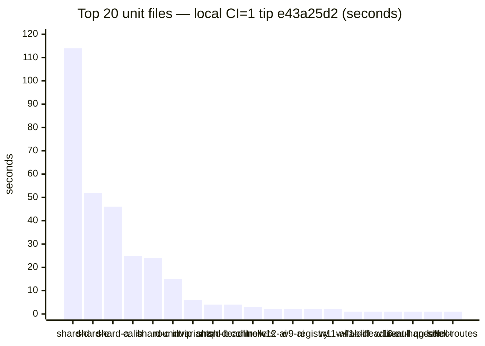
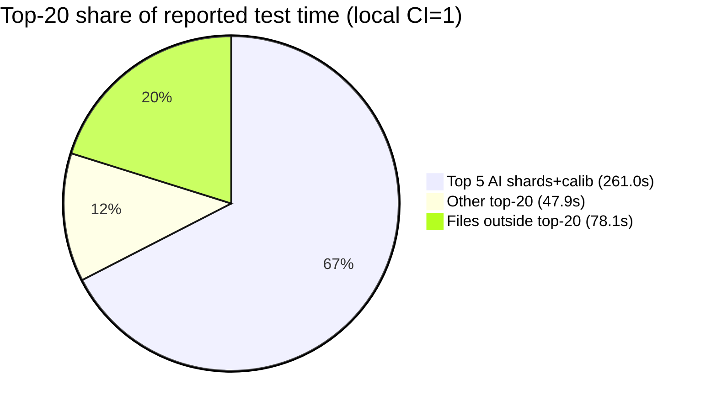

# Slowest unit-file inventory — 2026-10-10c (tip post914)

**Task id:** `q-mp-460` (P3, report-only)  
**Tip audited:** `cursor/mp-tip-post914` @ `e43a25d2` (full `e43a25d22b081819664bc631e4fe34f793847004`)  
**Measured on:** tip HEAD `e43a25d2` after tip fold of engine coverage round 15 (`d535d99f`); backlog `q-mp-460` stamped tip mid-fold post898 **3235** / **~12990** — **stale**  
**Deliverable:** this sibling doc only (no `src/`, test, ratchet, wiki wall-budget, or CI workflow edits)

## Purpose

Refresh the file-level duration ranking for the Vitest unit suite on tip post914 after suite growth past the prior inventory stamp (**3210** @ post865 / [#891](https://github.com/fuzzywigg/math-pentathlon/pull/891) `q-mp-392`). Orthogonal to the **unit wall-budget** page ([`docs/wiki/ci-unit-budget.md`](../wiki/ci-unit-budget.md) / open [#936](https://github.com/fuzzywigg/math-pentathlon/pull/936) `q-mp-446`) — that page owns job wall; **this page owns per-file seconds**. Open [#929](https://github.com/fuzzywigg/math-pentathlon/pull/929) `q-mp-445` owns wiki count tables only.

## Hard-rule HOLD (explicit)

Workers following this inventory must **not**:

- Change AI search, scoring, difficulty, or move timing
- Touch Hex Hard play deadline (**450ms** stays) — live pin `src/games/hex/ai.ts` `hard: 450`; characterization `tests/unit/ai-hard-midgame-identity.test.ts` `expect(HEX_MS.hard).toBeLessThanOrEqual(450)`
- Edit `*/rules.ts`, legal-move, or scoring paths
- Add Stars & Bars history caps
- Enable the two AI benches under `CI=1` (`tablet-ai-hard-latency.bench`, `ai-move-time-midgame.bench`) — see [`ai-timing-ci-skip-inventory-2026-10-09.md`](./ai-timing-ci-skip-inventory-2026-10-09.md)
- Assert or loosen AI-timing / scoring thresholds while chasing suite wall time
- Edit wiki wall-budget cells owned by `q-mp-446` / [#936](https://github.com/fuzzywigg/math-pentathlon/pull/936) or count tables owned by `q-mp-445` / [#929](https://github.com/fuzzywigg/math-pentathlon/pull/929)

Hygiene proposals below are **TEST-HARNESS-ONLY** (file splits, project/pool isolation, `retry` under CI, optional `maxWorkers` experiments). No product or AI deadline edits.

## Duplicate check (open tip drafts)

| Related draft / prior                                                                                                                                             | Overlap                                              | Action                                                         |
| ----------------------------------------------------------------------------------------------------------------------------------------------------------------- | ---------------------------------------------------- | -------------------------------------------------------------- |
| [#934](https://github.com/fuzzywigg/math-pentathlon/pull/934) `q-mp-090o` backlog 10f                                                                             | Defines this task; does not ship the inventory       | Leave open                                                     |
| [#891](https://github.com/fuzzywigg/math-pentathlon/pull/891) / [`slowest-unit-file-inventory-2026-10-10b.md`](./slowest-unit-file-inventory-2026-10-10b.md)   | Prior tip post865 stamp (**3210** @ `3908809d`)      | **contained** — leave open; this sibling refreshes for post914 |
| [#849](https://github.com/fuzzywigg/math-pentathlon/pull/849) / [`slowest-unit-file-inventory-2026-10-10.md`](./slowest-unit-file-inventory-2026-10-10.md)     | Prior tip post785 stamp (**3182** @ `c9b55cff`)      | **contained** — leave open                                     |
| [#811](https://github.com/fuzzywigg/math-pentathlon/pull/811) / [`slowest-unit-file-inventory-2026-10-09.md`](./slowest-unit-file-inventory-2026-10-09.md)     | Prior tip post755 stamp (**3163** @ `02af5c56`)      | **contained** — leave open                                     |
| [#929](https://github.com/fuzzywigg/math-pentathlon/pull/929) `q-mp-445` testing-layers counts                                                                    | File/case counts only (pre-r15 **3241** / **13056**) | Complementary; no duration ranking                             |
| [#936](https://github.com/fuzzywigg/math-pentathlon/pull/936) `q-mp-446` CI unit wall                                                                             | Job wall + AI-bench skip smoke                       | Narrative sibling; keep this file-level                        |
| [#935](https://github.com/fuzzywigg/math-pentathlon/pull/935) `q-mp-456` engine cov r15 (into post898; tip-folded)                                                | Adds `engine-coverage-round-15-burn-1008` (~0.03s)   | Orthogonal; leave open                                         |
| Open drafts into `cursor/mp-tip-post914` (`#939`–`#951` at measure)                                                                                               | knip / emit / dead-CSS / UI / soft-fail              | No competing slowest-file inventory                            |

No open draft already owns `q-mp-460` / `slowest-unit-file-inventory-2026-10-10c.md` → full task proceeds.

## Method

### Suite size (tip `e43a25d2`)

| Metric                                  |                                         Count | How                                                                                                      |
| --------------------------------------- | --------------------------------------------: | -------------------------------------------------------------------------------------------------------- |
| Unit files (excl. `_tokenmaxx_archive`) |                                      **3242** | `find tests/unit \( -name '*.test.ts' -o -name '*.spec.ts' \) ! -path '*/_tokenmaxx_archive/*' \| wc -l` |
| Cases listed (`npx vitest list`)        |                                     **13068** | tip HEAD `e43a25d2`                                                                                      |
| Files reported by Vitest under `CI=1`   |    **3240** passed / **2** skipped (**3242**) | Local measure on `e43a25d2`                                                                              |
| Cases (Vitest summary)                  | **13056** passed / **55** skipped (**13111**) | Local measure on `e43a25d2`                                                                              |

Backlog `q-mp-460` evidence (**3235** / **~12990** @ post898 mid-fold `788b4558`) is **stale** vs live post914 (**3242** / **13068** listed). Tip fold of `q-mp-456` added one file (`engine-coverage-round-15-burn-1008.test.ts`, ~0.03s local — rank ~431, outside top-20).

### Before → after (inventory stamps)

| Stamp                                                                                             | Tip / SHA           | Unit files | Vitest cases (run) | Wall Duration | Reported tests time | Top-20 sum |
| ------------------------------------------------------------------------------------------------- | ------------------- | ---------: | -----------------: | ------------: | ------------------: | ---------: |
| Prior [#849](https://github.com/fuzzywigg/math-pentathlon/pull/849) `2026-10-10`                  | post785 `c9b55cff`  |   **3182** |          **12522** |       157.63s |             385.27s |     315.1s |
| Prior [#891](https://github.com/fuzzywigg/math-pentathlon/pull/891) `2026-10-10b`                 | post865 `3908809d`  |   **3210** |          **12804** |       185.55s |             416.51s |     341.5s |
| This refresh `2026-10-10c`                                                                        | post914 `e43a25d2`  |   **3242** |          **13111** |       150.28s |             386.97s |     308.9s |

Host/runner variance dominates absolute seconds; rankings (AI shards + calibration first) are the durable signal.

### Primary: local tip run (`CI=1`, full unit job shape)

Host: cloud agent. Command (same script CI uses — **not** `--project unit-shared` alone; nearly all of the top-N live in `unit-node`):

```bash
git rev-parse HEAD   # e43a25d22b081819664bc631e4fe34f793847004
CI=1 npm run test:unit -- --reporter=default
# Test Files  3240 passed | 2 skipped (3242)
# Tests       13056 passed | 55 skipped (13111)
# Duration    150.28s (transform 18.09s, setup 4.52s, import 23.00s, tests 386.97s, environment 1105.82s)
```

Per-file durations parsed from Vitest default file lines (`✓ |project| path (N tests) Xms`). Artifact: `/opt/cursor/artifacts/q-mp-460-local-file-durations.json` (3240 passed-file rows).

AI benches skipped under `CI=1` (same HOLD as wall-budget page):

```text
↓ |unit-isolated| tests/unit/tablet-ai-hard-latency.bench.test.ts (10 tests | 10 skipped)
↓ |unit-shared| tests/unit/ai-move-time-midgame.bench.test.ts (1 test | 1 skipped)
```

## Top 20 slowest unit files (local tip `e43a25d2`, `CI=1`)

Sum of top-20 file durations: **308.9s** of **386.97s** reported test time (**79.8%**).

| Rank | File                                          | Project         | Local CI=1 (s) | Tests | Hygiene note                                                                    |
| ---: | --------------------------------------------- | --------------- | -------------: | ----: | ------------------------------------------------------------------------------- |
|    1 | `ai-determinism-shard-d.test.ts`              | `unit-node`     |         114.41 |     8 | **HOLD** — AI determinism; harness-only pool/timeout only (see flake inventory) |
|    2 | `ai-determinism-shard-e.test.ts`              | `unit-node`     |          52.21 |    10 | **HOLD** — AI determinism                                                       |
|    3 | `ai-determinism-shard-a.test.ts`              | `unit-node`     |          45.84 |     8 | **HOLD** — AI determinism                                                       |
|    4 | `ai-calibration-difficulty-order.test.ts`     | `unit-node`     |          24.96 |    20 | **HOLD** — AI calibration; no scoring/difficulty retune                         |
|    5 | `ai-determinism-shard-c.test.ts`              | `unit-node`     |          23.54 |     8 | **HOLD** — AI determinism                                                       |
|    6 | `state-roundtrip-fuzz.test.ts`                | `unit-node`     |          15.40 |    22 | Split by game/engine or property-count shards (harness only)                    |
|    7 | `engine-property-invariants.test.ts`          | `unit-node`     |           6.00 |    32 | Shard invariants by game family (harness only)                                  |
|    8 | `ai-determinism-shard-b.test.ts`              | `unit-node`     |           4.05 |     8 | **HOLD** — AI determinism                                                       |
|    9 | `queens-hex-ai-play-deadline.test.ts`         | `unit-node`     |           3.75 |     9 | **HOLD** — play-deadline characterization; Hex Hard **450ms** untouched         |
|   10 | `existing-games-controllers.test.ts`          | `unit-isolated` |           3.29 |    67 | Split by game controller (already `unit-isolated`)                              |
|   11 | `burn-wave12-win-draw-ai.test.ts`             | `unit-node`     |           2.44 |    19 | **HOLD** — AI win/draw surface                                                  |
|   12 | `burn-wave9-win-draw-ai.test.ts`              | `unit-node`     |           1.87 |    24 | **HOLD** — AI win/draw surface                                                  |
|   13 | `burn-1008-registry-module-contract.test.ts`  | `unit-isolated` |           1.63 |   129 | Split registry contract by domain (already isolated)                            |
|   14 | `burn-wave11-win-draw-ai.test.ts`             | `unit-node`     |           1.52 |    18 | **HOLD** — AI win/draw surface                                                  |
|   15 | `burn-wave41-pent-ai-difficulties.test.ts`    | `unit-node`     |           1.48 |     8 | **HOLD** — AI difficulty surface                                                |
|   16 | `fab-a-diffy-ai-play-deadline.test.ts`        | `unit-node`     |           1.44 |     4 | **HOLD** — play-deadline; no deadline raise                                     |
|   17 | `burn-wave16-ai-null-gates.test.ts`           | `unit-node`     |           1.43 |    19 | **HOLD** — AI null-gate surface                                                 |
|   18 | `burn-wave27-seat-handoff-core.test.ts`       | `unit-shared`   |           1.32 |    20 | Seat-handoff surface; harness isolation only — no AI deadline edits             |
|   19 | `mp3d-queens-guards-board-select.test.ts`     | `unit-isolated` |           1.19 |     6 | Already isolated; thinner select/lifecycle shards (harness only)                |
|   20 | `burn-1007-main-shell-routes.test.ts`         | `unit-isolated` |           1.12 |     6 | Already isolated; optional thinner route shards                                 |

Paths are under `tests/unit/` (basename shown for width).

### Rank delta vs `2026-10-10b` inventory (same basenames)

| Signal                   | Notes                                                                                                                          |
| ------------------------ | ------------------------------------------------------------------------------------------------------------------------------ |
| Top-5 composition        | Still AI determinism shards + calibration (order: d → e → a → **calib** → c; calib above shard-c vs post865)                   |
| Non-HOLD harness targets | Still: `state-roundtrip-fuzz`, `engine-property-invariants`, `existing-games-controllers`, registry contract                   |
| New in top-20            | `burn-wave41-pent-ai-difficulties`, `burn-wave27-seat-handoff-core`, `burn-1007-main-shell-routes`                             |
| Dropped from top-20      | `burn-wave10-win-draw-ai`, `mp3d-prime-gold-full-game-ai`, `q-mp-299-main-soft-fail`                                           |

### Bar visual — local top 20 (seconds)



### Concentration (local)



## Recommended harness hygiene (no AI-timing / Hex Hard edits)

Priority is **non-HOLD** files first; AI ranks 1–5 dominate wall but are already covered by flake / CI-skip inventories and must not be “fixed” by raising deadlines.

1. **`state-roundtrip-fuzz.test.ts` (~15s local)** — split into per-game or N-case shards under `unit-node` so one slow engine does not serialize the whole file.
2. **`engine-property-invariants.test.ts` (~6s)** — same pattern: shard by game family; keep property asserts; do not touch rules/scoring implementations.
3. **`existing-games-controllers.test.ts` (~3s, already `unit-isolated`)** — split by controller/game to cut isolate cost and improve parallel fill.
4. **`burn-1008-registry-module-contract.test.ts` (129 tests, ~2s)** — domain splits for maintainability more than wall; already isolated.
5. **`burn-wave27-seat-handoff-core.test.ts` / `burn-1007-main-shell-routes.test.ts` (~1s)** — optional thinner shards; harness only.
6. **AI determinism / calibration / play-deadline / win-draw files** — **HOLD**. If GHA headroom tightens, prefer harness-only moves already listed in [`ai-timing-flake-inventory-2026-10-09.md`](./ai-timing-flake-inventory-2026-10-09.md) (per-file `retry`, dedicated pool/`maxWorkers: 1`, CI-only longer `testTimeout`). Do **not** change Hex Hard **450ms**, `HARD_FLAG_MS`, or scoring asserts. Do **not** remove `describe.skipIf(!!process.env.CI)` on the two AI latency benches.

## Why not `--project unit-shared` alone?

Backlog verify sketch mentions suite size + Hex Hard + `check:dev-docs`. On tip, **1 of the top-20** files is in `unit-shared` (`burn-wave27-seat-handoff-core`); the rest are `unit-node` / `unit-isolated`. Measuring only `unit-shared` would miss the real wall contributors. Inventory therefore uses the full unit job (`npm run test:unit` / all three projects), matching CI.

## Hex Hard pin (untouched)

```text
$ rg -n 'hard:\s*450' src/games/hex/ai.ts
21:  hard: 450,

$ rg -n 'toBeLessThanOrEqual\(450\)' tests/unit/ai-hard-midgame-identity.test.ts
63:    expect(HEX_MS.hard).toBeLessThanOrEqual(450);
```

## Related

- Prior inventory (post865): [`docs/dev/slowest-unit-file-inventory-2026-10-10b.md`](./slowest-unit-file-inventory-2026-10-10b.md)
- Prior inventory (post785): [`docs/dev/slowest-unit-file-inventory-2026-10-10.md`](./slowest-unit-file-inventory-2026-10-10.md)
- Prior inventory (post755): [`docs/dev/slowest-unit-file-inventory-2026-10-09.md`](./slowest-unit-file-inventory-2026-10-09.md)
- Unit wall budget + AI-bench skips (owned by `q-mp-446` / [#936](https://github.com/fuzzywigg/math-pentathlon/pull/936)): [`docs/wiki/ci-unit-budget.md`](../wiki/ci-unit-budget.md)
- AI-timing CI-skip HOLD: [`docs/dev/ai-timing-ci-skip-inventory-2026-10-09.md`](./ai-timing-ci-skip-inventory-2026-10-09.md)
- AI flake inventory: [`docs/dev/ai-timing-flake-inventory-2026-10-09.md`](./ai-timing-flake-inventory-2026-10-09.md)

## Verify (this PR)

```bash
find tests/unit \( -name '*.test.ts' -o -name '*.spec.ts' \) ! -path '*/_tokenmaxx_archive/*' | wc -l   # 3242
npx vitest list | wc -l   # 13068
rg -n 'hard:\s*450' src/games/hex/ai.ts
npm run check:dev-docs
npm run verify
npm run test:unit
```
