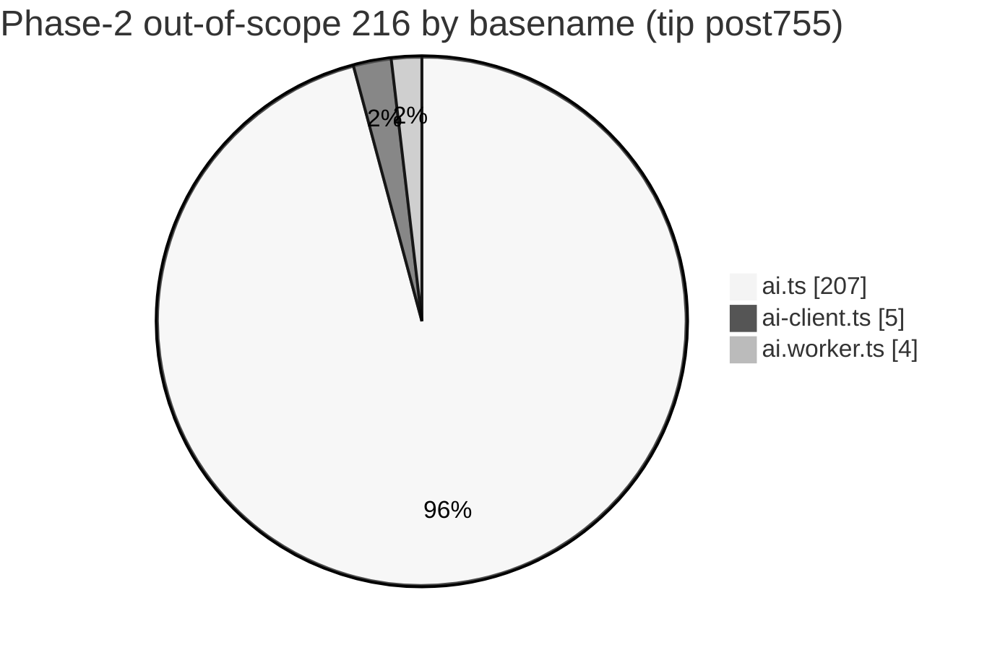
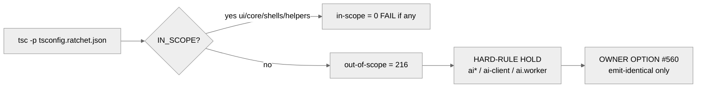

# q-mp-276 — Typecheck out-of-scope **216** HOLD map (AI residual)

**Task id:** `q-mp-276`  
**Role:** worker (docs / report-only)  
**Tip audited:** `cursor/mp-tip-post755` @ `74a1596f` (full `74a1596f71aab5d6616ff486b2a4eb2a70b5123b`)  
**Metric:** `npm run typecheck:ratchet` → in-scope **0**, out-of-scope **216** (= Phase-2 baseline ceiling)  
**Disposition:** **hard-rule HOLD** — AI residual; do not widen ratchet scope or “fix” AI types in this ticket.

## Purpose

Document the live Phase-2 type-ratchet **out-of-scope** residual as a directory / file bucket map so tip owners and workers know:

1. The **216** ceiling is entirely AI-module diagnostics (`ai.ts` / `ai-client.ts` / `ai.worker.ts`).
2. Clearing it requires the OWNER OPTION emit-identical path ([`docs/dev/ai-typeonly-option.md`](./ai-typeonly-option.md), open draft [`#560`](https://github.com/fuzzywigg/math-pentathlon/pull/560)) — not ordinary product-safe type edits.
3. No worker should widen `tsconfig.ratchet.json` / `scripts/check-type-ratchet.mjs` `IN_SCOPE` to fail on these files without an owner fold decision.

Docs only — **no** `src/` edits, **no** `tsconfig.ratchet.json` scope change, **no** baseline JSON rewrite in this PR.

## Duplicate check

| Related draft / prior | Overlap | Action |
| --- | --- | --- |
| `#560` AI type-only emit-identical (OWNER OPTION) | Would clear the **216** with emit-identical type-only edits | Leave open; this doc inventories HOLD, does not implement `#560` |
| `#537` / `#557` Phase-2 Batch 2/6 drafts | Historical type-ratchet batches; safe pool exhausted | Leave open; superseded for product-safe clears |
| `docs/dev/type-ratchet-phase2-baseline.json` | Machine baseline (`outOfScopeErrors: 216`) | Complementary; this md is the human HOLD map |
| `docs/dev/type-ratchet-batch-8.md` / `batch-9.md` | Batch notes already state AI-only residual | Complementary dated map for tip `post755` |
| Open tip drafts on `post748` / `post755` (coverage, eslint, knip, …) | None own a typecheck OOS HOLD map | Full task proceeds |

No open draft already owns this inventory → full task proceeds.

## Live tip measurements (evidence @ `74a1596f`)

```text
$ git rev-parse HEAD
  74a1596f71aab5d6616ff486b2a4eb2a70b5123b

$ npm run typecheck:ratchet
  Type ratchet (tsconfig.ratchet.json)
    flags: noUncheckedIndexedAccess, exactOptionalPropertyTypes, …
    in-scope errors:     0 (must be 0)
    out-of-scope errors: 216 (remaining AI/rules/games — not blocking here)
    Phase-2 ceiling:     216 ≤ baseline 216
  Type ratchet passed.

$ npx tsc --noEmit -p tsconfig.ratchet.json --pretty false \
    | classify via scripts/check-type-ratchet.mjs IN_SCOPE
  out-of-scope file count: 28
  by basename: ai.ts 207 / ai-client.ts 5 / ai.worker.ts 4
  by kind:     ai_search_scoring 216 (100%)
```

**Before / after (this docs PR):** out-of-scope **216 → 216** (unchanged; report-only). In-scope stays **0**.

## HOLD rule (explicit)

| Item | Status |
| --- | --- |
| Phase-2 out-of-scope count **216** | **HOLD** — hard-rule AI residual |
| `*/ai.ts`, `*/ai-client.ts`, `*/ai.worker.ts` | **HOLD** — no AI behavior / type “fixes” that change emit unless `#560` owner path |
| Hex Hard `hard: 450` in `src/games/hex/ai.ts` | **HOLD** — untouched |
| Stars & Bars history cap | **HOLD** — do not add |
| `tsconfig.ratchet.json` / ratchet `IN_SCOPE` | Do **not** widen to pull AI modules into fail-scope here |
| `docs/dev/type-ratchet-phase2-baseline.json` | Ceiling may only go **down**; this PR does not rewrite it |

Worker agents: treat every row below as **do not clear** unless Andrew folds `#560` (emit-identical proof via `npm run check:emit-identity`).

## Bucket by game directory (20 dirs → 216)

Sorted densest-first. Every hit is under that game’s AI module(s).

| Directory | Errors | Share | Files |
| --- | ---: | ---: | --- |
| `src/games/contig-60/` | 19 | 8.8% | `ai.ts` (19) |
| `src/games/fab-a-diffy/` | 19 | 8.8% | `ai.ts` (17), `ai-client.ts` (1), `ai.worker.ts` (1) |
| `src/games/juggle/` | 18 | 8.3% | `ai.ts` (18) |
| `src/games/stars-bars/` | 18 | 8.3% | `ai.ts` (18) |
| `src/games/hex/` | 16 | 7.4% | `ai.ts` (13), `ai-client.ts` (2), `ai.worker.ts` (1) |
| `src/games/kwatro-sinko/` | 16 | 7.4% | `ai.ts` (16) |
| `src/games/calla/` | 15 | 6.9% | `ai.ts` (15) |
| `src/games/pent-em-in/` | 12 | 5.6% | `ai.ts` (12) |
| `src/games/fiar/` | 11 | 5.1% | `ai.ts` (9), `ai-client.ts` (1), `ai.worker.ts` (1) |
| `src/games/kings-quadraphages/` | 11 | 5.1% | `ai.ts` (11) |
| `src/games/hex-a-gone/` | 9 | 4.2% | `ai.ts` (9) |
| `src/games/par-55/` | 8 | 3.7% | `ai.ts` (8) |
| `src/games/ramrod/` | 8 | 3.7% | `ai.ts` (8) |
| `src/games/sum-dominoes/` | 8 | 3.7% | `ai.ts` (8) |
| `src/games/prime-gold/` | 7 | 3.2% | `ai.ts` (7) |
| `src/games/star-track/` | 6 | 2.8% | `ai.ts` (6) |
| `src/games/queens-guards/` | 5 | 2.3% | `ai.ts` (3), `ai-client.ts` (1), `ai.worker.ts` (1) |
| `src/games/frac-fact/` | 4 | 1.9% | `ai.ts` (4) |
| `src/games/remainder-islands/` | 4 | 1.9% | `ai.ts` (4) |
| `src/games/fraction-pinball/` | 2 | 0.9% | `ai.ts` (2) |
| **Total** | **216** | **100%** | **28 files** |

### Visual — directory share

```text
contig-60      ███████████████████  19
fab-a-diffy    ███████████████████  19
juggle         ██████████████████   18
stars-bars     ██████████████████   18
hex            ████████████████     16
kwatro-sinko   ████████████████     16
calla          ███████████████      15
pent-em-in     ████████████         12
fiar           ███████████          11
kings-quadra…  ███████████          11
hex-a-gone     █████████             9
par-55         ████████              8
ramrod         ████████              8
sum-dominoes   ████████              8
prime-gold     ███████               7
star-track     ██████                6
queens-guards  █████                 5
frac-fact      ████                  4
remainder-isl… ████                  4
fraction-pin…  ██                    2
```



## Per-file inventory (28 files → 216)

| File | Errors | HOLD note |
| --- | ---: | --- |
| `src/games/contig-60/ai.ts` | 19 | AI search / scoring |
| `src/games/juggle/ai.ts` | 18 | AI search / scoring |
| `src/games/stars-bars/ai.ts` | 18 | AI search / scoring; no history cap |
| `src/games/fab-a-diffy/ai.ts` | 17 | AI search / scoring |
| `src/games/kwatro-sinko/ai.ts` | 16 | AI search / scoring |
| `src/games/calla/ai.ts` | 15 | AI search / scoring |
| `src/games/hex/ai.ts` | 13 | AI search / scoring; Hex Hard **450ms** HOLD |
| `src/games/pent-em-in/ai.ts` | 12 | AI search / scoring |
| `src/games/kings-quadraphages/ai.ts` | 11 | AI search / scoring |
| `src/games/fiar/ai.ts` | 9 | AI search / scoring |
| `src/games/hex-a-gone/ai.ts` | 9 | AI search / scoring |
| `src/games/par-55/ai.ts` | 8 | AI search / scoring |
| `src/games/ramrod/ai.ts` | 8 | AI search / scoring |
| `src/games/sum-dominoes/ai.ts` | 8 | AI search / scoring |
| `src/games/prime-gold/ai.ts` | 7 | AI search / scoring |
| `src/games/star-track/ai.ts` | 6 | AI search / scoring |
| `src/games/frac-fact/ai.ts` | 4 | AI search / scoring |
| `src/games/remainder-islands/ai.ts` | 4 | AI search / scoring |
| `src/games/queens-guards/ai.ts` | 3 | AI search / scoring |
| `src/games/fraction-pinball/ai.ts` | 2 | AI search / scoring |
| `src/games/hex/ai-client.ts` | 2 | AI client bridge |
| `src/games/fab-a-diffy/ai-client.ts` | 1 | AI client bridge |
| `src/games/fab-a-diffy/ai.worker.ts` | 1 | AI worker |
| `src/games/fiar/ai-client.ts` | 1 | AI client bridge |
| `src/games/fiar/ai.worker.ts` | 1 | AI worker |
| `src/games/hex/ai.worker.ts` | 1 | AI worker |
| `src/games/queens-guards/ai-client.ts` | 1 | AI client bridge |
| `src/games/queens-guards/ai.worker.ts` | 1 | AI worker |
| **Total** | **216** | **100% AI residual HOLD** |

## Diagnostic codes / root causes

Matches `docs/dev/type-ratchet-phase2-baseline.json` (`byCode` / `byRootCause`) on tip `post755`.

| Root cause | Count | Dominant codes |
| --- | ---: | --- |
| `unchecked_index_access` | 202 | TS2532 (88), TS18048 (59), plus TS2322/TS2345 with `\| undefined` |
| `exact_optional_property_types` | 11 | TS2379 (9), TS2375 (2) — includes `AISearchOptions` EOPT |
| `undefined_as_index` | 2 | TS2538 |
| `possibly_undefined_iterable` | 1 | TS2488 |
| **Total** | **216** | |



## What this map does **not** authorize

- Editing AI search, scoring, difficulty, or move timing
- Changing Hex Hard **450ms** or adding a Stars & Bars history cap
- Player-facing copy / rules-text changes; logic in `*/rules.ts` / legal-move / scoring paths
- Widening Phase-1/2 fail-scope so CI fails on these 216
- Rewriting `docs/dev/type-ratchet-phase2-baseline.json` upward (ceilings only go down)

## Related docs

- `docs/dev/type-ratchet-phase2-baseline.json` — committed Phase-2 ceiling (`outOfScopeErrors: 216`)
- `docs/dev/type-ratchet-phase2-plan.md` — Phase-2 plan / batch history
- `docs/dev/type-ratchet-batch-8.md` / `docs/dev/type-ratchet-batch-9.md` — AI-only residual notes
- `docs/dev/ai-typeonly-option.md` — OWNER OPTION emit-identical clear path (`#560`)
- `scripts/check-type-ratchet.mjs` — in-scope vs out-of-scope classifier

## Verify

```bash
npm run typecheck:ratchet
# expect: in-scope 0; out-of-scope 216 ≤ baseline 216

npm run check:dev-docs
npm run lint
npm run typecheck
npm run test:unit
```

**Next action: fold into tip by the tip owner.**
