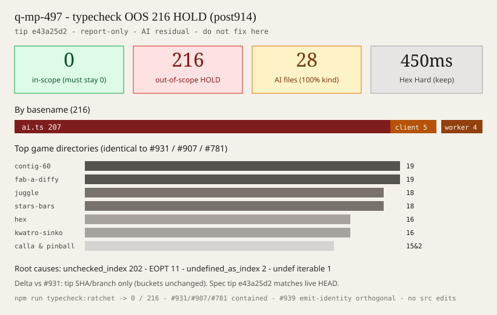
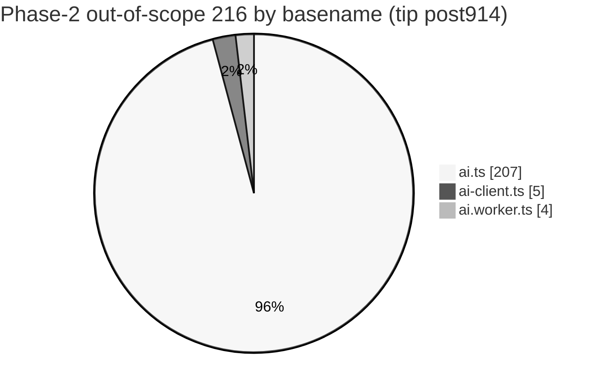
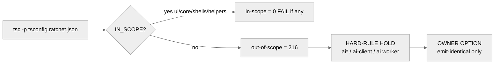

# q-mp-497 — Typecheck out-of-scope **216** HOLD map refresh (tip post914)

**Task id:** `q-mp-497`  
**Role:** worker (docs / data / chart only)  
**Tip audited:** `cursor/mp-tip-post914` @ `e43a25d2` (full `e43a25d22b081819664bc631e4fe34f793847004`)  
**Measured at:** `2026-10-10T09:52:10Z` (UTC)  
**Prior HOLD map:** [`typecheck-oos-216-hold-map-post898-2026-10-10.md`](./typecheck-oos-216-hold-map-post898-2026-10-10.md) (`q-mp-447` on tip `post898` @ `85522638`; open draft [`#931`](https://github.com/fuzzywigg/math-pentathlon/pull/931)) — leave open with **contained**  
**Earlier maps:** [`typecheck-oos-216-hold-map-post865-2026-10-10.md`](./typecheck-oos-216-hold-map-post865-2026-10-10.md) (`q-mp-421` / [`#907`](https://github.com/fuzzywigg/math-pentathlon/pull/907)); [`typecheck-oos-216-hold-map-2026-10-09.md`](./typecheck-oos-216-hold-map-2026-10-09.md) (`q-mp-276` / [`#781`](https://github.com/fuzzywigg/math-pentathlon/pull/781)) — leave open with **contained**  
**Machine summary:** [`typecheck-oos-216-hold-map-post914-2026-10-10.json`](./typecheck-oos-216-hold-map-post914-2026-10-10.json)  
**Visual:**   
**Metric:** `npm run typecheck:ratchet` → in-scope **0**, out-of-scope **216** (= Phase-2 baseline ceiling)  
**Disposition:** **hard-rule HOLD** — AI residual; do **not** “fix” the 216 AI/rules OOS errors in this ticket.

## Purpose

Refresh the Phase-2 type-ratchet **out-of-scope** HOLD map onto live tip `cursor/mp-tip-post914` so agents stop relying on the `post898` / `85522638` stamp in `#931` / `q-mp-447` (or older `post865` / `post755` stamps). Spec backlog `q-mp-497` (draft `#955`) was written against tip evidence `@e43a25d2`; live HEAD at this audit is the same `e43a25d2` — trust the live tree.

Docs / data / chart only — **no** `src/` edits, **no** `tsconfig.ratchet.json` scope change, **no** Phase-2 baseline JSON rewrite, **no** AI product / emit-identity clears (emit-identity stays with open `#939` / `q-mp-462` on post914, and older `#881` / `q-mp-393`).

## Hard rules (explicit non-goals)

- **No** AI search / scoring / difficulty / timing / RNG behavior changes
- **No** player-facing copy or rules-text edits
- **No** edits under `*/rules.ts`, legal-move, or scoring paths
- **No** Stars & Bars history cap
- Hex Hard stays **450ms** — tip HEAD already has `hard: 450` in `src/games/hex/ai.ts`; this map does **not** touch that line
- Do **not** widen `tsconfig.ratchet.json` / `scripts/check-type-ratchet.mjs` `IN_SCOPE` to fail on these 216
- Do **not** rewrite `docs/dev/type-ratchet-phase2-baseline.json` upward (ceilings only go down)
- Clearing the 216 requires the OWNER OPTION emit-identical path ([`docs/dev/ai-typeonly-option.md`](./ai-typeonly-option.md)) — not ordinary product-safe type edits

## Duplicate check (open drafts)

| Related draft / prior                                                                              | Base      | Overlap                                                             | Action                                                    |
| -------------------------------------------------------------------------------------------------- | --------- | ------------------------------------------------------------------- | --------------------------------------------------------- |
| [`#931`](https://github.com/fuzzywigg/math-pentathlon/pull/931) `q-mp-447` HOLD map refresh        | `post898` | Same **216** buckets; older tip stamp                               | Leave open; **contained**                                 |
| [`#907`](https://github.com/fuzzywigg/math-pentathlon/pull/907) `q-mp-421` HOLD map refresh        | `post865` | Same **216** buckets; older tip stamp                               | Leave open; **contained**                                 |
| [`#781`](https://github.com/fuzzywigg/math-pentathlon/pull/781) `q-mp-276` HOLD map                | `post755` | Same **216** buckets; older tip stamp                               | Leave open; **contained**                                 |
| [`#939`](https://github.com/fuzzywigg/math-pentathlon/pull/939) `q-mp-462` emit-identity inventory | `post914` | Separate series (FAIL **11** emit diffs); does not own OOS HOLD map | Leave open; **contained** (orthogonal ownership restated) |
| [`#955`](https://github.com/fuzzywigg/math-pentathlon/pull/955) `q-mp-090p` backlog 10g            | `post914` | Spec source for this task                                           | Leave open                                                |
| Open `#560` AI type-only OWNER OPTION                                                              | wave5 tip | Would clear **216** via emit-identical path                         | Leave open; this doc inventories HOLD only                |
| `docs/dev/type-ratchet-phase2-baseline.json`                                                       | tip       | Machine ceiling (`outOfScopeErrors: 216`)                           | Complementary; not rewritten here                         |

No open draft into `cursor/mp-tip-post914` already owns a post914-dated typecheck OOS HOLD map → full refresh proceeds.

## Live tip measurements (evidence @ `e43a25d2`)

```text
$ git rev-parse HEAD
  e43a25d22b081819664bc631e4fe34f793847004

$ npm run typecheck:ratchet
  Type ratchet (tsconfig.ratchet.json)
    flags: noUncheckedIndexedAccess, exactOptionalPropertyTypes, …
    in-scope errors:     0 (must be 0)
    out-of-scope errors: 216 (remaining AI/rules/games — not blocking here)
    Phase-2 ceiling:     216 ≤ baseline 216
  Type ratchet passed.

$ node docs/dev/type-ratchet-phase2-export.mjs --check
  Phase-2 baseline check: in-scope=0 out-of-scope=216 (baseline 216)

$ npx tsc --noEmit -p tsconfig.ratchet.json --pretty false \
    | classify via scripts/check-type-ratchet.mjs IN_SCOPE
  out-of-scope file count: 28
  by basename: ai.ts 207 / ai-client.ts 5 / ai.worker.ts 4
  by kind:     ai_search_scoring 216 (100%)

$ rg -n 'hard:\s*450' src/games/hex/ai.ts
  21:  hard: 450,

$ find tests/unit \( -name '*.test.ts' -o -name '*.spec.ts' \) \
    ! -path '*/_tokenmaxx_archive/*' | wc -l
  3242
```

Context (not owned by this ticket): tip unit-file count is now **3242** (post898 map noted **3235**); emit-identity FAIL **11** stays with open `#939`.

**Before / after (this docs PR):** out-of-scope **216 → 216** (unchanged; report-only). In-scope stays **0**. Tip stamp **post898 `85522638` → post914 `e43a25d2`**.

## HOLD rule (explicit)

| Item                                          | Status                                                                                     |
| --------------------------------------------- | ------------------------------------------------------------------------------------------ |
| Phase-2 out-of-scope count **216**            | **HOLD** — hard-rule AI residual                                                           |
| `*/ai.ts`, `*/ai-client.ts`, `*/ai.worker.ts` | **HOLD** — no AI behavior / type “fixes” that change emit unless owner emit-identical path |
| Hex Hard `hard: 450` in `src/games/hex/ai.ts` | **HOLD** — untouched                                                                       |
| Stars & Bars history cap                      | **HOLD** — do not add                                                                      |
| `tsconfig.ratchet.json` / ratchet `IN_SCOPE`  | Do **not** widen to pull AI modules into fail-scope here                                   |
| `docs/dev/type-ratchet-phase2-baseline.json`  | Ceiling may only go **down**; this PR does not rewrite it                                  |

Worker agents: treat every row below as **do not clear** unless Andrew folds an OWNER OPTION emit-identical proof via `npm run check:emit-identity`.

## Bucket by game directory (20 dirs → 216)

Sorted densest-first. Every hit is under that game’s AI module(s). **Identical** to `q-mp-447` / `#931`, `q-mp-421` / `#907`, and `q-mp-276` / `#781` buckets — only tip SHA / branch stamp moved.

| Directory                       |  Errors |    Share | Files                                                |
| ------------------------------- | ------: | -------: | ---------------------------------------------------- |
| `src/games/contig-60/`          |      19 |     8.8% | `ai.ts` (19)                                         |
| `src/games/fab-a-diffy/`        |      19 |     8.8% | `ai.ts` (17), `ai-client.ts` (1), `ai.worker.ts` (1) |
| `src/games/juggle/`             |      18 |     8.3% | `ai.ts` (18)                                         |
| `src/games/stars-bars/`         |      18 |     8.3% | `ai.ts` (18)                                         |
| `src/games/hex/`                |      16 |     7.4% | `ai.ts` (13), `ai-client.ts` (2), `ai.worker.ts` (1) |
| `src/games/kwatro-sinko/`       |      16 |     7.4% | `ai.ts` (16)                                         |
| `src/games/calla/`              |      15 |     6.9% | `ai.ts` (15)                                         |
| `src/games/pent-em-in/`         |      12 |     5.6% | `ai.ts` (12)                                         |
| `src/games/fiar/`               |      11 |     5.1% | `ai.ts` (9), `ai-client.ts` (1), `ai.worker.ts` (1)  |
| `src/games/kings-quadraphages/` |      11 |     5.1% | `ai.ts` (11)                                         |
| `src/games/hex-a-gone/`         |       9 |     4.2% | `ai.ts` (9)                                          |
| `src/games/par-55/`             |       8 |     3.7% | `ai.ts` (8)                                          |
| `src/games/ramrod/`             |       8 |     3.7% | `ai.ts` (8)                                          |
| `src/games/sum-dominoes/`       |       8 |     3.7% | `ai.ts` (8)                                          |
| `src/games/prime-gold/`         |       7 |     3.2% | `ai.ts` (7)                                          |
| `src/games/star-track/`         |       6 |     2.8% | `ai.ts` (6)                                          |
| `src/games/queens-guards/`      |       5 |     2.3% | `ai.ts` (3), `ai-client.ts` (1), `ai.worker.ts` (1)  |
| `src/games/frac-fact/`          |       4 |     1.9% | `ai.ts` (4)                                          |
| `src/games/remainder-islands/`  |       4 |     1.9% | `ai.ts` (4)                                          |
| `src/games/fraction-pinball/`   |       2 |     0.9% | `ai.ts` (2)                                          |
| **Total**                       | **216** | **100%** | **28 files**                                         |

### Visual — directory share


```text
contig-60      ███████████████████  19
fab-a-diffy    ███████████████████  19
juggle         ██████████████████   18
stars-bars     ██████████████████   18
hex            ████████████████     16
kwatro-sinko   ████████████████     16
calla          ███████████████      15
pent-em-in     ████████████         12
fiar           ███████████          11
kings-quadra…  ███████████          11
hex-a-gone     █████████             9
par-55         ████████              8
ramrod         ████████              8
sum-dominoes   ████████              8
prime-gold     ███████               7
star-track     ██████                6
queens-guards  █████                 5
frac-fact      ████                  4
remainder-isl… ████                  4
fraction-pin…  ██                    2
```



## Per-file inventory (28 files → 216)

| File                                   |  Errors | HOLD note                                    |
| -------------------------------------- | ------: | -------------------------------------------- |
| `src/games/contig-60/ai.ts`            |      19 | AI search / scoring                          |
| `src/games/juggle/ai.ts`               |      18 | AI search / scoring                          |
| `src/games/stars-bars/ai.ts`           |      18 | AI search / scoring; no history cap          |
| `src/games/fab-a-diffy/ai.ts`          |      17 | AI search / scoring                          |
| `src/games/kwatro-sinko/ai.ts`         |      16 | AI search / scoring                          |
| `src/games/calla/ai.ts`                |      15 | AI search / scoring                          |
| `src/games/hex/ai.ts`                  |      13 | AI search / scoring; Hex Hard **450ms** HOLD |
| `src/games/pent-em-in/ai.ts`           |      12 | AI search / scoring                          |
| `src/games/kings-quadraphages/ai.ts`   |      11 | AI search / scoring                          |
| `src/games/fiar/ai.ts`                 |       9 | AI search / scoring                          |
| `src/games/hex-a-gone/ai.ts`           |       9 | AI search / scoring                          |
| `src/games/par-55/ai.ts`               |       8 | AI search / scoring                          |
| `src/games/ramrod/ai.ts`               |       8 | AI search / scoring                          |
| `src/games/sum-dominoes/ai.ts`         |       8 | AI search / scoring                          |
| `src/games/prime-gold/ai.ts`           |       7 | AI search / scoring                          |
| `src/games/star-track/ai.ts`           |       6 | AI search / scoring                          |
| `src/games/frac-fact/ai.ts`            |       4 | AI search / scoring                          |
| `src/games/remainder-islands/ai.ts`    |       4 | AI search / scoring                          |
| `src/games/queens-guards/ai.ts`        |       3 | AI search / scoring                          |
| `src/games/fraction-pinball/ai.ts`     |       2 | AI search / scoring                          |
| `src/games/hex/ai-client.ts`           |       2 | AI client bridge                             |
| `src/games/fab-a-diffy/ai-client.ts`   |       1 | AI client bridge                             |
| `src/games/fab-a-diffy/ai.worker.ts`   |       1 | AI worker                                    |
| `src/games/fiar/ai-client.ts`          |       1 | AI client bridge                             |
| `src/games/fiar/ai.worker.ts`          |       1 | AI worker                                    |
| `src/games/hex/ai.worker.ts`           |       1 | AI worker                                    |
| `src/games/queens-guards/ai-client.ts` |       1 | AI client bridge                             |
| `src/games/queens-guards/ai.worker.ts` |       1 | AI worker                                    |
| **Total**                              | **216** | **100% AI residual HOLD**                    |

## Diagnostic codes / root causes

Matches `docs/dev/type-ratchet-phase2-baseline.json` (`byCode` / `byRootCause`) on tip `post914` (classifier aligned with `docs/dev/type-ratchet-phase2-export.mjs`).

| Root cause                      |   Count | Dominant codes                                                    |
| ------------------------------- | ------: | ----------------------------------------------------------------- |
| `unchecked_index_access`        |     202 | TS2532 (88), TS18048 (59), plus TS2322/TS2345 with `\| undefined` |
| `exact_optional_property_types` |      11 | TS2379 (9), TS2375 (2) — includes `AISearchOptions` EOPT          |
| `undefined_as_index`            |       2 | TS2538                                                            |
| `possibly_undefined_iterable`   |       1 | TS2488                                                            |
| **Total**                       | **216** |                                                                   |



## What this map does **not** authorize

- Editing AI search, scoring, difficulty, or move timing
- Changing Hex Hard **450ms** or adding a Stars & Bars history cap
- Player-facing copy / rules-text changes; logic in `*/rules.ts` / legal-move / scoring paths
- Widening Phase-1/2 fail-scope so CI fails on these 216
- Rewriting `docs/dev/type-ratchet-phase2-baseline.json` upward (ceilings only go down)
- Competing with open `#939` emit-identity inventory ownership

## Related docs

- `docs/dev/typecheck-oos-216-hold-map-post898-2026-10-10.md` — prior `q-mp-447` map (post898 stamp; **contained**)
- `docs/dev/typecheck-oos-216-hold-map-post865-2026-10-10.md` — earlier `q-mp-421` map (post865 stamp; **contained**)
- `docs/dev/typecheck-oos-216-hold-map-2026-10-09.md` — earlier `q-mp-276` map (post755 stamp; **contained**)
- `docs/dev/type-ratchet-phase2-baseline.json` — committed Phase-2 ceiling (`outOfScopeErrors: 216`)
- `docs/dev/type-ratchet-phase2-plan.md` — Phase-2 plan / batch history
- `docs/dev/type-ratchet-batch-8.md` / `docs/dev/type-ratchet-batch-9.md` — AI-only residual notes
- `docs/dev/ai-typeonly-option.md` — OWNER OPTION emit-identical clear path
- `docs/dev/emit-identity-fail-inventory-post865-2026-10-10.md` — emit-identity series (open `#939` post914 refresh; older `#881`)
- `scripts/check-type-ratchet.mjs` — in-scope vs out-of-scope classifier

## Verify

```bash
npm run typecheck:ratchet
# expect: in-scope 0; out-of-scope 216 ≤ baseline 216

node docs/dev/type-ratchet-phase2-export.mjs --check
# expect: in-scope=0 out-of-scope=216 (baseline 216)

npm run check:dev-docs
npm run verify
npm run test:unit
```

**Next action: fold into tip by the tip owner.**
