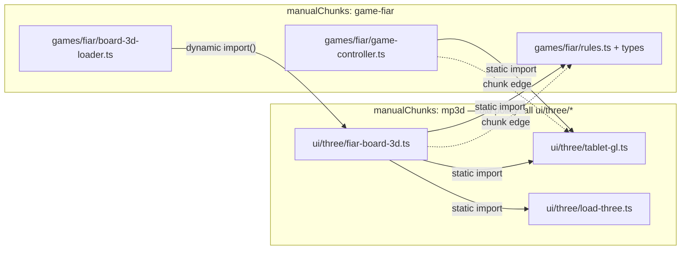

# q-mp-138 — Vite `manualChunks` smell: `mp3d` ↔ `game-*` circular chunks

**Task id:** `q-mp-138`  
**Role:** worker (docs only)  
**Tip context at authoring:** `cursor/mp-tip-post477` @ `03a15e5c`  
**Code fix owner:** draft [#606](https://github.com/fuzzywigg/math-pentathlon/pull/606) (`q-mp-062`) — tip already folded that policy as `4448b4ae`; this note is the contributor-facing write-up, not a second code change.  
**Scope:** Documentation only — no `vite*.ts` edits, no AI/rules moves, no player-facing copy.

## Why this note exists

`npm run check:boundaries` reports **source SCCs = 0**. Vite can still emit **Circular chunk** warnings when `manualChunks` forces modules that already have a cross-edge into the same named buckets. That is a packaging smell, not an import-graph cycle in TypeScript source.

Live tip evidence (still recorded, historically):

- `docs/dev/module-boundaries-ceilings.json` → `notes.reported_not_changed` documents the smell (board-3d-loader / `ui/three` packaging; do not “fix” it by editing AI or `*/rules.ts`).
- `vite.shell-chunks.ts` comments the prior forced-`mp3d` cycle around the `MP3D_SHARED_MODULES` policy.

## Chunk graph (smell)

When every `src/ui/three/*` file was forced into the `mp3d` manual chunk, Rollup saw:



Edges that close the **chunk** cycle (not a source SCC):

| Direction | Mechanism |
| --- | --- |
| `game-*` → `mp3d` | Game controller **statically** imports `ui/three/tablet-gl` (and friends) while living in `game-<id>`. |
| `mp3d` → `game-*` | Per-game `*-board-3d.ts` (forced into `mp3d`) **statically** imports that game’s `rules` / `types` / board-ui helpers. |

`board-3d-loader.ts` stays in the game package and only **dynamic-imports** the 3D board — that gate is fine. The smell appears when the board module itself is **also** force-bucketed into `mp3d`.

Same pattern applied to other 3D games (`star-track`, `hex-a-gone`, `queens-guards`, `kwatro-sinko`, `prime-gold`, `pent-em-in`, …) whenever their controller pulled `tablet-gl` and their board-3d sat in `mp3d`.

## Policy that clears the warning (do not regress)

Current tip policy in `vite.shell-chunks.ts`:

- `MP3D_SHARED_MODULES = ['tablet-gl', 'load-three']` → only those land in the `mp3d` chunk.
- Per-game `*-board-3d` / `*-pieces` stay **unnamed** so they ride the dynamic-import graph with `board-3d-loader`.
- Unit guard: `tests/unit/shell-preload-policy.test.ts` expects per-game boards to be `undefined` from `uiManualChunkName`.

**Do not** “simplify” by putting all of `src/ui/three/` back into `mp3d`. That reintroduces `Circular chunk: mp3d -> game-* -> mp3d`. Clearing or changing this stays with [#606](https://github.com/fuzzywigg/math-pentathlon/pull/606) / the tip owner — not a docs PR.

## Captured build output

### Tip HEAD (this doc’s tip SHA) — clean

Fresh `npm run build` on tip `@03a15e5c` (artifact: `/opt/cursor/artifacts/q-mp-138-build.log`):

```text
vite v7.3.7 building client environment for production...
transforming...
✓ 246 modules transformed.
rendering chunks...
computing gzip size...
…
✓ built in 4.24s

PWA v2.0.0
```

No `Circular chunk:` lines on tip after the folded `q-mp-062` policy.

### Pre-policy reproduction (authentic Rollup warnings)

Same command on the parent of tip fold `4448b4ae` (when `ui/three/*` was still entirely `mp3d`). Full log: `/opt/cursor/artifacts/q-mp-138-build-pre-062-warnings.log`.

```text
Circular chunk: mp3d -> game-fiar -> mp3d. Please adjust the manual chunk logic for these chunks.
Circular chunk: mp3d -> game-kwatro-sinko -> mp3d. Please adjust the manual chunk logic for these chunks.
Circular chunk: mp3d -> game-prime-gold -> mp3d. Please adjust the manual chunk logic for these chunks.
```

(Also accompanied at that SHA by Rollup’s default `Some chunks are larger than 500 kB after minification` for the intentional `three` vendor chunk — separate from the cycle; tip raises `chunkSizeWarningLimit` for that known size.)

Broader historical inventory (seven game ids) remains in `docs/dev/module-boundaries-ceilings.json` `reported_not_changed` for boundary-checker context; the three lines above are the verbatim Vite text from a fresh pre-policy build.

## Related

| Item | Role |
| --- | --- |
| [#606](https://github.com/fuzzywigg/math-pentathlon/pull/606) `q-mp-062` | Owns clearing / keeping the warnings gone in `vite*.ts` |
| `vite.shell-chunks.ts` | `MP3D_SHARED_MODULES` + comment on the forced-mp3d cycle |
| `docs/dev/module-boundaries-ceilings.json` | Source SCC ceilings stay 0; packaging smell called out in notes |
| `docs/bundle-budget.md` | Gzip / `game-<id>` chunk budgets (orthogonal) |
| `docs/dev/ci-gates-mermaid-q-mp-073.md` | CI job map (build job runs `npm run build`) |

## Local verify

```bash
npm run build            # tip: no Circular chunk lines
npm run check:dev-docs   # report-only; paths in this note should resolve
```
