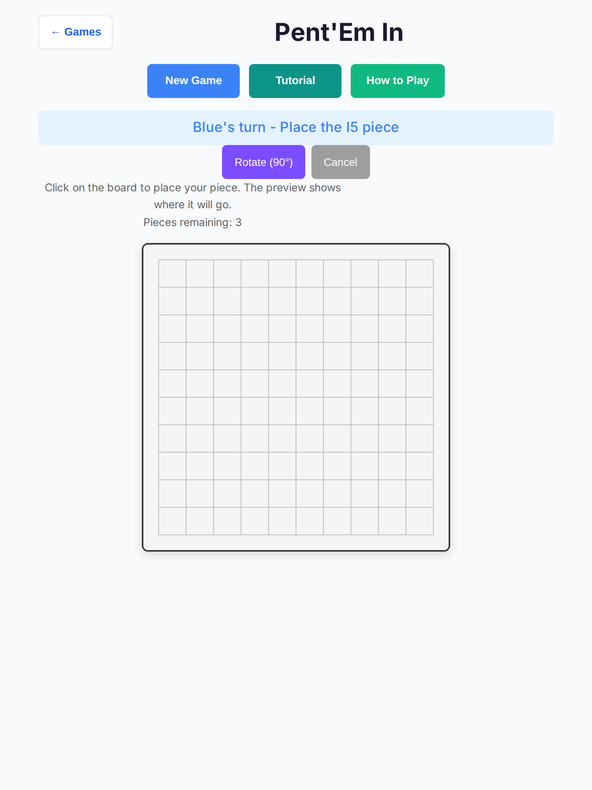
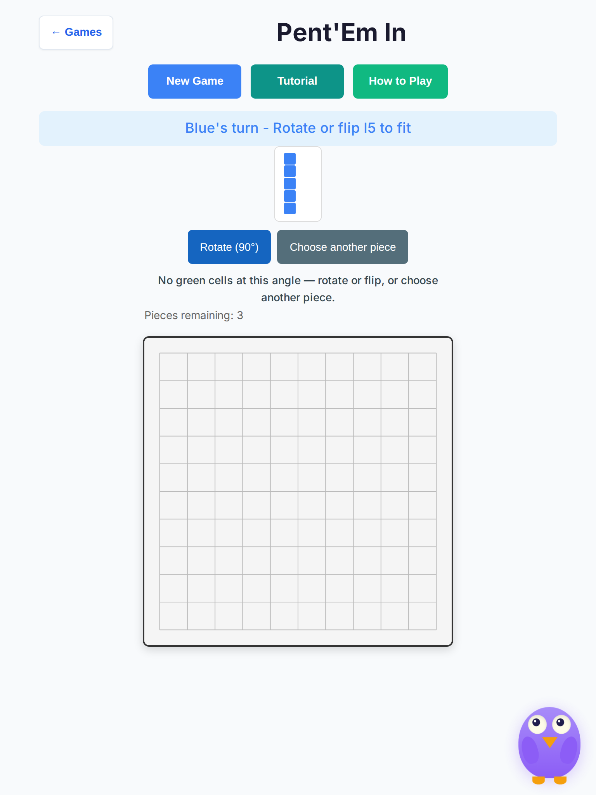
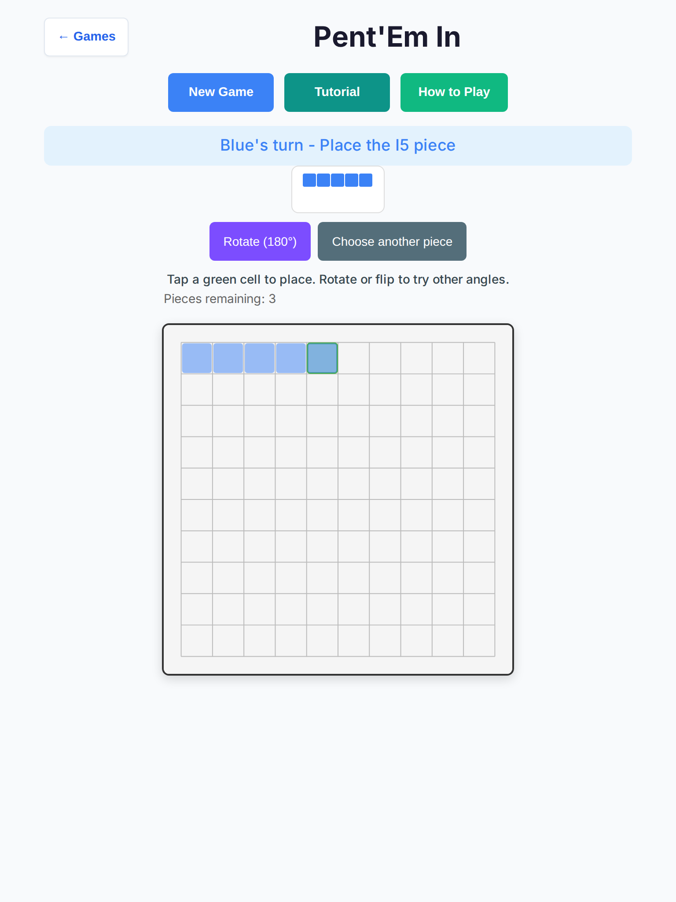

# Pent'Em In place-piece UX — 2026-10-07 follow-up

Stacked on playtest recheck PR #415. Addresses top-10 item **#5** (STILL BROKEN on #415): kids get stuck on **“Place the … piece”** without clear legal cells or an escape on tablet.

## Before

Injected crowded board + vertical `I5` (won’t fit the open strip):

- Status: `Place the I5 piece`
- Controls: Rotate / Cancel only
- Hint: “Click on the board… The preview shows where it will go.” (hover preview is weak on touch)
- **0** legal-cell highlights

## After

Same jammed orientation:

- Status: `Rotate or flip I5 to fit`
- Controls: Rotate + **Choose another piece**
- Hint: no green cells at this angle — rotate/flip or choose another

After one rotate (or selecting from the tray with orient-to-fit):

- Green **legal anchors** + ghost preview without hover
- Hint: tap a green cell to place

## Scope

Polish only — no scoring / win-condition / clock changes. Kwatro untouched.
