# Playtest recheck — 2026-10-07 (vs integration PR #413)

Recheck of the top-10 items from [`docs/playtest/2026-10-07.md`](https://github.com/fuzzywigg/math-pentathlon/blob/cursor/playtest-report-2026-10-07-0789/docs/playtest/2026-10-07.md) (PR #414) against overnight polish integration **PR #413** (`cursor/overnight-polish-integration-0494` @ `89b8435`), then small safe non-rules fixes on this branch.

## Method

| Item | Detail |
| --- | --- |
| App | `npm run dev` → `http://127.0.0.1:5173` |
| Browser | Playwright Chromium headless |
| Viewport | 768×1024, `deviceScaleFactor: 2`, `hasTouch: true`, iPad Mini profile |
| Soft-lock games | Restored harness (`full-playtest.mjs`): Easy/Medium/Hard, max **90** human turns / ~5 min |
| Spot probes | Touch sizes, AI think ms, console errors, winner copy |
| Hard stops | No Kwatro scoring / win-condition edits (#393/#394 await Andrew). No merges. |

## Verification table (top-10)

Legend: **FIXED** / **PARTIAL** / **STILL BROKEN** on #413 alone; **This PR** = status after `cursor/playtest-recheck-fixes-a6fd`.

| # | Issue | On #413 | This PR | Evidence |
| --- | --- | --- | --- | --- |
| 1 | **Juggle — placement soft-lock** | **STILL BROKEN** | **FIXED** (UX escape) | Soft-lock harness: Easy/Med/Hard soft_lock on “Place the shape…” (E: 13 turns). #407 was AI-seat lock only. This PR: orient-to-fit, `.juggle-cell-valid` highlights, **Choose another shape** → back to die select. 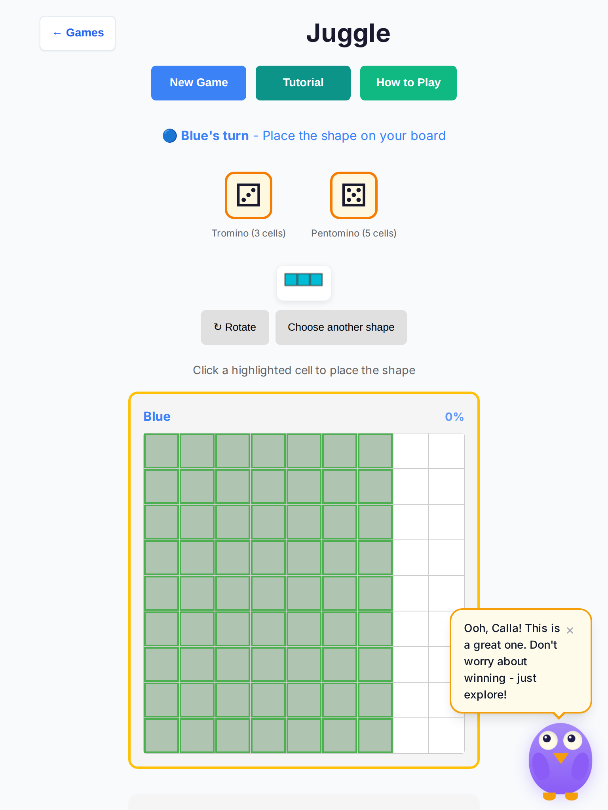 |
| 2 | **Kwatro-Sinko — AI stall on Red** | **PARTIAL** | **PARTIAL** (no code change) | E/M/H timed out at 90 turns still on **Blue** select/move — critical Easy **Red** stall from the report **not reproduced**. AI reply when it acts is fast (`aiThinkMaxMs` ~0–4). Long games remain. Do **not** land #393/#394 here. 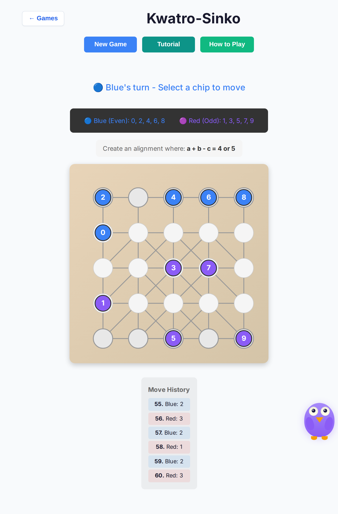 |
| 3 | **Shell + Ollie ≥44px** | **PARTIAL** | **FIXED** | Shell New Game / How to Play / back already often 44 via coarse CSS; Ollie dismiss/minimize were **24×24** (height bumped by min-height only). This PR: dismiss + minimize **44×44**; button-row / back `min-height: 44` unconditional. Post-fix: all measured 44×44. 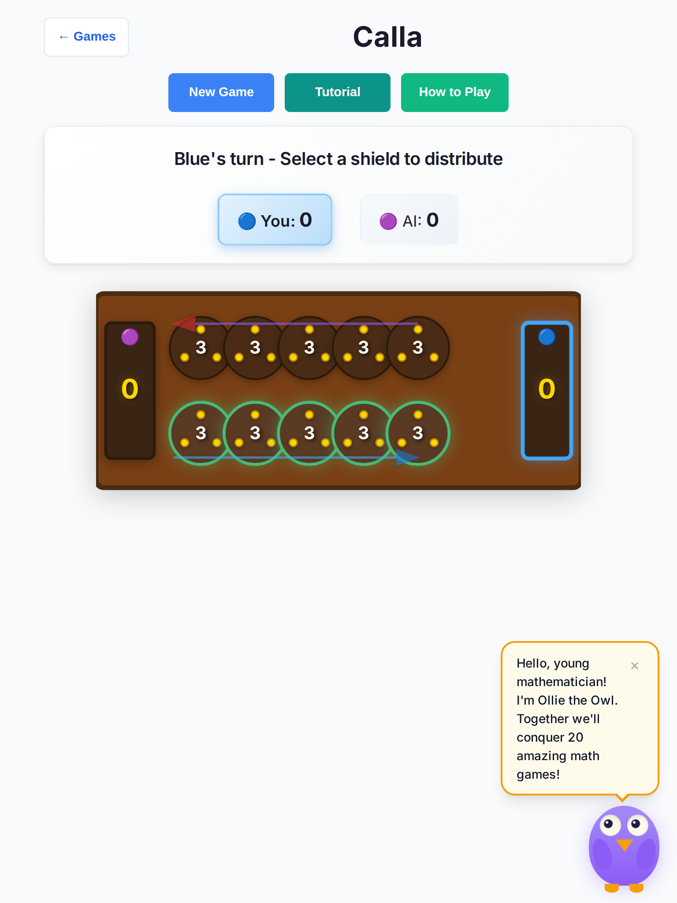 |
| 4 | **Board hit targets ≥44px** | **PARTIAL** | **PARTIAL → improved** | Hex: height 44 at 690px board (pointy-top design; bbox width ~38 geometry) — treat Hex as **FIXED** per #411 intent. Kwatro valid nodes **44×44** on #413. FIAR nodes still ~40×40. Kings were ~36 on tablet; this PR coarse board → **44×44**. Sum Dominoes hands → **72×44**. 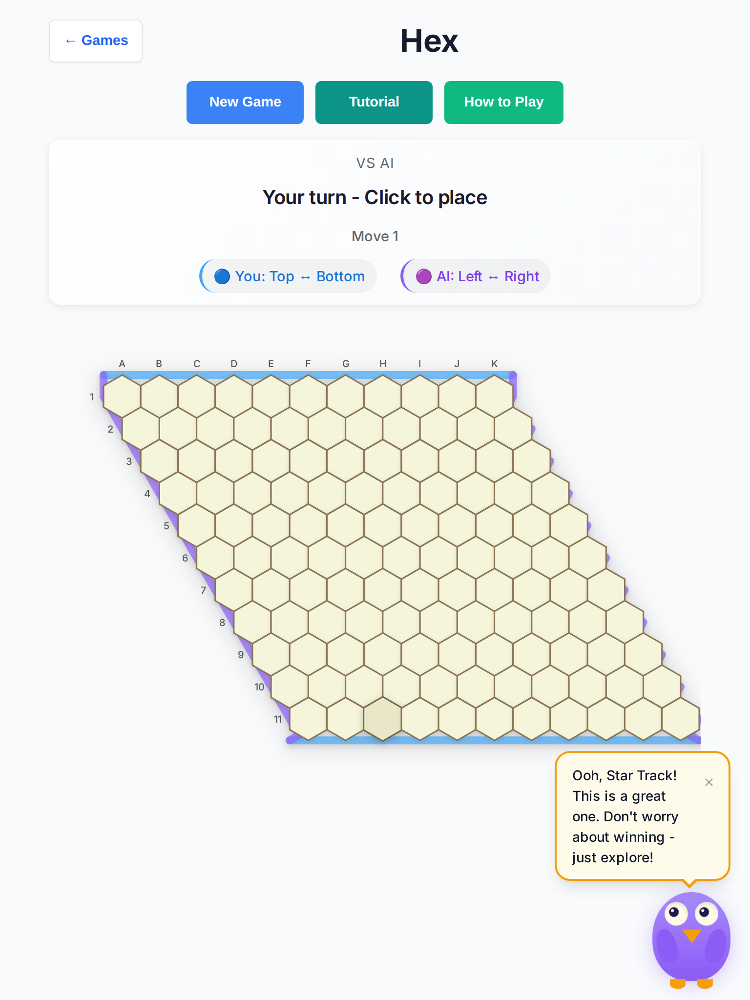 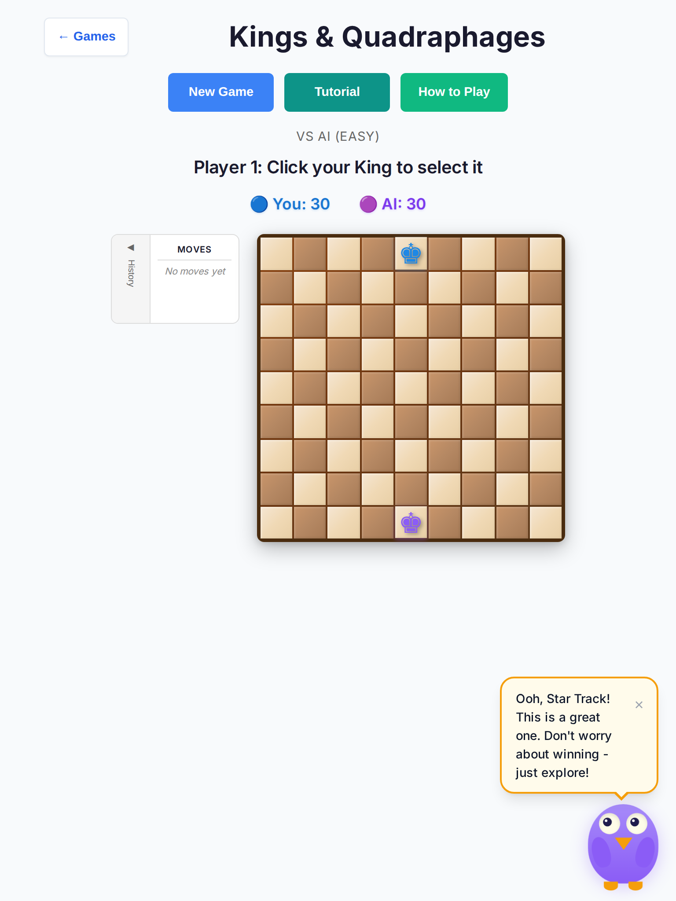 |
| 5 | **Pent'Em In — place dead-end UX** | **STILL BROKEN** | **STILL BROKEN** (no rules/UX deep fix) | Soft-lock / AI no-progress on “Place the L5 piece” (Easy/Hard). #403 was AI-seat input lock only — no legal-cell default orientation. Needs a dedicated playability PR (not scoring). 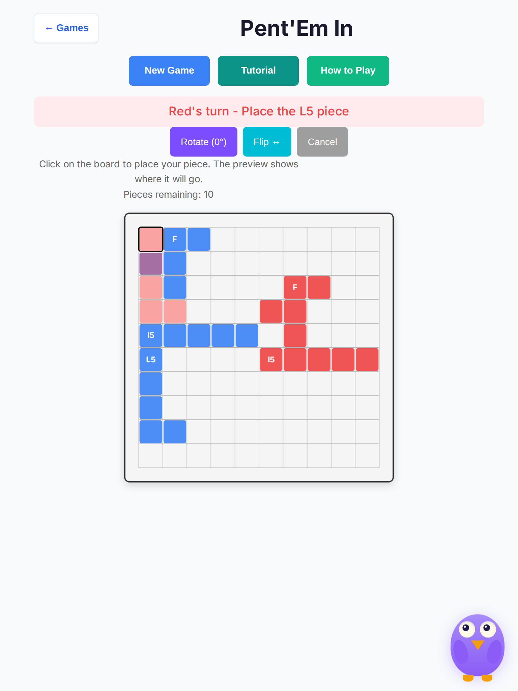 |
| 6 | **Prime Gold — Roll stall** | **PARTIAL** | **PARTIAL** (+ timer guard) | Medium reached **tie**. Easy timed out on Blue “Roll the dice” (harness/long). Hard soft_lock on Red “Roll the dice” (AI no progress 45s). #405 was AI-seat lock. This PR: avoid resetting the AI think timer on every `updateUI` re-entry. 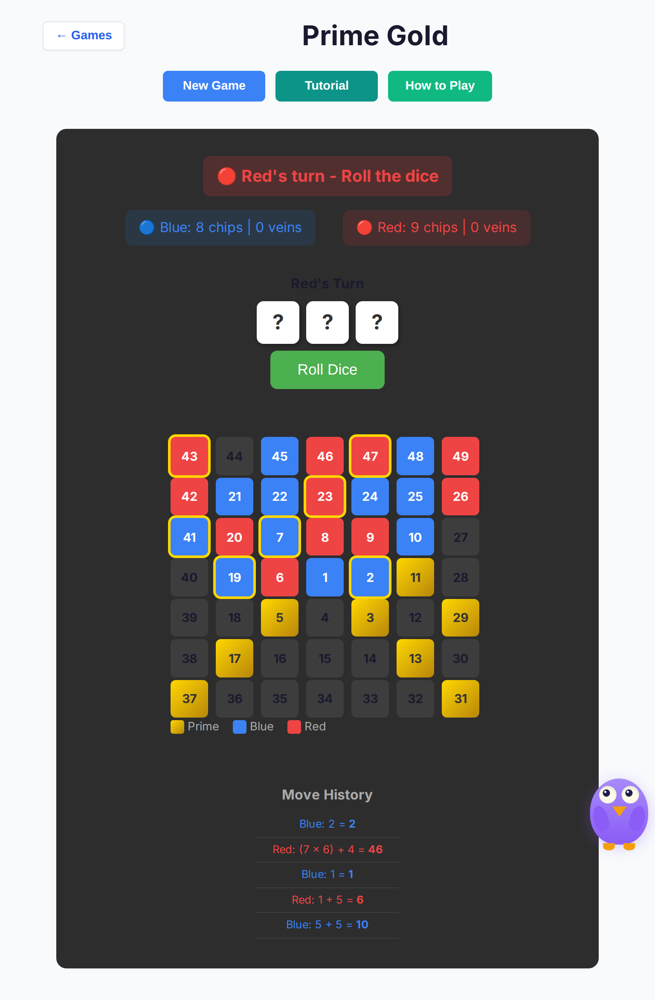 |
| 7 | **Hex-a-Gone AI think ~3.1s** | **STILL BROKEN** | **FIXED** | On #413, measured think ~**3.2s** (800ms delay × multi-block place chain). This PR: `AI_THINKING_DELAY = 350` → measured ~**1.4s** Easy/Med/Hard. 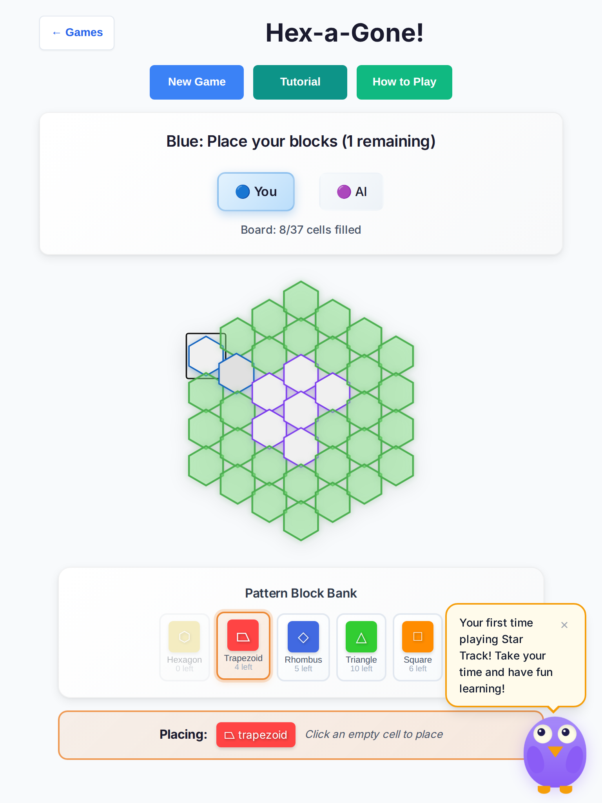 |
| 8 | **Star Track “You Wins!”** | **STILL BROKEN** | **FIXED** | Live end copy on #413: `🎉 🔵 You Wins! 🎉`. This PR: HvA human → **You win!** Unit + live: `🎉 🔵 You win! 🎉`. 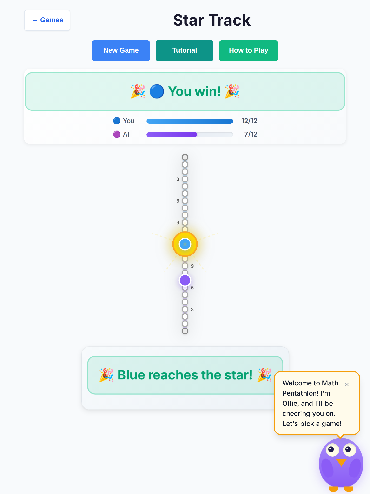 |
| 9 | **Fab-a-Diffy AI console errors** | **STILL BROKEN** | **FIXED** (noise) | Soft-lock harness: `AI: selectBar1 failed … phase: confirmingMove` on E/M/H. Game still progressed toward answers. This PR: keep `passTurn` recovery, remove `console.error` spam. Post-fix Hard/Med probe: **0** matching errors. 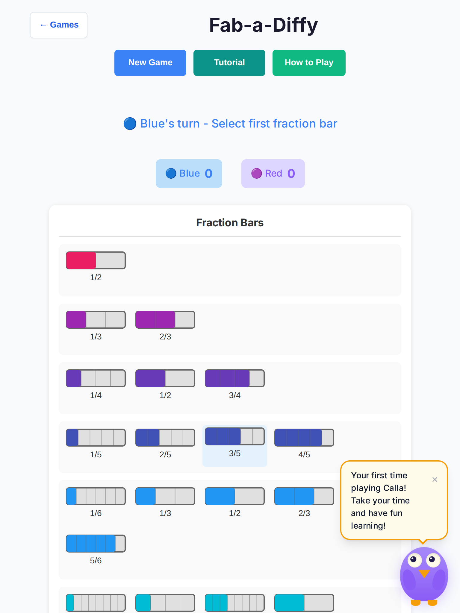 |
| 10 | **FIAR move-phase clarity + touch** | **PARTIAL** | **PARTIAL** | Chip-kind buttons **44px** on #413; status copy for move phase present (“Select a chip…” / “Click a green node…”). Harness still times out at 90 turns in move phase; board nodes ~40px. No rules change. 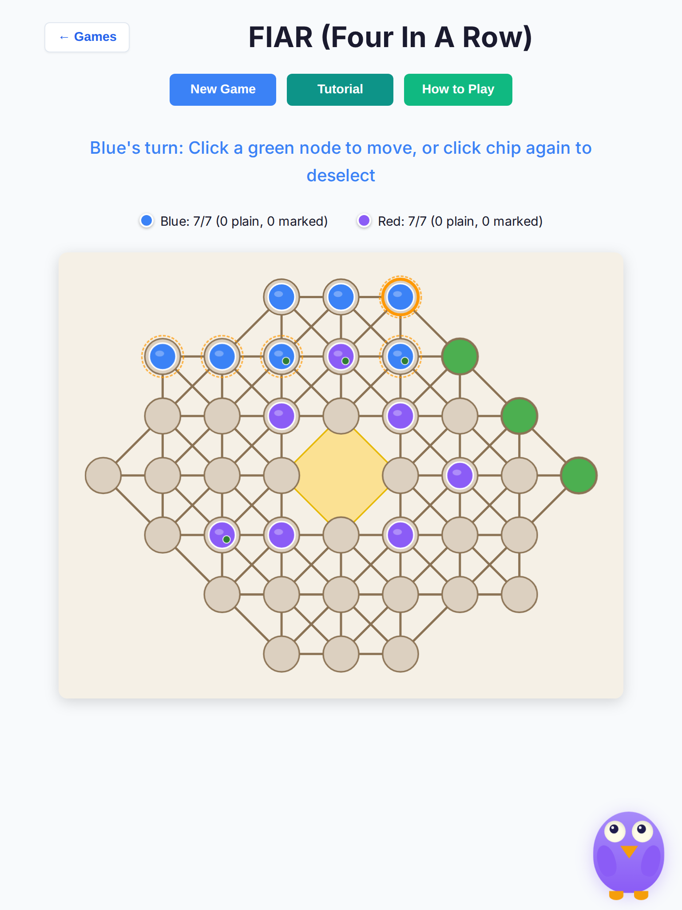 |

## What #413 actually covered vs the report

Many merged polish PRs (#401–#412) are **AI-seat input locks / aria honesty / touch CSS**, not the critical soft-lock or copy bugs named in the playtest top-10. Notably:

- **#407 Juggle** ≠ placement can’t-fit escape  
- **#403 Pent'Em In** ≠ legal placement UX  
- **#405 Prime Gold** ≠ mid-game Roll AI stall  
- **#393/#394 Kwatro** intentionally **skipped** on the integration branch  

## Fixes in this PR (safe / non-rules)

1. Juggle placement escape + legal highlights (`rules.ts` / `board-ui.ts` / controller)  
2. Star Track “You win!”  
3. Ollie + shell 44px targets  
4. Hex-a-Gone AI delay budget  
5. Fab-a-Diffy silent AI pass recovery  
6. Sum Dominoes hand height; Kings coarse board size  
7. Prime Gold AI schedule re-entry guard  

## CI / local checks (this branch)

| Check | Result |
| --- | --- |
| `npm run lint` | pass |
| `npx tsc --noEmit` | pass |
| `npm run test:unit` | **3005 files / 10616 tests passed** |
| `npm run test:e2e -- --project=chromium` | **76 passed** |

## Screenshots

| File | What |
| --- | --- |
| `juggle-softlock-before.png` | Soft-lock on #413 (pre-fix harness) |
| `juggle-placing.png` | Post-fix place phase + Choose another |
| `star-track-you-win.png` | “You win!” end copy |
| `shell-ollie.png` | 44×44 Ollie + shell chrome |
| `hex-a-gone.png` | Post-fix AI think path |
| `kwatro-sinko-easy.png` | Long Blue turn (no Red stall) |
| `prime-gold-hard.png` | Hard Roll stall sample |
| `pent-em-in-easy.png` | Place L5 stuck sample |
| `fiar-easy.png` | Move-phase timeout sample |
| `fab-a-diffy.png` | Fab tablet board |
| `hex-board.png` / `kings-board.png` | Board target samples |
