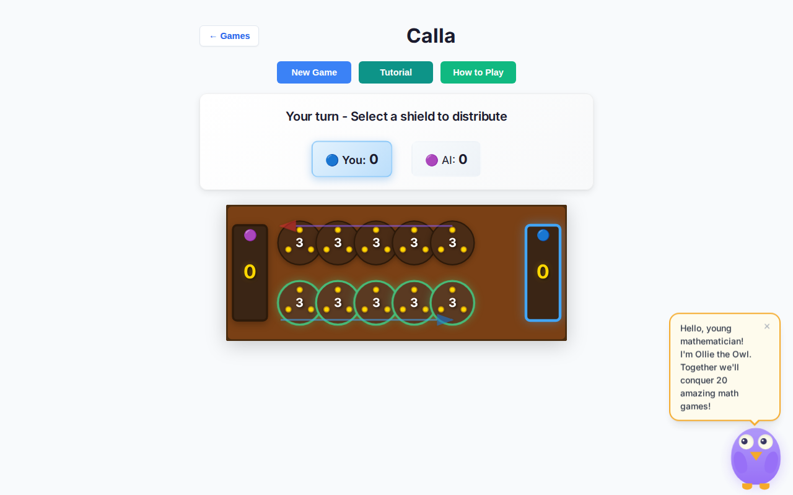
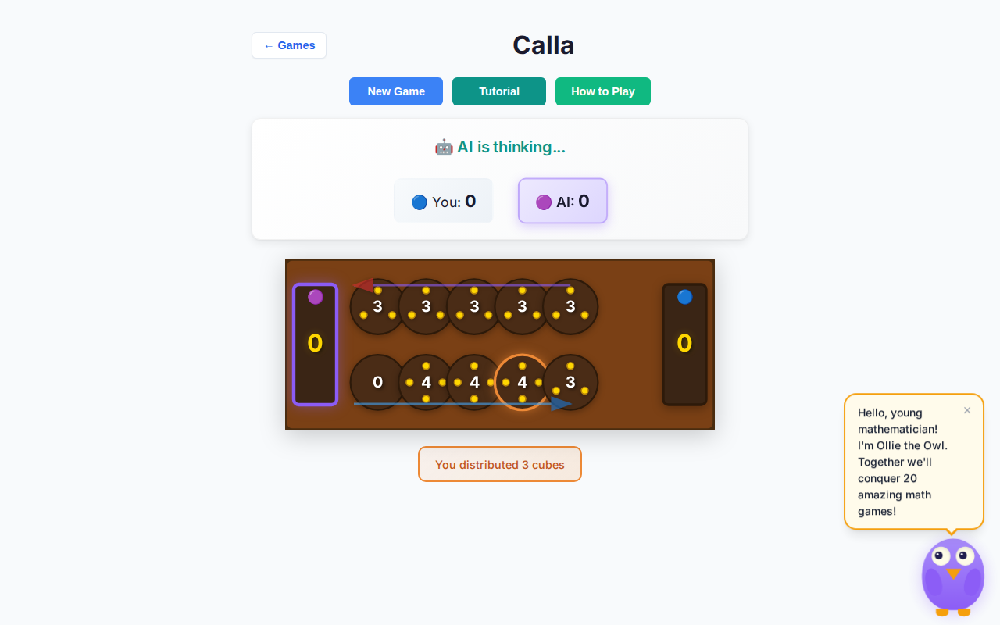
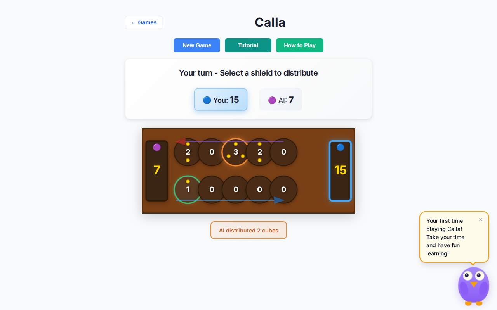
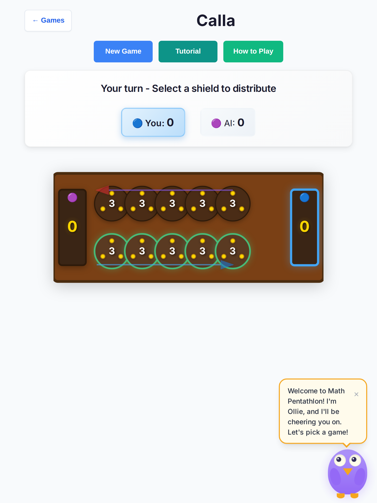

# Calla deep playtest — 2026-10-07

Human vs AI · Easy / Medium / Hard · desktop + tablet headless Chromium · **10+ full games each** (60 primary + 30 clean verification).

**Scope:** playability only — no rules or scoring changes.

## Method

- Harness: `scripts/calla-deep-playtest.mjs` (Playwright Chromium)
- Viewports: desktop 1280×800; tablet 768×1024 (`hasTouch`)
- Per cell: start New Game → Human vs AI → difficulty → play valid pits to completion
- Recorded: winner banner, stalls, console/page errors, AI thinking-chrome duration, pit hit CSS diameter

## Results (primary 60-game run)

| Viewport | Diff | Games | OK | Stalls | Console errs | Pit hit ⌀ | AI think chrome max* |
| --- | --- | --- | --- | --- | --- | --- | --- |
| desktop | Easy | 10 | 10 | 0 | 0 | 88px | ~3.3s |
| desktop | Medium | 10 | 10 | 0 | 0 | 88px | ~6.0s† |
| desktop | Hard | 10 | 10 | 0 | 0 | 88px | ~4.9s† |
| tablet | Easy | 10 | 10 | 0 | 0 | 88px | ~3.2s |
| tablet | Medium | 10 | 10 | 0 | 0 | 88px | ~3.2s |
| tablet | Hard | 10 | 10 | 0 | 0 | 88px | ~4.0s |

\*Thinking chrome includes intentional sow delay + free-turn chain delays (not raw search time). Calla Hard minimax on this board stays well under the 2.5s tablet search budget.

†Longer peaks were continuous free-turn chains while thinking chrome stayed locked (see fix #1). Cadence later tightened to 600ms / 250ms; clean verification max dropped to ~3.2s.

**Clean verification (30 games, no live HMR):** 30/30 OK, 0 stalls, 0 console errors, 0 `You Wins!` / Blue-Red vs-AI banners.

Raw JSON: [`results.json`](./calla-deep-2026-10-07/results.json)

## Findings → fixes

### 1. Stall / unclear UX — AI free-turn gap (critical)

Between AI free turns the controller cleared `isAIThinking`, so status briefly showed **“AI's turn - Select a shield…”** with **zero valid pits**. Kids (and the harness) looked stuck.

**Fix:** keep thinking chrome through the entire free-turn chain; only clear when the seat returns to the human. Free-turn delay 250ms (first sow 600ms).

### 2. Unclear UX — “You Wins!” grammar

Winner banner used `Wins` for every name → **“You Wins!”**.

**Fix:** `You Win!` / `Blue Wins!` / `AI Wins!` (same pattern as Hex / Kings).

### 3. Unclear UX — Blue/Red copy in vs-AI

Turn + last-move strings still said Blue/Red while scores said You/AI.

**Fix:** `getPhaseMessage` / `getLastMoveInfo` take display mode → Your/AI labels in human-vs-AI.

### 4. Teaching mode silent on Easy

Easy AI already produced `hint` strings, but nothing rendered them.

**Fix:** surface `.calla-teaching-hint` on the human’s next turn; clear on the next human sow.

### 5. Touch targets

Pit hit radius raised to SVG `r=40` (≥44px CSS on tablet/desktop; measured **88px**). Coarse-pointer board `min-height: 280px`.

### 6. `resetGame` dropped Hard → Medium

**Fix:** `newGameVsAI(aiDifficulty)` preserves the chosen difficulty.

### 7. Soft-lock settle on human seat

Defensive: empty valids mid-game run existing `settleNoValidMoves` (same end collection as before — no scoring change).

### Observed during primary run (not product bugs)

Two desktop games showed **“Red Wins!”** mid-session while files were hot-reloaded. Clean re-run (30 games, no HMR) never reproduced — treated as Vite HMR resetting module `gameMode`.

## Screenshots

| Shot | File |
| --- | --- |
| Desktop — Your turn |  |
| Desktop — AI thinking |  |
| Desktop — You Win! |  |
| Tablet — Hard board |  |

## Regression tests

- Unit: `tests/unit/calla-deep-playability-2026-10-07.test.ts` (+ updated winner-banner exacts)
- E2E: `tests/e2e/calla-deep.spec.ts` (desktop + tablet Chromium)

## Files touched

- `src/games/calla/{board-ui,game-controller,rules}.ts`
- `src/style.css` (`.calla-*` only)
- `tests/unit/calla-deep-playability-2026-10-07.test.ts` (+ related calla banner exacts)
- `tests/e2e/calla-deep.spec.ts`
- `scripts/calla-deep-playtest.mjs`
- `docs/playtest/calla-deep-2026-10-07.md` + screenshots
