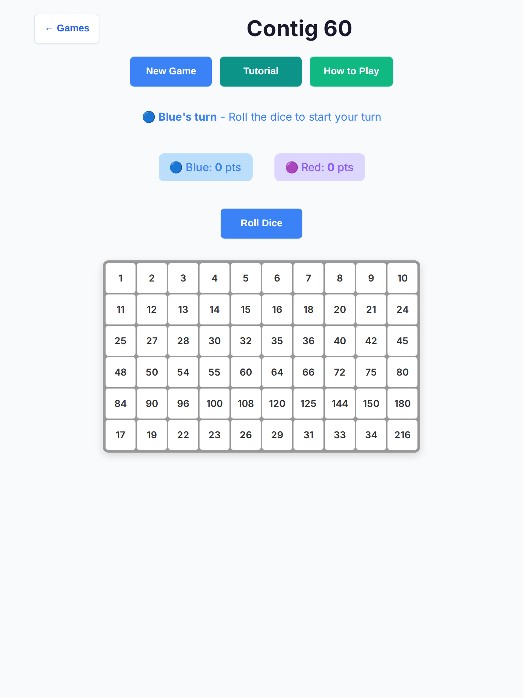
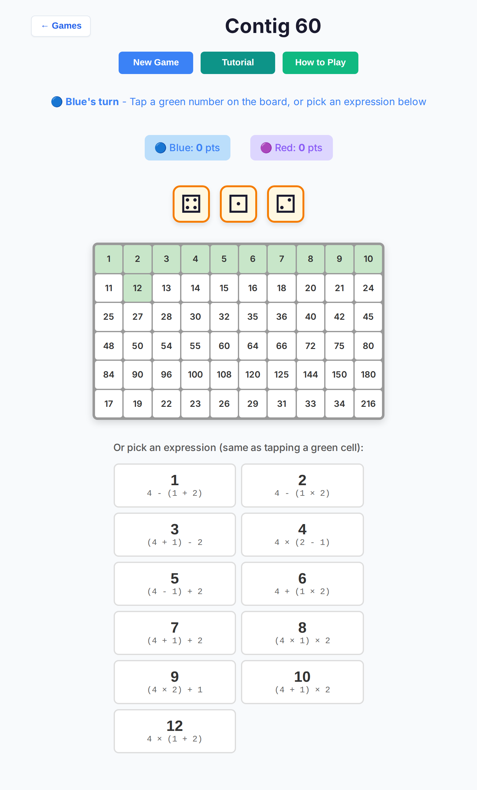
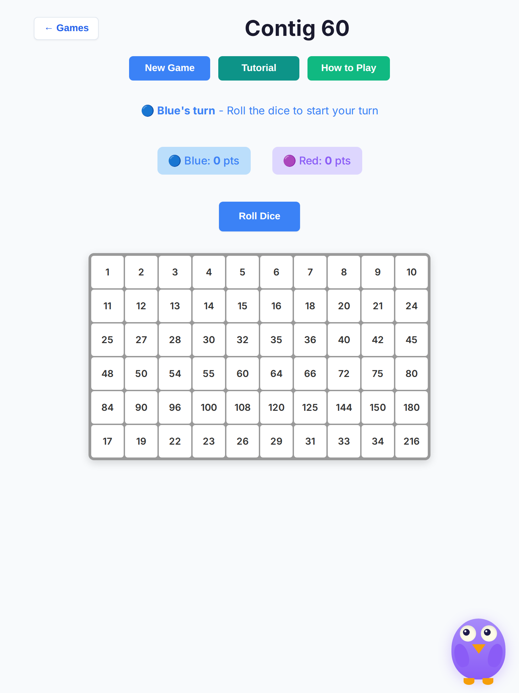
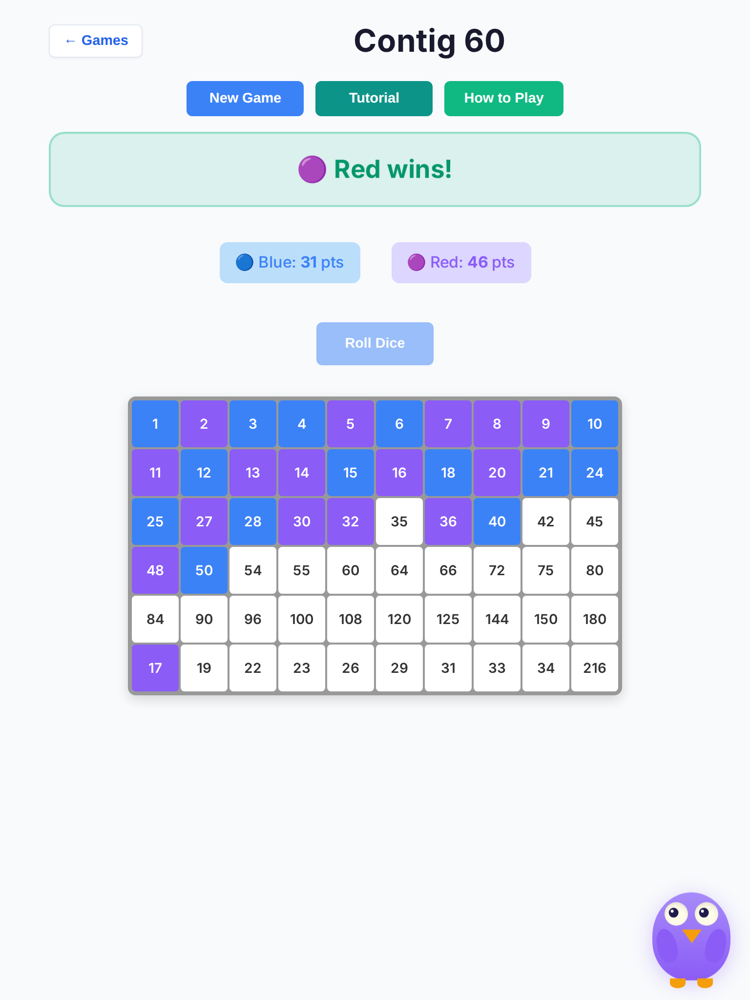
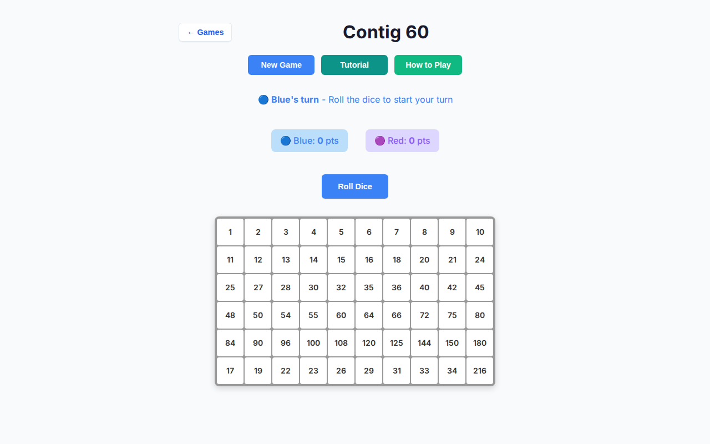
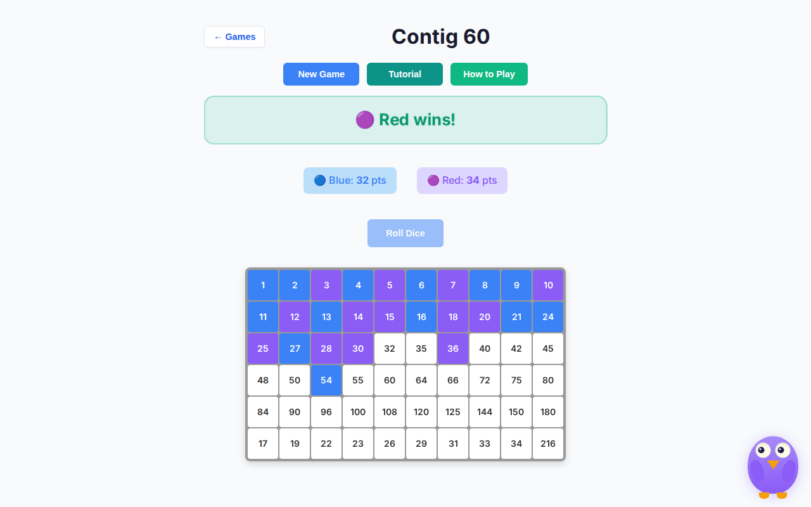
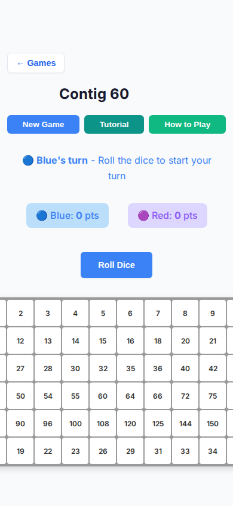

# Contig 60 deep playtest — 2026-10-07

Human vs AI · Easy / Medium / Hard · tablet (iPad Mini 768×1024, touch) + desktop (1280×800) · headless Chromium.

Stacked on `cursor/overnight-polish-integration-0494`. **No rules or scoring changes.**

## Method

- Local Vite (`127.0.0.1:5173`) + Playwright Chromium headless
- Scripted human: roll → tap highest-point green cell (or Pass) → wait for AI
- **12 full games × 3 difficulties × 2 viewports = 72 games**
- Also probed New Game mid–AI-pause (stale timer race) and narrow 390px fine-pointer cells
- Wall clock ~16 min for the full matrix; max AI “thinking” chrome ~737 ms

## Results matrix

| Viewport | Difficulty | Games | Ended | Stalls | Max AI think | Notes |
| --- | --- | --- | --- | --- | --- | --- |
| tablet | Easy | 12 | 12 | 0 | 736 ms | Mix of Blue / Red / draw |
| tablet | Medium | 12 | 12 | 0 | 737 ms | Mix; New Game race clean |
| tablet | Hard | 12 | 12 | 0 | 736 ms | Mix; some short 5-in-a-row wins |
| desktop | Easy | 12 | 12 | 0 | 736 ms | Mix |
| desktop | Medium | 12 | 12 | 0 | 736 ms | Mix |
| desktop | Hard | 12 | 12 | 0 | 737 ms | Mix |

**Totals:** 72 ended · **0 stalls** · **0 console errors** · New Game race suspicious hits: **0**

## Findings

| # | Issue | Severity | Status |
| --- | --- | --- | --- |
| 1 | **Stale AI `setTimeout` after New Game** — placing then immediately starting a new match left Blue with auto-rolled dice (`handleRollDice(true)` ran for the human seat). Soft corruption / confusing UX. | high | **Fixed** — `aiGeneration` bump on init/New Game; `scheduleAI`; AI-seat guard on `fromAI === true` |
| 2 | **Narrow viewport cells at 40px** (`max-width: 600px`) — under the 44px touch budget on fine-pointer narrow windows | medium | **Fixed** — cells stay 44×44 in that media query |
| 3 | **Expression list above the board** — after Roll, long option grids pushed green cells below the fold on tablets | medium | **Fixed** — board renders before expressions; status/header copy points at green cells |
| 4 | **Hard `lookahead: true` unused** — config flag never read; Hard missed open-threat avoidance beyond the existing block bonus | medium | **Fixed** — Hard penalizes moves that leave open 5-in-a-row threats |
| 5 | **AI turn pauses felt slow** — 500 ms then 1000 ms per computer turn | low | **Fixed** — 350 ms roll / 450 ms place (still well under 3 s) |
| 6 | Status said “Click…” / “you must pass” — weak for touch | low | **Fixed** — tap-oriented copy |

### Non-issues (verified)

- AI seat input lock / “Computer is thinking…” chrome still blocks human Pass / expressions / valid targets
- Roll / Pass / expression options already ≥44px on tablet
- Coarse-pointer cells already 44px (tablet)
- No console spam during 72 games
- Games reliably reach a winner banner or draw (no soft-lock)

## Screenshots

| Shot | File |
| --- | --- |
| Tablet Easy opening |  |
| Tablet Easy after roll (board above expressions) |  |
| Tablet Medium New Game race (clean Roll for Blue) |  |
| Tablet Hard end banner |  |
| Desktop Medium opening |  |
| Desktop Hard end |  |
| Narrow 390px fine-pointer cells ≥44px |  |

## Code / tests

- `src/games/contig-60/game-controller.ts` — generation token, delays, board order, copy
- `src/games/contig-60/board-ui.ts` — 44px narrow cells, expression header
- `src/games/contig-60/ai.ts` — Hard lookahead threat scan
- `tests/unit/contig-60-ai-timer-generation.test.ts`
- `tests/unit/contig-60-deep-playtest-ux.test.ts`
- `tests/e2e/contig-60-playability.spec.ts` (Chromium tablet + desktop)

## Hard stops honored

- No merges; did not edit or close other PRs
- Contig 60 sources + its tests/docs only
- No rules / scoring / win-condition changes
