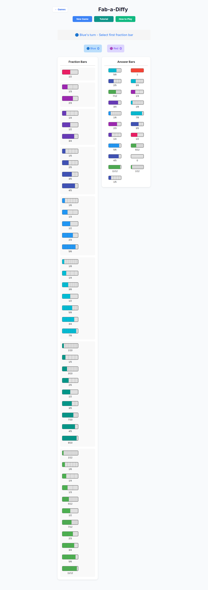
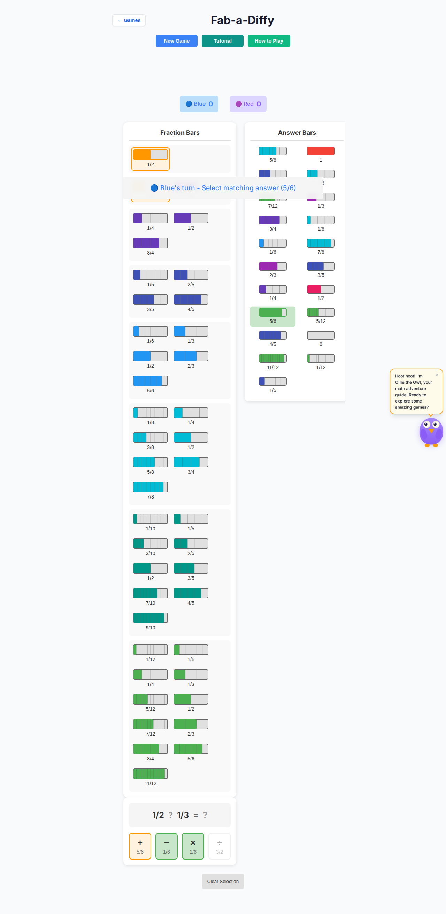
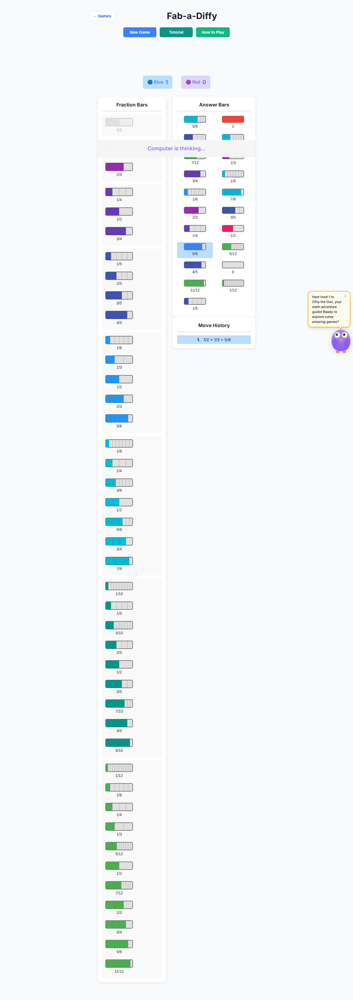
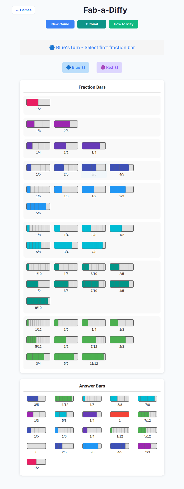
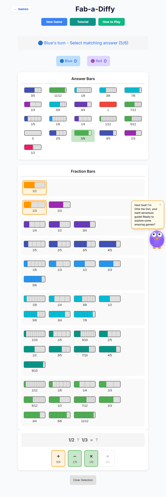

# Fab-a-Diffy deep playtest — 2026-10-07

Target: local Vite `http://127.0.0.1:5173/#/game/fab-a-diffy`  
Branch: `cursor/fab-a-diffy-deep-playtest-a823` (base `cursor/overnight-polish-integration-0494`)  
Scope: playability only — **no rules or scoring changes**.

## Session exercised

| Step | Result |
|---|---|
| Mount Fab-a-Diffy shell | Pass — bar pool + answer board |
| New Game → human vs AI Easy/Medium/Hard | Pass |
| Desktop Chromium (1280×800) × 10 games × 3 difficulties | **30/30 ok** |
| Tablet Chromium (768×1024, touch) × 10 games × 3 difficulties | **30/30 ok** (1 harness stall on first tablet/easy pass; **0/10** after claim-search + UX fixes) |
| AI thinking chrome + seat lock | Pass — status + disabled bars |
| Console / page errors during volume run | None material (`AI:` apply failures: 0) |
| Hard AI think wall time | ~1.3s typical after 800ms schedule (deadline + worker) |

Runner: `tests/playtest/fab-a-diffy-deep.mjs`  
Raw totals: `docs/playtest/fab-a-diffy-deep-2026-10-07/summary.json`

## Findings

### F1 — Human could act during AI think (input lock missing) — **P1** — fixed

**Repro:** New Game → vs AI → complete a claim → during “computer” seat, tap bars / Clear.

**Expected:** Board non-interactive; clear thinking status.

**Actual:** Prior polish was reverted for the AI-worker PR; humans could interrupt the AI seat. No `status-ai-thinking` copy.

**Fix:** `allowInput` on bar/answer/op renderers; handler guards; “Computer is thinking…” + generation-cancelled think timer (`game-controller.ts`, `board-ui.ts`).

### F2 — Sub-44px tap targets / motion — **P2** — fixed

**Repro:** Tablet viewport; inspect `.fab-bar-wrapper` / `.fab-answer-wrapper` / `.fab-op-btn`.

**Expected:** ≥44px targets; reduced-motion disables pulse/glow.

**Actual:** SVG-sized hit areas (~100×30 / 80×25) with only 4px padding; `fab-pulse` / `fab-glow` always on.

**Fix:** `min-height/width: 44px`, `@media (pointer: coarse)`, `@media (prefers-reduced-motion: reduce)`.

### F3 — Operation dead-end (confirmingMove with no matchables) — **P1** — fixed

**Repro:** Select two bars → choose an operation whose result has no unclaimed answer → status asks for matching answer → only Clear recovers.

**Expected:** Only claimable operations are choosable.

**Actual:** Any non-negative result op was clickable; teaching residual was a soft stall.

**Fix:** Enable op buttons only when `findMatchingAnswers` is non-empty (rules untouched).

### F4 — Tablet claim targets below long bar pool — **P2** — fixed

**Repro:** Tablet vs AI → select bars + valid op → matching answer sits far below the fold; easy to miss green pulse.

**Expected:** Claim targets obvious and reachable without hunting.

**Actual:** Single-column layout put answers under a tall bar list; playtest harness stuck in confirmingMove once.

**Fix:** Phase class `fab-phase-confirmingMove` reorders answers above bars on ≤768px; stronger match outline; status names target `(5/6)`; `scrollIntoView` on first `.fab-answer-matchable`.

### F5 — Sticky status overlay briefly covered bars — **P2** — fixed

**Repro:** Mid-game tablet screenshot after an experimental sticky status.

**Expected:** Status never occludes the bar pool.

**Actual:** Sticky + backdrop blur sat over mid-board content while scrolling.

**Fix:** Removed sticky positioning (scroll-into-view + reorder cover the claim case).

### F6 — Shared Ollie chrome can overlap the board — **P3** — noted

**Repro:** Tablet confirmingMove; owl speech bubble overlaps right edge of fraction bars.

**Expected:** Mascot does not steal taps.

**Actual:** Overlap is visible; playtest forces `pointer-events: none` on `#ollie-owl`. Shared shell — out of Fab file scope for this PR.

### F7 — Suspected history math (vision false positive) — **n/a**

One failure screenshot description claimed `1/3 + 5/6 = 2/5`. Unit check: `1/3+5/6=7/6` and **no** matching answer — rules reject that claim. Treated as OCR/vision misread of move history, not a scoring bug.

## Screenshots

Desktop — human turn:

Desktop — confirming match (target named in status):

Desktop — AI thinking / seat lock:

Tablet — human turn:

Tablet — confirming match (answers above bars, `5/6` highlighted):

## Volume matrix

| Viewport | Easy | Medium | Hard |
|---|---|---|---|
| Desktop | 10/10 | 10/10 | 10/10 |
| Tablet | 10/10 (rerun) | 10/10 | 10/10 |

Avg peak AI think observed ≈ **1.3s** (800ms UX delay + search within play deadlines).

## Success criteria

| ID | Criterion | Result |
|---|---|---|
| S1 | ≥10 full human-vs-AI games per Easy/Medium/Hard × desktop+tablet | Met (60) |
| S2 | No AI soft-lock / think stall >30s | Met |
| S3 | AI-seat input lock + thinking status | Met |
| S4 | Touch floors ≥44px + reduced-motion CSS | Met |
| S5 | No console `AI:` apply failures in volume run | Met |
| S6 | Unit + e2e regression for polish | Met (`fab-a-diffy-playability-polish.test.ts`, `fab-a-diffy-playability.spec.ts`) |

## PR

Draft PR against `cursor/overnight-polish-integration-0494` — Fab sources + Fab tests/docs only.
