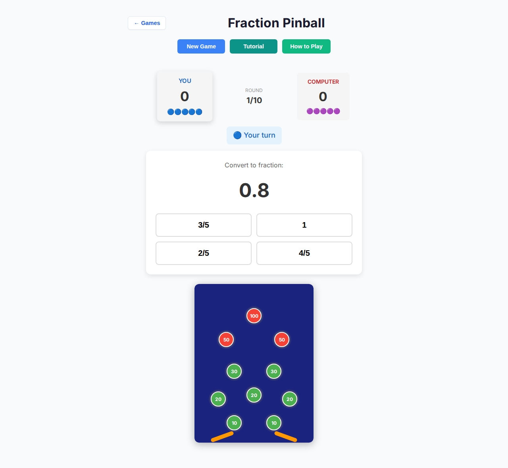
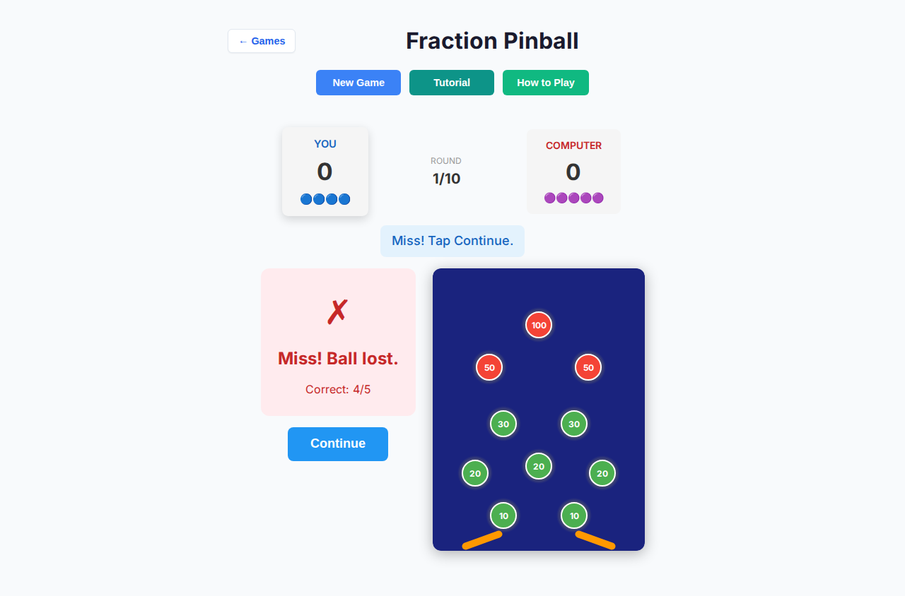
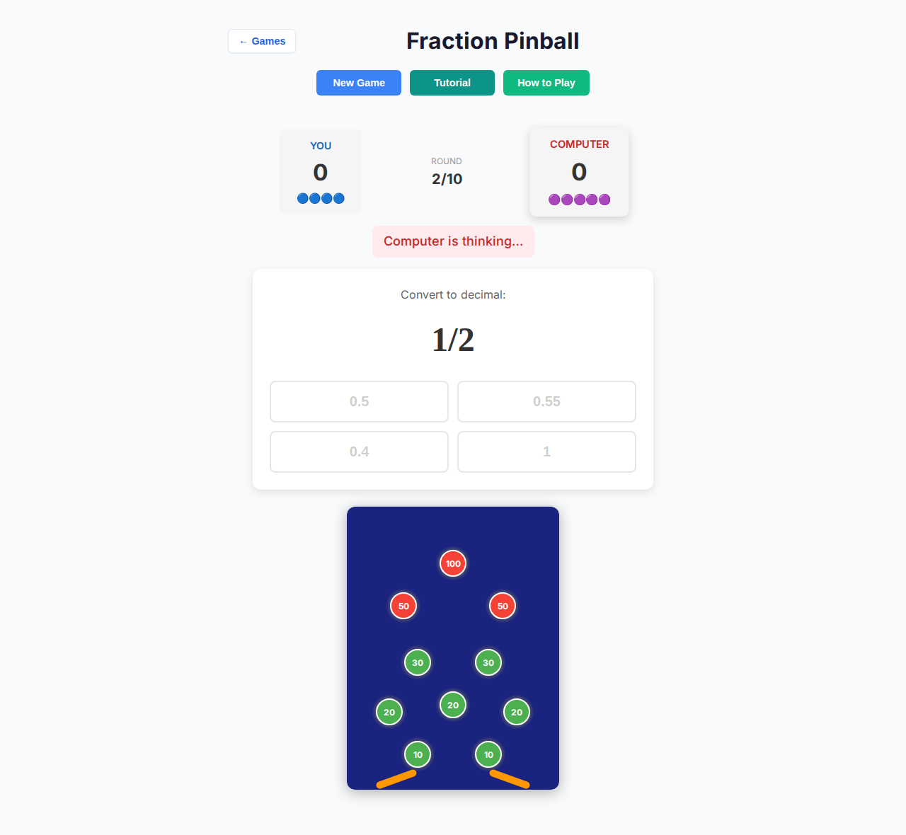
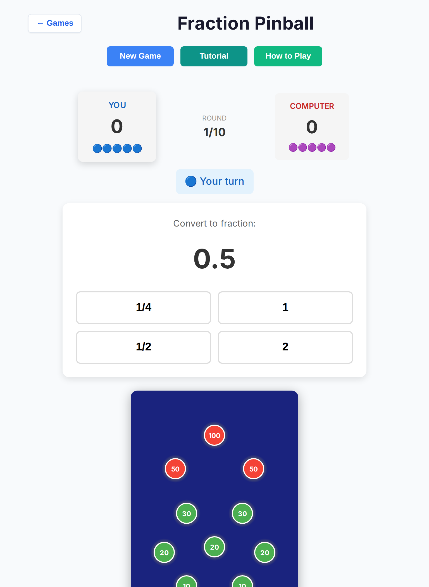
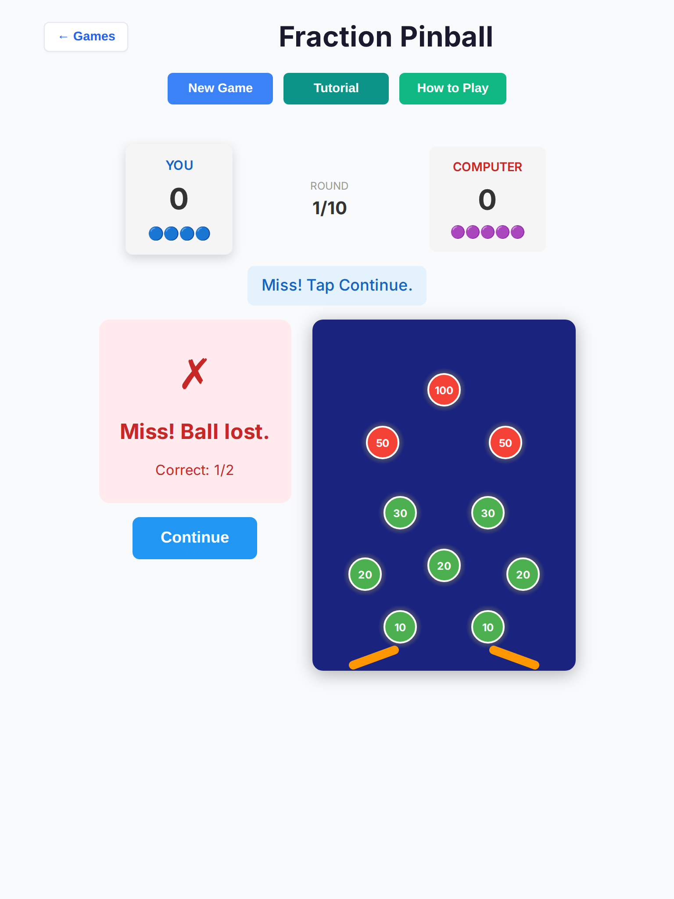
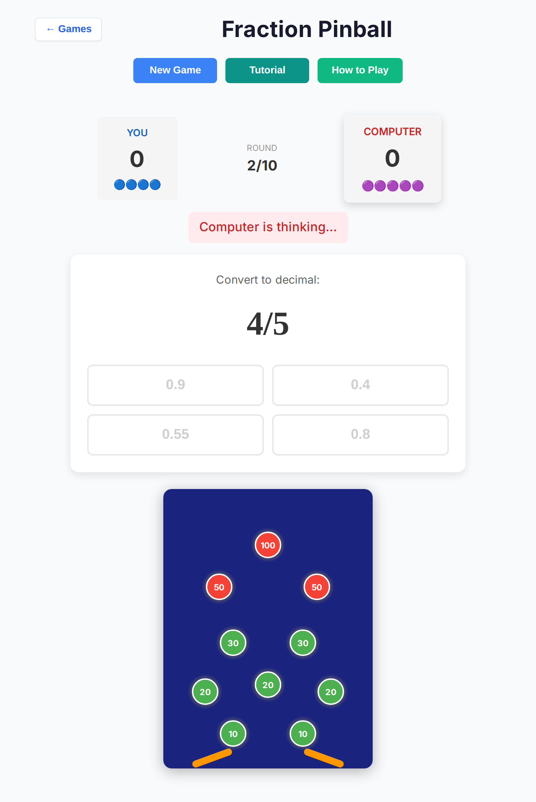

# Fraction Pinball — deep playtest (2026-10-07)

Draft PR: playability-only. **No rules or scoring changes.**

## Method

| Item | Detail |
| --- | --- |
| Branch base | `cursor/overnight-polish-integration-0494` |
| Harness | `docs/playtest/fraction-pinball-deep-playtest.mjs` |
| Browser | Headless Chromium (Playwright) |
| Profiles | **Desktop** 1280×800; **Tablet** iPad Mini 768×1024 + touch |
| Mode | Human vs AI |
| Difficulties | Easy / Medium / Hard |
| Volume | **10 full games × 3 difficulties × 2 profiles = 60 games** (baseline + post-fix verify) |
| Human policy | Click first choice (last game per bucket hammers last choice) |
| Pass criteria | Reach `.pinball-game-over`; no stall; no `pageerror` / console error |

## Baseline results (pre / mid-fix)

| Profile / difficulty | Games | Ended | Stalled | Crashed | Console/page errors | Avg duration | Avg AI think* |
| --- | --- | --- | --- | --- | --- | --- | --- |
| desktop / easy | 10 | 10 | 0 | 0 | 0 | 8.0s | 1290ms |
| desktop / medium | 10 | 10 | 0 | 0 | 0 | 7.9s | 1289ms |
| desktop / hard | 10 | 10 | 0 | 0 | 0 | 7.7s | 1237ms |
| tablet / easy | 10 | 10 | 0 | 0 | 0 | 10.6s | 818ms† |
| tablet / medium | 10 | 10 | 0 | 0 | 0 | 12.0s | 785ms† |
| tablet / hard | 10 | 10 | 0 | 0 | 0 | 12.0s | 785ms† |
| **Total** | **60** | **60** | **0** | **0** | **0** | — | — |

\* Time from `.status-ai-thinking` visible → hidden (includes think delay + submit).  
† Tablet rows ran after the think-delay patch landed via Vite HMR.

**Touch samples (choice buttons):** desktop ~120×59; tablet ~202–213×59 — already ≥44px before polish; raised CSS floor to **48px**.

Raw JSON: [`summary.json`](./fraction-pinball-deep-2026-10-07/summary.json).

## Findings

### Critical / stall

None observed in 60 full games. Prior polish (#406) already covered AI-seat input lock, null-answer soft-lock recovery, and generation-token cancel.

### Playability issues fixed in this PR

| # | Issue | Fix |
| --- | --- | --- |
| 1 | AI seat felt slow (~1.0s think + 1.5s result hold ≈ 2.5s/AI turn) | Think **650ms**, auto-continue **900ms** (accuracy unchanged) |
| 2 | After answering, status still said “Blue/Red’s turn” while Continue was the real action | Status: **“HIT! Tap Continue.”** / **“Miss! Tap Continue.”**; AI: **“Computer hit/missed…”** |
| 3 | Hit feedback said “Points scored!” without the amount | Show **`+N points`** from score delta (display-only; not rules state) |
| 4 | vs-AI still labeled Blue/Red; winner “Blue Wins!” | Scoreboard **You / Computer**; winner **You win! / Computer wins!** (HvH Blue/Red unchanged) |
| 5 | Decorative SVG board looked tappable; competed with choices on tablet | `aria-hidden` + `pointer-events: none`; **challenge-first** layout; smaller board on coarse/narrow |
| 6 | Continue visible during AI auto-advance (ambiguous) | Hide Continue; show **“Next challenge…”** while AI result auto-advances |
| 7 | Latent `String.repeat(negative)` if `ballsRemaining` ever &lt; 0 | Floor at **0** in `submitAnswer` + defensive `Math.max` in `renderScores` (win checks already used `<= 0`) |
| 8 | Touch budget | Choice/Continue **min 48×48**; `touch-action: manipulation` |

### Not changed (by design)

- Challenge generation, point weights, ball count, max rounds, win/draw rules
- AI accuracy tables (Easy 0.6 / Medium 0.78 / Hard 0.92 + Easy teaching misses)
- Shared shell chrome (New Game / Tutorial / How to Play) — out of this game’s file scope

### AI strength note

Easy intentionally misses often (teaching mode). Medium/Hard finish cleanly; Hard is reliably competitive. No accuracy tuning in this PR.

## Screenshots

### After-fix (Medium)

| Shot | File |
| --- | --- |
| Desktop start (You / Your turn) |  |
| Desktop miss + Continue |  |
| Desktop AI thinking (choices disabled) |  |
| Tablet start |  |
| Tablet result |  |
| Tablet AI thinking |  |

### Full-run game-over captures (all difficulties × profiles)

| | Easy | Medium | Hard |
| --- | --- | --- | --- |
| Desktop start | [png](./fraction-pinball-deep-2026-10-07/desktop-easy-start.png) | [png](./fraction-pinball-deep-2026-10-07/desktop-medium-start.png) | [png](./fraction-pinball-deep-2026-10-07/desktop-hard-start.png) |
| Desktop game over | [png](./fraction-pinball-deep-2026-10-07/desktop-easy-gameover.png) | [png](./fraction-pinball-deep-2026-10-07/desktop-medium-gameover.png) | [png](./fraction-pinball-deep-2026-10-07/desktop-hard-gameover.png) |
| Tablet start | [png](./fraction-pinball-deep-2026-10-07/tablet-easy-start.png) | [png](./fraction-pinball-deep-2026-10-07/tablet-medium-start.png) | [png](./fraction-pinball-deep-2026-10-07/tablet-hard-start.png) |
| Tablet game over | [png](./fraction-pinball-deep-2026-10-07/tablet-easy-gameover.png) | [png](./fraction-pinball-deep-2026-10-07/tablet-medium-gameover.png) | [png](./fraction-pinball-deep-2026-10-07/tablet-hard-gameover.png) |

## Regression tests

| Suite | Path |
| --- | --- |
| Unit | `tests/unit/fraction-pinball-deep-playability.test.ts` |
| Unit | `tests/unit/fraction-pinball-neg-balls-repro.test.ts` |
| E2E | `tests/e2e/fraction-pinball-deep.spec.ts` (Chromium desktop + tablet × E/M/H) |

## Verify commands

```bash
npm run lint
npx tsc --noEmit
npm run test:unit
npx playwright test tests/e2e/fraction-pinball-deep.spec.ts --project=chromium
# optional dogfood:
PLAYTEST_GAMES=10 node docs/playtest/fraction-pinball-deep-playtest.mjs
```

## Post-fix verify dogfood

Second full pass after polish (`summary.json` overwritten with this run):

| Metric | Value |
| --- | --- |
| Games | **60/60** ended |
| Stalls / crashes / console errors | **0 / 0 / 0** |
| Avg AI think (all buckets) | **~785ms** (was ~1290ms on pre-fix desktop) |

## Verify status (this agent)

| Check | Result |
| --- | --- |
| lint | pass |
| tsc | pass |
| unit (full) | **3006 files / 10624 tests** pass |
| e2e deep Chromium | **6/6** pass |
| baseline dogfood | **60/60** end, 0 stall, 0 console errors |
| post-fix dogfood | **60/60** end, avg AI think ~785ms |
