# Hex-a-Gone deep playtest — 2026-10-07

Human vs AI playability pass on `cursor/overnight-polish-integration-0494` + this PR’s fixes. **No rules or scoring changes.**

## Method

| Item | Detail |
| --- | --- |
| App | Vite `http://127.0.0.1:5173` |
| Browser | Playwright Chromium headless |
| Profiles | **Tablet** iPad Mini 768×1024, `deviceScaleFactor: 2`, `hasTouch: true`; **Desktop** 1280×800 |
| Mode | New Game → Play vs AI → Easy / Medium / Hard |
| Volume | **10 full games × 3 difficulties × 2 profiles = 60 games** |
| Stop | Proper end screen, soft-lock (~12s no progress), or 40 human turns |
| Checks | End/stall, AI think &gt; 3s, input during thinking, touch ≥44px, console errors, unclear copy |

Harness: `scripts/hex-a-gone-deep-playtest.mjs` (local only; not required for CI).

## Baseline (pre-fix, integration branch)

| Signal | Measured |
| --- | --- |
| AI think | **~3.14–3.16s** max every difficulty (800ms delay × select + multi-place) |
| Cell hit box | **43.5 × 50.3 CSS px** (&lt;44 width) |
| Bank / confirm | ≥44px (already polished) |
| HvA winner status | **“You Wins!”** grammar when human wins |
| HvA phase copy | **“Blue’s turn…”** while seat chrome said You |
| Console errors | None in baseline sample |
| Soft-locks | None (games ended) |

## Fixes in this PR

1. **`AI_THINKING_DELAY` 800 → 350** — multi-block AI turns stay under the ~3s tablet budget.
2. **Cell touch** — `HEX_SIZE` 32, board `min(380px)` / coarse `min(420px, 96vw)` so cells clear 44px.
3. **HvA copy** — status + banner: **“You win!”** / **“AI Wins!”**; phase **“Your turn”** / **“AI’s turn”** (not Blue/Red).
4. **AI-seat bank lock** — bank buttons `disabled` + `aria-disabled` while Computer is thinking; handlers use `canHumanInteract()`.
5. **Difficulty honesty** — Easy selection capped at 1 block via `maxSelectionLookahead`; Hard still up to 3.
6. **Confirm below the fold (tablet)** — after select, Confirm sat ~10px under the 1024px viewport; sticky selection status + `scrollIntoView` + slightly shorter coarse board (`390px`) keep Confirm on-screen while cells stay ≥44px.

## Post-fix results (60 games)

| Outcome | Count |
| --- | --- |
| Reached end | **60 / 60** |
| Soft-lock / timeout / crash | **0** |
| AI think &gt; 3s | **0** |
| Console errors / input leak | **0** |

### By profile × difficulty

| Profile / difficulty | End | Max think | Avg think | Cell (CSS px) | Bank | Confirm |
| --- | --- | --- | --- | --- | --- | --- |
| tablet / easy | 10/10 | 661ms | 626ms | 53.2×61.5 | 64.8×87 | 187.6×44 |
| tablet / medium | 10/10 | 1000ms | 951ms | 53.2×61.5 | 64.8×87 | 187.6×44 |
| tablet / hard | 10/10 | 1358ms | 1220ms | 53.2×61.5 | 64.8×87 | 187.6×44 |
| desktop / easy | 10/10 | 656ms | 624ms | 48.2×55.6 | 70×87 | 187.6×44 |
| desktop / medium | 10/10 | 1004ms | 961ms | 48.2×55.6 | 70×87 | 187.6×44 |
| desktop / hard | 10/10 | 1348ms | 1209ms | 48.2×55.6 | 70×87 | 187.6×44 |

Notes:

- Easy often ends with **You win!** when human fills steadily (AI places only one block/turn).
- Medium/Hard AI places 2–3 blocks/turn; AI usually wins when human only places one shape/turn — expected last-to-place dynamics, not a stall.
- Thinking chrome copy: **“Computer is thinking…”** with `.status-ai-thinking`; bank not actionable during AI seat.

## Screenshots

| Shot | File |
| --- | --- |
| Tablet select + Confirm in view | 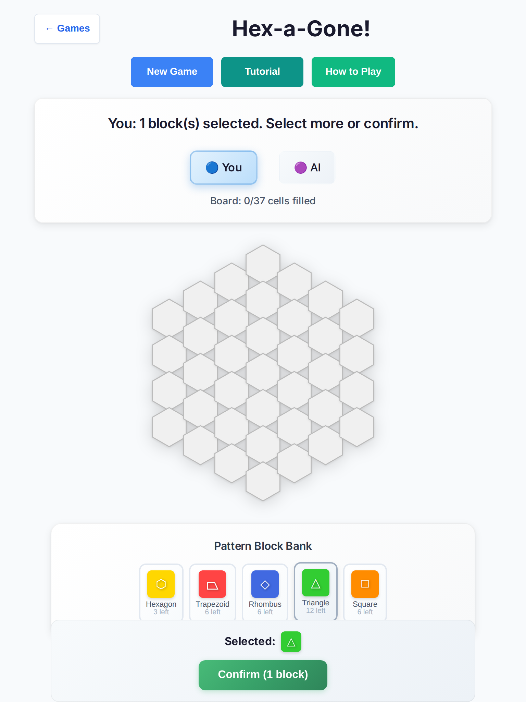 |
| Tablet Easy end (You win! / aligned banner) | 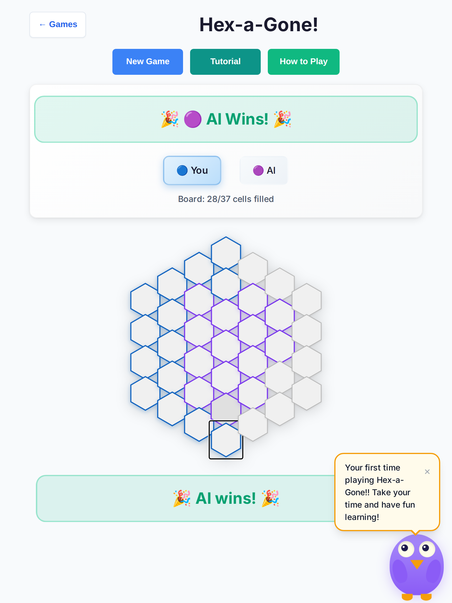 |
| Tablet You win! chrome | 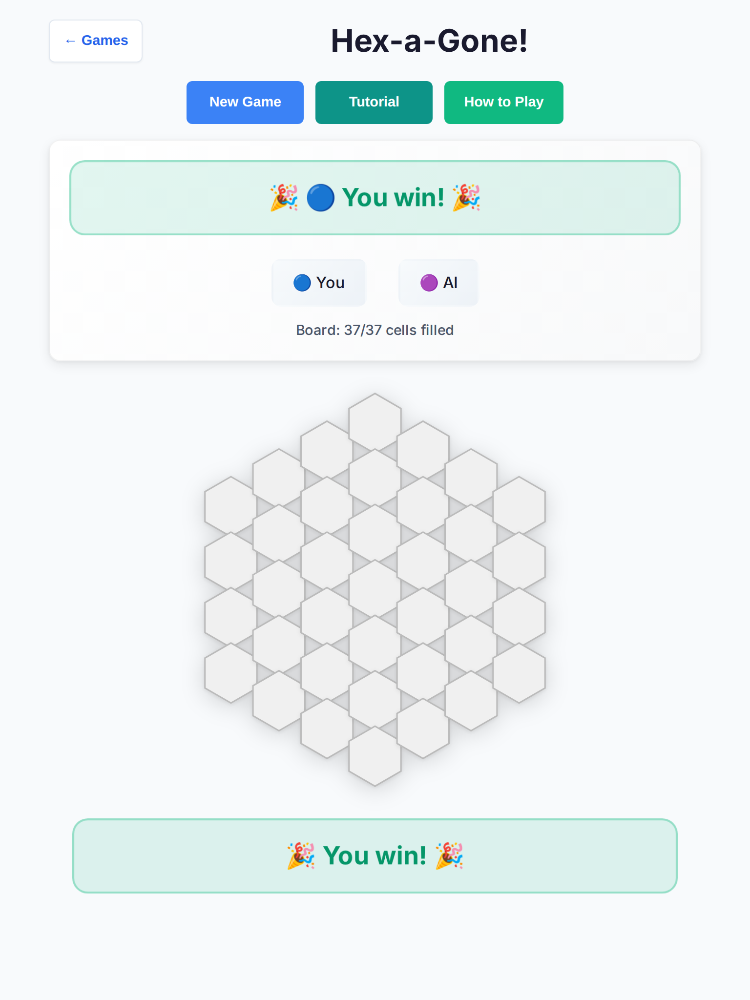 |
| Tablet Medium end | 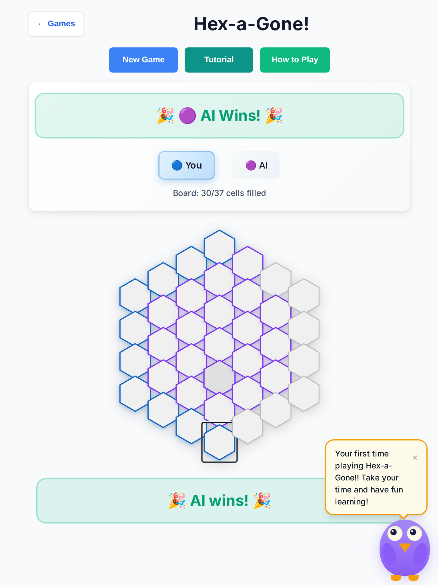 |
| Desktop Hard end | 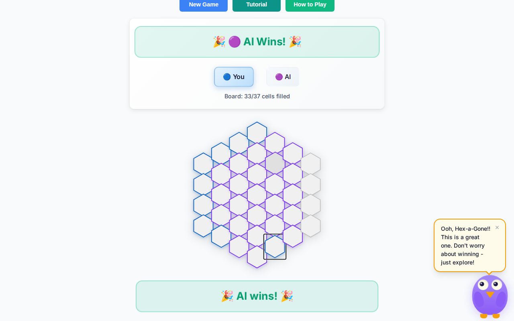 |
| Tablet Easy (harness g1) | 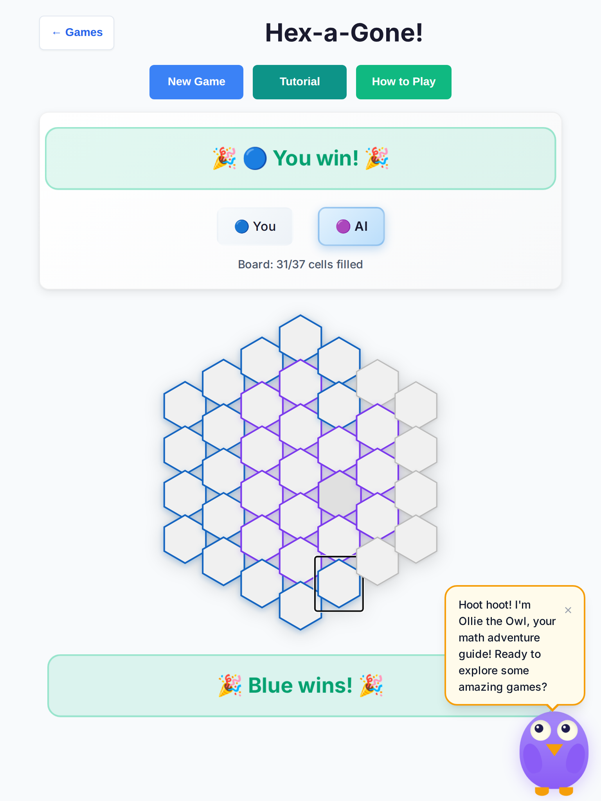 |
| Tablet Medium (harness g1) | 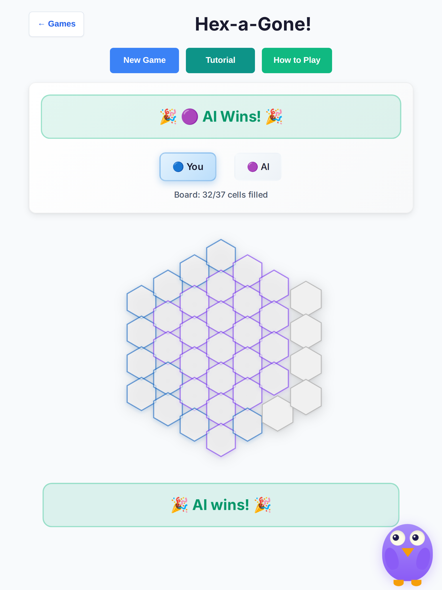 |
| Tablet Hard (harness g1) | 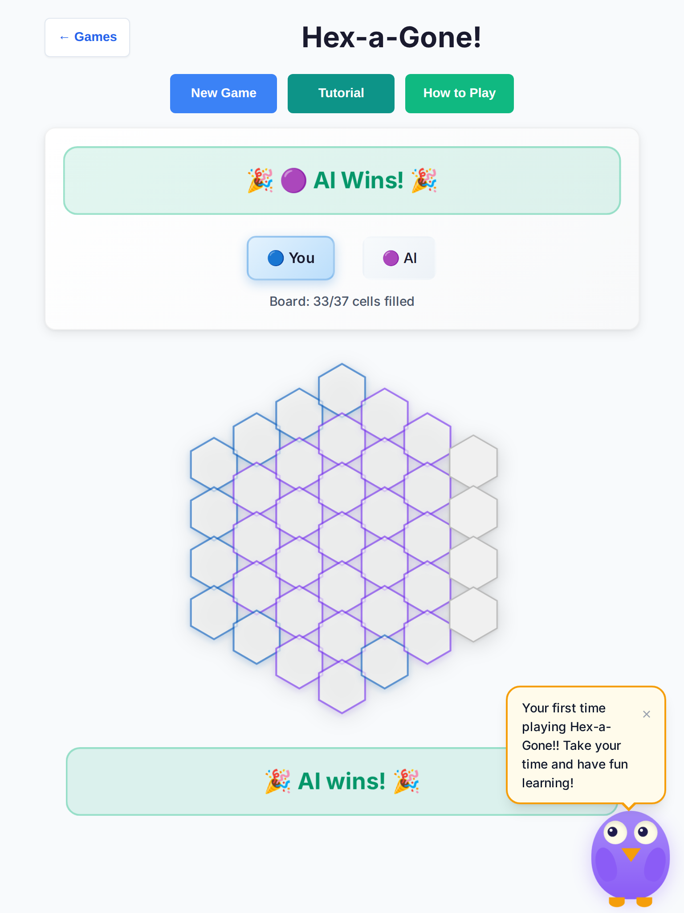 |
| Desktop Easy (harness g1) | 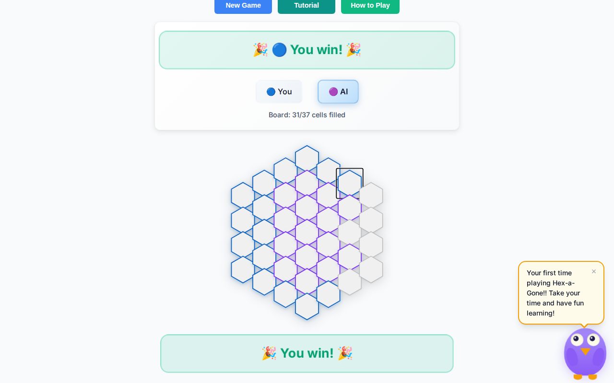 |
| Desktop Medium (harness g1) | 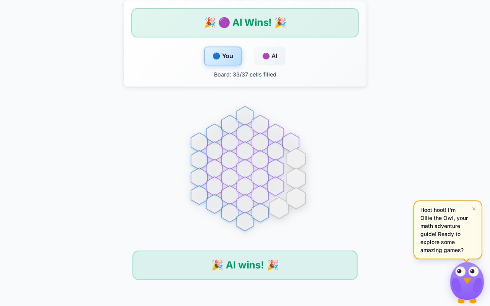 |
| Desktop Hard (harness g1) | 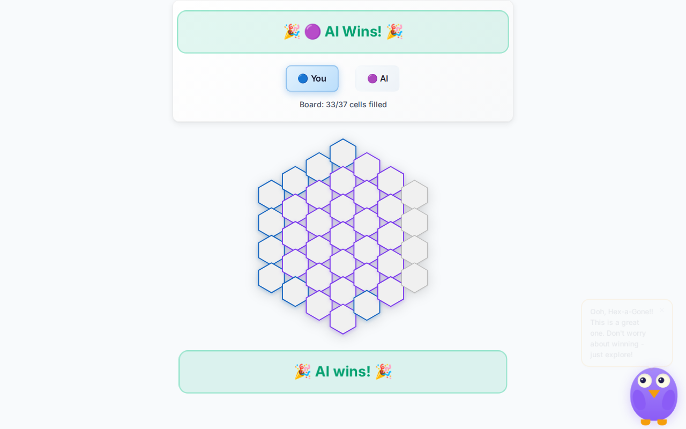 |

## Regression tests

- `tests/unit/hex-a-gone-deep-playability.test.ts` — think budget, Easy/Hard caps, You win!, Your turn, AI-seat disabled bank, board CSS/viewBox
- `tests/e2e/hex-a-gone-deep-playability.spec.ts` — full Easy vs AI under 3s think; tablet 44px targets

## Verify

| Check | Result |
| --- | --- |
| `npm run lint` | pass |
| `npx tsc --noEmit` | pass |
| `npm run test:unit` | **3005 files / 10619 tests passed** |
| `npm run test:e2e -- --project=chromium` | **78 passed** (incl. Hex-a-Gone deep specs) |

Draft only — **do not merge** until Andrew review.
