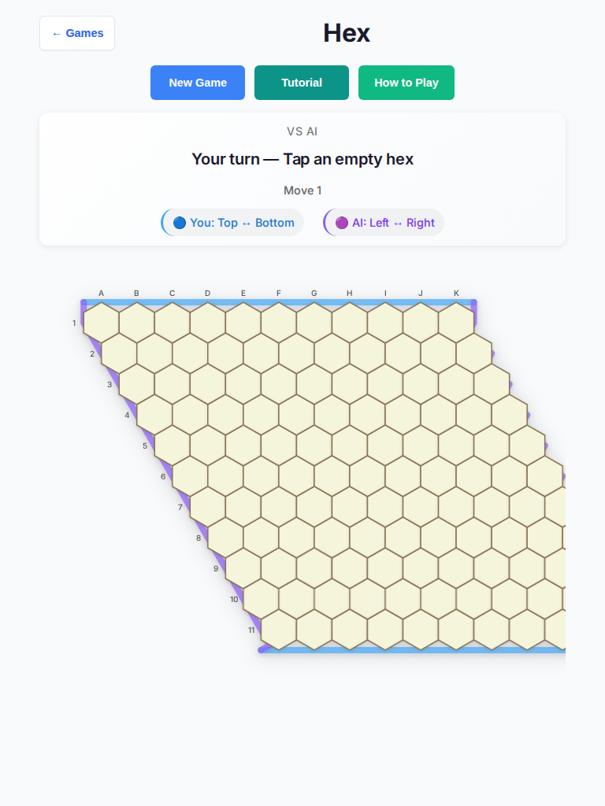
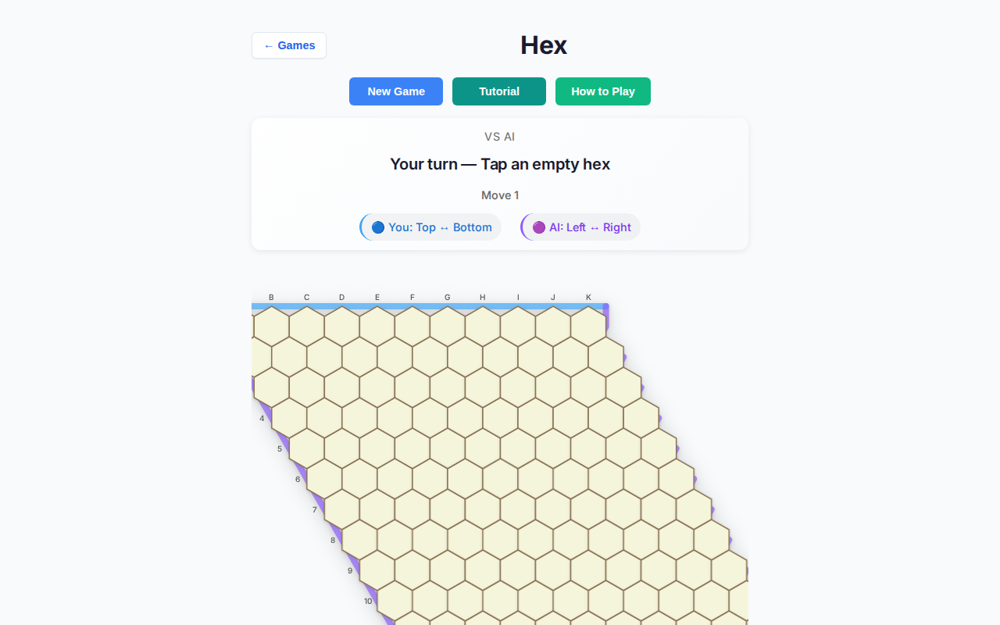
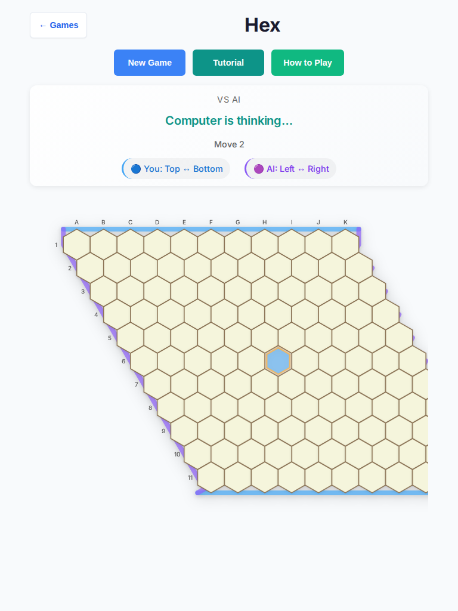
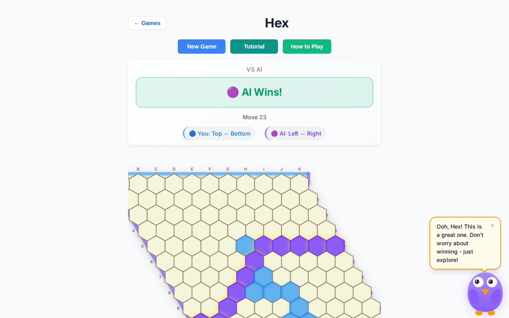
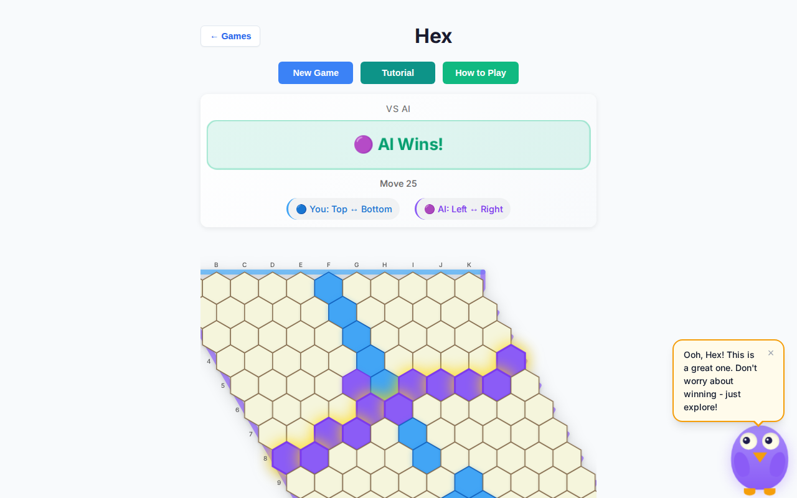

# Hex — deep playtest (2026-10-07)

Human vs AI · Easy / Medium / Hard · tablet (768×1024, touch) + desktop (1280×800) · headless Chromium.

**Scope:** playability only (UX, touch, AI latency/stalls, console). **No rules, scoring, or end-condition changes.**

## Method

- Local Vite (`npm run dev`) + Playwright Chromium headless
- Harness: [`hex-deep-probe.mjs`](../hex-deep-probe.mjs)
- 10 full games × 3 difficulties × 2 viewports = **60 games**
- Baseline probe: 1 game × 6 buckets (before fixes) → [`results-baseline-probe.json`](./hex-deep-2026-10-07/results-baseline-probe.json)
- Random-biased Blue mover (center columns, progressing rows); Red = stock AI worker with play budgets (Easy 600ms / Medium 1200ms / Hard 2500ms)
- Metrics: outcome, human turns, AI think wall time, hex CSS hit size, console/page errors
- Serial recheck of the one Hard timeout bucket: **5/5 full wins**, think max ≤2812ms

## Baseline probe (before fixes)

| Bucket | Outcome | Think median | Cell CSS px | Notes |
| --- | --- | --- | --- | --- |
| tablet / easy | ai-win | ~787ms | **38.1×44** | width &lt;44 |
| tablet / medium | ai-win | ~788ms | **38.1×44** | width &lt;44 |
| tablet / hard | ai-win | ~2296ms | **38.1×44** | think max 3309ms |
| desktop / easy | ai-win | ~787ms | **16.6×19.1** | SVG collapsed to 300px |
| desktop / medium | ai-win | ~788ms | **16.6×19.1** | SVG collapsed to 300px |
| desktop / hard | ai-win | ~2297ms | **16.6×19.1** | SVG collapsed to 300px |

Opening status on all buckets: **“Your turn - Click to place”** (mouse-centric). Console errors: 0.

## Headline results (after fixes)

| Bucket | Games | Outcomes | Think median (of medians) | Hex cell (CSS px) | Console errors |
| --- | --- | --- | --- | --- | --- |
| tablet / easy | 10 | 10 ai-win | ~792ms | **45×52** | 0 |
| tablet / medium | 10 | 10 ai-win | ~786ms | **45×52** | 0 |
| tablet / hard | 10 | 10 ai-win | ~1801ms | **45×52** | 0 |
| desktop / easy | 10 | 10 ai-win | ~784ms | **45×52** | 0 |
| desktop / medium | 10 | 10 ai-win | ~785ms | **45×52** | 0 |
| desktop / hard | 10 | 9 ai-win, 1 game-timeout* | ~2298ms | **45×52** | 0 |

\*One desktop Hard game hung on a worker reply (~310s) so the harness hit its wall clock; the board had already reached **AI Wins!** by screenshot time. **Client watchdog + dispose** added; serial recheck of desktop Hard **5/5 wins**, think max **2812ms**, 0 stalls, 0 console errors.

- **Games with cells &lt;44px after fix:** 0
- **Page/console errors across 60 games:** none
- **Typical Hard think:** ~1.3–2.8s (250ms paint + ≤2500ms search)

Raw JSON: [`results.json`](./hex-deep-2026-10-07/results.json)

## Findings → fixes

### 1. Critical — desktop hex taps ~17×19px (FIXED)

`.hex-board` used `width/height: 100%` without an intrinsic size, so desktop collapsed to the browser’s **300×150** replaced-element default. Cells measured **~16.6×19.1 CSS px**.

**Fix:** set intrinsic SVG `width`/`height` from the viewBox; pin CSS at **801px** (hexRadius 26 → viewBox ~801×522) for all pointers; allow horizontal scroll in `.hex-game-area`.

### 2. Critical — tablet cell width 38px &lt; 44 (FIXED)

Prior coarse pin assumed hexRadius 22 → pointy height 44 but **flat-to-flat ≈38.1**. Width never cleared the 44px floor.

**Fix:** `hexRadius` 22→**26** (flat ≈45.0, pointy 52). CSS pin 690→**801**.

### 3. High — AI worker hang soft-lock / timer race (FIXED)

`AiWorkerClient.request` has no client timeout. One desktop Hard ply never resolved for ~310s (harness `game-timeout`); seat stayed on Computer-thinking chrome.

**Fix:** Hex `getBestMoveAsync` races a **play-budget + 1500ms** watchdog, disposes the stuck worker, and falls back to sync `getBestMove`. Controller still uses `getRandomMove` if the async path returns null.

### 4. Medium — mouse-centric turn copy (FIXED)

Status said **“Your turn - Click to place”** on touch and desktop.

**Fix:** **“Your turn — Tap an empty hex”** (HvH: Blue’s/Red’s). Tutorial gameplay step uses “tap”.

### 5. Medium — AI-seat status invited taps (FIXED)

If the worker returned null or paint lagged, status could show **“AI's turn - Click to place”**.

**Fix:** any computer seat (vs AI + AI to move) shows **“Computer is thinking…”** + `.status-ai-thinking`.

### 6. Low — winner / thinking wording (FIXED)

HvA human win → **“You win!”** (not “You Win!”). Thinking chrome uses Computer-thinking copy (no robot-emoji prefix).

### 7. Low — AI paint delay (FIXED)

`AI_THINKING_DELAY` 500→**250** ms. Search budgets unchanged (600 / 1200 / 2500).

### 8. Rules / scoring observations (NOT changed)

- Random Blue never beat stock AI in this pass — expected strength gap, not a playability bug.
- Hex topology still guarantees a winner; no draw path observed.
- Hard think wall times include paint delay + search; budgets themselves were not raised.

## Screenshots

| Shot | File |
| --- | --- |
| Desktop before (~17px cells) |  |
| Tablet before (38px width) |  |
| Tablet start (after fix) |  |
| Desktop start (after fix) |  |
| AI thinking chrome |  |
| Desktop Hard timeout (pre-watchdog) |  |
| Desktop Hard recheck end |  |

## Regression tests

- Unit: `tests/unit/hex-deep-playability.test.ts`, `tests/unit/hex-touch-reduced-motion.test.ts`
- E2E: `tests/e2e/hex-deep-playability.spec.ts` (Chromium)

## Verification

- `npm run lint` — clean
- `npx tsc --noEmit` — clean
- `npm run test:unit` — **10618 passed** (pre-watchdog commit; Hex suites re-run green after watchdog)
- `npm run test:e2e -- --project=chromium` — **78 passed**
- 60-game harness + desktop Hard serial recheck 5/5
